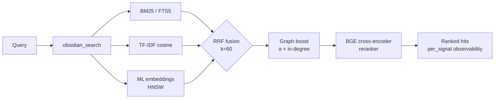

<div align="center">

<a href="https://github.com/oomkapwn/enquire-mcp"></a>

# enquire-mcp

<sub>[English](./README.md) · [中文](./README.zh.md) · [Español](./README.es.md) · [हिन्दी](./README.hi.md) · **العربية** · [Русский](./README.ru.md) · [Português](./README.pt.md) · [Français](./README.fr.md) · [日本語](./README.ja.md) · [한국어](./README.ko.md) · [Deutsch](./README.de.md)</sub>

### 🏆 خادم Obsidian MCP رقم 1 لذاكرة الذكاء الاصطناعي.

**كُفّ عن إعادة شرح السياق في كل جلسة. يبحث enquire-mcp هجينيّاً في Markdown وPDF/OCR، بينما توفّر أدواته البنيوية تحليل Canvas، واستعلامات LIST/TABLE بأسلوب Dataview، وتنفيذ مرشحات Obsidian Bases المدعومة. تصبح معرفتك ذاكرةً موثقةً وقابلةً للبحث عبر كل وكيل متوافق مع MCP.**

*مقاسة: يضيف مُعيد ترتيب BGE ذو المُرمِّز المتقاطع **‎+15.5 NDCG@10 / +24.7 MRR** فوق الهجين الصِّرف على [استئصال من 60 استعلاماً قابل لإعادة الإنتاج](./docs/benchmarks.md) — حزمة استرجاع المعلومات الحديثة بأكملها، تستدعي markdown الذي كتبته **أنت** (مع استشهادات، قابل للتحرير)، لا تلخيصاً سحابياً أبداً.*

[](https://www.npmjs.com/package/@oomkapwn/enquire-mcp)
[](./STABILITY.md)
[](https://slsa.dev/spec/v1.0/levels#build-l2)
[](https://modelcontextprotocol.io/)
[](./LICENSE)

**[⚡ التثبيت في 30 ثانية](#-البدء-السريع) · [🏆 لماذا هو رقم 1](#why-number-one) · [🧠 حالات الاستخدام](#-حالات-الاستخدام) · [📊 قياسات الأداء](./docs/benchmarks.md) · [📖 مرجع API](https://oomkapwn.github.io/enquire-mcp/api/)**

**Claude Code — سطر واحد:**

```bash
claude mcp add obsidian -- npx -y @oomkapwn/enquire-mcp serve --vault ~/Documents/Obsidian\ Vault
```

</div>

> 📌 هذا المستند هو الترجمة العربية لـ [README.md](./README.md) لتسهيل القراءة على المتحدثين بالعربية؛ عند أي اختلاف، **النسخة الإنجليزية هي المرجع** (تُحدَّث مع كل إصدار).

---

## المشكلة

تبدأ كل جلسة ذكاء اصطناعي من الصفر، فتُعيد شرح المشروع وقرارات التصميم ونتائج البحث السابقة. ذاكرة المزوّد المدمجة تحبس المعرفة في سحابة واحدة وتقطع الاستمرارية عند تبديل الأدوات. **معرفتك تظل تبدأ من جديد.**

## الحل

<div dir="rtl" align="right">

تصبح مكتبة Obsidian (vault) لديك **ذاكرةً طويلة الأمد دائمة وقابلة للاستعلام** لأي وكيل متوافق مع MCP. تثبيت واحد — وتصير معرفتك متاحةً فوراً من Claude Code وClaude Desktop وCursor وChatGPT custom GPT وCodex وOpenClaw وكل عميل MCP آخر. ملفات markdown صِرفة **تملكها أنت**، مُفهرسة محلياً، يُبحث فيها بكامل حزمة استرجاع المعلومات (IR) الحديثة، وتُستدعى عبر كل جلسة وكل نموذج.

**مرتكز على ما كتبته، لا على حقائق مستخرجة.** تستخرج معظم أنظمة ذاكرة المحادثة الحقائق من الدردشة إلى مخزن منفصل. يبدأ enquire-mcp من المعرفة التي كتبتها عمداً: ملاحظات `.md` حرفية مع الاستشهادات، لذلك يبقى الاستدعاء قابلاً للتدقيق والتحرير والنقل، لا إعادة صياغة ناقصة مخفية في قاعدة بيانات الغير. تظل مكتبة محلية هي مصدر الحقيقة، مع صفر اتصالات سحابية أثناء serve.

**راسخة — وواعية بالحداثة.** استدعاء حقيقةٍ ما هو نصف المشكلة؛ ومعرفة ما إن كانت لا تزال *صحيحة* هو النصف الآخر. أظهر [معيار Memora](https://arxiv.org/abs/2604.20006) (أبريل 2026) أن أنظمة الذاكرة تفشل بانتظام في إعادة استخدام الحقائق القديمة — فتستدعي ملاحظةً عمرها عام كأنها كُتبت اليوم. ولأن ذاكرة enquire *هي* ملفات markdown الحقيقية لديك، تحمل كل نتيجة بحث `age_days` (العمر بالأيام) وعلامة `stale` (قديمة) مشتقّة من وقت آخر تعديل حيّ للملاحظة، ويمكنك تفعيل الترتيب المرجَّح بالحداثة (`--recency-weight`) لتظهر الملاحظات الأحدث أولاً. معرفتك، واعية بالحداثة — لا كتلة بلا زمن.

> **ما الذي يميّز enquire-mcp**:
> 1. **محايدة تجاه المزوّدين.** ذاكرتك تعيش في ملفات `.md`. انتقل من Claude إلى Cursor — وتأتي ذاكرتك معك.
> 2. **حزمة استرجاع محلية متكاملة.** ‏BM25 + TF-IDF + تضمينات متعددة اللغات مدموجة عبر RRF، مع إعادة ترتيب BGE اختيارية ودرجات لكل إشارة؛ ويتولى HNSW + تكميم int8 توسيع المسار الكثيف.
> 3. **صفر اتصالات صادرة يبدأها enquire أثناء `serve`.** نموذج التضمين q8 يعمل **على جهازك** ويُفهرس markdown الذي كتبته **أنت** — ولهذا فهو تنزيل محلي صريح لمرة واحدة (~118 ميغابايت)، لا مفتاح API سحابي. يُعاد المحتوى فقط إلى عميل MCP الذي توصلّه؛ وتبقى طريقة معالجة ذلك العميل أو النفق للبيانات ضمن حدود الثقة الخاصة به ([مفروضة بالكود](./SECURITY.md)، لا مجرّد طموح).
> 4. **استدعاء واعٍ بالحداثة.** تُبلّغ كل نتيجة عن عمر الملاحظة؛ وإعادة الترتيب الاختيارية بالحداثة تتيح للوكيل تفضيل المعرفة الحديثة ووسم الحقائق القديمة لإعادة التحقق — حدود "الوعي بالنسيان"، مبنيّة على `mtime` الذي تملكه ملفاتك أصلاً.

**46 أداة · 19 موجِّه MCP · 2207+ اختبار وحدة · 50+ لغة · إصدار مستقر v3.11.x · مُقيَّد بالـ semver · MIT · إثبات بناء npm (SLSA L2).**

</div>

---

<a id="why-number-one"></a>

## 🏆 لماذا enquire-mcp هو رقم 1

**حزمة ذاكرة ذكاء اصطناعي محلية متكاملة لـ Obsidian — ليست غلاف ملفات بسيطاً ولا مجرد بحث متجهي.** تثبيت واحد يجمع جودة الاسترجاع وملكية المعرفة والوصول إلى الوكلاء وتغطية المستندات وتشغيلاً بمستوى الإنتاج.

| معيار الريادة | ما يقدمه enquire-mcp |
|---|---|
| **استدعاء يتجاوز تطابق الكلمات** | ✅ ‏BM25 + TF-IDF + تضمينات متعددة اللغات ← دمج RRF؛ إعادة ترتيب BGE اختيارية تضيف قياسياً **+15.5 NDCG@10 / +24.7 MRR** |
| **ذاكرة واحدة لكل الوكلاء** | ✅ وصول MCP أصيل لـ Claude Code/Desktop وCursor وChatGPT وCodex وOpenClaw وأي عميل متوافق |
| **إجابات قابلة للتحقق** | ✅ نص حرفي ومسارات الملاحظات واستشهادات صفحات PDF ودرجات كل إشارة وبيانات الحداثة |
| **معرفة تملكها فعلاً** | ✅ ‏markdown هو مصدر الحقيقة، والفهارس محلية، وصفر اتصالات سحابية أثناء serve |
| **سطح معرفة Obsidian الكامل** | ✅ ‏Markdown والروابط وfrontmatter وCanvas وBases وPDF وOCR |
| **استرجاع وكيلي للأسئلة الصعبة** | ✅ ‏HyDE وتقسيم الأسئلة وحزم السياق وGraphRAG-light و19 موجِّه MCP |
| **توسّع من دون التنازل عن التحكم** | ✅ تحديثات HNSW الحية والاستمرارية والملء التكيفي وتكميم int8 |
| **ثقة الإنتاج** | ✅ قراءة فقط افتراضياً ومرشحات خصوصية وHTTP موثّق وعقود semver و2207 اختباراً و13 بوابة إصدار ومصدر SLSA L2 |

**مكتبة واحدة. كل الوكلاء. الحزمة الكاملة. بلا ارتهان للسحابة.**

> الموقع الاستراتيجي: enquire-mcp هو الخلفية المفتوحة المصدر لـ [LLM Wikis بأسلوب Karpathy](https://gist.github.com/karpathy/442a6bf555914893e9891c11519de94f) فوق مكتبة Obsidian الحالية—معرفة تتراكم وتبقى قابلة للتتبع إلى مصادرها.

---

## ⚡ البدء السريع

```bash
npm install -g @oomkapwn/enquire-mcp
enquire-mcp serve --vault ~/Documents/Obsidian\ Vault
```

<div dir="rtl" align="right">

ضَعها في أي عميل MCP:

</div>

```json
{
  "mcpServers": {
    "obsidian": {
      "command": "npx",
      "args": ["-y", "@oomkapwn/enquire-mcp", "serve", "--vault", "/path/to/vault"]
    }
  }
}
```

<div dir="rtl" align="right">

### حزمة سطح مكتب قابلة للمراجعة؟ MCPB Basic

يوفّر [GitHub Release `v4.0.0-rc.4`](https://github.com/oomkapwn/enquire-mcp/releases/tag/v4.0.0-rc.4) ملف `enquire-mcp-basic-4.0.0-rc.4.mcpb` مع checksum والجرد وSBOM والإشعارات وإثبات المصدر. تتضمن الحزمة JavaScript الخاص بالخادم والاعتماديات العادية، وعلى مضيف MCPB المتوافق توفير Node.js 22.13 أو أحدث.

Basic مقيد بـ **13 أداة للقراءة فقط** و**0 موجّهات**: بلا كتابة أو فهارس دائمة أو نماذج أو PDF/OCR أو watcher. ما زال اختبار واجهة سطح المكتب الفعلية والتوقيع وموافقة المجلد والدليل بيد المشرف. لا يبدأ enquire اتصالات خارجية أثناء الخدمة، لكن نص الملاحظات المطلوب ينتقل إلى عميل MCP المتصل ويخضع لشروط خصوصيته.

📂 إعدادات جاهزة للاستخدام في [`examples/`](./examples/) — **Claude Desktop** و**Cursor** و**ChatGPT custom GPT** (MCP بعيد عبر HTTP)، إضافةً إلى مجموعة استعلامات نموذجية لأداة التقييم.

**تريد القوة الكاملة للاسترجاع الهجين؟** أكمل فحص الإعداد الهجين ثم شغّل الخادم:

</div>

```bash
npm install -g @oomkapwn/enquire-mcp@4.0.0-rc.4      # exact prerelease package
enquire-mcp --version
# recommended: preview first, then explicitly apply the same package-coherent plan
enquire-mcp first-run --tier hybrid --client claude-desktop --vault <path>
enquire-mcp first-run --tier hybrid --client claude-desktop --vault <path> --apply
# manual equivalent below: choose this instead of first-run --apply, not in addition
enquire-mcp setup --vault <path>                          # caches embedder; builds FTS5 + embed-db
enquire-mcp install-model rerank-bge                      # caches the offline reranker
enquire-mcp doctor --tier hybrid --vault <path>           # structural/runtime readiness
enquire-mcp configure --tier hybrid --client claude-desktop --vault <path>
enquire-mcp serve --vault <path> --persistent-index --enable-reranker --use-hnsw
```

---

## 🤖 الإعداد في وكيل الذكاء الاصطناعي — موجِّهات للنسخ واللصق

<div dir="rtl" align="right">

بمجرد تثبيت `enquire-mcp`، الصق هذه الموجِّهات في وكيلك ليعرف أن المكتبة متاحة كذاكرة.

</div>

<details>
<summary><b>Claude Code (الطرفية)</b> — إضافة خادم MCP + أول موجِّه</summary>

```bash
# Add the MCP server to your Claude Code config (one time)
claude mcp add obsidian -- npx -y @oomkapwn/enquire-mcp serve --vault ~/Documents/Obsidian\ Vault
```

<div dir="rtl" align="right">

ثم في أي جلسة Claude Code:

> أصبحت لديك الآن أدوات `obsidian_*` تبحث في مكتبة Obsidian لديّ وتقرؤها — ذاكرتي طويلة الأمد. قبل الإجابة عن أسئلة حول المشاريع أو القرارات أو الأشخاص أو السياق التقني، استدعِ `obsidian_search` بالمصطلحات المناسبة. واستشهِد بكل حقيقة بالملاحظة المصدر (و`[page: N]` لملفات PDF). إن لم تجد ملاحظةً ذات صلة، فقُلها صراحةً — ولا تخمّن.

</div>

</details>

<details>
<summary><b>Claude Desktop</b> — ملف الإعداد + أول موجِّه</summary>

<div dir="rtl" align="right">

يُفضّل استخدام خرج `enquire-mcp configure --tier hybrid --client claude-desktop --vault <path>` الجاهز للصق. ملف [`examples/claude-desktop-hybrid.json`](./examples/claude-desktop-hybrid.json) مجرد قالب؛ عند استخدامه يدوياً استبدل مساري الملف التنفيذي والمكتبة معاً. أعد تشغيل Claude Desktop، ثم:

> لديك مكتبة Obsidian الخاصة بي موصولةً كذاكرة قابلة للبحث عبر أدوات `obsidian_*`. تحقّق دائماً من `obsidian_search` أولاً حين أسألك عن أي شيء في ملاحظاتي — سياق اجتماع، أو بحث، أو قرارات، أو مُدخلات يوميات. اقتبس مسار الملاحظة المصدر في كل حقيقة.

</div>

</details>

<details>
<summary><b>Cursor</b> — إعداد MCP stdio + قاعدة الوكيل</summary>

<div dir="rtl" align="right">

ضَع [`examples/cursor-mcp.json`](./examples/cursor-mcp.json) في `~/.cursor/mcp.json` (عدّل مسار المكتبة). في ملف `.cursorrules` لديك أو في الدردشة:

> قبل اقتراح أي كود يتعلق بموضوع قد تكون لديّ ملاحظات عنه (قرارات معمارية، عقود API، تقييمات مزوّدين)، استدعِ `obsidian_search` أولاً. عامِل مكتبة Obsidian لديّ كسياق ذي مرجعية.

</div>

</details>

<details>
<summary><b>ChatGPT custom GPT</b> — MCP بعيد عبر HTTP</summary>

<div dir="rtl" align="right">

اتبع [`examples/chatgpt-actions.md`](./examples/chatgpt-actions.md) لكشف `serve-http` عبر نفق مع مصادقة bearer. في تعليمات الـ GPT المخصّص لديك:

> لديك صلاحية قراءة لمكتبة Obsidian الخاصة بي عبر عائلة أدوات `obsidian_*`. ابحث قبل الإجابة عن أي شيء قد يكون في ملاحظاتي؛ واستشهِد بمسار الملف المصدر في كل ادّعاء.

</div>

</details>

<details>
<summary><b>OpenClaw / Codex / أي عميل MCP آخر</b></summary>

<div dir="rtl" align="right">

الأمر نفسه `npx -y @oomkapwn/enquire-mcp serve --vault <path>` يعمل مع أي عميل متوافق مع MCP. راجع وثائق إعداد MCP الخاصة بالعميل لمعرفة موضع إدخال الخادم، ثم استخدم أياً من الموجِّهات أعلاه.

</div>

</details>

<div dir="rtl" align="right">

**قاعدة وكيل قابلة لإعادة الاستخدام** (ضَعها في أي `AGENTS.md` / `CLAUDE.md` / `.cursorrules` ليعرف الوكيل *متى* يلجأ إلى المكتبة):

> حين يلامس سؤالي ملاحظاتي أو قراراتي أو مشاريعي أو الأشخاص أو أبحاثي، **ابحث في مكتبة Obsidian لديّ أولاً** عبر أدوات `obsidian_*` (ابدأ بـ `obsidian_search`) واستشهِد بالملاحظة المصدر في كل حقيقة. فضّل enquire للاستدعاء *المفاهيمي / عبر اللغات / "ماذا قلت عن X"*؛ واستخدم `grep` / `ripgrep` العادي للسلاسل الحرفية الدقيقة. إن لم يرجع شيء ذو صلة، فقُلها صراحةً — ولا تخمّن.

</div>

### أمثلة استعلامات تعمل جيداً

<div dir="rtl" align="right">

- *"اعثر على كل ملاحظة ناقشت فيها استراتيجية التسعير، ولخّص تطوّرها."* — يتعامل دمج RRF + المُرتِّب مع "التطوّر" دلالياً
- *"ما قراري بشأن PostgreSQL مقابل MongoDB؟ استشهِد بالملاحظة اليومية."* — يُظهر Wikilink graph-boost وثيقة القرار المركزية
- *"Анализируй мои заметки о RAG за последние 3 месяца"* — تضمينات متعددة اللغات + مرشّح تاريخ على الـ frontmatter
- *"ما الصفحات من ورقة LLaMA-3 بصيغة PDF التي تتحدث عن التوسّع (scaling)؟"* — دمج ملفات PDF في البحث مع استشهادات `[page: N]`
- *"أرِني المجتمعات الموضوعية في مكتبة أبحاثي — أي المواضيع كنت أستكشف؟"* — `obsidian_get_communities` (GraphRAG-light)

</div>

---

## 🧠 حالات الاستخدام

<div dir="rtl" align="right">

**1 — ذاكرة طويلة الأمد لوكلاء الذكاء الاصطناعي.** ضَع مكتبة Obsidian لديك في أي وكيل متوافق مع MCP (Claude Code، Claude Desktop، Cursor، ChatGPT، Codex، OpenClaw). يحصل الوكيل عندها على استدعاء دلاليّ مُتين لكل ملاحظة اجتماع ومُدخل يوميات وسجل بحث ووثيقة قرار كتبتها يوماً — عبر الجلسات والنماذج والمزوّدين. وبخلاف ذاكرة المزوّد المدمجة، معرفتك ليست محبوسة في سحابة مزوّد واحد؛ بل تعيش في markdown صِرف تملكه وتهاجر به بحرّية.

**2 — قاعدة معرفة شخصية / دماغ ثانٍ.** يُظهر الاسترجاع الهجين الملاحظة الصحيحة لـ*أي* صياغة، في أيٍّ من 50+ لغة. اسأل بالإنجليزية عن مُدخل يوميات بالروسية من قبل عامين، واحصل على النتيجة الصحيحة. تُعيد إضافة Wikilink graph-boost ترتيب الملاحظات الواقعة في قلب رسم معرفتك. ويُظهر GraphRAG-light المجتمعات الموضوعية — لتكتشف روابط نسيت أنك صنعتها. وتندمج ملفات PDF في البحث مع استشهادات `[page: N]`، فتصير الأوراق البحثية ونصوص الاجتماعات ذاكرةً من الدرجة الأولى.

**3 — RAG وكيليّ / هندسة سياق.** يكشف `obsidian_search` درجات كل إشارة على حدة، فيرى الوكيل *لماذا* احتلّت كل نتيجة ترتيبها. يُعيد HyDE صياغة الاستعلامات الغامضة إلى إجابات افتراضية ثرية قبل الاسترجاع. ويعالج تفكيك الأسئلة الفرعية الأسئلةَ متعددة القفزات ("كيف تطوّرت استراتيجية تسعيرنا وما كان ردّ فعل العملاء؟") بتقسيمها إلى استعلامات فرعية مستقلة ثم دمج النتائج. وتتيح لك أداة التقييم المدمجة (NDCG / Recall / MRR) قياس جودة الاسترجاع على استعلاماتك أنت، بدل الوثوق بمعايير المزوّدين.

</div>

---

## ✅ مبني لسير عمل المعرفة المحلية الجاد

اختر enquire-mcp عندما تريد:

- **أن تظل مكتبة Obsidian مصدر الحقيقة** بدلاً من نسخ المعرفة إلى مخزن احتكاري.
- **طبقة ذاكرة واحدة عبر عدة وكلاء ذكاء اصطناعي** فلا يعني تبديل النموذج البدء من جديد.
- **استدعاء مفاهيمي ومتعدد اللغات** يتحمل اختلاف الصياغة.
- **نتائج مستشهدة وقابلة للفحص** مع المسارات وصفحات PDF ودرجات الإشارات والحداثة.
- **خصوصية محلية أولاً** مع القراءة فقط افتراضياً وتمكين الكتابة صراحة وصفر اتصالات سحابية أثناء serve.
- **خلفية استرجاع متكاملة** تشمل البحث الهجين وإعادة الترتيب وسياق الرسم والتوسعة الوكيلية وصيغ Obsidian وMCP البعيد.

**نطاق واضح:** ‏enquire-mcp خادم MCP / CLI بلا واجهة لـ Markdown وCanvas وBases وPDF. استخدم البحث الحرفي معه للرموز الدقيقة، والنقل HTTP المدمج للوكلاء البعيدين.

---

## 📖 مرجع API

<div dir="rtl" align="right">

**[مرجع API المُولَّد تلقائياً على oomkapwn.github.io/enquire-mcp](https://oomkapwn.github.io/enquire-mcp/api/)** — كل أداة وموجِّه ومساعد مُصدَّر مع TSDoc كامل (`@param` / `@returns` / `@example`). يُعاد بناؤه من المصدر عند كل دفع إلى `main` عبر [`publish-docs.yml`](https://github.com/oomkapwn/enquire-mcp/blob/main/.github/workflows/publish-docs.yml) (TypeDoc → GitHub Pages). خالٍ من الانحراف بحكم التصميم: نفس TSDoc الذي تراه وكلاء الذكاء الاصطناعي ومحرّرات الـ IDE هو ما يُنشَر.

</div>

---

## 🏗️ كيف يعمل الاسترجاع



<div dir="rtl" align="right">

يكتشف `obsidian_search` الإشارات المتاحة تلقائياً ويتراجع بلُطف. يُعيد Wikilink graph-boost ترتيب top-K عبر PageRank مُشخصَن بخطوة واحدة. وتُعيد إعادة الترتيب الاختيارية بمُرمِّز متقاطع تسجيل top-N للحصول على ‎+15.5 NDCG@10 مقاسة. تُعيد كل نتيجة `per_signal: { bm25, tfidf, embeddings }`، فترى *لماذا* احتلّت ترتيبها.

طبقات يمكن تفعيلها حسب الحاجة:

</div>

| الطبقة | طريقة التفعيل | ما تحصل عليه |
|---|---|---|
| **1** | `serve --vault <path>` | TF-IDF cosine (بلا إعداد، فوري) |
| **2** | + `--persistent-index` | + BM25 / FTS5 (استرجاع لفظي مفهرس) |
| **3** | + `setup` (تنزيل نموذج + بناء embed-db) | + تضمينات ML متعددة اللغات |
| **4** | + `--enable-reranker` | + مُرمِّز متقاطع BGE (‎+15.5 NDCG@10 مقاسة) |
| **5** | + `--use-hnsw` | + استرجاع تقريبي لأقرب الجيران مع HNSW مستدام |
| **6** | + `--include-pdfs` | + دمج ملفات PDF في كل ما سبق |
| **7** | `serve-http --bearer-token …` | + MCP بعيد (ويب Claude.ai، ChatGPT، Cursor HTTP، الجوال) |

---

## 🛠️ جميع الأدوات الـ 46

<div dir="rtl" align="right">

46 أداة إجمالاً: 34 قراءة دائمة (بما في ذلك المدخل الجامع `obsidian_search`) + 4 اختيارية + 7 كتابات محكومة + 1 تغذية راجعة بحلقة مغلقة. المرجع الكامل في **[docs/api.md](./docs/api.md)**.

</div>

| الفئة | الأدوات |
|---|---|
| **البحث والاسترجاع** | `obsidian_search` (المدخل الجامع، RRF-fused) · `obsidian_hyde_search` (مُعزَّز بـ HyDE، v3.1.0) · `obsidian_search_text` · `obsidian_full_text_search` · `obsidian_semantic_search` · `obsidian_embeddings_search` · `obsidian_find_similar` |
| **Wikilinks والرسم** | `obsidian_resolve_wikilink` · `obsidian_get_backlinks` · `obsidian_get_outbound_links` · `obsidian_get_note_neighbors` · `obsidian_get_unresolved_wikilinks` · `obsidian_find_path` · `obsidian_get_communities` (v3.4.0، GraphRAG-light) |
| **Frontmatter وDataview** | `obsidian_frontmatter_get` · `obsidian_frontmatter_search` · `obsidian_dataview_query` · `obsidian_list_tags` |
| **القراءة والتنقّل** | `obsidian_read_note` · `obsidian_list_notes` · `obsidian_get_recent_edits` · `obsidian_stale_notes` · `obsidian_open_questions` · `obsidian_context_pack` · `obsidian_chat_thread_read` · `obsidian_open_in_ui` · `obsidian_stats` |
| **PDF وCanvas وBases** | `obsidian_read_pdf` · `obsidian_list_pdfs` · `obsidian_ocr_pdf` · `obsidian_read_canvas` · `obsidian_list_canvases` · `obsidian_list_bases` (v3.2.0) · `obsidian_read_base` (v3.2.0) · `obsidian_query_base` (v3.2.0) |
| **الكتابة** (محكومة بـ `--enable-write`) | `obsidian_create_note` · `obsidian_append_to_note` · `obsidian_rename_note` · `obsidian_replace_in_notes` · `obsidian_archive_note` · `obsidian_frontmatter_set` · `obsidian_chat_thread_append` |
| **التشخيص / lint** | `obsidian_lint_wiki` · `obsidian_paper_audit` · `obsidian_validate_note_proposal` |
| **التغذية الراجعة** (اختيارية عبر `--feedback-weight`) | `obsidian_mark_useful` (حلقة مغلقة: تسجيل الملاحظات المُستدعاة التي أفادت؛ ورفعها في عمليات البحث المقبلة) |

<div dir="rtl" align="right">

إضافةً إلى 3 موارد MCP (`obsidian://vault/info`، `obsidian://note/{path}`، `obsidian://chunk/{n}/{path}`) و19 **موجِّه MCP** (`summarize_recent_edits` · `review_tag` · `find_orphans` · `weekly_review` · `extract_todos` · `process_inbox` · `consolidate_tags` · `find_duplicates` · `lint_wiki` · `monthly_review` · `search_with_query_expansion` · `vault_synth` · `vault_wiki_compile` · `vault_lint_extended` · `vault_capture` · `vault_persona_search` · `vault_automation_setup` · `vault_research` · `vault_synthesis_page`) لسير العمل الشائع في المكتبة.

</div>

---

## 🛡️ الثقة

| الجانب | السياسة |
|---|---|
| **الافتراضي** | للقراءة فقط — تتطلب أدوات الكتابة السبع `--enable-write` |
| **أقل الامتيازات** | يُتيح `--disabled-tools` / `--enabled-tools` كشف أقل سطح ممكن (مثلاً وكيل بحث للقراءة فقط يحصل على `obsidian_search` + `obsidian_read_note` فحسب) |
| **سلامة المسار** | فحص realpath عند كل قراءة + كتابة؛ ورفض الروابط الرمزية الخارجة عن المكتبة |
| **مرشّح الخصوصية** | مُتحقَّق منه عند مسارات FTS5 + embed-db + موارد الـ chunk؛ يفشل مغلقاً عند قوائم سماح/حظر فارغة |
| **نقل HTTP** | مصادقة Bearer (SHA-256 بزمن ثابت + `timingSafeEqual`)، تحديد معدّل لكل token، وCORS صارم |
| **Frontmatter** | `js-yaml@5` `load` (مخطط YAML 1.2 الأساسي، آمن افتراضياً) — لا تنفيذ للكود |
| **ملفات الكاش + الفهرس** | عند دعم أوضاع POSIX يعيد Enquire تطبيق `0600` على الملفات الحساسة بأفضل جهد؛ يبدأ المجلد الأب الذي ينشئه Enquire بوضع `0700`، بينما يبقى المجلد الموجود/المخصّص تحت إدارة المشغّل |
| **2207 اختبار وحدة · 13 فحص CI مطلوباً للإصدار · جميع الفحوص الـ13 محمية حالياً على الفرع** | وضع إصدار متحقق منه؛ والتفاصيل التشغيلية مثبتة أدناه. |
| **CI** | يسرد `release.yml` مباشرة **13 بوابة للإصدار** وتعمل كلها في كل PR: `lint` و`test (22)` و`test (24)` و`smoke` و`audit` و`coverage` و`version-consistency` و`docs` و`oia` و`protocol-conformance` و`package-consumer` و`mcpb-basic` و`docker`. إن job ‏Windows hostile-filesystem المثبت `test-windows` هو check-run إضافي مسمى يُفرض انتقالياً كمتطلب حاجب لـ`smoke`. تفرض حماية الفرع الآن البوابات **13** كلها (لقطة حماية الفرع متحقق منها مباشرة في 2026-08-21). ‏`test-macos` هو الـ job الإرشادي الوحيد الذي يحمل `continue-on-error`. يبني gate ‏`docker` الصورة وينفذ فحصَي CLI وMCP المحدودين؛ ويشغّل CodeQL تحليلين منفصلين غير محميين عبر [إعداد GitHub الافتراضي](https://docs.github.com/code-security/code-scanning/automatically-scanning-your-code-for-vulnerabilities-and-errors/configuring-default-setup-for-code-scanning). قبل npm publish يعيد `release.yml` التحقق من البوابات الثلاث عشرة التي يسردها مباشرة على SHA الموسوم. |
| **التغطية** | الأسطر ≥86% · العبارات ≥82% · الدوال ≥75% · الفروع ≥74% (محكومة) |
| **البناء والإصدار** | نشر على npm + GitHub Release لكل tag · semver · **إثبات بناء موقَّع** (npm + Sigstore، SLSA Build L2؛ مُولِّد L3 على خارطة الطريق) |
| **الاستقرار** | الإصدار v3.0+ مُقيَّد بالـ semver — كل flag CLI واسم أداة ومورد MCP وموجِّه ورمز مُصدَّر هو عقد |

<div dir="rtl" align="right">

نموذج الأمان الكامل في **[SECURITY.md](./SECURITY.md)** · حدود الاستقرار في **[STABILITY.md](./STABILITY.md)** · للإبلاغ عن الثغرات: `oomkapwn@gmail.com`.

</div>

---

## ❓ أسئلة شائعة

<div dir="rtl" align="right">

**هل يلزم تثبيت Obsidian؟** لا. يقرأ `.md` + `.canvas` + `.pdf` مباشرةً. يعمل على أي مكتبة بصيغة Obsidian.

**هل سيكتب في مكتبتي؟** لا، إلا إذا مرّرت `--enable-write`. أدوات الكتابة السبع كلها محكومة؛ والعمليات الإتلافية تدعم `dry_run`.

**هل تُرسَل بياناتي إلى أي مكان؟** لا يرسل enquire أي بيانات قياس عن بُعد ولا يبدأ أي اتصال HTTP صادر أثناء `serve`. لكنه يعيد سياق الخزنة المطلوب إلى عميل MCP الذي توصلّه؛ وقد يعالج العميل السحابي هذا السياق وفق سياسة الخصوصية الخاصة به، ويشكّل أي نفق أو وكيل عكسي حدود ثقة أخرى. قد تجلب أوامر `setup` و`build-embeddings` و`install-model`، وكذلك `first-run --apply` للمستويات الهجينة، أوزان ONNX من Hugging Face؛ ويجلب `install-ocr-lang` حزمة لغة Tesseract.

**ما الأداء؟** يعتمد على حجم الخزنة والعتاد والنموذج وطبقات الاسترجاع المفعّلة. تتضمن الأدلة العامة تقرير إنتاج قدره **50–100ms** لـ BM25 top-10 عند 1,771 chunk / 368 ملفاً، واختباراً اصطناعياً قابلاً للتكرار يُظهر تسارع FTS5 بمقدار **37–103×** مقابل المسح الخطي عند 100–1,000 ملاحظة. شغّل التقييم المدمج على خزنتك قبل تحديد هدف زمن استجابة.

**أي اللغات؟** نموذج الـembedder الافتراضي هو `paraphrase-multilingual-MiniLM-L12-v2` (أكثر من 50 لغة)، وقد تم التحقق منه من البداية إلى النهاية على خزائن ثنائية الروسية + الإنجليزية. أما reranker ذو الـcross-encoder الافتراضي فهو `rerank-bge` (English-only؛ الاسم الوحيد في الكتالوج الذي تم التحقق منه من البداية إلى النهاية)؛ وتفشل أسماء reranker متعددة اللغات حالياً في فحص توافق tokenizer الخاص بـtransformers.js. تستخدم تجزئة CJK / التايلندية / الخميرية `Intl.Segmenter`.

**هل يمكن تشغيلها عن بُعد؟** نعم — يكشف `serve-http` الخادم نفسه عبر [Streamable HTTP](https://modelcontextprotocol.io/specification/2025-06-18/basic/transports#streamable-http). ضَع أمامه Tailscale Funnel أو Cloudflare Tunnel من أجل HTTPS. يعمل مع ويب claude.ai، وChatGPT custom GPT، ووضع Cursor HTTP، وعملاء MCP على الجوال. راجع **[docs/http-transport.md](./docs/http-transport.md)**.

</div>

---

## 🚀 الإصدارات

<div dir="rtl" align="right">

**v3.0.0 — القناة المستقرة.** اكتملت خارطة طريق الاسترجاع للإصدار v2.x، والسطح العام الآن [مُقيَّد بالـ semver](./STABILITY.md). شريط أبرز المحطات:

`v2.0` استرجاع هجين (BM25+TF-IDF+تضمينات عبر RRF) · `v2.6` MCP بعيد · `v2.7-2.8` دمج PDF · `v2.9` مُعيد ترتيب BGE · `v2.10` OCR · `v2.11` doctor + setup · `v2.12` أداة تقييم · `v2.13` HNSW · `v2.14` جلسات ذات حالة · `v2.15` late-chunking · `v2.16` استدامة HNSW · `v2.17` تكميم int8 · `v3.8.0` مستقر · `v3.8.7` تقوية نقل HTTP · **`v3.9.0` مستقر**: مزامنة embed لمراقب PDF الممسوح ضوئياً (OCR)، تحديث HNSW حيّ في الذاكرة عند تغيّر الملفات، إعادة ملء HNSW التكيُّفية R-10 (تُغلق نقص الإرجاع لما تجاوز 66% المُستبعد). · **`v3.10` مستقر**: حداثة واعية بالنسيان — علامة `age_days` + `stale` + إعادة ترتيب اختيارية بـ `--recency-weight` + `obsidian_search` واعٍ بالـ frontmatter.

القناة: `npm install @oomkapwn/enquire-mcp` ← أحدث إصدار مستقر (`@latest` = v3.11.x). الإصدار التجريبي: `npm install @oomkapwn/enquire-mcp@rc` (أحدث مرشّح إصدار — راجع [CHANGELOG.md](./CHANGELOG.md)). سجل التغييرات الكامل في **[CHANGELOG.md](./CHANGELOG.md)** · خارطة الطريق في **[ROADMAP.md](https://github.com/oomkapwn/enquire-mcp/blob/main/ROADMAP.md)**.

</div>

## 🤝 المساهمة

```bash
git clone https://github.com/oomkapwn/enquire-mcp.git
cd enquire-mcp && npm install
npm test       # full suite (2207 tests)
npm run lint   # zero warnings
npm run build  # tsc → dist/
```

<div dir="rtl" align="right">

البلاغات (issues) وطلبات الدمج (PRs) والأفكار مرحَّب بها. تتطلب حماية الفرع مراجعة PR على `main`. سير عمل التطوير في **[CONTRIBUTING.md](https://github.com/oomkapwn/enquire-mcp/blob/main/CONTRIBUTING.md)**؛ ودليل المستودع الموجَّه للوكلاء في **[AGENTS.md](https://github.com/oomkapwn/enquire-mcp/blob/main/AGENTS.md)**.

</div>

## 📜 الترخيص

<div dir="rtl" align="right">

[MIT](./LICENSE) © Alex (@OomkaBear)

</div>
