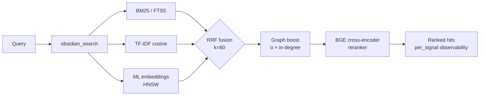

<div align="center">

<a href="https://github.com/oomkapwn/enquire-mcp"></a>

# enquire-mcp

<sub>[English](./README.md) · [中文](./README.zh.md) · [Español](./README.es.md) · [हिन्दी](./README.hi.md) · **العربية** · [Русский](./README.ru.md) · [Português](./README.pt.md) · [Français](./README.fr.md) · [日本語](./README.ja.md) · [한국어](./README.ko.md) · [Deutsch](./README.de.md)</sub>

### أكثر خوادم Obsidian MCP تطوّراً. ذاكرة طويلة الأمد لوكلاء الذكاء الاصطناعي.

**كُفّ عن إعادة شرح السياق لـ Claude وCursor وChatGPT وCodex وOpenClaw في كل جلسة. تصبح ملاحظاتك في Obsidian ذاكرةً مشتركةً قابلةً للبحث عبر كل وكيل متوافق مع MCP — معرفتك، وكل نموذج، وتظل ملكاً لك إلى الأبد.**

*مقاسة: يضيف مُعيد ترتيب BGE ذو المُرمِّز المتقاطع **‎+15.5 NDCG@10 / +24.7 MRR** فوق الهجين الصِّرف على [استئصال من 60 استعلاماً قابل لإعادة الإنتاج](./docs/benchmarks.md) — حزمة استرجاع المعلومات الحديثة بأكملها، تستدعي markdown الذي كتبته **أنت** (مع استشهادات، قابل للتحرير)، لا تلخيصاً سحابياً أبداً.*

[](https://www.npmjs.com/package/@oomkapwn/enquire-mcp)
[](./STABILITY.md)
[](https://slsa.dev/spec/v1.0/levels#build-l2)
[](https://modelcontextprotocol.io/)
[](./LICENSE)

**[⚡ التثبيت في 30 ثانية](#-البدء-السريع) · [🧠 حالات الاستخدام](#-حالات-الاستخدام) · [📊 قياسات الأداء](./docs/benchmarks.md) · [📖 مرجع API](https://oomkapwn.github.io/enquire-mcp/) · [💬 مقارنة البدائل](./docs/COMPARISON.md)**

**Claude Code — سطر واحد:**

```bash
claude mcp add obsidian -- npx -y @oomkapwn/enquire-mcp serve --vault ~/Documents/Obsidian\ Vault
```

</div>

> 📌 هذا المستند هو الترجمة العربية لـ [README.md](./README.md) لتسهيل القراءة على المتحدثين بالعربية؛ عند أي اختلاف، **النسخة الإنجليزية هي المرجع** (تُحدَّث مع كل إصدار).

---

## المشكلة

<div dir="rtl" align="right">

كل جلسة ذكاء اصطناعي تبدأ من الصفر. تُعيد شرح مشروعك، وقراراتك التصميمية، ونتائج بحث الأسبوع الماضي مراراً وتكراراً. ميزات "الذاكرة" من المزوّدين ([Claude Memory](https://www.anthropic.com/news/memory-and-tool-use)، [ChatGPT Memory](https://openai.com/index/memory-and-new-controls-for-chatgpt/)، Cursor memory) تحبس معرفتك في سحابة مزوّد واحد — ثم تنساها من جديد حين تبدّل الأداة. **معرفتك تظل تبدأ من جديد.**

</div>

## الحل

<div dir="rtl" align="right">

تصبح مكتبة Obsidian (vault) لديك **ذاكرةً طويلة الأمد دائمة وقابلة للاستعلام** لأي وكيل متوافق مع MCP. تثبيت واحد — وتصير معرفتك متاحةً فوراً من Claude Code وClaude Desktop وCursor وChatGPT custom GPT وCodex وOpenClaw وكل عميل MCP آخر. ملفات markdown صِرفة **تملكها أنت**، مُفهرسة محلياً، يُبحث فيها بكامل حزمة استرجاع المعلومات (IR) الحديثة، وتُستدعى عبر كل جلسة وكل نموذج.

**راسخة في النص الأصلي، لا مستخلَصة.** أدوات ذاكرة المحادثات (mem0، Zep، Supermemory، Memobase) *تستخلص* الحقائق من سجلات دردشتك إلى مخزن منفصل لا يمكنك قراءته. أما enquire-mcp فهي العكس: إنها **راسخة في المعرفة التي كتبتها بالفعل** — ملاحظاتك `.md` نفسها، حرفياً، مع الاستشهادات — فالاستدعاء قابل للتدقيق، وقابل للتحرير في أي محرّر، وليس أبداً تلخيصاً ناقصاً لدردشة تتذكرها بالكاد. وبخلاف منصات ذاكرة **الأسطول (fleet-memory)** على جانب الخادم (مخازن سحابية متعددة المستأجرين تعيد صياغة حركة الوكلاء في قاعدة بيانات مشتركة)، فإن enquire **أحادية المستخدم ومحلية أولاً**: مكتبة واحدة تملكها بالكامل ويمكنك قراءتها وتحريرها وحذفها بنفسك، بصفر استدعاءات سحابية أثناء التشغيل (serve). (نقد "الاستخلاص" هذا خاصّ بفئة ذاكرة المحادثات تحديداً — لا بأدوات رسوم المعرفة / ETL مثل cognee، ولا بأقران البحث الشخصي مثل Khoj.)

**راسخة — وواعية بالحداثة.** استدعاء حقيقةٍ ما هو نصف المشكلة؛ ومعرفة ما إن كانت لا تزال *صحيحة* هو النصف الآخر. أظهر [معيار Memora](https://arxiv.org/abs/2604.20006) (أبريل 2026) أن أنظمة الذاكرة تفشل بانتظام في إعادة استخدام الحقائق القديمة — فتستدعي ملاحظةً عمرها عام كأنها كُتبت اليوم. ولأن ذاكرة enquire *هي* ملفات markdown الحقيقية لديك، تحمل كل نتيجة بحث `age_days` (العمر بالأيام) وعلامة `stale` (قديمة) مشتقّة من وقت آخر تعديل حيّ للملاحظة، ويمكنك تفعيل الترتيب المرجَّح بالحداثة (`--recency-weight`) لتظهر الملاحظات الأحدث أولاً. معرفتك، واعية بالحداثة — لا كتلة بلا زمن.

> **ما الذي يميّز enquire-mcp**:
> 1. **محايدة تجاه المزوّدين.** ذاكرتك تعيش في ملفات `.md`. انتقل من Claude إلى Cursor — وتأتي ذاكرتك معك.
> 2. **استرجاع من الطراز الأول.** مزيج من BM25 + تضمينات متعددة اللغات + إعادة ترتيب بمُرمِّز متقاطع BGE، مدموجة عبر RRF، ومُوسَّعة بـ HNSW + تكميم int8. نفس حزمة IR التي قد تبنيها شركة بحث ناشئة — مفتوحة المصدر، في ثنائيّ واحد.
> 3. **صفر استدعاءات سحابية أثناء التشغيل.** نموذج التضمين يعمل **على جهازك** ويُفهرس markdown الذي كتبته **أنت** — ولهذا فهو تنزيل محلي لمرة واحدة (~110 ميغابايت)، لا مفتاح API سحابي. الرسوخ والخصوصية لهما ثمن، ولا ندّعي خلاف ذلك: محتوى مكتبتك لا يغادر جهازك أبداً، وهي آمنة للعمل المعزول (air-gap) افتراضياً ([مفروضة بالكود](./SECURITY.md)، لا مجرّد طموح).
> 4. **استدعاء واعٍ بالحداثة.** تُبلّغ كل نتيجة عن عمر الملاحظة؛ وإعادة الترتيب الاختيارية بالحداثة تتيح للوكيل تفضيل المعرفة الحديثة ووسم الحقائق القديمة لإعادة التحقق — حدود "الوعي بالنسيان"، مبنيّة على `mtime` الذي تملكه ملفاتك أصلاً.

**46 أداة · 19 موجِّه MCP · 1552+ اختبار وحدة · 50+ لغة · إصدار مستقر v3.11.x · مُقيَّد بالـ semver · MIT · إثبات بناء npm (SLSA L2).**

</div>

---

## 🏆 لماذا هي الأفضل

<div dir="rtl" align="right">

**ست ميزات لا يملكها أي Obsidian-MCP آخر بتاتاً** (GraphRAG-light، تنفيذ `.base` مستقل، HyDE، تكميم int8، late-chunking، أداة تقييم مدمجة)، **إضافةً إلى حزمة IR الحديثة بأكملها** (BM25 + تضمينات + إعادة ترتيب بمُرمِّز متقاطع + HNSW)، بينما لا يقدّم المنافسون منها سوى واحدة أو اثنتين على الأكثر. مقارنة جنباً إلى جنب:

</div>

| القدرة | enquire-mcp | Smart Connections | Obsidian-MCP أخرى |
|---|:---:|:---:|:---:|
| الاسترجاع الهجين (BM25 + TF-IDF + تضمينات، مدموج بـ RRF) | ✅ | ❌ | ❌ |
| **إعادة الترتيب بمُرمِّز متقاطع** (BGE، ‎+15.5 NDCG@10 مقاسة) | ✅ | ❌ | ❌ |
| **فهرس متجهات HNSW** (top-K دون 10ms، مُستديم) | ✅ | ❌ | ❌ |
| **تكميم المتجهات int8** (حجم embed-db أصغر بنحو الرُّبع) | ✅ | ❌ | ❌ |
| **Late-chunking** تضمينات بنافذة سياق | ✅ | ❌ | ❌ |
| **دمج ملفات PDF في البحث الهجين** (استشهادات `[page: N]`) | ✅ | ❌ | ❌ |
| **OCR لملفات PDF الممسوحة ضوئياً** (Tesseract.js، متعدد اللغات) | ✅ | ❌ | ❌ |
| **إشارة استرجاع Wikilink graph-boost** | ✅ | ❌ | ❌ |
| **بحث دلاليّ متعدد اللغات** (50+ لغة، على الجهاز) | ✅ | 💰 مدفوع | ❌ |
| **أداة تقييم جودة الاسترجاع مدمجة** (NDCG، Recall، MRR، مصفوفة A/B) | ✅ | ❌ | ❌ |
| **MCP بعيد** (HTTP + bearer auth + جلسات ذات حالة) | ✅ | ❌ | جزئي |
| **قابلية رصد لكل إشارة** عند كل نتيجة | ✅ | ❌ | ❌ |
| **MCP أصيل** (Claude · Cursor · ChatGPT · Codex · OpenClaw · أي عميل) | ✅ | ❌ Obsidian فقط | متفاوت |
| **مرشّح خصوصية** مُتحقَّق منه عند كل مسار بحث + كتابة | ✅ | غير منطبق | ❌ |
| **46 أداة إنتاجية** (34 أداة قراءة دائمة + 4 اختيارية + 7 كتابات محكومة + 1 تغذية راجعة) | ✅ | غير منطبق | متفاوت |
| **GraphRAG-light** (كشف مجتمعات Wikilink بمعامل Louvain) | ✅ **حصرياً هنا** | ❌ | ❌ |
| **تنفيذ استعلام `.base` مستقل** (يعمل دون تشغيل Obsidian) | ✅ **حصرياً هنا** | ❌ | ❌ يفوّض إلى Obsidian |
| **استرجاع HyDE** (Gao et al 2023) + تفكيك الأسئلة الفرعية | ✅ **حصرياً هنا** | ❌ | ❌ |
| **1552 اختبار وحدة · 9 بوابات CI إلزامية + 5 إرشادية لكل PR** | ✅ | غير منطبق | نادر |
| **إثبات بناء موقَّع** (npm + Sigstore، SLSA Build L2) | ✅ | غير منطبق | ❌ |
| **سطح عام مُقيَّد بالـ semver** ([STABILITY.md](./STABILITY.md)) | ✅ | غير منطبق | ❌ |
| تشغيل مستقل (لا حاجة لإضافة Obsidian) | ✅ | ❌ يتطلب Obsidian | متفاوت |
| الترخيص | MIT، مجاني | احتكاري، مدفوع | متفاوت |

<sub>تستند المقارنة إلى القدرات العلنية لكل مشروع حتى الإصدار المستقر v3.8.x (اللقطة الأولية v3.7.0 / 2026-05-15؛ مُحدَّثة في v3.8.4). ‏Smart Connections إضافة Obsidian مدفوعة (لا خادم MCP). ويُقصد بـ"Obsidian-MCP أخرى" خوادم Obsidian-MCP مفتوحة المصدر العلنية على GitHub وقت الكتابة. وتُنشر قياسات الاسترجاع الشاملة لـ enquire-mcp في <a href="./docs/benchmarks.md"><code>docs/benchmarks.md</code></a> — فارق `rerank-bge` المقاس هو ‎+24.7 MRR / +15.5 NDCG@10 مقارنةً بالهجين الصِّرف على استئصال من 60 استعلاماً.</sub>

<div dir="rtl" align="right">

> ادّعاء استراتيجي: enquire-mcp هي الخلفية مفتوحة المصدر لـ[ويكيات LLM بأسلوب Karpathy](https://gist.github.com/karpathy/442a6bf555914893e9891c11519de94f) فوق مكتبة Obsidian القائمة لديك. معرفة تتراكم، قابلة للتتبّع إلى مصادرها.

</div>

---

## ⚡ البدء السريع

```bash
npm install -g @oomkapwn/enquire-mcp
enquire-mcp serve --vault ~/Documents/Obsidian\ Vault
```

<div dir="rtl" align="right">

ضَعها في أي عميل MCP:

</div>

```json
{
  "mcpServers": {
    "obsidian": {
      "command": "npx",
      "args": ["-y", "@oomkapwn/enquire-mcp", "serve", "--vault", "/path/to/vault"]
    }
  }
}
```

<div dir="rtl" align="right">

📂 إعدادات جاهزة للاستخدام في [`examples/`](./examples/) — **Claude Desktop** و**Cursor** و**ChatGPT custom GPT** (MCP بعيد عبر HTTP)، إضافةً إلى مجموعة استعلامات نموذجية لأداة التقييم.

**تريد القوة الكاملة للاسترجاع الهجين؟** انطلاقة بأمر واحد ودون أي إعداد يدوي:

</div>

```bash
enquire-mcp setup --vault <path>     # downloads model, builds FTS5 + embed-db
enquire-mcp serve --vault <path> --persistent-index --enable-reranker --use-hnsw
enquire-mcp doctor --vault <path>    # color-coded ✓/⚠/✗ health check
```

---

## 🤖 الإعداد في وكيل الذكاء الاصطناعي — موجِّهات للنسخ واللصق

<div dir="rtl" align="right">

بمجرد تثبيت `enquire-mcp`، الصق هذه الموجِّهات في وكيلك ليعرف أن المكتبة متاحة كذاكرة.

</div>

<details>
<summary><b>Claude Code (الطرفية)</b> — إضافة خادم MCP + أول موجِّه</summary>

```bash
# Add the MCP server to your Claude Code config (one time)
claude mcp add obsidian -- npx -y @oomkapwn/enquire-mcp serve --vault ~/Documents/Obsidian\ Vault
```

<div dir="rtl" align="right">

ثم في أي جلسة Claude Code:

> أصبحت لديك الآن أدوات `obsidian_*` تبحث في مكتبة Obsidian لديّ وتقرؤها — ذاكرتي طويلة الأمد. قبل الإجابة عن أسئلة حول المشاريع أو القرارات أو الأشخاص أو السياق التقني، استدعِ `obsidian_search` بالمصطلحات المناسبة. واستشهِد بكل حقيقة بالملاحظة المصدر (و`[page: N]` لملفات PDF). إن لم تجد ملاحظةً ذات صلة، فقُلها صراحةً — ولا تخمّن.

</div>

</details>

<details>
<summary><b>Claude Desktop</b> — ملف الإعداد + أول موجِّه</summary>

<div dir="rtl" align="right">

ضَع [`examples/claude-desktop-hybrid.json`](./examples/claude-desktop-hybrid.json) في إعداد MCP لـ Claude Desktop (عدّل مسار المكتبة أولاً). أعد تشغيل Claude Desktop، ثم:

> لديك مكتبة Obsidian الخاصة بي موصولةً كذاكرة قابلة للبحث عبر أدوات `obsidian_*`. تحقّق دائماً من `obsidian_search` أولاً حين أسألك عن أي شيء في ملاحظاتي — سياق اجتماع، أو بحث، أو قرارات، أو مُدخلات يوميات. اقتبس مسار الملاحظة المصدر في كل حقيقة.

</div>

</details>

<details>
<summary><b>Cursor</b> — إعداد MCP stdio + قاعدة الوكيل</summary>

<div dir="rtl" align="right">

ضَع [`examples/cursor-mcp.json`](./examples/cursor-mcp.json) في `~/.cursor/mcp.json` (عدّل مسار المكتبة). في ملف `.cursorrules` لديك أو في الدردشة:

> قبل اقتراح أي كود يتعلق بموضوع قد تكون لديّ ملاحظات عنه (قرارات معمارية، عقود API، تقييمات مزوّدين)، استدعِ `obsidian_search` أولاً. عامِل مكتبة Obsidian لديّ كسياق ذي مرجعية.

</div>

</details>

<details>
<summary><b>ChatGPT custom GPT</b> — MCP بعيد عبر HTTP</summary>

<div dir="rtl" align="right">

اتبع [`examples/chatgpt-actions.md`](./examples/chatgpt-actions.md) لكشف `serve-http` عبر نفق مع مصادقة bearer. في تعليمات الـ GPT المخصّص لديك:

> لديك صلاحية قراءة لمكتبة Obsidian الخاصة بي عبر عائلة أدوات `obsidian_*`. ابحث قبل الإجابة عن أي شيء قد يكون في ملاحظاتي؛ واستشهِد بمسار الملف المصدر في كل ادّعاء.

</div>

</details>

<details>
<summary><b>OpenClaw / Codex / أي عميل MCP آخر</b></summary>

<div dir="rtl" align="right">

الأمر نفسه `npx -y @oomkapwn/enquire-mcp serve --vault <path>` يعمل مع أي عميل متوافق مع MCP. راجع وثائق إعداد MCP الخاصة بالعميل لمعرفة موضع إدخال الخادم، ثم استخدم أياً من الموجِّهات أعلاه.

</div>

</details>

<div dir="rtl" align="right">

**قاعدة وكيل قابلة لإعادة الاستخدام** (ضَعها في أي `AGENTS.md` / `CLAUDE.md` / `.cursorrules` ليعرف الوكيل *متى* يلجأ إلى المكتبة):

> حين يلامس سؤالي ملاحظاتي أو قراراتي أو مشاريعي أو الأشخاص أو أبحاثي، **ابحث في مكتبة Obsidian لديّ أولاً** عبر أدوات `obsidian_*` (ابدأ بـ `obsidian_search`) واستشهِد بالملاحظة المصدر في كل حقيقة. فضّل enquire للاستدعاء *المفاهيمي / عبر اللغات / "ماذا قلت عن X"*؛ واستخدم `grep` / `ripgrep` العادي للسلاسل الحرفية الدقيقة. إن لم يرجع شيء ذو صلة، فقُلها صراحةً — ولا تخمّن.

</div>

### أمثلة استعلامات تعمل جيداً

<div dir="rtl" align="right">

- *"اعثر على كل ملاحظة ناقشت فيها استراتيجية التسعير، ولخّص تطوّرها."* — يتعامل دمج RRF + المُرتِّب مع "التطوّر" دلالياً
- *"ما قراري بشأن PostgreSQL مقابل MongoDB؟ استشهِد بالملاحظة اليومية."* — يُظهر Wikilink graph-boost وثيقة القرار المركزية
- *"Анализируй мои заметки о RAG за последние 3 месяца"* — تضمينات متعددة اللغات + مرشّح تاريخ على الـ frontmatter
- *"ما الصفحات من ورقة LLaMA-3 بصيغة PDF التي تتحدث عن التوسّع (scaling)؟"* — دمج ملفات PDF في البحث مع استشهادات `[page: N]`
- *"أرِني المجتمعات الموضوعية في مكتبة أبحاثي — أي المواضيع كنت أستكشف؟"* — `obsidian_get_communities` (GraphRAG-light)

</div>

---

## 🧠 حالات الاستخدام

<div dir="rtl" align="right">

**1 — ذاكرة طويلة الأمد لوكلاء الذكاء الاصطناعي.** ضَع مكتبة Obsidian لديك في أي وكيل متوافق مع MCP (Claude Code، Claude Desktop، Cursor، ChatGPT، Codex، OpenClaw). يحصل الوكيل عندها على استدعاء دلاليّ مُتين لكل ملاحظة اجتماع ومُدخل يوميات وسجل بحث ووثيقة قرار كتبتها يوماً — عبر الجلسات والنماذج والمزوّدين. وبخلاف `Claude Memory` أو `ChatGPT Memory`، معرفتك ليست محبوسة في سحابة مزوّد واحد؛ بل تعيش في markdown صِرف تملكه وتهاجر به بحرّية.

**2 — قاعدة معرفة شخصية / دماغ ثانٍ.** يُظهر الاسترجاع الهجين الملاحظة الصحيحة لـ*أي* صياغة، في أيٍّ من 50+ لغة. اسأل بالإنجليزية عن مُدخل يوميات بالروسية من قبل عامين، واحصل على النتيجة الصحيحة. تُعيد إضافة Wikilink graph-boost ترتيب الملاحظات الواقعة في قلب رسم معرفتك. ويُظهر GraphRAG-light المجتمعات الموضوعية — لتكتشف روابط نسيت أنك صنعتها. وتندمج ملفات PDF في البحث مع استشهادات `[page: N]`، فتصير الأوراق البحثية ونصوص الاجتماعات ذاكرةً من الدرجة الأولى.

**3 — RAG وكيليّ / هندسة سياق.** يكشف `obsidian_search` درجات كل إشارة على حدة، فيرى الوكيل *لماذا* احتلّت كل نتيجة ترتيبها. يُعيد HyDE صياغة الاستعلامات الغامضة إلى إجابات افتراضية ثرية قبل الاسترجاع. ويعالج تفكيك الأسئلة الفرعية الأسئلةَ متعددة القفزات ("كيف تطوّرت استراتيجية تسعيرنا وما كان ردّ فعل العملاء؟") بتقسيمها إلى استعلامات فرعية مستقلة ثم دمج النتائج. وتتيح لك أداة التقييم المدمجة (NDCG / Recall / MRR) قياس جودة الاسترجاع على استعلاماتك أنت، بدل الوثوق بمعايير المزوّدين.

</div>

---

## 🚫 متى لا تكون enquire-mcp الأداة المناسبة

<div dir="rtl" align="right">

أهداف غير مقصودة بصراحة — اختر شيئاً آخر حين:

- **تريد بحثاً حرفياً / بالتعبيرات النمطية.** `ripgrep` / `grep` أسرع وأدق في "ابحث عن هذا الرمز بالضبط". تتألق enquire في الاستدعاء *المفاهيمي* — المرادفات، وعبر اللغات، و"ماذا قلت عن X". استخدم كليهما: `rg` للحرفي، وenquire للمعنى.
- **معرفتك تعيش في سجلات الدردشة، لا في الملاحظات.** enquire *راسخة* في markdown الذي كتبته بنفسك. أدوات ذاكرة المحادثات (mem0، Zep، Supermemory) التي *تستخلص* الحقائق من نصوص الدردشة إلى مخزن منفصل هي فئة مختلفة — راجع [المقارنة](./docs/COMPARISON.md).
- **تحتاج بحثاً متعدد المستخدمين / مُستضافاً / مُزامَناً.** enquire محلية أولاً وأحادية المكتبة بحكم التصميم — لا فهرس متعدد المستأجرين على جانب الخادم.
- **مصادرك ليست Markdown أو PDF.** صيغ `.md` / `.canvas` / `.base` / `.pdf` من الدرجة الأولى؛ أما الصيغ الأخرى فتحتاج تحويلاً أولاً.
- **تريد واجهة رسومية أو إضافة Obsidian داخل التطبيق.** enquire خادم MCP / CLI بلا واجهة — إنها *تُكمّل* Obsidian ولا تحلّ محلّه. (Smart Connections هو خيار الإضافة داخل التطبيق.)
- **تحتاج بحثاً دون المليمتر-ثانية عبر ملايين الملاحظات.** يمنح HNSW سرعة top-K دون 10ms على نطاق واسع، لكن enquire موجَّهة للمكتبات الشخصية / الفِرَقية، لا لمجموعات النصوص بحجم الويب.

</div>

---

## 📖 مرجع API

<div dir="rtl" align="right">

**[مرجع API المُولَّد تلقائياً على oomkapwn.github.io/enquire-mcp](https://oomkapwn.github.io/enquire-mcp/)** — كل أداة وموجِّه ومساعد مُصدَّر مع TSDoc كامل (`@param` / `@returns` / `@example`). يُعاد بناؤه من المصدر عند كل دفع إلى `main` عبر [`publish-docs.yml`](https://github.com/oomkapwn/enquire-mcp/blob/main/.github/workflows/publish-docs.yml) (TypeDoc → GitHub Pages). خالٍ من الانحراف بحكم التصميم: نفس TSDoc الذي تراه وكلاء الذكاء الاصطناعي ومحرّرات الـ IDE هو ما يُنشَر.

</div>

---

## 🏗️ كيف يعمل الاسترجاع



<div dir="rtl" align="right">

يكتشف `obsidian_search` الإشارات المتاحة تلقائياً ويتراجع بلُطف. يُعيد Wikilink graph-boost ترتيب top-K عبر PageRank مُشخصَن بخطوة واحدة. وتُعيد إعادة الترتيب الاختيارية بمُرمِّز متقاطع تسجيل top-N للحصول على ‎+15.5 NDCG@10 مقاسة. تُعيد كل نتيجة `per_signal: { bm25, tfidf, embeddings }`، فترى *لماذا* احتلّت ترتيبها.

طبقات يمكن تفعيلها حسب الحاجة:

</div>

| الطبقة | طريقة التفعيل | ما تحصل عليه |
|---|---|---|
| **1** | `serve --vault <path>` | TF-IDF cosine (بلا إعداد، فوري) |
| **2** | + `--persistent-index` | + BM25 / FTS5 (top-10 دون 100ms) |
| **3** | + `setup` (تنزيل نموذج + بناء embed-db) | + تضمينات ML متعددة اللغات |
| **4** | + `--enable-reranker` | + مُرمِّز متقاطع BGE (‎+15.5 NDCG@10 مقاسة) |
| **5** | + `--use-hnsw` | + top-K دون 10ms على نطاق ملايين الـ chunks |
| **6** | + `--include-pdfs` | + دمج ملفات PDF في كل ما سبق |
| **7** | `serve-http --bearer-token …` | + MCP بعيد (ويب Claude.ai، ChatGPT، Cursor HTTP، الجوال) |

---

## 🛠️ جميع الأدوات الـ 46

<div dir="rtl" align="right">

46 أداة إجمالاً: 34 قراءة دائمة (بما في ذلك المدخل الجامع `obsidian_search`) + 4 اختيارية + 7 كتابات محكومة + 1 تغذية راجعة بحلقة مغلقة. المرجع الكامل في **[docs/api.md](./docs/api.md)**.

</div>

| الفئة | الأدوات |
|---|---|
| **البحث والاسترجاع** | `obsidian_search` (المدخل الجامع، RRF-fused) · `obsidian_hyde_search` (مُعزَّز بـ HyDE، v3.1.0) · `obsidian_search_text` · `obsidian_full_text_search` · `obsidian_semantic_search` · `obsidian_embeddings_search` · `obsidian_find_similar` |
| **Wikilinks والرسم** | `obsidian_resolve_wikilink` · `obsidian_get_backlinks` · `obsidian_get_outbound_links` · `obsidian_get_note_neighbors` · `obsidian_get_unresolved_wikilinks` · `obsidian_find_path` · `obsidian_get_communities` (v3.4.0، GraphRAG-light) |
| **Frontmatter وDataview** | `obsidian_frontmatter_get` · `obsidian_frontmatter_search` · `obsidian_dataview_query` · `obsidian_list_tags` |
| **القراءة والتنقّل** | `obsidian_read_note` · `obsidian_list_notes` · `obsidian_get_recent_edits` · `obsidian_stale_notes` · `obsidian_open_questions` · `obsidian_context_pack` · `obsidian_chat_thread_read` · `obsidian_open_in_ui` · `obsidian_stats` |
| **PDF وCanvas وBases** | `obsidian_read_pdf` · `obsidian_list_pdfs` · `obsidian_ocr_pdf` · `obsidian_read_canvas` · `obsidian_list_canvases` · `obsidian_list_bases` (v3.2.0) · `obsidian_read_base` (v3.2.0) · `obsidian_query_base` (v3.2.0) |
| **الكتابة** (محكومة بـ `--enable-write`) | `obsidian_create_note` · `obsidian_append_to_note` · `obsidian_rename_note` · `obsidian_replace_in_notes` · `obsidian_archive_note` · `obsidian_frontmatter_set` · `obsidian_chat_thread_append` |
| **التشخيص / lint** | `obsidian_lint_wiki` · `obsidian_paper_audit` · `obsidian_validate_note_proposal` |
| **التغذية الراجعة** (اختيارية عبر `--feedback-weight`) | `obsidian_mark_useful` (حلقة مغلقة: تسجيل الملاحظات المُستدعاة التي أفادت؛ ورفعها في عمليات البحث المقبلة) |

<div dir="rtl" align="right">

إضافةً إلى 3 موارد MCP (`obsidian://vault/info`، `obsidian://note/{path}`، `obsidian://chunk/{n}/{path}`) و19 **موجِّه MCP** (`summarize_recent_edits` · `review_tag` · `find_orphans` · `weekly_review` · `extract_todos` · `process_inbox` · `consolidate_tags` · `find_duplicates` · `lint_wiki` · `monthly_review` · `search_with_query_expansion` · `vault_synth` · `vault_wiki_compile` · `vault_lint_extended` · `vault_capture` · `vault_persona_search` · `vault_automation_setup` · `vault_research` · `vault_synthesis_page`) لسير العمل الشائع في المكتبة.

</div>

---

## 🛡️ الثقة

| الجانب | السياسة |
|---|---|
| **الافتراضي** | للقراءة فقط — تتطلب أدوات الكتابة السبع `--enable-write` |
| **أقل الامتيازات** | يُتيح `--disabled-tools` / `--enabled-tools` كشف أقل سطح ممكن (مثلاً وكيل بحث للقراءة فقط يحصل على `obsidian_search` + `obsidian_read_note` فحسب) |
| **سلامة المسار** | فحص realpath عند كل قراءة + كتابة؛ ورفض الروابط الرمزية الخارجة عن المكتبة |
| **مرشّح الخصوصية** | مُتحقَّق منه عند مسارات FTS5 + embed-db + موارد الـ chunk؛ يفشل مغلقاً عند قوائم سماح/حظر فارغة |
| **نقل HTTP** | مصادقة Bearer (SHA-256 بزمن ثابت + `timingSafeEqual`)، تحديد معدّل لكل token، وCORS صارم |
| **Frontmatter** | `js-yaml@5` `load` (مخطط YAML 1.2 الأساسي، آمن افتراضياً) — لا تنفيذ للكود |
| **ملفات الكاش + الفهرس** | chmod 0600، والمجلد الأب 0700 |
| **CI** | **9 بوابات** حماية فرع **إلزامية**: (1) `lint`، (2) `test` على Node 22، (3) `test` على Node 24، (4) `smoke`، (5) `audit`، (6) `coverage`، (7) `version-consistency`، (8) `docs`، (9) `oia`. و**5 إرشادية**: `test-macos` + `docker` (بناء Dockerfile + استبطان `tools/list`) عبر `.github/workflows/ci.yml`؛ وCodeQL ×2 + إجراءات Analyze عبر [الإعداد الافتراضي لـ GitHub](https://docs.github.com/code-security/code-scanning/automatically-scanning-your-code-for-vulnerabilities-and-errors/configuring-default-setup-for-code-scanning) (لا ملفات workflow). يُعيد سير عمل الإصدار التحقق من اجتياز البوابات الإلزامية التسع على الـ SHA الموسوم قبل النشر على npm. |
| **التغطية** | الأسطر ≥86% · العبارات ≥82% · الدوال ≥75% · الفروع ≥74% (محكومة) |
| **البناء والإصدار** | نشر على npm + GitHub Release لكل tag · semver · **إثبات بناء موقَّع** (npm + Sigstore، SLSA Build L2؛ مُولِّد L3 على خارطة الطريق) |
| **الاستقرار** | الإصدار v3.0+ مُقيَّد بالـ semver — كل flag CLI واسم أداة ومورد MCP وموجِّه ورمز مُصدَّر هو عقد |

<div dir="rtl" align="right">

نموذج الأمان الكامل في **[SECURITY.md](./SECURITY.md)** · حدود الاستقرار في **[STABILITY.md](./STABILITY.md)** · للإبلاغ عن الثغرات: `oomkapwn@gmail.com`.

</div>

---

## ❓ أسئلة شائعة

<div dir="rtl" align="right">

**هل يلزم تثبيت Obsidian؟** لا. يقرأ `.md` + `.canvas` + `.pdf` مباشرةً. يعمل على أي مكتبة بصيغة Obsidian.

**هل سيكتب في مكتبتي؟** لا، إلا إذا مرّرت `--enable-write`. أدوات الكتابة السبع كلها محكومة؛ والعمليات الإتلافية تدعم `dry_run`.

**هل تُرسَل بياناتي إلى أي مكان؟** فقط عند `enquire-mcp install-model` (تنزيل أوزان ONNX من HuggingFace لمرة واحدة). وضع التشغيل (serve) لا يجري أبداً أي اتصال HTTP خارجي. التضمينات وإعادة الترتيب تعمل محلياً على وحدة المعالجة المركزية.

**ما الأداء؟** بناء FTS5 على البارد: نحو 5s/1k ملاحظة، ونحو 30s/50k. استعلام BM25: دائماً <100ms. **HNSW top-10: دون 10ms على أي نطاق.** بدء التشغيل على البارد مع استدامة HNSW: نحو 50ms.

**أي اللغات؟** افتراضياً `paraphrase-multilingual-MiniLM-L12-v2` (50+ لغة)، ومُرمِّز متقاطع متعدد اللغات. تجزئة CJK / التايلندية / الخميرية عبر `Intl.Segmenter`.

**هل يمكن تشغيلها عن بُعد؟** نعم — يكشف `serve-http` الخادم نفسه عبر [Streamable HTTP](https://modelcontextprotocol.io/specification/2025-06-18/basic/transports#streamable-http). ضَع أمامه Tailscale Funnel أو Cloudflare Tunnel من أجل HTTPS. يعمل مع ويب claude.ai، وChatGPT custom GPT، ووضع Cursor HTTP، وعملاء MCP على الجوال. راجع **[docs/http-transport.md](./docs/http-transport.md)**.

</div>

---

## 🚀 الإصدارات

<div dir="rtl" align="right">

**v3.0.0 — القناة المستقرة.** اكتملت خارطة طريق الاسترجاع للإصدار v2.x، والسطح العام الآن [مُقيَّد بالـ semver](./STABILITY.md). شريط أبرز المحطات:

`v2.0` استرجاع هجين (BM25+TF-IDF+تضمينات عبر RRF) · `v2.6` MCP بعيد · `v2.7-2.8` دمج PDF · `v2.9` مُعيد ترتيب BGE · `v2.10` OCR · `v2.11` doctor + setup · `v2.12` أداة تقييم · `v2.13` HNSW · `v2.14` جلسات ذات حالة · `v2.15` late-chunking · `v2.16` استدامة HNSW · `v2.17` تكميم int8 · `v3.8.0` مستقر · `v3.8.7` تقوية نقل HTTP · **`v3.9.0` مستقر**: مزامنة embed لمراقب PDF الممسوح ضوئياً (OCR)، تحديث HNSW حيّ في الذاكرة عند تغيّر الملفات، إعادة ملء HNSW التكيُّفية R-10 (تُغلق نقص الإرجاع لما تجاوز 66% المُستبعد). · **`v3.10` مستقر**: حداثة واعية بالنسيان — علامة `age_days` + `stale` + إعادة ترتيب اختيارية بـ `--recency-weight` + `obsidian_search` واعٍ بالـ frontmatter.

القناة: `npm install @oomkapwn/enquire-mcp` ← أحدث إصدار مستقر (`@latest` = v3.11.x). الإصدار التجريبي: `npm install @oomkapwn/enquire-mcp@rc` (أحدث مرشّح إصدار — راجع [CHANGELOG.md](./CHANGELOG.md)). سجل التغييرات الكامل في **[CHANGELOG.md](./CHANGELOG.md)** · خارطة الطريق في **[ROADMAP.md](https://github.com/oomkapwn/enquire-mcp/blob/main/ROADMAP.md)**.

</div>

## 🤝 المساهمة

```bash
git clone https://github.com/oomkapwn/enquire-mcp.git
cd enquire-mcp && npm install
npm test       # full suite (1552 tests, ~12s)
npm run lint   # zero warnings
npm run build  # tsc → dist/
```

<div dir="rtl" align="right">

البلاغات (issues) وطلبات الدمج (PRs) والأفكار مرحَّب بها. تتطلب حماية الفرع مراجعة PR على `main`. سير عمل التطوير في **[CONTRIBUTING.md](https://github.com/oomkapwn/enquire-mcp/blob/main/CONTRIBUTING.md)**؛ ودليل المستودع الموجَّه للوكلاء في **[AGENTS.md](https://github.com/oomkapwn/enquire-mcp/blob/main/AGENTS.md)**.

</div>

## 📜 الترخيص

<div dir="rtl" align="right">

[MIT](./LICENSE) © Alex (@OomkaBear)

</div>
