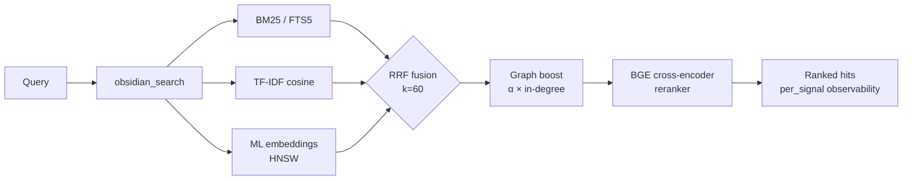

<div align="center">

<a href="https://github.com/oomkapwn/enquire-mcp"></a>

# enquire-mcp

<sub>[English](./README.md) · [中文](./README.zh.md) · [Español](./README.es.md) · [हिन्दी](./README.hi.md) · [العربية](./README.ar.md) · [Русский](./README.ru.md) · [Português](./README.pt.md) · [Français](./README.fr.md) · [日本語](./README.ja.md) · [한국어](./README.ko.md) · **Deutsch**</sub>

<sub>**TL;DR für KI-Agenten** — MCP-Server, der einen lokalen Obsidian-Markdown-Vault für Claude Code, Claude Desktop, Cursor, ChatGPT, Codex und OpenClaw als persistentes, durchsuchbares Gedächtnis bereitstellt. Hybrid-Retrieval (BM25 + ML-Embeddings + BGE-Reranker, per RRF fusioniert), HNSW + int8-Quantisierung, agentisches RAG (HyDE + Teilfragen), GraphRAG-light, PDFs + OCR, eigenständige Bases. Anbieterneutral, MIT, null Cloud-Aufrufe während des Servings. Installation: `npm i -g @oomkapwn/enquire-mcp`. Docs: [llms.txt](https://github.com/oomkapwn/enquire-mcp/blob/main/llms.txt) · [AGENTS.md](https://github.com/oomkapwn/enquire-mcp/blob/main/AGENTS.md) · [API](https://oomkapwn.github.io/enquire-mcp/).</sub>

### Das fortschrittlichste Obsidian-MCP. Langzeitgedächtnis für KI-Agenten.

**Hören Sie auf, Claude, Cursor, ChatGPT, Codex und OpenClaw in jeder Sitzung den Kontext neu zu erklären. Ihre Obsidian-Notizen werden zu einem gemeinsamen, durchsuchbaren Gedächtnis über jeden MCP-kompatiblen Agenten hinweg — Ihr Wissen, jedes Modell, für immer Ihnen gehörend.**

*Gemessen: Der BGE-Cross-Encoder-Reranker bringt **+15.5 NDCG@10 / +24.7 MRR** gegenüber reinem Hybrid auf einer [reproduzierbaren 60-Abfragen-Ablation](./docs/benchmarks.md) — der vollständige moderne IR-Stack, der das von **Ihnen** geschriebene Markdown zurückholt (zitiert, editierbar), niemals eine Cloud-Paraphrase.*

[](https://github.com/oomkapwn/enquire-mcp/actions/workflows/ci.yml)
[](https://www.npmjs.com/package/@oomkapwn/enquire-mcp)
[](https://www.npmjs.com/package/@oomkapwn/enquire-mcp)
[](#️-vertrauen)
[](./STABILITY.md)
[](https://slsa.dev/spec/v1.0/levels#build-l2)
[](https://modelcontextprotocol.io/)
[](./LICENSE)

**[⚡ Installation in 30 Sekunden](#-schnellstart) · [🧠 Anwendungsfälle](#-anwendungsfälle) · [📊 Benchmarks](./docs/benchmarks.md) · [📖 API-Referenz](https://oomkapwn.github.io/enquire-mcp/) · [💬 Alternativen vergleichen](./docs/COMPARISON.md)**

**Claude Code — eine einzige Zeile:**

```bash
claude mcp add obsidian -- npx -y @oomkapwn/enquire-mcp serve --vault ~/Documents/Obsidian\ Vault
```

</div>

> 📌 Dieses Dokument ist die deutsche Übersetzung von [README.md](./README.md), um die Lektüre für deutschsprachige Nutzer zu erleichtern; bei Abweichungen ist **die englische Fassung maßgeblich** (sie wird bei jeder Veröffentlichung aktualisiert).

---

## Das Problem

Jede KI-Sitzung beginnt bei null. Sie erklären Ihr Projekt, Ihre Design-Entscheidungen, die Schlussfolgerungen der Recherche der letzten Woche immer wieder neu. Die „Gedächtnis"-Funktionen der Anbieter ([Claude Memory](https://www.anthropic.com/news/memory-and-tool-use), [ChatGPT Memory](https://openai.com/index/memory-and-new-controls-for-chatgpt/), Cursor-Gedächtnis) sperren Ihr Wissen in die Cloud eines einzigen Anbieters ein — und vergessen es wieder, sobald Sie das Tool wechseln. **Ihr Wissen fängt immer wieder von vorne an.**

## Die Lösung

Ihr Obsidian-Vault wird zum **persistenten, abfragbaren Langzeitgedächtnis** für jeden MCP-kompatiblen Agenten. Eine Installation — Ihr Wissen ist sofort aus Claude Code, Claude Desktop, Cursor, dem benutzerdefinierten GPT von ChatGPT, Codex, OpenClaw und jedem anderen MCP-Client zugänglich. Reine Markdown-Dateien, **die Ihnen gehören**, lokal indexiert, durchsucht mit dem vollständigen modernen IR-Stack, über jede Sitzung und jedes Modell hinweg abrufbar.

**Verankert, nicht extrahiert.** Konversationsgedächtnis-Tools (mem0, Zep, Supermemory, Memobase) *extrahieren* Fakten aus Ihren Chat-Protokollen in einen separaten Speicher, den Sie nicht lesen können. enquire-mcp macht das Gegenteil: Es ist **im Wissen verankert, das Sie bereits geschrieben haben** — Ihren eigenen `.md`-Notizen, wortgetreu, mit Zitaten — sodass der Abruf nachvollziehbar, in jedem Editor editierbar und niemals eine verlustbehaftete Zusammenfassung eines Chats ist, an den Sie sich nur halb erinnern. Und anders als serverseitige ***Flotten*-Gedächtnis**-Plattformen — mandantenfähige Cloud-Speicher, die Agenten-Traffic in eine gemeinsame Datenbank paraphrasieren — ist enquire **Einzelnutzer- und Local-First**: ein Vault, der Ihnen vollständig gehört und den Sie selbst lesen, bearbeiten und löschen können, mit null Cloud-Aufrufen während des Servings. (Diese „Extraktions"-Kritik gilt speziell der Chat-Gedächtnis-Kohorte — nicht Knowledge-Graph- / ETL-Tools wie cognee, ebenso wenig persönlichen Such-Pendants wie Khoj.)

**Verankert — und frischebewusst.** Einen Fakt abzurufen ist nur die halbe Aufgabe; zu wissen, ob er noch *wahr* ist, ist die andere Hälfte. Der [Memora-Benchmark](https://arxiv.org/abs/2604.20006) (Apr. 2026) zeigte, dass Gedächtnissysteme systematisch an der Wiederverwendung veralteter Fakten scheitern — eine ein Jahr alte Notiz so abzurufen, als wäre sie heute geschrieben worden. Weil enquires Gedächtnis Ihre echten Markdown-Dateien *ist*, trägt jeder Suchtreffer `age_days` + ein `stale`-Flag, das aus der echten Zeit der letzten Änderung der Notiz abgeleitet wird, und Sie können sich für ein nach Aktualität gewichtetes Ranking (`--recency-weight`) entscheiden, sodass frischere Notizen zuerst erscheinen. Ihr Wissen, frischebewusst — kein zeitloser Klumpen.

> **Was enquire-mcp anders macht**:
> 1. **Anbieterneutral.** Ihr Gedächtnis lebt in `.md`-Dateien. Wechseln Sie von Claude zu Cursor — Ihr Gedächtnis kommt mit.
> 2. **Retrieval der Spitzenklasse.** Hybrides BM25 + mehrsprachige Embeddings + BGE-Cross-Encoder-Reranker, per RRF fusioniert, skaliert mit HNSW + int8-Quantisierung. Derselbe IR-Stack, den ein Such-Startup bauen würde — als Open Source, in einer einzigen Binärdatei.
> 3. **Null Cloud-Aufrufe während des Servings.** Das Embedding-Modell läuft **auf Ihrem Rechner** und indexiert das von **Ihnen** geschriebene Markdown — deshalb ist es ein einmaliger lokaler Download (~110 MB), kein Cloud-API-Schlüssel. Verankert + privat gibt es nicht umsonst, und wir tun nicht so: Der Inhalt Ihres Vaults verlässt niemals Ihren Rechner, standardmäßig air-gap-sicher ([erzwungen](./SECURITY.md), nicht nur angestrebt).
> 4. **Frischebewusster Abruf.** Jeder Treffer meldet, wie alt die Notiz ist; das optionale Reranking nach Aktualität erlaubt es einem Agenten, frisches Wissen zu bevorzugen und veraltete Fakten zur erneuten Überprüfung zu markieren — die vergessensbewusste Front, aufgebaut auf der `mtime`, die Ihre Dateien bereits besitzen.

**46 Tools · 19 MCP-Prompts · 1681+ Unit-Tests · 50+ Sprachen · v3.11.x stable · semver-gebunden · MIT · npm-Build-Provenienz (SLSA L2).**

---

## 🏆 Warum es das Beste ist

**Sechs Funktionen, die kein anderes Obsidian-MCP überhaupt hat** (GraphRAG-light, eigenständige `.base`-Ausführung, HyDE, int8-Quantisierung, Late-Chunking, integriertes Eval-Harness). **Plus der gesamte moderne IR-Stack** (BM25 + ML-Embeddings + Cross-Encoder-Reranking + HNSW), von dem Konkurrenten höchstens ein oder zwei Bestandteile mitbringen. Im direkten Vergleich:

| Fähigkeit | enquire-mcp | Smart Connections | Andere Obsidian-MCPs |
|---|:---:|:---:|:---:|
| Hybrid-Retrieval (BM25 + TF-IDF + ML-Embeddings, per RRF fusioniert) | ✅ | ❌ | ❌ |
| **Cross-Encoder-Reranking** (BGE, +15.5 NDCG@10 gemessen) | ✅ | ❌ | ❌ |
| **HNSW-Vektorindex** (Top-K in unter 10 ms, persistiert) | ✅ | ❌ | ❌ |
| **int8-Vektorquantisierung** (~4× kleinere embed-db) | ✅ | ❌ | ❌ |
| **Late-Chunking** (kontextfenstergestützte Embeddings) | ✅ | ❌ | ❌ |
| **PDFs in die Hybrid-Suche eingemischt** (`[page: N]`-Zitate) | ✅ | ❌ | ❌ |
| **OCR für gescannte PDFs** (Tesseract.js, mehrsprachig) | ✅ | ❌ | ❌ |
| **Wikilink-Graph-Boost** als Retrieval-Signal | ✅ | ❌ | ❌ |
| **Mehrsprachige semantische Suche** (50+ Sprachen, on-device) | ✅ | 💰 kostenpflichtig | ❌ |
| **Integriertes Eval-Harness für die Retrieval-Qualität** (NDCG, Recall, MRR, A/B-Matrix) | ✅ | ❌ | ❌ |
| **Remote-MCP** über HTTP + Bearer-Auth + zustandsbehaftete Sitzungen | ✅ | ❌ | teilweise |
| **Pro-Signal-Observability** je Treffer | ✅ | ❌ | ❌ |
| **MCP-nativ** (Claude · Cursor · ChatGPT · Codex · OpenClaw · jeder Client) | ✅ | ❌ nur Obsidian | variiert |
| **Privatsphäre-Filter** an jedem Such- + Schreibpfad verifiziert | ✅ | n. z. | ❌ |
| **46 Produktions-Tools** (34 stets aktive Lese-Tools + 4 optionale + 7 abgesicherte Schreib-Tools + 1 Feedback-Tool) | ✅ | n. z. | variiert |
| **GraphRAG-light** (Wikilink-Community-Erkennung via Louvain-Modularität) | ✅ **nur hier** | ❌ | ❌ |
| **Eigenständige `.base`-Abfrageausführung** (funktioniert ohne laufendes Obsidian) | ✅ **nur hier** | ❌ | ❌ delegiert an Obsidian |
| **HyDE-Retrieval** (Gao et al. 2023) + Teilfragen-Zerlegung | ✅ **nur hier** | ❌ | ❌ |
| **1681 Unit-Tests · 9 release-erforderliche CI-Checks · aktuell 7 branch-geschützt** | ✅ | n. z. | selten |
| **Signierte Build-Provenienz** (npm + Sigstore, SLSA Build L2) | ✅ | n. z. | ❌ |
| **Semver-gebundene öffentliche Oberfläche** ([STABILITY.md](./STABILITY.md)) | ✅ | n. z. | ❌ |
| Eigenständig (kein Obsidian-Plugin nötig) | ✅ | ❌ erfordert Obsidian | variiert |
| Lizenz | MIT, kostenlos | proprietär, kostenpflichtig | variiert |

<sub>Vergleich basierend auf den öffentlichen Fähigkeiten jedes Projekts zum Stand der stabilen Version v3.8.x (initiale Momentaufnahme v3.7.0 / 2026-05-15; aktualisiert in v3.8.4). Smart Connections ist ein kostenpflichtiges Obsidian-Plugin (kein MCP-Server). „Andere Obsidian-MCPs" bezeichnet die öffentlichen Open-Source-Obsidian-MCP-Server auf GitHub zum Zeitpunkt der Erstellung. Öffentliche End-to-End-Retrieval-Benchmarks für enquire-mcp sind in <a href="./docs/benchmarks.md"><code>docs/benchmarks.md</code></a> veröffentlicht — das gemessene `rerank-bge`-Delta beträgt +24.7 MRR / +15.5 NDCG@10 gegenüber reinem Hybrid auf einer 60-Abfragen-Ablation.</sub>

> Strategische Behauptung: enquire-mcp ist das Open-Source-Backend für [LLM-Wikis im Karpathy-Stil](https://gist.github.com/karpathy/442a6bf555914893e9891c11519de94f) auf Basis Ihres bestehenden Obsidian-Vaults. Wissen, das sich kumuliert, bis zu den Quellen nachverfolgbar.

---

## ⚡ Schnellstart

```bash
npm install -g @oomkapwn/enquire-mcp
enquire-mcp serve --vault ~/Documents/Obsidian\ Vault
```

In jeden MCP-Client einklinken:

```json
{
  "mcpServers": {
    "obsidian": {
      "command": "npx",
      "args": ["-y", "@oomkapwn/enquire-mcp", "serve", "--vault", "/path/to/vault"]
    }
  }
}
```

📂 Sofort einsetzbare Konfigurationen in [`examples/`](./examples/) — **Claude Desktop**, **Cursor**, **benutzerdefiniertes GPT von ChatGPT** (Remote-MCP über HTTP), plus ein Beispiel-Abfragesatz für das Eval-Harness.

**Möchten Sie die volle Hybrid-Power?** Schließen Sie den Hybrid-Preflight ab und starten Sie dann den Server:

```bash
npm install -g @oomkapwn/enquire-mcp@3.12.0-rc.1      # exact prerelease package
enquire-mcp --version
enquire-mcp setup --vault <path>                          # cached den Embedder und baut FTS5 + embed-db
enquire-mcp install-model rerank-bge                      # cached den Offline-Reranker
enquire-mcp doctor --tier hybrid --vault <path>           # strukturelle/runtime Bereitschaft
enquire-mcp configure --tier hybrid --client claude-desktop --vault <path>
enquire-mcp serve --vault <path> --persistent-index --enable-reranker --use-hnsw
```

---

## 🤖 In Ihrem KI-Agenten einrichten — Prompts zum Kopieren und Einfügen

Sobald `enquire-mcp` installiert ist, fügen Sie diese Prompts in Ihren Agenten ein, damit er weiß, dass der Vault als Gedächtnis verfügbar ist.

<details>
<summary><b>Claude Code (Terminal)</b> — MCP-Server hinzufügen + erster Prompt</summary>

```bash
# Fügen Sie den MCP-Server zu Ihrer Claude-Code-Konfiguration hinzu (einmalig)
claude mcp add obsidian -- npx -y @oomkapwn/enquire-mcp serve --vault ~/Documents/Obsidian\ Vault
```

Dann in jeder Claude-Code-Sitzung:

> Du verfügst jetzt über `obsidian_*`-Tools, die meinen Obsidian-Vault durchsuchen und lesen — mein Langzeitgedächtnis. Bevor du Fragen zu Projekten, Entscheidungen, Personen oder technischem Kontext beantwortest, rufe `obsidian_search` mit den relevanten Begriffen auf. Belege jeden Fakt mit der Quellnotiz (und `[page: N]` bei PDFs). Wenn du keine relevante Notiz findest, sag es — rate nicht.

</details>

<details>
<summary><b>Claude Desktop</b> — Konfigurationsdatei + erster Prompt</summary>

Bevorzugen Sie die direkt einsetzbare Ausgabe von `enquire-mcp configure --tier hybrid --client claude-desktop --vault <path>`. [`examples/claude-desktop-hybrid.json`](./examples/claude-desktop-hybrid.json) ist nur eine Vorlage; ersetzen Sie bei manueller Nutzung sowohl den Pfad zur ausführbaren Datei als auch den Vault-Pfad. Starten Sie Claude Desktop neu, dann:

> Du hast meinen Obsidian-Vault als durchsuchbares Gedächtnis über die `obsidian_*`-Tools angebunden. Prüfe immer zuerst `obsidian_search`, wenn ich dich nach etwas in meinen Notizen frage — Besprechungskontext, Recherche, Entscheidungen, Journaleinträge. Zitiere bei jedem Fakt den Pfad der Quellnotiz.

</details>

<details>
<summary><b>Cursor</b> — MCP-stdio-Konfiguration + Agenten-Regel</summary>

Legen Sie [`examples/cursor-mcp.json`](./examples/cursor-mcp.json) nach `~/.cursor/mcp.json` (bearbeiten Sie den Vault-Pfad). In Ihrer `.cursorrules`-Datei oder im Chat:

> Bevor du Code vorschlägst, der ein Thema berührt, zu dem ich Notizen haben könnte (Architektur-Entscheidungen, API-Verträge, Anbieterbewertungen), rufe zuerst `obsidian_search` auf. Behandle meinen Obsidian-Vault als maßgeblichen Kontext.

</details>

<details>
<summary><b>Benutzerdefiniertes GPT von ChatGPT</b> — Remote-MCP über HTTP</summary>

Folgen Sie [`examples/chatgpt-actions.md`](./examples/chatgpt-actions.md), um `serve-http` über einen Tunnel mit Bearer-Auth bereitzustellen. In den Anweisungen Ihres benutzerdefinierten GPT:

> Du hast Lesezugriff auf meinen Obsidian-Vault über die `obsidian_*`-Tool-Familie. Suche, bevor du etwas beantwortest, das in meinen Notizen stehen könnte; zitiere bei jeder Behauptung den Pfad der Quelldatei.

</details>

<details>
<summary><b>OpenClaw / Codex / jeder andere MCP-Client</b></summary>

Derselbe Befehl `npx -y @oomkapwn/enquire-mcp serve --vault <path>` funktioniert für jeden MCP-kompatiblen Client. In der MCP-Konfigurationsdokumentation des Clients erfahren Sie, wo der Servereintrag abzulegen ist; verwenden Sie dann einen der obigen Prompts.

</details>

**Wiederverwendbare Agenten-Regel** (in eine beliebige `AGENTS.md` / `CLAUDE.md` / `.cursorrules` einfügen, damit der Agent weiß, *wann* er auf den Vault zugreifen soll):

> Wenn meine Frage meine eigenen Notizen, Entscheidungen, Projekte, Personen oder Recherchen berührt, **suche zuerst in meinem Obsidian-Vault** über die `obsidian_*`-Tools (beginne mit `obsidian_search`) und zitiere bei jedem Fakt die Quellnotiz. Bevorzuge enquire für *konzeptuellen / sprachübergreifenden / „Was habe ich über X gesagt"*-Abruf; verwende einfaches `grep` / `ripgrep` für exakte wörtliche Zeichenketten. Wenn nichts Relevantes zurückkommt, sag es — rate nicht.

### Beispielabfragen, die gut funktionieren

- *„Finde jede Notiz, in der ich über Preisstrategie gesprochen habe, und fasse die Entwicklung zusammen."* — RRF-Fusion + Reranker verarbeiten „Entwicklung" semantisch
- *„Wie lautete meine Entscheidung zu PostgreSQL vs. MongoDB? Zitiere die Tagesnotiz."* — Wikilink-Graph-Boost holt das zentrale Entscheidungsdokument nach oben
- *„Анализируй мои заметки о RAG за последние 3 месяца"* — mehrsprachige Embeddings + Frontmatter-Datumsfilter
- *„Auf welchen Seiten des LLaMA-3-Paper-PDFs geht es um Skalierung?"* — PDFs in die Suche eingemischt mit `[page: N]`-Zitaten
- *„Zeig mir thematische Communities in meinem Recherche-Vault — welche Themen habe ich erkundet?"* — `obsidian_get_communities` (GraphRAG-light)

---

## 🧠 Anwendungsfälle

**1 — Langzeitgedächtnis für KI-Agenten.** Klinken Sie Ihren Obsidian-Vault in jeden MCP-kompatiblen Agenten ein (Claude Code, Claude Desktop, Cursor, ChatGPT, Codex, OpenClaw). Der Agent verfügt nun über dauerhaften, semantischen Abruf über jede Besprechungsnotiz, jeden Journaleintrag, jedes Recherche-Log und jedes Entscheidungsdokument, das Sie je geschrieben haben — über Sitzungen, Modelle und Anbieter hinweg. Anders als `Claude Memory` oder `ChatGPT Memory` ist Ihr Wissen nicht in die Cloud eines einzigen Anbieters gesperrt; es lebt in reinem Markdown, das Ihnen gehört und das Sie frei migrieren können.

**2 — Persönliche Wissensdatenbank / zweites Gehirn.** Das Hybrid-Retrieval holt die richtige Notiz für *jede* Formulierung nach oben, in jeder der 50+ Sprachen. Fragen Sie auf Englisch nach einem russischsprachigen Journaleintrag von vor zwei Jahren, und Sie erhalten den richtigen Treffer. Der Wikilink-Graph-Boost stuft Notizen höher ein, die im Zentrum Ihres Wissensgraphen stehen. GraphRAG-light bringt thematische Communities zum Vorschein — entdecken Sie Verbindungen, an die Sie sich nicht mehr erinnert haben. PDFs fließen mit `[page: N]`-Zitaten in die Suche ein, sodass Forschungsarbeiten und Besprechungsprotokolle zu erstklassigem Gedächtnis werden.

**3 — Agentisches RAG / Kontext-Engineering.** `obsidian_search` legt die Scores pro Signal offen, damit der Agent sieht, *warum* jeder Treffer eingestuft wurde. HyDE schreibt vage Abfragen vorab in reichhaltige hypothetische Antworten um, bevor das Retrieval erfolgt. Die Teilfragen-Zerlegung bewältigt Multi-Hop-Fragen („Wie hat sich unsere Preisstrategie entwickelt und wie haben die Kunden reagiert?"), indem sie sie in unabhängige Teilabfragen aufteilt und die Ergebnisse fusioniert. Das integrierte Eval-Harness (NDCG / Recall / MRR) erlaubt es Ihnen, die Retrieval-Qualität an Ihren eigenen Abfragen zu messen, statt den Benchmarks der Anbieter zu vertrauen.

---

## 🚫 Wann enquire-mcp *nicht* das richtige Tool ist

Ehrliche Nicht-Ziele — greifen Sie zu etwas anderem, wenn:

- **Sie eine wörtliche String-/Regex-Suche wollen.** `ripgrep` / `grep` ist schneller und exakt für „finde genau dieses Token". enquire glänzt beim *konzeptuellen* Abruf — Synonyme, sprachübergreifend, „Was habe ich über X gesagt". Nutzen Sie beides: `rg` fürs Wörtliche, enquire fürs Bedeutungsmäßige.
- **Ihr Wissen in Chat-Protokollen lebt, nicht in Notizen.** enquire ist im Markdown *verankert*, das Sie verfasst haben. Konversationsgedächtnis-Tools (mem0, Zep, Supermemory), die Fakten aus Chat-Transkripten in einen separaten Speicher *extrahieren*, sind eine andere Kategorie — siehe den [Vergleich](./docs/COMPARISON.md).
- **Sie eine Mehrbenutzer- / gehostete / synchronisierte Suche brauchen.** enquire ist von Grund auf Local-First und Single-Vault — kein serverseitiger mandantenfähiger Index.
- **Ihre Quellen weder Markdown noch PDF sind.** `.md` / `.canvas` / `.base` / `.pdf` sind erstklassig; andere Formate müssen zuerst konvertiert werden.
- **Sie eine GUI oder ein In-App-Obsidian-Plugin wollen.** enquire ist ein Headless-MCP-Server / CLI — es *ergänzt* Obsidian, es ist keines. (Smart Connections ist die In-App-Plugin-Option.)
- **Sie eine Suche im Submillisekundenbereich über Millionen von Notizen brauchen.** HNSW liefert Top-K in unter 10 ms bei großem Maßstab, aber enquire zielt auf persönliche / Team-Vaults ab, nicht auf Korpora im Web-Maßstab.

---

## 📖 API-Referenz

Automatisch generierte **[API-Referenz auf oomkapwn.github.io/enquire-mcp](https://oomkapwn.github.io/enquire-mcp/)** — jedes Tool, jeder Prompt und jeder exportierte Helper mit vollständigem TSDoc (`@param` / `@returns` / `@example`). Bei jedem Push auf `main` aus dem Quellcode neu gebaut über [`publish-docs.yml`](https://github.com/oomkapwn/enquire-mcp/blob/main/.github/workflows/publish-docs.yml) (TypeDoc → GitHub Pages). Driftfrei per Konstruktion: Dasselbe TSDoc, das KI-Agenten und IDEs sehen, ist das, was veröffentlicht wird.

---

## 🏗️ Wie das Retrieval funktioniert



`obsidian_search` erkennt automatisch die verfügbaren Signale und degradiert anmutig. Der Wikilink-Graph-Boost stuft das Top-K über ein personalisiertes 1-Schritt-PageRank um. Das optionale Cross-Encoder-Reranking bewertet das Top-N neu für gemessene +15.5 NDCG@10. Jeder Treffer liefert `per_signal: { bm25, tfidf, embeddings }` zurück, damit Sie sehen, WARUM er eingestuft wurde.

| Stufe | Einrichtung | Was Sie erhalten |
|---|---|---|
| **1** | `serve --vault <path>` | TF-IDF-Cosinus (null Einrichtung, sofort) |
| **2** | + `--persistent-index` | + BM25 / FTS5 (Top-10 in unter 100 ms) |
| **3** | + `setup` (lädt Modell herunter + baut embed-db) | + mehrsprachige ML-Embeddings |
| **4** | + `--enable-reranker` | + BGE-Cross-Encoder (+15.5 NDCG@10 gemessen) |
| **5** | + `--use-hnsw` | + Top-K in unter 10 ms im Millionen-Chunk-Maßstab |
| **6** | + `--include-pdfs` | + PDFs in alles Vorstehende eingemischt |
| **7** | `serve-http --bearer-token …` | + Remote-MCP (Claude.ai-Web, ChatGPT, Cursor-HTTP, mobil) |

---

## 🛠️ Alle 46 Tools

46 Tools insgesamt: 34 stets aktive Lese-Tools (inkl. dem übergreifenden `obsidian_search`) + 4 optionale Lese-Tools + 7 abgesicherte Schreib-Tools + 1 Closed-Loop-Feedback. Vollständige Referenz: **[docs/api.md](./docs/api.md)**.

| Kategorie | Tools |
|---|---|
| **Suche & Retrieval** | `obsidian_search` (übergreifend, per RRF fusioniert) · `obsidian_hyde_search` (HyDE-augmentiert, v3.1.0) · `obsidian_search_text` · `obsidian_full_text_search` · `obsidian_semantic_search` · `obsidian_embeddings_search` · `obsidian_find_similar` |
| **Wikilinks & Graph** | `obsidian_resolve_wikilink` · `obsidian_get_backlinks` · `obsidian_get_outbound_links` · `obsidian_get_note_neighbors` · `obsidian_get_unresolved_wikilinks` · `obsidian_find_path` · `obsidian_get_communities` (v3.4.0, GraphRAG-light) |
| **Frontmatter & Dataview** | `obsidian_frontmatter_get` · `obsidian_frontmatter_search` · `obsidian_dataview_query` · `obsidian_list_tags` |
| **Lesen & navigieren** | `obsidian_read_note` · `obsidian_list_notes` · `obsidian_get_recent_edits` · `obsidian_stale_notes` · `obsidian_open_questions` · `obsidian_context_pack` · `obsidian_chat_thread_read` · `obsidian_open_in_ui` · `obsidian_stats` |
| **PDFs, Canvas & Bases** | `obsidian_read_pdf` · `obsidian_list_pdfs` · `obsidian_ocr_pdf` · `obsidian_read_canvas` · `obsidian_list_canvases` · `obsidian_list_bases` (v3.2.0) · `obsidian_read_base` (v3.2.0) · `obsidian_query_base` (v3.2.0) |
| **Schreib-Tools** (abgesichert durch `--enable-write`) | `obsidian_create_note` · `obsidian_append_to_note` · `obsidian_rename_note` · `obsidian_replace_in_notes` · `obsidian_archive_note` · `obsidian_frontmatter_set` · `obsidian_chat_thread_append` |
| **Diagnose / Lint** | `obsidian_lint_wiki` · `obsidian_paper_audit` · `obsidian_validate_note_proposal` |
| **Feedback** (optional via `--feedback-weight`) | `obsidian_mark_useful` (Closed-Loop: erfasst, welche abgerufenen Notizen geholfen haben; wertet sie in künftigen Suchen auf) |

Plus 3 MCP-Ressourcen (`obsidian://vault/info`, `obsidian://note/{path}`, `obsidian://chunk/{n}/{path}`) und 19 **MCP-Prompts** (`summarize_recent_edits` · `review_tag` · `find_orphans` · `weekly_review` · `extract_todos` · `process_inbox` · `consolidate_tags` · `find_duplicates` · `lint_wiki` · `monthly_review` · `search_with_query_expansion` · `vault_synth` · `vault_wiki_compile` · `vault_lint_extended` · `vault_capture` · `vault_persona_search` · `vault_automation_setup` · `vault_research` · `vault_synthesis_page`) für gängige Vault-Workflows.

---

## 🛡️ Vertrauen

| Aspekt | Haltung |
|---|---|
| **Standard** | Schreibgeschützt — `--enable-write` für die 7 Schreib-Tools erforderlich |
| **Geringstes Privileg** | `--disabled-tools` / `--enabled-tools` legen eine minimale Oberfläche offen (z. B. erhält ein schreibgeschützter Recherche-Agent nur `obsidian_search` + `obsidian_read_note`) |
| **Pfadsicherheit** | Realpath-Prüfung bei jedem Lesen + Schreiben; Symlinks aus dem Vault heraus werden abgelehnt |
| **Privatsphäre-Filter** | An den Ressourcenpfaden von FTS5 + embed-db + Chunk verifiziert; fail-closed bei leeren Allow-/Deny-Listen |
| **HTTP-Transport** | Bearer-Auth (konstantzeitiges SHA-256 + `timingSafeEqual`), Rate-Limit pro Token, striktes CORS |
| **Frontmatter** | `js-yaml@5` `load` (YAML-1.2-Core-Schema, standardmäßig sicher) — keine Code-Ausführung |
| **Cache- + Indexdateien** | chmod 0600, übergeordnetes Verzeichnis 0700 |
| **CI** | Auf jedem PR laufen **9 release-erforderliche Checks**: `lint`, `test (22)`, `test (24)`, `smoke`, `audit`, `coverage`, `version-consistency`, `docs` und `oia`. Die Branch-Protection erzwingt derzeit nur **7** davon; `docs` und `oia` sind für Releases erforderlich, aber ungeschützt (live verifiziert am 2026-07-23). `test-macos` ist der einzige beratende Job mit `continue-on-error`. `docker` kann den CI-Workflow fehlschlagen lassen, ist aber ungeschützt; CodeQL führt über das [GitHub Default Setup](https://docs.github.com/code-security/code-scanning/automatically-scanning-your-code-for-vulnerabilities-and-errors/configuring-default-setup-for-code-scanning) zwei getrennte ungeschützte Analysen aus. Vor dem npm publish prüft `release.yml` alle 9 auf dem getaggten SHA erneut. |
| **Coverage** | Zeilen ≥86 % · Statements ≥82 % · Funktionen ≥75 % · Branches ≥74 % (abgesichert) |
| **Releases** | npm + GitHub-Release pro Tag · semver · **signierte Build-Provenienz** (npm + Sigstore, SLSA Build L2; L3-Generator auf der Roadmap) |
| **Stabilität** | v3.0+ semver-gebunden — jedes CLI-Flag, jeder Tool-Name, jede MCP-Ressource, jeder Prompt und jedes exportierte Symbol ist Vertrag |

Vollständige Haltung: **[SECURITY.md](./SECURITY.md)** · Stabilitätsoberfläche: **[STABILITY.md](./STABILITY.md)** · Sicherheitslücken: `oomkapwn@gmail.com`.

---

## ❓ FAQ

**Muss Obsidian installiert sein?** Nein. Liest `.md` + `.canvas` + `.pdf` direkt. Funktioniert mit jedem Vault im Obsidian-Format.

**Schreibt es in meinen Vault?** Nur wenn Sie `--enable-write` übergeben. Alle 7 Schreib-Tools sind abgesichert; destruktive unterstützen `dry_run`.

**Werden Daten irgendwohin gesendet?** Ausgehende Downloads erfolgen nur durch explizite Beschaffungsbefehle: `enquire-mcp setup`, `enquire-mcp build-embeddings` und `enquire-mcp install-model` können ONNX-Gewichte von HuggingFace laden; `enquire-mcp install-ocr-lang` lädt ein Tesseract-Sprachpaket für OCR. Der Serve-Modus stellt niemals ausgehende HTTP-Anfragen. Embeddings + Reranker laufen lokal auf der CPU.

**Performance?** Kalter FTS5-Build: ~5 s/1k Notizen, ~30 s/50k. BM25-Abfrage: immer <100 ms. Embedding-Build: ~30 ms/Chunk auf M1. **HNSW Top-10: unter 10 ms bei jedem Maßstab.** Serve-Kaltstart: ~50 ms mit HNSW-Persistenz.

**Sprachen?** Der Standard-Embedder ist `paraphrase-multilingual-MiniLM-L12-v2` (50+ Sprachen), End-to-End an zweisprachigen russisch-englischen Vaults validiert. Der standardmäßige Cross-Encoder-Reranker ist `rerank-bge` (English-only; der einzige End-to-End verifizierte Katalog-Alias); die mehrsprachigen Reranker-Aliase scheitern derzeit an der transformers.js-Tokenizer-Kompatibilitätsprüfung. CJK/Thai/Khmer-Tokenisierung nutzt `Intl.Segmenter`.

**Remote ausführen?** Ja — `serve-http` stellt denselben Server über [Streamable HTTP](https://modelcontextprotocol.io/specification/2025-06-18/basic/transports#streamable-http) bereit. Stellen Sie Tailscale Funnel oder Cloudflare Tunnel davor für HTTPS. Funktioniert mit dem claude.ai-Web, dem benutzerdefinierten GPT von ChatGPT, dem HTTP-Modus von Cursor und mobilen MCP-Clients. Siehe **[docs/http-transport.md](./docs/http-transport.md)**.

---

## 🚀 Releases

**v3.0.0 — stabiler Kanal.** Die v2.x-Retrieval-Roadmap ist abgeschlossen, und die öffentliche Oberfläche ist nun [semver-gebunden](./STABILITY.md). Best-of-Auswahl:

`v2.0` Hybrid-Retrieval (BM25+TF-IDF+Embeddings via RRF) · `v2.6` Remote-MCP · `v2.7-2.8` PDFs eingemischt · `v2.9` BGE-Reranker · `v2.10` OCR · `v2.11` doctor + setup · `v2.12` Eval-Harness · `v2.13` HNSW · `v2.14` zustandsbehaftete Sitzungen · `v2.15` Late-Chunking · `v2.16` HNSW-Persistenz · `v2.17` int8-Quantisierung · `v3.8.0` stable · `v3.8.7` Härtung des HTTP-Transports · **`v3.9.0` stable**: embed-sync des Watchers für OCR-PDFs, HNSW-In-Memory-Live-Update bei Dateiänderungen, R-10 adaptives HNSW-Refill (schließt die >66 %-ausgeschlossene Unterrückgabe). · **`v3.10` stable**: vergessensbewusste Frische — `age_days` + `stale`-Flag + optionales `--recency-weight`-Reranking + frontmatterbewusstes `obsidian_search`.

Kanal: `npm install @oomkapwn/enquire-mcp` → neueste stabile Version (`@latest` = v3.11.x). Vorabversion: `npm install @oomkapwn/enquire-mcp@rc` (der neueste Release-Kandidat — siehe [CHANGELOG.md](./CHANGELOG.md)). Vollständiges Changelog: **[CHANGELOG.md](./CHANGELOG.md)** · Vorausschauender Plan: **[ROADMAP.md](https://github.com/oomkapwn/enquire-mcp/blob/main/ROADMAP.md)**.

---

## 🤝 Mitwirken

```bash
git clone https://github.com/oomkapwn/enquire-mcp.git
cd enquire-mcp && npm install
npm test       # vollständige Suite (1681 Tests)
npm run lint   # null Warnungen
npm run build  # tsc → dist/
```

Issues, PRs und Ideen sind willkommen.

---

## 📜 Lizenz

MIT. Erstellt von [Alex (@OomkaBear)](https://github.com/oomkapwn). Benannt nach [Tim Berners-Lees Prototyp des WWW von 1980](https://en.wikipedia.org/wiki/ENQUIRE) — dem ursprünglichen Hypertext-System, vor dem Web. Die ursprüngliche Spezifikation lautete: Man konnte das System nach allem fragen. **enquire-mcp bringt das in Ihren Vault.**
