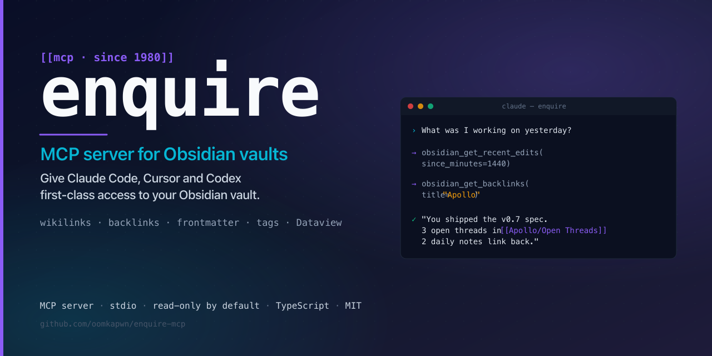
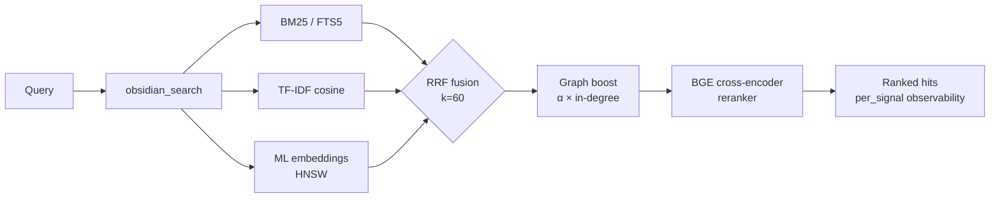

<div align="center">

<a href="https://github.com/oomkapwn/enquire-mcp"></a>

# enquire-mcp

<sub>[English](./README.md) · [中文](./README.zh.md) · **Español** · [हिन्दी](./README.hi.md) · [العربية](./README.ar.md) · [Русский](./README.ru.md) · [Português](./README.pt.md) · [Français](./README.fr.md) · [日本語](./README.ja.md) · [한국어](./README.ko.md) · [Deutsch](./README.de.md)</sub>

### 🏆 El Obsidian MCP n.º 1 para memoria de IA.

**Deja de reexplicarle el contexto a Claude, Cursor, ChatGPT, Codex y OpenClaw en cada sesión. Tus notas de Obsidian se convierten en una memoria compartida y consultable entre todos los agentes compatibles con MCP: tu conocimiento, cualquier modelo, tuyo para siempre.**

[](https://www.npmjs.com/package/@oomkapwn/enquire-mcp)
[](./STABILITY.md)
[](https://slsa.dev/spec/v1.0/levels#build-l2)
[](https://modelcontextprotocol.io/)
[](./LICENSE)

**[⚡ Instalación en 30 segundos](#-inicio-rápido) · [🏆 Por qué es el n.º 1](#why-number-one) · [🧠 Casos de uso](#-casos-de-uso) · [📊 Benchmarks](./docs/benchmarks.md) · [📖 Referencia de la API](https://oomkapwn.github.io/enquire-mcp/)**

**Claude Code —— en una sola línea:**

```bash
claude mcp add obsidian -- npx -y @oomkapwn/enquire-mcp serve --vault ~/Documents/Obsidian\ Vault
```

</div>

> 📌 Este documento es la traducción al español de [README.md](./README.md), para facilitar la lectura a quienes hablan español; ante cualquier discrepancia, **prevalece la versión en inglés** (que se actualiza con cada publicación).

---

## El problema

Cada sesión de IA empieza desde cero. Vuelves a explicar el proyecto, las decisiones de diseño y las conclusiones de la investigación anterior. La memoria integrada de cada proveedor encierra el conocimiento en una sola nube y rompe la continuidad cuando cambias de herramienta. **Tu conocimiento no para de empezar de nuevo.**

## La solución

Tu bóveda de Obsidian se convierte en **memoria a largo plazo persistente y consultable** para cualquier agente compatible con MCP. Una sola instalación: tu conocimiento queda al instante accesible desde Claude Code, Claude Desktop, Cursor, el GPT personalizado de ChatGPT, Codex, OpenClaw y cualquier otro cliente MCP. Archivos markdown planos **que son tuyos**, indexados localmente, buscados con todo el stack moderno de recuperación de información (IR), y recordados en cada sesión y con cada modelo.

**Anclado en tus textos, no extraído.** La mayoría de los sistemas de memoria conversacional extraen hechos de los chats hacia otro almacén. enquire-mcp parte del conocimiento que decidiste escribir: conserva tus notas `.md` literales y sus citas, de modo que cada recuerdo sea auditable, editable y migrable, nunca una paráfrasis con pérdidas oculta en una base de datos ajena. Una bóveda local sigue siendo la fuente de verdad, sin llamadas a la nube durante el servicio.

**Anclado —— y consciente de la frescura.** Recordar un hecho es solo la mitad del problema; saber si sigue siendo *cierto* es la otra mitad. El [benchmark Memora](https://arxiv.org/abs/2604.20006) (abril de 2026) mostró que los sistemas de memoria fallan sistemáticamente al reutilizar hechos obsoletos: recuerdan una nota de hace un año como si se hubiera escrito hoy. Como la memoria de enquire *son* tus archivos markdown reales, cada resultado de búsqueda incluye `age_days` (días de antigüedad) y una marca `stale` (obsoleto) derivada de la hora real de última modificación de la nota, y puedes activar el ranking ponderado por recencia (`--recency-weight`) para que las notas más recientes salgan primero. Tu conocimiento, consciente de la frescura, no un bloque atemporal.

> **Lo que hace diferente a enquire-mcp**:
> 1. **Neutral respecto al proveedor.** Tu memoria vive en archivos `.md`. Cambia de Claude a Cursor: tu memoria viaja contigo.
> 2. **Pila local de recuperación completa.** BM25 + TF-IDF + embeddings multilingües fusionados mediante RRF, con reranking BGE opcional y puntuaciones por señal; HNSW + cuantización int8 escalan la ruta densa.
> 3. **Cero llamadas a la nube durante el servicio.** El modelo de embeddings se ejecuta **en tu máquina** e indexa el markdown que **tú** escribiste: por eso es una descarga local única (~110 MB), no una clave de API en la nube. Estar anclado y ser privado no sale gratis, y no fingimos que sí: el contenido de tu bóveda nunca sale de tu máquina, seguro para entornos aislados por defecto ([garantizado](./SECURITY.md), no aspiracional).
> 4. **Recuperación consciente de la frescura.** Cada resultado informa de la antigüedad de la nota; el reordenamiento por recencia opcional permite que un agente prefiera el conocimiento reciente y marque los hechos obsoletos para reverificación: la frontera consciente del olvido, construida sobre el `mtime` que tus archivos ya tienen.

**46 herramientas · 19 prompts MCP · 1703+ pruebas unitarias · 50+ idiomas · v3.11.x estable · ligado a semver · MIT · procedencia de compilación en npm (SLSA L2).**

---

<a id="why-number-one"></a>

## 🏆 Por qué enquire-mcp es el n.º 1

**La pila local completa de memoria de IA para Obsidian: no es una simple envoltura de archivos ni solo búsqueda vectorial.** Una instalación reúne calidad de recuperación, propiedad del conocimiento, alcance entre agentes, cobertura documental y operación de nivel productivo.

| Estándar de liderazgo | Lo que ofrece enquire-mcp |
|---|---|
| **Recuerdo más allá de las palabras exactas** | ✅ BM25 + TF-IDF + embeddings multilingües → fusión RRF; el reranking BGE opcional aporta **+15.5 NDCG@10 / +24.7 MRR** medidos |
| **Una memoria para todos los agentes** | ✅ Acceso MCP nativo para Claude Code/Desktop, Cursor, ChatGPT, Codex, OpenClaw y cualquier cliente compatible |
| **Respuestas verificables** | ✅ Texto literal, rutas de notas, citas de páginas PDF, puntuaciones por señal y metadatos de frescura |
| **Conocimiento que realmente posees** | ✅ Markdown como fuente de verdad, índices locales y cero llamadas a la nube durante el servicio |
| **Toda la superficie de conocimiento de Obsidian** | ✅ Markdown, wikilinks, frontmatter, Canvas, Bases, PDF y OCR |
| **Recuperación agéntica para preguntas difíciles** | ✅ HyDE, descomposición en subpreguntas, paquetes de contexto, GraphRAG-light y 19 prompts de flujo |
| **Escala sin ceder el control** | ✅ Actualizaciones HNSW en vivo, persistencia, relleno adaptativo y cuantización int8 |
| **Confianza para producción** | ✅ Solo lectura por defecto, filtros de privacidad, HTTP autenticado, contratos semver, 1703 pruebas, 9 gates de publicación y procedencia SLSA L2 |

**Una bóveda. Todos los agentes. La pila completa. Sin dependencia de la nube.**

> Posicionamiento estratégico: enquire-mcp es el backend abierto para [LLM Wikis al estilo de Karpathy](https://gist.github.com/karpathy/442a6bf555914893e9891c11519de94f) sobre tu bóveda de Obsidian. Conocimiento que se acumula y siempre conserva su fuente.

---

## ⚡ Inicio rápido

```bash
npm install -g @oomkapwn/enquire-mcp
enquire-mcp serve --vault ~/Documents/Obsidian\ Vault
```

Conéctalo a cualquier cliente MCP:

```json
{
  "mcpServers": {
    "obsidian": {
      "command": "npx",
      "args": ["-y", "@oomkapwn/enquire-mcp", "serve", "--vault", "/path/to/vault"]
    }
  }
}
```

📂 Configuraciones listas para usar en [`examples/`](./examples/) —— **Claude Desktop**, **Cursor**, **GPT personalizado de ChatGPT** (MCP remoto sobre HTTP), además de un conjunto de consultas de ejemplo para el arnés de evaluación.

**¿Quieres toda la potencia híbrida?** Completa la preparación híbrida y luego inicia el servidor:

```bash
npm install -g @oomkapwn/enquire-mcp@3.12.0-rc.9      # exact prerelease package
enquire-mcp --version
# recommended: preview first, then explicitly apply the same package-coherent plan
enquire-mcp first-run --tier hybrid --client claude-desktop --vault <path>
enquire-mcp first-run --tier hybrid --client claude-desktop --vault <path> --apply
# manual equivalent below: choose this instead of first-run --apply, not in addition
enquire-mcp setup --vault <path>                          # guarda el embedder y construye FTS5 + embed-db
enquire-mcp install-model rerank-bge                      # guarda el reranker sin conexión
enquire-mcp doctor --tier hybrid --vault <path>           # preparación estructural/runtime
enquire-mcp configure --tier hybrid --client claude-desktop --vault <path>
enquire-mcp serve --vault <path> --persistent-index --enable-reranker --use-hnsw
```

---

## 🤖 Configúralo en tu agente de IA — prompts para copiar y pegar

Una vez instalado `enquire-mcp`, pega estos prompts en tu agente para que sepa que la bóveda está disponible como memoria.

<details>
<summary><b>Claude Code (terminal)</b> — añade el servidor MCP + primer prompt</summary>

```bash
# Añade el servidor MCP a tu configuración de Claude Code (una sola vez)
claude mcp add obsidian -- npx -y @oomkapwn/enquire-mcp serve --vault ~/Documents/Obsidian\ Vault
```

Luego, en cualquier sesión de Claude Code:

> Ahora dispones de herramientas `obsidian_*` que buscan y leen mi bóveda de Obsidian, mi memoria a largo plazo. Antes de responder a preguntas sobre proyectos, decisiones, personas o contexto técnico, llama a `obsidian_search` con los términos relevantes. Cita cada hecho con la nota fuente (y `[page: N]` para los PDF). Si no encuentras una nota relevante, dilo: no adivines.

</details>

<details>
<summary><b>Claude Desktop</b> — archivo de configuración + primer prompt</summary>

Prefiere la salida lista para pegar de `enquire-mcp configure --tier hybrid --client claude-desktop --vault <path>`. [`examples/claude-desktop-hybrid.json`](./examples/claude-desktop-hybrid.json) es solo una plantilla; si la usas manualmente, sustituye tanto la ruta del ejecutable como la de la bóveda. Reinicia Claude Desktop y luego:

> Tienes mi bóveda de Obsidian conectada como memoria consultable a través de las herramientas `obsidian_*`. Comprueba siempre `obsidian_search` primero cuando te pregunte por cualquier cosa de mis notas: contexto de reuniones, investigación, decisiones, entradas de diario. Cita la ruta de la nota fuente en cada hecho.

</details>

<details>
<summary><b>Cursor</b> — configuración MCP stdio + regla de agente</summary>

Deposita [`examples/cursor-mcp.json`](./examples/cursor-mcp.json) en `~/.cursor/mcp.json` (edita la ruta de la bóveda). En tu archivo `.cursorrules` o en el chat:

> Antes de sugerir código que toque un tema sobre el que pueda tener notas (decisiones de arquitectura, contratos de API, evaluaciones de proveedores), llama primero a `obsidian_search`. Trata mi bóveda de Obsidian como contexto autoritativo.

</details>

<details>
<summary><b>GPT personalizado de ChatGPT</b> — MCP remoto sobre HTTP</summary>

Sigue [`examples/chatgpt-actions.md`](./examples/chatgpt-actions.md) para exponer `serve-http` a través de un túnel con autenticación bearer. En las instrucciones de tu GPT personalizado:

> Tienes acceso de lectura a mi bóveda de Obsidian a través de la familia de herramientas `obsidian_*`. Busca antes de responder a cualquier cosa que pueda estar en mis notas; cita la ruta del archivo fuente en cada afirmación.

</details>

<details>
<summary><b>OpenClaw / Codex / cualquier otro cliente MCP</b></summary>

El mismo comando `npx -y @oomkapwn/enquire-mcp serve --vault <path>` funciona para cualquier cliente compatible con MCP. Consulta la documentación de configuración MCP del propio cliente para saber dónde colocar la entrada del servidor, y luego usa cualquiera de los prompts anteriores.

</details>

**Regla de agente reutilizable** (deposítala en cualquier `AGENTS.md` / `CLAUDE.md` / `.cursorrules` para que el agente sepa *cuándo* recurrir a la bóveda):

> Cuando mi pregunta toque mis propias notas, decisiones, proyectos, personas o investigación, **busca primero en mi bóveda de Obsidian** mediante las herramientas `obsidian_*` (empieza por `obsidian_search`) y cita la nota fuente en cada hecho. Prefiere enquire para el recall *conceptual / entre idiomas / "qué dije sobre X"*; usa `grep` / `ripgrep` simple para cadenas literales exactas. Si no vuelve nada relevante, dilo: no adivines.

### Ejemplos de consultas que funcionan bien

- *"Encuentra cada nota donde hablé de estrategia de precios, resume la evolución."* — la fusión RRF + el reranker manejan "evolución" semánticamente
- *"¿Cuál fue mi decisión sobre PostgreSQL vs MongoDB? Cita la nota diaria."* — el graph-boost de wikilinks saca a la luz el documento de decisión central
- *"Анализируй мои заметки о RAG за последние 3 месяца"* — embeddings multilingües + filtro de fecha en el frontmatter
- *"¿Qué páginas del PDF del artículo de LLaMA-3 hablan del escalado?"* — PDF mezclados en la búsqueda con citas `[page: N]`
- *"Muéstrame las comunidades temáticas de mi bóveda de investigación: ¿qué temas he estado explorando?"* — `obsidian_get_communities` (GraphRAG-light)

---

## 🧠 Casos de uso

**1 —— Memoria a largo plazo para agentes de IA.** Conecta tu bóveda de Obsidian a cualquier agente compatible con MCP (Claude Code, Claude Desktop, Cursor, ChatGPT, Codex, OpenClaw). El agente dispone entonces de una recuperación semántica duradera sobre cada nota de reunión, entrada de diario, registro de investigación y documento de decisión que hayas escrito jamás, a través de sesiones, modelos y proveedores. A diferencia de la memoria integrada de un proveedor, tu conocimiento no queda encerrado en la nube de un proveedor; vive en markdown plano que posees y puedes migrar libremente.

**2 —— Base de conocimiento personal / segundo cerebro.** La recuperación híbrida saca a la luz la nota correcta para *cualquier* formulación, en cualquiera de más de 50 idiomas. Pregunta en inglés por una entrada de diario en ruso de hace dos años y obtén el resultado correcto. El graph-boost de wikilinks reordena las notas que están en el centro de tu grafo de conocimiento. GraphRAG-light revela comunidades temáticas: descubre conexiones que olvidaste haber hecho. Los PDF se mezclan en la búsqueda con citas `[page: N]`, de modo que artículos de investigación y transcripciones de reuniones pasan a ser memoria de primera clase.

**3 —— RAG agéntico / ingeniería de contexto.** `obsidian_search` expone las puntuaciones por señal para que el agente vea *por qué* se posicionó cada resultado. HyDE reescribe de antemano las consultas vagas en respuestas hipotéticas ricas antes de la recuperación. La descomposición en subpreguntas resuelve preguntas multi-salto dividiéndolas en subconsultas independientes y fusionando los resultados. El arnés de evaluación incorporado (NDCG / Recall / MRR) te permite medir la calidad de recuperación con tus propias consultas en lugar de confiar en los benchmarks del proveedor.

---

## ✅ Hecho para flujos de conocimiento local exigentes

Elige enquire-mcp cuando quieras:

- **Mantener la bóveda de Obsidian como fuente de verdad**, sin copiar el conocimiento a un almacén propietario.
- **Compartir una memoria entre muchos agentes de IA**, sin volver a empezar al cambiar de modelo.
- **Recuerdo conceptual y multilingüe** que resista cambios de redacción.
- **Resultados citados e inspeccionables** con rutas, páginas PDF, señales y frescura.
- **Privacidad local-first** con solo lectura por defecto, escritura explícita y cero llamadas a la nube durante el servicio.
- **Un backend de recuperación completo** con búsqueda híbrida, reranking, grafo, expansión agéntica, formatos de Obsidian y MCP remoto.

**Alcance claro:** enquire-mcp es un servidor MCP / CLI sin interfaz para Markdown, Canvas, Bases y PDF. Combínalo con búsqueda literal para tokens exactos y usa el transporte HTTP integrado para agentes remotos.

---

## 📖 Referencia de la API

**[Referencia de la API autogenerada en oomkapwn.github.io/enquire-mcp](https://oomkapwn.github.io/enquire-mcp/)** — cada herramienta, prompt y helper exportado con TSDoc completo (`@param` / `@returns` / `@example`). Reconstruida desde el código fuente en cada push a `main` mediante [`publish-docs.yml`](https://github.com/oomkapwn/enquire-mcp/blob/main/.github/workflows/publish-docs.yml) (TypeDoc → GitHub Pages). Sin deriva por construcción: el mismo TSDoc que ven los agentes de IA y los IDE es el que se publica.

---

## 🏗️ Cómo funciona la recuperación



`obsidian_search` detecta automáticamente las señales disponibles y degrada con elegancia. El graph-boost de wikilinks reordena el top-K mediante un PageRank personalizado de un paso. El reranking con cross-encoder opcional vuelve a puntuar el top-N para +15.5 NDCG@10 medido. Cada resultado devuelve `per_signal: { bm25, tfidf, embeddings }`, para que veas POR QUÉ se posicionó.

| Nivel | Configuración | Lo que obtienes |
|---|---|---|
| **1** | `serve --vault <path>` | Coseno TF-IDF (cero configuración, instantáneo) |
| **2** | + `--persistent-index` | + BM25 / FTS5 (top-10 en menos de 100 ms) |
| **3** | + `setup` (descarga el modelo + construye embed-db) | + embeddings multilingües de ML |
| **4** | + `--enable-reranker` | + cross-encoder BGE (+15.5 NDCG@10 medido) |
| **5** | + `--use-hnsw` | + top-K en menos de 10 ms a escala de millones de chunks |
| **6** | + `--include-pdfs` | + PDF mezclados en todo lo anterior |
| **7** | `serve-http --bearer-token …` | + MCP remoto (web de Claude.ai, ChatGPT, Cursor HTTP, móvil) |

---

## 🛠️ Las 46 herramientas

46 herramientas en total: 34 de lectura siempre activas (incl. el paraguas `obsidian_search`) + 4 opcionales + 7 escrituras restringidas + 1 de retroalimentación de bucle cerrado. Referencia completa: **[docs/api.md](./docs/api.md)**.

| Categoría | Herramientas |
|---|---|
| **Búsqueda y recuperación** | `obsidian_search` (paraguas, fusionado con RRF) · `obsidian_hyde_search` (aumentado con HyDE, v3.1.0) · `obsidian_search_text` · `obsidian_full_text_search` · `obsidian_semantic_search` · `obsidian_embeddings_search` · `obsidian_find_similar` |
| **Wikilinks y grafo** | `obsidian_resolve_wikilink` · `obsidian_get_backlinks` · `obsidian_get_outbound_links` · `obsidian_get_note_neighbors` · `obsidian_get_unresolved_wikilinks` · `obsidian_find_path` · `obsidian_get_communities` (v3.4.0, GraphRAG-light) |
| **Frontmatter y Dataview** | `obsidian_frontmatter_get` · `obsidian_frontmatter_search` · `obsidian_dataview_query` · `obsidian_list_tags` |
| **Leer y navegar** | `obsidian_read_note` · `obsidian_list_notes` · `obsidian_get_recent_edits` · `obsidian_stale_notes` · `obsidian_open_questions` · `obsidian_context_pack` · `obsidian_chat_thread_read` · `obsidian_open_in_ui` · `obsidian_stats` |
| **PDF, Canvas y Bases** | `obsidian_read_pdf` · `obsidian_list_pdfs` · `obsidian_ocr_pdf` · `obsidian_read_canvas` · `obsidian_list_canvases` · `obsidian_list_bases` (v3.2.0) · `obsidian_read_base` (v3.2.0) · `obsidian_query_base` (v3.2.0) |
| **Escrituras** (restringidas por `--enable-write`) | `obsidian_create_note` · `obsidian_append_to_note` · `obsidian_rename_note` · `obsidian_replace_in_notes` · `obsidian_archive_note` · `obsidian_frontmatter_set` · `obsidian_chat_thread_append` |
| **Diagnóstico / lint** | `obsidian_lint_wiki` · `obsidian_paper_audit` · `obsidian_validate_note_proposal` |
| **Retroalimentación** (opcional vía `--feedback-weight`) | `obsidian_mark_useful` (bucle cerrado: registra qué notas recuperadas ayudaron; las potencia en búsquedas futuras) |

Además 3 recursos MCP (`obsidian://vault/info`, `obsidian://note/{path}`, `obsidian://chunk/{n}/{path}`) y 19 **prompts MCP** (`summarize_recent_edits` · `review_tag` · `find_orphans` · `weekly_review` · `extract_todos` · `process_inbox` · `consolidate_tags` · `find_duplicates` · `lint_wiki` · `monthly_review` · `search_with_query_expansion` · `vault_synth` · `vault_wiki_compile` · `vault_lint_extended` · `vault_capture` · `vault_persona_search` · `vault_automation_setup` · `vault_research` · `vault_synthesis_page`) para los flujos de trabajo habituales sobre la bóveda.

---

## 🛡️ Confianza

| Aspecto | Postura |
|---|---|
| **Por defecto** | Solo lectura —— se requiere `--enable-write` para las 7 herramientas de escritura |
| **Mínimo privilegio** | `--disabled-tools` / `--enabled-tools` exponen una superficie mínima (p. ej. un agente de investigación de solo lectura obtiene solo `obsidian_search` + `obsidian_read_note`) |
| **Seguridad de rutas** | Comprobación de realpath en cada lectura+escritura; se rechazan los symlinks que salen de la bóveda |
| **Filtro de privacidad** | Verificado en las rutas de recurso de FTS5 + embed-db + chunk; fail-closed ante listas de permitidos/denegados vacías |
| **Transporte HTTP** | Autenticación bearer (SHA-256 de tiempo constante + `timingSafeEqual`), límite de tasa por token, CORS estricto |
| **Frontmatter** | `js-yaml@5` `load` (esquema núcleo YAML 1.2, seguro por defecto) — sin ejecución de código |
| **Archivos de caché + índice** | chmod 0600, directorio padre 0700 |
| **1703 pruebas unitarias · 9 comprobaciones de CI requeridas para release · 7 protegidas actualmente** | Estado de publicación verificado; el detalle operativo está fijado debajo. |
| **CI** | En cada PR se ejecutan **9 comprobaciones requeridas para release**: `lint`, `test (22)`, `test (24)`, `smoke`, `audit`, `coverage`, `version-consistency`, `docs` y `oia`. La protección de rama exige actualmente solo **7**; `docs` y `oia` son necesarias para publicar, pero no están protegidas (verificado en vivo el 2026-07-23). `test-macos` es el único job indicativo con `continue-on-error`. `docker` puede hacer fallar el workflow de CI, pero no está protegido; CodeQL ejecuta dos análisis separados no protegidos mediante el [default setup de GitHub](https://docs.github.com/code-security/code-scanning/automatically-scanning-your-code-for-vulnerabilities-and-errors/configuring-default-setup-for-code-scanning). Antes de npm publish, `release.yml` reverifica las 9 en el SHA etiquetado. |
| **Cobertura** | Líneas ≥86 % · sentencias ≥82 % · funciones ≥75 % · ramas ≥74 % (con guarda) |
| **Publicación de versiones** | npm + GitHub release por cada tag · semver · **procedencia de compilación firmada** (npm + Sigstore, SLSA Build L2; generador L3 en la hoja de ruta) |
| **Estabilidad** | v3.0+ ligada a semver — cada flag de CLI, nombre de herramienta, recurso MCP, prompt y símbolo exportado es un contrato |

Postura completa: **[SECURITY.md](./SECURITY.md)** · Superficie de estabilidad: **[STABILITY.md](./STABILITY.md)** · Vulnerabilidades: `oomkapwn@gmail.com`.

---

## ❓ Preguntas frecuentes

**¿Hace falta tener instalado Obsidian?** No. Lee `.md` + `.canvas` + `.pdf` directamente. Funciona con cualquier bóveda en formato Obsidian.

**¿Escribirá en mi bóveda?** No, a menos que pases `--enable-write`. Las 7 herramientas de escritura están restringidas; las destructivas admiten `dry_run`.

**¿Se envían datos a algún sitio?** Las descargas salientes solo ocurren con comandos explícitos de adquisición: `enquire-mcp setup`, `enquire-mcp build-embeddings` y `enquire-mcp install-model` pueden descargar pesos ONNX de HuggingFace; `enquire-mcp install-ocr-lang` descarga un paquete de idioma Tesseract para OCR. El modo serve nunca realiza HTTP saliente. Los embeddings y el reranker se ejecutan localmente en la CPU.

**¿Rendimiento?** Construcción en frío de FTS5: ~5s/1k notas, ~30s/50k. Consulta BM25: siempre <100ms. **HNSW top-10: menos de 10 ms a cualquier escala.** Arranque en frío de serve: ~50ms con persistencia HNSW.

**¿Idiomas?** El embedder por defecto es `paraphrase-multilingual-MiniLM-L12-v2` (50+ idiomas), validado de extremo a extremo en vaults bilingües ruso + inglés. El reranker cross-encoder por defecto es `rerank-bge` (English-only; el único alias del catálogo validado de extremo a extremo); los alias multilingües del reranker fallan actualmente la comprobación de compatibilidad del tokenizer de transformers.js. La tokenización CJK / tailandés / jemer usa `Intl.Segmenter`.

**¿Ejecución remota?** Sí —— `serve-http` expone el mismo servidor a través de [Streamable HTTP](https://modelcontextprotocol.io/specification/2025-06-18/basic/transports#streamable-http). Ponle delante Tailscale Funnel o Cloudflare Tunnel para HTTPS. Funciona con la web de claude.ai, el GPT personalizado de ChatGPT, el modo HTTP de Cursor y clientes MCP móviles. Consulta **[docs/http-transport.md](./docs/http-transport.md)**.

---

## 🚀 Publicaciones

Canal: `npm install @oomkapwn/enquire-mcp` → última versión estable (`@latest` = v3.11.x). Versión preliminar: `npm install @oomkapwn/enquire-mcp@rc` (el último candidato a versión). Registro de cambios completo en **[CHANGELOG.md](./CHANGELOG.md)** · Hoja de ruta en **[ROADMAP.md](https://github.com/oomkapwn/enquire-mcp/blob/main/ROADMAP.md)**.

## 🤝 Cómo contribuir

Se agradecen issues y PR. Flujo de trabajo de desarrollo en **[CONTRIBUTING.md](https://github.com/oomkapwn/enquire-mcp/blob/main/CONTRIBUTING.md)**; guía del repositorio orientada a agentes en **[AGENTS.md](https://github.com/oomkapwn/enquire-mcp/blob/main/AGENTS.md)**.

## 📜 Licencia

[MIT](./LICENSE) © Alex (@OomkaBear)
