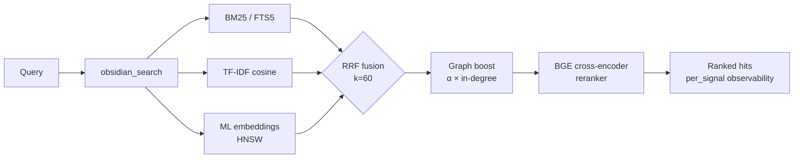

<div align="center">

<a href="https://github.com/oomkapwn/enquire-mcp"></a>

# enquire-mcp

<sub>[English](./README.md) · [中文](./README.zh.md) · [Español](./README.es.md) · [हिन्दी](./README.hi.md) · [العربية](./README.ar.md) · [Русский](./README.ru.md) · [Português](./README.pt.md) · **Français** · [日本語](./README.ja.md) · [한국어](./README.ko.md) · [Deutsch](./README.de.md)</sub>

<sub>**TL;DR pour les agents IA** — Le MCP Obsidian n° 1 pour une mémoire IA fraîche et citable. La recherche hybride couvre Markdown et PDF/OCR ; des outils structurés analysent Canvas, exécutent des requêtes LIST/TABLE de style Dataview et les filtres Obsidian Bases pris en charge. Neutre vis-à-vis des fournisseurs, MIT, lecture seule par défaut ; enquire n’initie aucun appel réseau sortant pendant `serve`. Installation : `npm i -g @oomkapwn/enquire-mcp`. Docs : [llms.txt](https://github.com/oomkapwn/enquire-mcp/blob/main/llms.txt) · [AGENTS.md](https://github.com/oomkapwn/enquire-mcp/blob/main/AGENTS.md) · [API](https://oomkapwn.github.io/enquire-mcp/api/).</sub>

### 🏆 Le MCP Obsidian n° 1 pour la mémoire IA.

**Arrêtez de réexpliquer le contexte à Claude, Cursor, ChatGPT, Codex, OpenClaw à chaque session. Vos notes Obsidian deviennent une mémoire partagée et interrogeable pour chaque agent compatible MCP — votre savoir, tous les modèles, à vous pour toujours.**

[](https://github.com/oomkapwn/enquire-mcp/actions/workflows/ci.yml)
[](https://www.npmjs.com/package/@oomkapwn/enquire-mcp)
[](https://www.npmjs.com/package/@oomkapwn/enquire-mcp)
[](#️-confiance)
[](./STABILITY.md)
[](https://slsa.dev/spec/v1.0/levels#build-l2)
[](https://modelcontextprotocol.io/)
[](./LICENSE)

**[⚡ Installation en 30 secondes](#-démarrage-rapide) · [🏆 Pourquoi n° 1](#why-number-one) · [🧠 Cas d'usage](#-cas-dusage) · [📊 Benchmarks](./docs/benchmarks.md) · [📖 Référence de l'API](https://oomkapwn.github.io/enquire-mcp/api/)**

**Claude Code — en une seule ligne :**

```bash
claude mcp add obsidian -- npx -y @oomkapwn/enquire-mcp serve --vault ~/Documents/Obsidian\ Vault
```

</div>

> 📌 Ce document est la traduction française de [README.md](./README.md), pour en faciliter la lecture aux francophones ; en cas de divergence, **la version anglaise fait foi** (elle est mise à jour à chaque publication).

---

## Le problème

Chaque session d'IA repart de zéro. Vous réexpliquez le projet, les choix de conception et les conclusions de la recherche précédente. La mémoire intégrée d'un fournisseur enferme le savoir dans un seul cloud et rompt la continuité lorsque vous changez d'outil. **Votre savoir n'arrête pas de recommencer à zéro.**

## La solution

Votre coffre Obsidian devient une **mémoire à long terme persistante et interrogeable** pour tout agent compatible MCP. Une seule installation — votre savoir est instantanément accessible depuis Claude Code, Claude Desktop, Cursor, le GPT personnalisé de ChatGPT, Codex, OpenClaw et tout autre client MCP. Des fichiers markdown bruts **qui vous appartiennent**, indexés localement, interrogés avec toute la pile moderne de recherche d'information (RI), rappelés à chaque session et avec chaque modèle.

**Ancré dans vos écrits, pas extrait.** La plupart des systèmes de mémoire conversationnelle extraient des faits des chats vers un autre stockage. enquire-mcp part du savoir que vous avez choisi d'écrire : les notes `.md` littérales et leurs citations restent auditables, modifiables et portables, jamais une paraphrase avec pertes cachée dans la base d'un tiers. Un coffre local reste la source de vérité, sans appel cloud pendant le service.

**Ancré — et conscient de la fraîcheur.** Rappeler un fait n'est que la moitié du problème ; savoir s'il est encore *vrai* est l'autre moitié. Le [benchmark Memora](https://arxiv.org/abs/2604.20006) (avr. 2026) a montré que les systèmes de mémoire échouent systématiquement à réutiliser les faits périmés — rappeler une note vieille d'un an comme si elle avait été écrite aujourd'hui. Parce que la mémoire d'enquire *est* vos vrais fichiers markdown, chaque résultat de recherche porte `age_days` + un indicateur `stale` dérivé de l'heure de dernière modification réelle de la note, et vous pouvez activer un classement pondéré par récence (`--recency-weight`) pour que les notes plus fraîches remontent en premier. Votre savoir, conscient de la fraîcheur — et non un bloc intemporel.

> **Ce qui rend enquire-mcp différent** :
> 1. **Neutre vis-à-vis des fournisseurs.** Votre mémoire vit dans des fichiers `.md`. Passez de Claude à Cursor — votre mémoire vous suit.
> 2. **Pile locale de récupération complète.** BM25 + TF-IDF + embeddings multilingues fusionnés par RRF, avec reranking BGE optionnel et scores par signal ; HNSW + quantification int8 font évoluer le chemin dense.
> 3. **Aucun appel réseau sortant initié par enquire pendant `serve`.** Les modèles sont mis en cache localement après un téléchargement explicite et unique depuis HuggingFace. Le contenu est renvoyé uniquement au client MCP connecté ; le traitement des données par ce client ou tunnel constitue sa propre frontière de confiance.
> 4. **Rappel conscient de la fraîcheur.** Chaque résultat indique l'âge de la note ; le reclassement par récence optionnel permet à un agent de préférer le savoir frais et de signaler les faits périmés à revérifier — la frontière consciente de l'oubli, bâtie sur le `mtime` que vos fichiers possèdent déjà.

**46 outils · 19 prompts MCP · 1807+ tests unitaires · 50+ langues · v3.11.x stable · lié au semver · MIT · provenance de build npm (SLSA L2).**

---

<a id="why-number-one"></a>

## 🏆 Pourquoi enquire-mcp est n° 1

**La pile locale complète de mémoire IA pour Obsidian — pas une simple enveloppe de fichiers ni seulement une recherche vectorielle.** Une installation réunit qualité de rappel, propriété du savoir, portée multi-agent, couverture documentaire et exploitation de niveau production.

| Standard de leadership | Ce qu'offre enquire-mcp |
|---|---|
| **Rappel au-delà des mots exacts** | ✅ BM25 + TF-IDF + embeddings multilingues → fusion RRF ; le reranking BGE optionnel apporte **+15.5 NDCG@10 / +24.7 MRR** mesurés |
| **Une mémoire pour tous les agents** | ✅ Accès MCP natif pour Claude Code/Desktop, Cursor, ChatGPT, Codex, OpenClaw et tout client compatible |
| **Réponses vérifiables** | ✅ Texte littéral, chemins de notes, pages PDF citées, scores par signal et métadonnées de fraîcheur |
| **Un savoir qui vous appartient vraiment** | ✅ Markdown comme source de vérité, index locaux et zéro appel cloud pendant le service |
| **Toute la surface de connaissance Obsidian** | ✅ Markdown, wikilinks, frontmatter, Canvas, Bases, PDF et OCR |
| **Récupération agentique pour les questions difficiles** | ✅ HyDE, décomposition en sous-questions, context packs, GraphRAG-light et 19 prompts MCP |
| **Passage à l'échelle sans perdre le contrôle** | ✅ Mises à jour HNSW en direct, persistance, refill adaptatif et quantification int8 |
| **Confiance en production** | ✅ Lecture seule par défaut, filtres de confidentialité, HTTP authentifié, contrats semver, 1807 tests, 12 gates de publication et provenance SLSA L2 |

**Un coffre. Tous les agents. La pile complète. Aucun verrouillage cloud.**

> Positionnement stratégique : enquire-mcp est le backend open source des [LLM Wikis façon Karpathy](https://gist.github.com/karpathy/442a6bf555914893e9891c11519de94f) sur votre coffre Obsidian existant. Un savoir qui s'accumule et reste traçable jusqu'aux sources.

---

## ⚡ Démarrage rapide

```bash
npm install -g @oomkapwn/enquire-mcp
enquire-mcp serve --vault ~/Documents/Obsidian\ Vault
```

Connectez-le à n'importe quel client MCP :

```json
{
  "mcpServers": {
    "obsidian": {
      "command": "npx",
      "args": ["-y", "@oomkapwn/enquire-mcp", "serve", "--vault", "/path/to/vault"]
    }
  }
}
```

### Un bundle desktop vérifiable ? MCPB Basic

La [GitHub Release `v4.0.0-rc.2`](https://github.com/oomkapwn/enquire-mcp/releases/tag/v4.0.0-rc.2) fournit `enquire-mcp-basic-4.0.0-rc.2.mcpb` avec sa somme de contrôle, son inventaire, son SBOM, ses notices et sa provenance. Le bundle contient le JavaScript serveur et les dépendances ordinaires ; l'hôte MCPB compatible doit fournir Node.js 22.13 ou plus récent.

Basic est limité à **13 outils en lecture seule** et **0 prompt** : aucune écriture, aucun index persistant, modèle, PDF/OCR ou watcher. Les essais réels de GUI desktop, signature, autorisation du dossier et annuaire restent à valider par le mainteneur. enquire n'émet aucun appel sortant pendant le service, mais le texte demandé est transmis au client MCP connecté et relève ensuite de ses conditions de confidentialité.

📂 Configurations prêtes à l'emploi dans [`examples/`](./examples/) — **Claude Desktop**, **Cursor**, **GPT personnalisé de ChatGPT** (MCP distant sur HTTP), plus un jeu de requêtes d'exemple pour le harnais d'évaluation.

**Vous voulez toute la puissance hybride ?** Exécutez le preflight hybride, puis démarrez le serveur :

```bash
npm install -g @oomkapwn/enquire-mcp@4.0.0-rc.2      # exact prerelease package
enquire-mcp --version
# recommended: preview first, then explicitly apply the same package-coherent plan
enquire-mcp first-run --tier hybrid --client claude-desktop --vault <path>
enquire-mcp first-run --tier hybrid --client claude-desktop --vault <path> --apply
# manual equivalent below: choose this instead of first-run --apply, not in addition
enquire-mcp setup --vault <path>                          # met l'embedder en cache et construit FTS5 + embed-db
enquire-mcp install-model rerank-bge                      # met le reranker hors ligne en cache
enquire-mcp doctor --tier hybrid --vault <path>           # préparation structurelle/runtime
enquire-mcp configure --tier hybrid --client claude-desktop --vault <path>
enquire-mcp serve --vault <path> --persistent-index --enable-reranker --use-hnsw
```

---

## 🤖 Configuration dans votre agent IA — prompts à copier-coller

Une fois `enquire-mcp` installé, collez ces prompts dans votre agent pour qu'il sache que le coffre est disponible comme mémoire.

<details>
<summary><b>Claude Code (terminal)</b> — ajouter le serveur MCP + premier prompt</summary>

```bash
# Ajoutez le serveur MCP à votre configuration Claude Code (une seule fois)
claude mcp add obsidian -- npx -y @oomkapwn/enquire-mcp serve --vault ~/Documents/Obsidian\ Vault
```

Ensuite, dans n'importe quelle session Claude Code :

> Tu disposes désormais d'outils `obsidian_*` qui recherchent et lisent mon coffre Obsidian — ma mémoire à long terme. Avant de répondre à des questions sur des projets, des décisions, des personnes ou un contexte technique, appelle `obsidian_search` avec les termes pertinents. Cite chaque fait avec la note source (et `[page: N]` pour les PDF). Si tu ne trouves pas de note pertinente, dis-le — ne devine pas.

</details>

<details>
<summary><b>Claude Desktop</b> — fichier de configuration + premier prompt</summary>

Préférez la sortie prête à coller de `enquire-mcp configure --tier hybrid --client claude-desktop --vault <path>`. [`examples/claude-desktop-hybrid.json`](./examples/claude-desktop-hybrid.json) n'est qu'un modèle ; en cas d'utilisation manuelle, remplacez les chemins de l'exécutable et du coffre. Redémarrez Claude Desktop, puis :

> Tu as mon coffre Obsidian branché comme mémoire interrogeable via les outils `obsidian_*`. Vérifie toujours `obsidian_search` en premier quand je te demande quoi que ce soit dans mes notes — contexte de réunion, recherche, décisions, entrées de journal. Cite le chemin de la note source pour chaque fait.

</details>

<details>
<summary><b>Cursor</b> — configuration MCP stdio + règle d'agent</summary>

Déposez [`examples/cursor-mcp.json`](./examples/cursor-mcp.json) à `~/.cursor/mcp.json` (modifiez le chemin du coffre). Dans votre fichier `.cursorrules` ou dans le chat :

> Avant de proposer du code qui touche à un sujet sur lequel j'ai peut-être des notes (décisions d'architecture, contrats d'API, évaluations de fournisseurs), appelle d'abord `obsidian_search`. Considère mon coffre Obsidian comme un contexte faisant autorité.

</details>

<details>
<summary><b>GPT personnalisé de ChatGPT</b> — MCP distant sur HTTP</summary>

Suivez [`examples/chatgpt-actions.md`](./examples/chatgpt-actions.md) pour exposer `serve-http` via un tunnel avec auth bearer. Dans les instructions de votre GPT personnalisé :

> Tu as un accès en lecture à mon coffre Obsidian via la famille d'outils `obsidian_*`. Cherche avant de répondre à tout ce qui pourrait se trouver dans mes notes ; cite le chemin du fichier source pour chaque affirmation.

</details>

<details>
<summary><b>OpenClaw / Codex / tout autre client MCP</b></summary>

La même commande `npx -y @oomkapwn/enquire-mcp serve --vault <path>` fonctionne pour tout client compatible MCP. Consultez la documentation de configuration MCP du client pour savoir où déposer l'entrée du serveur, puis utilisez l'un des prompts ci-dessus.

</details>

**Règle d'agent réutilisable** (à déposer dans n'importe quel `AGENTS.md` / `CLAUDE.md` / `.cursorrules` pour que l'agent sache *quand* recourir au coffre) :

> Quand ma question touche à mes propres notes, décisions, projets, personnes ou recherches, **cherche d'abord dans mon coffre Obsidian** via les outils `obsidian_*` (commence par `obsidian_search`) et cite la note source pour chaque fait. Préfère enquire pour le rappel *conceptuel / interlangue / « qu'ai-je dit à propos de X »* ; utilise `grep` / `ripgrep` simple pour les chaînes littérales exactes. Si rien de pertinent ne ressort, dis-le — ne devine pas.

### Exemples de requêtes qui fonctionnent bien

- *« Trouve chaque note où j'ai discuté de stratégie tarifaire, résume l'évolution. »* — la fusion RRF + le reranker gèrent « évolution » sémantiquement
- *« Quelle a été ma décision sur PostgreSQL vs MongoDB ? Cite la note quotidienne. »* — le graph-boost de wikilinks fait remonter le document de décision central
- *« Анализируй мои заметки о RAG за последние 3 месяца »* — embeddings multilingues + filtre de date sur le frontmatter
- *« De quelles pages du PDF de l'article LLaMA-3 parle-t-on de mise à l'échelle ? »* — PDF fondus dans la recherche avec citations `[page: N]`
- *« Montre-moi les communautés thématiques de mon coffre de recherche — quels thèmes ai-je explorés ? »* — `obsidian_get_communities` (GraphRAG-light)

---

## 🧠 Cas d'usage

**1 — Mémoire à long terme pour les agents IA.** Déposez votre coffre Obsidian dans n'importe quel agent compatible MCP (Claude Code, Claude Desktop, Cursor, ChatGPT, Codex, OpenClaw). L'agent dispose désormais d'un rappel sémantique durable sur chaque note de réunion, entrée de journal, journal de recherche et document de décision que vous ayez jamais écrit — à travers les sessions, les modèles et les fournisseurs. Contrairement à la mémoire intégrée d'un fournisseur, votre savoir n'est pas enfermé dans le cloud d'un seul fournisseur ; il vit dans du markdown brut qui vous appartient et que vous pouvez migrer librement.

**2 — Base de connaissances personnelle / second cerveau.** La récupération hybride fait remonter la bonne note pour *n'importe quelle* formulation, dans l'une des 50+ langues. Posez une question en anglais sur une entrée de journal en russe d'il y a deux ans, obtenez le bon résultat. Le graph-boost de wikilinks reclasse les notes qui se trouvent au centre de votre graphe de connaissances. GraphRAG-light fait émerger des communautés thématiques — découvrez des connexions que vous aviez oublié avoir faites. Les PDF se fondent dans la recherche avec des citations `[page: N]`, de sorte que les articles de recherche et les transcriptions de réunions deviennent une mémoire de premier ordre.

**3 — RAG agentique / ingénierie de contexte.** `obsidian_search` expose les scores par signal pour que l'agent voie *pourquoi* chaque résultat a été classé. HyDE réécrit au préalable les requêtes vagues en réponses hypothétiques riches avant la récupération. La décomposition en sous-questions gère les questions multi-sauts (« comment notre stratégie tarifaire a-t-elle évolué et quelle a été la réaction des clients ? ») en les découpant en sous-requêtes indépendantes, puis en fusionnant les résultats. Le harnais d'évaluation intégré (NDCG / Recall / MRR) vous permet de mesurer la qualité de récupération sur vos propres requêtes plutôt que de faire confiance aux benchmarks des fournisseurs.

---

## ✅ Conçu pour les flux de savoir local exigeants

Choisissez enquire-mcp si vous voulez :

- **Garder le coffre Obsidian comme source de vérité**, sans copier le savoir dans un stockage propriétaire.
- **Partager une mémoire entre plusieurs agents IA**, sans repartir de zéro en changeant de modèle.
- **Un rappel conceptuel et multilingue** qui résiste aux reformulations.
- **Des résultats cités et inspectables** avec chemins, pages PDF, signaux et fraîcheur.
- **Une confidentialité local-first** avec lecture seule par défaut, écriture explicite et zéro appel cloud pendant le service.
- **Un backend de récupération complet** : recherche hybride, reranking, graphe, expansion agentique, formats Obsidian et MCP distant.

**Périmètre clair :** enquire-mcp est un serveur MCP / CLI sans interface pour Markdown, Canvas, Bases et PDF. Associez-le à une recherche littérale pour les tokens exacts et utilisez le transport HTTP intégré pour les agents distants.

---

## 📖 Référence de l'API

**[Référence de l'API auto-générée sur oomkapwn.github.io/enquire-mcp](https://oomkapwn.github.io/enquire-mcp/api/)** — chaque outil, prompt et helper exporté avec un TSDoc complet (`@param` / `@returns` / `@example`). Reconstruite depuis les sources à chaque push sur `main` via [`publish-docs.yml`](https://github.com/oomkapwn/enquire-mcp/blob/main/.github/workflows/publish-docs.yml) (TypeDoc → GitHub Pages). Sans dérive par construction : le même TSDoc que voient les agents IA et les IDE est celui qui est publié.

---

## 🏗️ Comment fonctionne la récupération



`obsidian_search` détecte automatiquement les signaux disponibles et se dégrade avec élégance. Le graph-boost de wikilinks reclasse le top-K via un PageRank personnalisé d'un pas. Le reranking par cross-encoder optionnel re-score le top-N pour +15.5 NDCG@10 mesuré. Chaque résultat renvoie `per_signal: { bm25, tfidf, embeddings }` pour que vous voyiez POURQUOI il a été classé.

| Niveau | Configuration | Ce que vous obtenez |
|---|---|---|
| **1** | `serve --vault <path>` | Cosinus TF-IDF (zéro configuration, instantané) |
| **2** | + `--persistent-index` | + BM25 / FTS5 (recherche lexicale indexée) |
| **3** | + `setup` (télécharge le modèle + construit embed-db) | + embeddings ML multilingues |
| **4** | + `--enable-reranker` | + cross-encoder BGE (+15.5 NDCG@10 mesuré) |
| **5** | + `--use-hnsw` | + recherche de voisins approximatifs avec HNSW persistant |
| **6** | + `--include-pdfs` | + PDF fondus dans tout ce qui précède |
| **7** | `serve-http --bearer-token …` | + MCP distant (web Claude.ai, ChatGPT, Cursor HTTP, mobile) |

---

## 🛠️ Les 46 outils

46 outils au total : 34 de lecture toujours actifs (dont le parapluie `obsidian_search`) + 4 de lecture optionnels + 7 écritures restreintes + 1 de retour en boucle fermée. Référence complète : **[docs/api.md](./docs/api.md)**.

| Catégorie | Outils |
|---|---|
| **Recherche & récupération** | `obsidian_search` (parapluie, fusionné par RRF) · `obsidian_hyde_search` (augmenté par HyDE, v3.1.0) · `obsidian_search_text` · `obsidian_full_text_search` · `obsidian_semantic_search` · `obsidian_embeddings_search` · `obsidian_find_similar` |
| **Wikilinks & graphe** | `obsidian_resolve_wikilink` · `obsidian_get_backlinks` · `obsidian_get_outbound_links` · `obsidian_get_note_neighbors` · `obsidian_get_unresolved_wikilinks` · `obsidian_find_path` · `obsidian_get_communities` (v3.4.0, GraphRAG-light) |
| **Frontmatter & Dataview** | `obsidian_frontmatter_get` · `obsidian_frontmatter_search` · `obsidian_dataview_query` · `obsidian_list_tags` |
| **Lire & naviguer** | `obsidian_read_note` · `obsidian_list_notes` · `obsidian_get_recent_edits` · `obsidian_stale_notes` · `obsidian_open_questions` · `obsidian_context_pack` · `obsidian_chat_thread_read` · `obsidian_open_in_ui` · `obsidian_stats` |
| **PDF, Canvas & Bases** | `obsidian_read_pdf` · `obsidian_list_pdfs` · `obsidian_ocr_pdf` · `obsidian_read_canvas` · `obsidian_list_canvases` · `obsidian_list_bases` (v3.2.0) · `obsidian_read_base` (v3.2.0) · `obsidian_query_base` (v3.2.0) |
| **Écritures** (restreintes par `--enable-write`) | `obsidian_create_note` · `obsidian_append_to_note` · `obsidian_rename_note` · `obsidian_replace_in_notes` · `obsidian_archive_note` · `obsidian_frontmatter_set` · `obsidian_chat_thread_append` |
| **Diagnostic / lint** | `obsidian_lint_wiki` · `obsidian_paper_audit` · `obsidian_validate_note_proposal` |
| **Retour** (optionnel via `--feedback-weight`) | `obsidian_mark_useful` (boucle fermée : enregistre quelles notes rappelées ont aidé ; les valorise dans les recherches futures) |

Plus 3 ressources MCP (`obsidian://vault/info`, `obsidian://note/{path}`, `obsidian://chunk/{n}/{path}`) et 19 **prompts MCP** (`summarize_recent_edits` · `review_tag` · `find_orphans` · `weekly_review` · `extract_todos` · `process_inbox` · `consolidate_tags` · `find_duplicates` · `lint_wiki` · `monthly_review` · `search_with_query_expansion` · `vault_synth` · `vault_wiki_compile` · `vault_lint_extended` · `vault_capture` · `vault_persona_search` · `vault_automation_setup` · `vault_research` · `vault_synthesis_page`) pour les flux de travail courants sur le coffre.

---

## 🛡️ Confiance

| Aspect | Posture |
|---|---|
| **Par défaut** | Lecture seule — `--enable-write` requis pour les 7 outils d'écriture |
| **Moindre privilège** | `--disabled-tools` / `--enabled-tools` exposent une surface minimale (p. ex. un agent de recherche en lecture seule n'obtient que `obsidian_search` + `obsidian_read_note`) |
| **Sécurité des chemins** | Vérification realpath à chaque lecture+écriture ; les liens symboliques sortant du coffre sont rejetés |
| **Filtre de confidentialité** | Vérifié aux chemins de ressources FTS5 + embed-db + chunk ; fail-closed sur des listes d'autorisation/interdiction vides |
| **Transport HTTP** | Auth bearer (SHA-256 à temps constant + `timingSafeEqual`), limite de débit par token, CORS strict |
| **Frontmatter** | `js-yaml@5` `load` (schéma cœur YAML 1.2, sûr par défaut) — aucune exécution de code |
| **Fichiers de cache + index** | chmod 0600, répertoire parent 0700 |
| **1807 tests unitaires · 12 contrôles CI requis pour la release · 7 actuellement protégés** | Posture de publication vérifiée ; le détail opérationnel est fixé ci-dessous. |
| **CI** | `release.yml` énumère directement **12 gates de release**, tous exécutés sur chaque PR : `lint`, `test (22)`, `test (24)`, `smoke`, `audit`, `coverage`, `version-consistency`, `docs`, `oia`, `protocol-conformance`, `package-consumer` et `mcpb-basic`. Le job Windows hostile-filesystem épinglé `test-windows` est un check-run nommé supplémentaire, imposé transitivement comme prérequis bloquant de `smoke`. La protection de branche n'en impose actuellement que **7** ; `docs`, `oia`, `protocol-conformance`, `package-consumer` et `mcpb-basic` sont requis pour publier mais ne sont pas protégés (snapshot vérifié en direct le 2026-07-23). `test-macos` est le seul job indicatif avec `continue-on-error`. `docker` peut faire échouer le workflow CI mais n'est pas protégé ; CodeQL exécute deux analyses séparées non protégées via le [default setup de GitHub](https://docs.github.com/code-security/code-scanning/automatically-scanning-your-code-for-vulnerabilities-and-errors/configuring-default-setup-for-code-scanning). Avant npm publish, `release.yml` revérifie les 12 gates qu'il énumère directement sur le SHA taggé. |
| **Couverture** | Lignes ≥86 % · instructions ≥82 % · fonctions ≥75 % · branches ≥74 % (sous garde) |
| **Publications** | npm + release GitHub par tag · semver · **provenance de build signée** (npm + Sigstore, SLSA Build L2 ; générateur L3 sur la feuille de route) |
| **Stabilité** | v3.0+ liée au semver — chaque flag CLI, nom d'outil, ressource MCP, prompt et symbole exporté est un contrat |

Posture complète : **[SECURITY.md](./SECURITY.md)** · Surface de stabilité : **[STABILITY.md](./STABILITY.md)** · Vulnérabilités : `oomkapwn@gmail.com`.

---

## ❓ FAQ

**Faut-il installer Obsidian ?** Non. Lit `.md` + `.canvas` + `.pdf` directement. Fonctionne avec n'importe quel coffre au format Obsidian.

**Va-t-il écrire dans mon coffre ?** Pas sauf si vous passez `--enable-write`. Les 7 outils d'écriture sont restreints ; les outils destructifs prennent en charge `dry_run`.

**Des données envoyées quelque part ?** enquire n'envoie aucune télémétrie et n'initie aucun appel HTTP sortant pendant `serve`. Il renvoie toutefois le contexte demandé du coffre au client MCP connecté ; un client cloud peut traiter ce contexte selon sa propre politique de confidentialité, et tout tunnel ou proxy inverse constitue une autre frontière de confiance. `setup`, `build-embeddings`, `install-model` et, pour les niveaux hybrides, `first-run --apply` peuvent récupérer des poids ONNX depuis Hugging Face ; `install-ocr-lang` télécharge un pack de langue Tesseract.

**Performances ?** Elles dépendent de la taille du vault, du matériel, du modèle et des couches activées. Les preuves publiques incluent un retour de production de **50–100 ms** pour BM25 top-10 sur 1 771 chunks / 368 fichiers et un benchmark synthétique reproductible où FTS5 accélère la recherche de **37–103×** face au scan linéaire sur 100–1 000 notes. Exécutez l'évaluation intégrée sur votre vault avant de fixer un SLO de latence.

**Langues ?** L'embedder par défaut est `paraphrase-multilingual-MiniLM-L12-v2` (50+ langues), validé de bout en bout sur des coffres bilingues russe + anglais. Le reranker cross-encoder par défaut est `rerank-bge` (English-only ; le seul alias du catalogue validé de bout en bout) ; les alias multilingues du reranker échouent actuellement au contrôle de compatibilité du tokenizer de transformers.js. La tokenisation CJK/thaï/khmer utilise `Intl.Segmenter`.

**Exécution à distance ?** Oui — `serve-http` expose le même serveur via [Streamable HTTP](https://modelcontextprotocol.io/specification/2025-06-18/basic/transports#streamable-http). Mettez Tailscale Funnel ou Cloudflare Tunnel devant pour le HTTPS. Fonctionne avec le web claude.ai, le GPT personnalisé de ChatGPT, le mode HTTP de Cursor et les clients MCP mobiles. Voir **[docs/http-transport.md](./docs/http-transport.md)**.

---

## 🚀 Publications

**v3.0.0 — canal stable.** La feuille de route de récupération v2.x est complète et la surface publique est désormais [liée au semver](./STABILITY.md). Florilège :

`v2.0` récupération hybride (BM25+TF-IDF+embeddings via RRF) · `v2.6` MCP distant · `v2.7-2.8` PDF fondus · `v2.9` reranker BGE · `v2.10` OCR · `v2.11` doctor + setup · `v2.12` harnais d'évaluation · `v2.13` HNSW · `v2.14` sessions à état · `v2.15` late-chunking · `v2.16` persistance HNSW · `v2.17` quantification int8 · `v3.8.0` stable · `v3.8.7` durcissement du transport HTTP · **`v3.9.0` stable** : embed-sync du watcher pour les PDF OCRisés, mise à jour HNSW en mémoire en temps réel lors des modifications de fichiers, refill HNSW adaptatif R-10 (clôt la sous-restitution avec >66 % d'exclusion). · **`v3.10` stable** : fraîcheur consciente de l'oubli — indicateur `age_days` + `stale` + reclassement optionnel `--recency-weight` + `obsidian_search` conscient du frontmatter.

Canal : `npm install @oomkapwn/enquire-mcp` → dernière version stable (`@latest` = v3.11.x). Préversion : `npm install @oomkapwn/enquire-mcp@rc` (le dernier candidat à la version — voir [CHANGELOG.md](./CHANGELOG.md)). Changelog complet : **[CHANGELOG.md](./CHANGELOG.md)** · Plan à venir : **[ROADMAP.md](https://github.com/oomkapwn/enquire-mcp/blob/main/ROADMAP.md)**.

---

## 🤝 Contribuer

```bash
git clone https://github.com/oomkapwn/enquire-mcp.git
cd enquire-mcp && npm install
npm test       # suite complète (1807 tests)
npm run lint   # zéro avertissement
npm run build  # tsc → dist/
```

Issues, PR et idées bienvenues.

---

## 📜 Licence

MIT. Réalisé par [Alex (@OomkaBear)](https://github.com/oomkapwn). Nommé d'après le [prototype du WWW de Tim Berners-Lee de 1980](https://en.wikipedia.org/wiki/ENQUIRE) — le système hypertexte originel, avant le web. La spécification d'origine était la suivante : vous pouviez interroger le système sur tout. **enquire-mcp apporte cela à votre coffre.**
