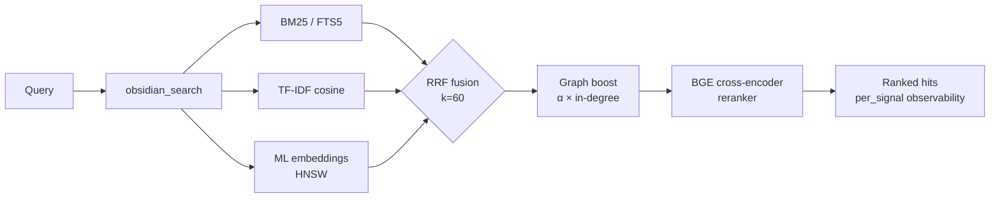

<div align="center">

<a href="https://github.com/oomkapwn/enquire-mcp"></a>

# enquire-mcp

<sub>[English](./README.md) · [中文](./README.zh.md) · [Español](./README.es.md) · [हिन्दी](./README.hi.md) · [العربية](./README.ar.md) · [Русский](./README.ru.md) · [Português](./README.pt.md) · **Français** · [日本語](./README.ja.md) · [한국어](./README.ko.md) · [Deutsch](./README.de.md)</sub>

<sub>**TL;DR pour les agents IA** — Serveur MCP qui expose un coffre markdown Obsidian local à Claude Code, Claude Desktop, Cursor, ChatGPT, Codex et OpenClaw comme une mémoire persistante interrogeable. Récupération hybride (BM25 + embeddings ML + reranker BGE, fusionnés par RRF), HNSW + quantification int8, RAG agentique (HyDE + sous-questions), GraphRAG-light, PDF + OCR, Bases autonomes. Neutre vis-à-vis des fournisseurs, MIT, zéro appel au cloud pendant le service. Installation : `npm i -g @oomkapwn/enquire-mcp`. Docs : [llms.txt](https://github.com/oomkapwn/enquire-mcp/blob/main/llms.txt) · [AGENTS.md](https://github.com/oomkapwn/enquire-mcp/blob/main/AGENTS.md) · [API](https://oomkapwn.github.io/enquire-mcp/).</sub>

### Le MCP Obsidian le plus avancé. Mémoire à long terme pour les agents IA.

**Arrêtez de réexpliquer le contexte à Claude, Cursor, ChatGPT, Codex, OpenClaw à chaque session. Vos notes Obsidian deviennent une mémoire partagée et interrogeable pour chaque agent compatible MCP — votre savoir, tous les modèles, à vous pour toujours.**

[](https://github.com/oomkapwn/enquire-mcp/actions/workflows/ci.yml)
[](https://www.npmjs.com/package/@oomkapwn/enquire-mcp)
[](https://www.npmjs.com/package/@oomkapwn/enquire-mcp)
[](#️-confiance)
[](./STABILITY.md)
[](https://slsa.dev/spec/v1.0/levels#build-l2)
[](https://modelcontextprotocol.io/)
[](./LICENSE)

**[⚡ Installation en 30 secondes](#-démarrage-rapide) · [🧠 Cas d'usage](#-cas-dusage) · [📊 Benchmarks](./docs/benchmarks.md) · [📖 Référence de l'API](https://oomkapwn.github.io/enquire-mcp/) · [💬 Comparer les alternatives](./docs/COMPARISON.md)**

**Claude Code — en une seule ligne :**

```bash
claude mcp add obsidian -- npx -y @oomkapwn/enquire-mcp serve --vault ~/Documents/Obsidian\ Vault
```

</div>

> 📌 Ce document est la traduction française de [README.md](./README.md), pour en faciliter la lecture aux francophones ; en cas de divergence, **la version anglaise fait foi** (elle est mise à jour à chaque publication).

---

## Le problème

Chaque session d'IA repart de zéro. Vous réexpliquez votre projet, vos décisions de conception, les conclusions de la recherche de la semaine dernière. Les fonctionnalités de « mémoire » des fournisseurs ([Claude Memory](https://www.anthropic.com/news/memory-and-tool-use), [ChatGPT Memory](https://openai.com/index/memory-and-new-controls-for-chatgpt/), la mémoire de Cursor) enferment votre savoir dans le cloud d'un seul fournisseur — et l'oublient à nouveau dès que vous changez d'outil. **Votre savoir n'arrête pas de recommencer à zéro.**

## La solution

Votre coffre Obsidian devient une **mémoire à long terme persistante et interrogeable** pour tout agent compatible MCP. Une seule installation — votre savoir est instantanément accessible depuis Claude Code, Claude Desktop, Cursor, le GPT personnalisé de ChatGPT, Codex, OpenClaw et tout autre client MCP. Des fichiers markdown bruts **qui vous appartiennent**, indexés localement, interrogés avec toute la pile moderne de recherche d'information (RI), rappelés à chaque session et avec chaque modèle.

**Ancré, pas extrait.** Les outils de mémoire conversationnelle (mem0, Zep, Supermemory, Memobase) *extraient* des faits de vos journaux de chat vers un dépôt séparé que vous ne pouvez pas lire. enquire-mcp fait l'inverse : il est **ancré dans le savoir que vous avez déjà écrit** — vos propres notes `.md`, à la lettre, avec citations — de sorte que le rappel est auditable, modifiable dans n'importe quel éditeur, et jamais un résumé avec perte d'un chat dont vous vous souvenez à moitié. Et contrairement aux plateformes de mémoire de ***flotte*** côté serveur — des dépôts cloud multi-locataires qui paraphrasent le trafic des agents dans une base de données partagée — enquire est **mono-utilisateur et local-first** : un seul coffre qui vous appartient entièrement et que vous pouvez lire, modifier et supprimer vous-même, avec zéro appel au cloud pendant le service. (Cette critique de l'« extraction » vise spécifiquement la catégorie de la mémoire de chat — pas les outils de graphe de connaissances / ETL comme cognee, ni les pairs de recherche personnelle comme Khoj.)

**Ancré — et conscient de la fraîcheur.** Rappeler un fait n'est que la moitié du problème ; savoir s'il est encore *vrai* est l'autre moitié. Le [benchmark Memora](https://arxiv.org/abs/2604.20006) (avr. 2026) a montré que les systèmes de mémoire échouent systématiquement à réutiliser les faits périmés — rappeler une note vieille d'un an comme si elle avait été écrite aujourd'hui. Parce que la mémoire d'enquire *est* vos vrais fichiers markdown, chaque résultat de recherche porte `age_days` + un indicateur `stale` dérivé de l'heure de dernière modification réelle de la note, et vous pouvez activer un classement pondéré par récence (`--recency-weight`) pour que les notes plus fraîches remontent en premier. Votre savoir, conscient de la fraîcheur — et non un bloc intemporel.

> **Ce qui rend enquire-mcp différent** :
> 1. **Neutre vis-à-vis des fournisseurs.** Votre mémoire vit dans des fichiers `.md`. Passez de Claude à Cursor — votre mémoire vous suit.
> 2. **Récupération de premier ordre.** BM25 hybride + embeddings multilingues + reranker cross-encoder BGE fusionnés par RRF, mis à l'échelle avec HNSW + quantification int8. La même pile de RI qu'une startup de recherche bâtirait — open-sourcée, dans un seul binaire.
> 3. **Zéro appel au cloud pendant le service.** Modèles mis en cache localement (téléchargement unique depuis HuggingFace). Le contenu de votre coffre ne quitte jamais votre machine. Sûr en environnement isolé par défaut.
> 4. **Rappel conscient de la fraîcheur.** Chaque résultat indique l'âge de la note ; le reclassement par récence optionnel permet à un agent de préférer le savoir frais et de signaler les faits périmés à revérifier — la frontière consciente de l'oubli, bâtie sur le `mtime` que vos fichiers possèdent déjà.

**46 outils · 19 prompts MCP · 1571+ tests unitaires · 50+ langues · v3.11.x stable · lié au semver · MIT · provenance de build npm (SLSA L2).**

---

## 🏆 Pourquoi c'est le meilleur

**Six fonctionnalités qu'aucun autre Obsidian-MCP ne possède** (GraphRAG-light, exécution autonome de `.base`, HyDE, quantification int8, late-chunking, harnais d'évaluation intégré). **Plus toute la pile moderne de RI** (BM25 + embeddings ML + reranking par cross-encoder + HNSW), dont les concurrents proposent au plus un ou deux éléments. Côte à côte :

| Capacité | enquire-mcp | Smart Connections | Autres Obsidian-MCP |
|---|:---:|:---:|:---:|
| Récupération hybride (BM25 + TF-IDF + embeddings ML, fusionnés par RRF) | ✅ | ❌ | ❌ |
| **Reranking par cross-encoder** (BGE, +15.5 NDCG@10 mesuré) | ✅ | ❌ | ❌ |
| **Index vectoriel HNSW** (top-K en moins de 10 ms, persisté) | ✅ | ❌ | ❌ |
| **Quantification vectorielle int8** (embed-db ~4× plus petite) | ✅ | ❌ | ❌ |
| **Late-chunking** (embeddings à fenêtre de contexte) | ✅ | ❌ | ❌ |
| **PDF fondus dans la recherche hybride** (citations `[page: N]`) | ✅ | ❌ | ❌ |
| **OCR pour les PDF scannés** (Tesseract.js, multilingue) | ✅ | ❌ | ❌ |
| **Graph-boost de wikilinks** comme signal de récupération | ✅ | ❌ | ❌ |
| **Recherche sémantique multilingue** (50+ langues, sur l'appareil) | ✅ | 💰 payant | ❌ |
| **Harnais d'évaluation de la qualité de récupération intégré** (NDCG, Recall, MRR, matrice A/B) | ✅ | ❌ | ❌ |
| **MCP distant** sur HTTP + auth bearer + sessions à état | ✅ | ❌ | partiel |
| **Observabilité par signal** pour chaque résultat | ✅ | ❌ | ❌ |
| **MCP-natif** (Claude · Cursor · ChatGPT · Codex · OpenClaw · n'importe quel client) | ✅ | ❌ Obsidian uniquement | variable |
| **Filtre de confidentialité** vérifié à chaque chemin de recherche + écriture | ✅ | s.o. | ❌ |
| **46 outils de production** (34 outils de lecture toujours actifs + 4 optionnels + 7 écritures restreintes + 1 outil de retour) | ✅ | s.o. | variable |
| **GraphRAG-light** (détection de communautés de wikilinks par modularité de Louvain) | ✅ **uniquement ici** | ❌ | ❌ |
| **Exécution autonome de requêtes `.base`** (fonctionne sans Obsidian ouvert) | ✅ **uniquement ici** | ❌ | ❌ délègue à Obsidian |
| **Récupération HyDE** (Gao et al. 2023) + décomposition en sous-questions | ✅ **uniquement ici** | ❌ | ❌ |
| **1571 tests unitaires · 9 portes CI requises + 5 indicatives par PR** | ✅ | s.o. | rare |
| **Provenance de build signée** (npm + Sigstore, SLSA Build L2) | ✅ | s.o. | ❌ |
| **Surface publique liée au semver** ([STABILITY.md](./STABILITY.md)) | ✅ | s.o. | ❌ |
| Autonome (aucun plugin Obsidian requis) | ✅ | ❌ requiert Obsidian | variable |
| Licence | MIT, gratuit | propriétaire, payant | variable |

<sub>Comparaison fondée sur les capacités publiques de chaque projet à la date de la version stable v3.8.x (instantané initial v3.7.0 / 2026-05-15 ; actualisé en v3.8.4). Smart Connections est un plugin Obsidian payant (pas un serveur MCP). « Autres Obsidian-MCP » désigne les serveurs Obsidian-MCP publics open source présents sur GitHub au moment de la rédaction. Les benchmarks de récupération de bout en bout publics d'enquire-mcp sont publiés dans <a href="./docs/benchmarks.md"><code>docs/benchmarks.md</code></a> — le delta mesuré de `rerank-bge` est de +24.7 MRR / +15.5 NDCG@10 par rapport à l'hybride pur sur une ablation de 60 requêtes.</sub>

> Affirmation stratégique : enquire-mcp est le backend open source des [wikis LLM façon Karpathy](https://gist.github.com/karpathy/442a6bf555914893e9891c11519de94f) bâtis sur votre coffre Obsidian existant. Un savoir qui se cumule, traçable jusqu'aux sources.

---

## ⚡ Démarrage rapide

```bash
npm install -g @oomkapwn/enquire-mcp
enquire-mcp serve --vault ~/Documents/Obsidian\ Vault
```

Connectez-le à n'importe quel client MCP :

```json
{
  "mcpServers": {
    "obsidian": {
      "command": "npx",
      "args": ["-y", "@oomkapwn/enquire-mcp", "serve", "--vault", "/path/to/vault"]
    }
  }
}
```

📂 Configurations prêtes à l'emploi dans [`examples/`](./examples/) — **Claude Desktop**, **Cursor**, **GPT personnalisé de ChatGPT** (MCP distant sur HTTP), plus un jeu de requêtes d'exemple pour le harnais d'évaluation.

**Vous voulez toute la puissance hybride ?** Mise en route sans friction, en une commande :

```bash
enquire-mcp setup --vault <path>     # télécharge le modèle, construit FTS5 + embed-db
enquire-mcp serve --vault <path> --persistent-index --enable-reranker --use-hnsw
enquire-mcp doctor --vault <path>    # contrôle de santé codé par couleur ✓/⚠/✗
```

---

## 🤖 Configuration dans votre agent IA — prompts à copier-coller

Une fois `enquire-mcp` installé, collez ces prompts dans votre agent pour qu'il sache que le coffre est disponible comme mémoire.

<details>
<summary><b>Claude Code (terminal)</b> — ajouter le serveur MCP + premier prompt</summary>

```bash
# Ajoutez le serveur MCP à votre configuration Claude Code (une seule fois)
claude mcp add obsidian -- npx -y @oomkapwn/enquire-mcp serve --vault ~/Documents/Obsidian\ Vault
```

Ensuite, dans n'importe quelle session Claude Code :

> Tu disposes désormais d'outils `obsidian_*` qui recherchent et lisent mon coffre Obsidian — ma mémoire à long terme. Avant de répondre à des questions sur des projets, des décisions, des personnes ou un contexte technique, appelle `obsidian_search` avec les termes pertinents. Cite chaque fait avec la note source (et `[page: N]` pour les PDF). Si tu ne trouves pas de note pertinente, dis-le — ne devine pas.

</details>

<details>
<summary><b>Claude Desktop</b> — fichier de configuration + premier prompt</summary>

Déposez [`examples/claude-desktop-hybrid.json`](./examples/claude-desktop-hybrid.json) dans la configuration MCP de Claude Desktop (modifiez d'abord le chemin du coffre). Redémarrez Claude Desktop, puis :

> Tu as mon coffre Obsidian branché comme mémoire interrogeable via les outils `obsidian_*`. Vérifie toujours `obsidian_search` en premier quand je te demande quoi que ce soit dans mes notes — contexte de réunion, recherche, décisions, entrées de journal. Cite le chemin de la note source pour chaque fait.

</details>

<details>
<summary><b>Cursor</b> — configuration MCP stdio + règle d'agent</summary>

Déposez [`examples/cursor-mcp.json`](./examples/cursor-mcp.json) à `~/.cursor/mcp.json` (modifiez le chemin du coffre). Dans votre fichier `.cursorrules` ou dans le chat :

> Avant de proposer du code qui touche à un sujet sur lequel j'ai peut-être des notes (décisions d'architecture, contrats d'API, évaluations de fournisseurs), appelle d'abord `obsidian_search`. Considère mon coffre Obsidian comme un contexte faisant autorité.

</details>

<details>
<summary><b>GPT personnalisé de ChatGPT</b> — MCP distant sur HTTP</summary>

Suivez [`examples/chatgpt-actions.md`](./examples/chatgpt-actions.md) pour exposer `serve-http` via un tunnel avec auth bearer. Dans les instructions de votre GPT personnalisé :

> Tu as un accès en lecture à mon coffre Obsidian via la famille d'outils `obsidian_*`. Cherche avant de répondre à tout ce qui pourrait se trouver dans mes notes ; cite le chemin du fichier source pour chaque affirmation.

</details>

<details>
<summary><b>OpenClaw / Codex / tout autre client MCP</b></summary>

La même commande `npx -y @oomkapwn/enquire-mcp serve --vault <path>` fonctionne pour tout client compatible MCP. Consultez la documentation de configuration MCP du client pour savoir où déposer l'entrée du serveur, puis utilisez l'un des prompts ci-dessus.

</details>

**Règle d'agent réutilisable** (à déposer dans n'importe quel `AGENTS.md` / `CLAUDE.md` / `.cursorrules` pour que l'agent sache *quand* recourir au coffre) :

> Quand ma question touche à mes propres notes, décisions, projets, personnes ou recherches, **cherche d'abord dans mon coffre Obsidian** via les outils `obsidian_*` (commence par `obsidian_search`) et cite la note source pour chaque fait. Préfère enquire pour le rappel *conceptuel / interlangue / « qu'ai-je dit à propos de X »* ; utilise `grep` / `ripgrep` simple pour les chaînes littérales exactes. Si rien de pertinent ne ressort, dis-le — ne devine pas.

### Exemples de requêtes qui fonctionnent bien

- *« Trouve chaque note où j'ai discuté de stratégie tarifaire, résume l'évolution. »* — la fusion RRF + le reranker gèrent « évolution » sémantiquement
- *« Quelle a été ma décision sur PostgreSQL vs MongoDB ? Cite la note quotidienne. »* — le graph-boost de wikilinks fait remonter le document de décision central
- *« Анализируй мои заметки о RAG за последние 3 месяца »* — embeddings multilingues + filtre de date sur le frontmatter
- *« De quelles pages du PDF de l'article LLaMA-3 parle-t-on de mise à l'échelle ? »* — PDF fondus dans la recherche avec citations `[page: N]`
- *« Montre-moi les communautés thématiques de mon coffre de recherche — quels thèmes ai-je explorés ? »* — `obsidian_get_communities` (GraphRAG-light)

---

## 🧠 Cas d'usage

**1 — Mémoire à long terme pour les agents IA.** Déposez votre coffre Obsidian dans n'importe quel agent compatible MCP (Claude Code, Claude Desktop, Cursor, ChatGPT, Codex, OpenClaw). L'agent dispose désormais d'un rappel sémantique durable sur chaque note de réunion, entrée de journal, journal de recherche et document de décision que vous ayez jamais écrit — à travers les sessions, les modèles et les fournisseurs. Contrairement à `Claude Memory` ou `ChatGPT Memory`, votre savoir n'est pas enfermé dans le cloud d'un seul fournisseur ; il vit dans du markdown brut qui vous appartient et que vous pouvez migrer librement.

**2 — Base de connaissances personnelle / second cerveau.** La récupération hybride fait remonter la bonne note pour *n'importe quelle* formulation, dans l'une des 50+ langues. Posez une question en anglais sur une entrée de journal en russe d'il y a deux ans, obtenez le bon résultat. Le graph-boost de wikilinks reclasse les notes qui se trouvent au centre de votre graphe de connaissances. GraphRAG-light fait émerger des communautés thématiques — découvrez des connexions que vous aviez oublié avoir faites. Les PDF se fondent dans la recherche avec des citations `[page: N]`, de sorte que les articles de recherche et les transcriptions de réunions deviennent une mémoire de premier ordre.

**3 — RAG agentique / ingénierie de contexte.** `obsidian_search` expose les scores par signal pour que l'agent voie *pourquoi* chaque résultat a été classé. HyDE réécrit au préalable les requêtes vagues en réponses hypothétiques riches avant la récupération. La décomposition en sous-questions gère les questions multi-sauts (« comment notre stratégie tarifaire a-t-elle évolué et quelle a été la réaction des clients ? ») en les découpant en sous-requêtes indépendantes, puis en fusionnant les résultats. Le harnais d'évaluation intégré (NDCG / Recall / MRR) vous permet de mesurer la qualité de récupération sur vos propres requêtes plutôt que de faire confiance aux benchmarks des fournisseurs.

---

## 🚫 Quand enquire-mcp n'est *pas* le bon outil

Des non-objectifs honnêtes — tournez-vous vers autre chose quand :

- **Vous voulez une recherche littérale de chaîne / regex.** `ripgrep` / `grep` est plus rapide et exact pour « trouver ce token précis ». enquire brille sur le rappel *conceptuel* — synonymes, interlangue, « qu'ai-je dit à propos de X ». Utilisez les deux : `rg` pour le littéral, enquire pour le sens.
- **Votre savoir vit dans des journaux de chat, pas dans des notes.** enquire est *ancré* dans le markdown que vous avez rédigé. Les outils de mémoire conversationnelle (mem0, Zep, Supermemory) qui *extraient* des faits de transcriptions de chat vers un dépôt séparé sont une catégorie différente — voir la [comparaison](./docs/COMPARISON.md).
- **Vous avez besoin d'une recherche multi-utilisateurs / hébergée / synchronisée.** enquire est local-first et mono-coffre par conception — pas d'index multi-locataire côté serveur.
- **Vos sources ne sont ni du Markdown ni du PDF.** `.md` / `.canvas` / `.base` / `.pdf` sont de premier ordre ; les autres formats nécessitent d'abord une conversion.
- **Vous voulez une interface graphique ou un plugin intégré à Obsidian.** enquire est un serveur MCP / CLI sans interface — il *complète* Obsidian, il n'en est pas un. (Smart Connections est l'option de plugin intégré à l'app.)
- **Vous avez besoin d'une recherche en moins d'une milliseconde sur des millions de notes.** HNSW offre un top-K en moins de 10 ms à grande échelle, mais enquire vise les coffres personnels / d'équipe, pas les corpus à l'échelle du web.

---

## 📖 Référence de l'API

**[Référence de l'API auto-générée sur oomkapwn.github.io/enquire-mcp](https://oomkapwn.github.io/enquire-mcp/)** — chaque outil, prompt et helper exporté avec un TSDoc complet (`@param` / `@returns` / `@example`). Reconstruite depuis les sources à chaque push sur `main` via [`publish-docs.yml`](https://github.com/oomkapwn/enquire-mcp/blob/main/.github/workflows/publish-docs.yml) (TypeDoc → GitHub Pages). Sans dérive par construction : le même TSDoc que voient les agents IA et les IDE est celui qui est publié.

---

## 🏗️ Comment fonctionne la récupération



`obsidian_search` détecte automatiquement les signaux disponibles et se dégrade avec élégance. Le graph-boost de wikilinks reclasse le top-K via un PageRank personnalisé d'un pas. Le reranking par cross-encoder optionnel re-score le top-N pour +15.5 NDCG@10 mesuré. Chaque résultat renvoie `per_signal: { bm25, tfidf, embeddings }` pour que vous voyiez POURQUOI il a été classé.

| Niveau | Configuration | Ce que vous obtenez |
|---|---|---|
| **1** | `serve --vault <path>` | Cosinus TF-IDF (zéro configuration, instantané) |
| **2** | + `--persistent-index` | + BM25 / FTS5 (top-10 en moins de 100 ms) |
| **3** | + `setup` (télécharge le modèle + construit embed-db) | + embeddings ML multilingues |
| **4** | + `--enable-reranker` | + cross-encoder BGE (+15.5 NDCG@10 mesuré) |
| **5** | + `--use-hnsw` | + top-K en moins de 10 ms à l'échelle du million de chunks |
| **6** | + `--include-pdfs` | + PDF fondus dans tout ce qui précède |
| **7** | `serve-http --bearer-token …` | + MCP distant (web Claude.ai, ChatGPT, Cursor HTTP, mobile) |

---

## 🛠️ Les 46 outils

46 outils au total : 34 de lecture toujours actifs (dont le parapluie `obsidian_search`) + 4 de lecture optionnels + 7 écritures restreintes + 1 de retour en boucle fermée. Référence complète : **[docs/api.md](./docs/api.md)**.

| Catégorie | Outils |
|---|---|
| **Recherche & récupération** | `obsidian_search` (parapluie, fusionné par RRF) · `obsidian_hyde_search` (augmenté par HyDE, v3.1.0) · `obsidian_search_text` · `obsidian_full_text_search` · `obsidian_semantic_search` · `obsidian_embeddings_search` · `obsidian_find_similar` |
| **Wikilinks & graphe** | `obsidian_resolve_wikilink` · `obsidian_get_backlinks` · `obsidian_get_outbound_links` · `obsidian_get_note_neighbors` · `obsidian_get_unresolved_wikilinks` · `obsidian_find_path` · `obsidian_get_communities` (v3.4.0, GraphRAG-light) |
| **Frontmatter & Dataview** | `obsidian_frontmatter_get` · `obsidian_frontmatter_search` · `obsidian_dataview_query` · `obsidian_list_tags` |
| **Lire & naviguer** | `obsidian_read_note` · `obsidian_list_notes` · `obsidian_get_recent_edits` · `obsidian_stale_notes` · `obsidian_open_questions` · `obsidian_context_pack` · `obsidian_chat_thread_read` · `obsidian_open_in_ui` · `obsidian_stats` |
| **PDF, Canvas & Bases** | `obsidian_read_pdf` · `obsidian_list_pdfs` · `obsidian_ocr_pdf` · `obsidian_read_canvas` · `obsidian_list_canvases` · `obsidian_list_bases` (v3.2.0) · `obsidian_read_base` (v3.2.0) · `obsidian_query_base` (v3.2.0) |
| **Écritures** (restreintes par `--enable-write`) | `obsidian_create_note` · `obsidian_append_to_note` · `obsidian_rename_note` · `obsidian_replace_in_notes` · `obsidian_archive_note` · `obsidian_frontmatter_set` · `obsidian_chat_thread_append` |
| **Diagnostic / lint** | `obsidian_lint_wiki` · `obsidian_paper_audit` · `obsidian_validate_note_proposal` |
| **Retour** (optionnel via `--feedback-weight`) | `obsidian_mark_useful` (boucle fermée : enregistre quelles notes rappelées ont aidé ; les valorise dans les recherches futures) |

Plus 3 ressources MCP (`obsidian://vault/info`, `obsidian://note/{path}`, `obsidian://chunk/{n}/{path}`) et 19 **prompts MCP** (`summarize_recent_edits` · `review_tag` · `find_orphans` · `weekly_review` · `extract_todos` · `process_inbox` · `consolidate_tags` · `find_duplicates` · `lint_wiki` · `monthly_review` · `search_with_query_expansion` · `vault_synth` · `vault_wiki_compile` · `vault_lint_extended` · `vault_capture` · `vault_persona_search` · `vault_automation_setup` · `vault_research` · `vault_synthesis_page`) pour les flux de travail courants sur le coffre.

---

## 🛡️ Confiance

| Aspect | Posture |
|---|---|
| **Par défaut** | Lecture seule — `--enable-write` requis pour les 7 outils d'écriture |
| **Moindre privilège** | `--disabled-tools` / `--enabled-tools` exposent une surface minimale (p. ex. un agent de recherche en lecture seule n'obtient que `obsidian_search` + `obsidian_read_note`) |
| **Sécurité des chemins** | Vérification realpath à chaque lecture+écriture ; les liens symboliques sortant du coffre sont rejetés |
| **Filtre de confidentialité** | Vérifié aux chemins de ressources FTS5 + embed-db + chunk ; fail-closed sur des listes d'autorisation/interdiction vides |
| **Transport HTTP** | Auth bearer (SHA-256 à temps constant + `timingSafeEqual`), limite de débit par token, CORS strict |
| **Frontmatter** | `js-yaml@5` `load` (schéma cœur YAML 1.2, sûr par défaut) — aucune exécution de code |
| **Fichiers de cache + index** | chmod 0600, répertoire parent 0700 |
| **CI** | **9 portes** de protection de branche **requises** : (1) `lint`, (2) `test` sur Node 22, (3) `test` sur Node 24, (4) `smoke`, (5) `audit`, (6) `coverage`, (7) `version-consistency`, (8) `docs`, (9) `oia`. **5 indicatives** : `test-macos` + `docker` (build du Dockerfile + smoke d'introspection `tools/list`) via `.github/workflows/ci.yml` ; CodeQL ×2 + actions Analyze via le [default-setup de GitHub](https://docs.github.com/code-security/code-scanning/automatically-scanning-your-code-for-vulnerabilities-and-errors/configuring-default-setup-for-code-scanning) (pas des fichiers de workflow). Le workflow de release revérifie que les 9 portes requises sont passées sur le SHA taggé avant la publication npm. _v3.7.10 — `docs` (porte de génération TypeDoc) ajoutée à l'ensemble requis. v3.7.13 — plancher `engines.node` relevé à `>=22.13.0` pour correspondre à la matrice CI. v3.8.0-rc.6 — `oia` (Outside-In Audit) promue depuis l'ensemble indicatif._ |
| **Couverture** | Lignes ≥86 % · instructions ≥82 % · fonctions ≥75 % · branches ≥74 % (sous garde) |
| **Publications** | npm + release GitHub par tag · semver · **provenance de build signée** (npm + Sigstore, SLSA Build L2 ; générateur L3 sur la feuille de route) |
| **Stabilité** | v3.0+ liée au semver — chaque flag CLI, nom d'outil, ressource MCP, prompt et symbole exporté est un contrat |

Posture complète : **[SECURITY.md](./SECURITY.md)** · Surface de stabilité : **[STABILITY.md](./STABILITY.md)** · Vulnérabilités : `oomkapwn@gmail.com`.

---

## ❓ FAQ

**Faut-il installer Obsidian ?** Non. Lit `.md` + `.canvas` + `.pdf` directement. Fonctionne avec n'importe quel coffre au format Obsidian.

**Va-t-il écrire dans mon coffre ?** Pas sauf si vous passez `--enable-write`. Les 7 outils d'écriture sont restreints ; les outils destructifs prennent en charge `dry_run`.

**Des données envoyées quelque part ?** Uniquement lors de `enquire-mcp install-model` (télécharge les poids ONNX depuis HuggingFace, une seule fois). Le mode serve ne fait jamais d'HTTP sortant. Les embeddings + le reranker s'exécutent localement sur le CPU.

**Performances ?** Build à froid FTS5 : ~5 s/1k notes, ~30 s/50k. Requête BM25 : <100 ms toujours. Build d'embeddings : ~30 ms/chunk sur M1. **HNSW top-10 : moins de 10 ms à toute échelle.** Démarrage à froid de serve : ~50 ms avec persistance HNSW.

**Langues ?** Par défaut `paraphrase-multilingual-MiniLM-L12-v2` (50+ langues). Cross-encoder multilingue. Validé de bout en bout sur des coffres bilingues russe + anglais. Tokenisation CJK/thaï/khmer via `Intl.Segmenter`.

**Exécution à distance ?** Oui — `serve-http` expose le même serveur via [Streamable HTTP](https://modelcontextprotocol.io/specification/2025-06-18/basic/transports#streamable-http). Mettez Tailscale Funnel ou Cloudflare Tunnel devant pour le HTTPS. Fonctionne avec le web claude.ai, le GPT personnalisé de ChatGPT, le mode HTTP de Cursor et les clients MCP mobiles. Voir **[docs/http-transport.md](./docs/http-transport.md)**.

---

## 🚀 Publications

**v3.0.0 — canal stable.** La feuille de route de récupération v2.x est complète et la surface publique est désormais [liée au semver](./STABILITY.md). Florilège :

`v2.0` récupération hybride (BM25+TF-IDF+embeddings via RRF) · `v2.6` MCP distant · `v2.7-2.8` PDF fondus · `v2.9` reranker BGE · `v2.10` OCR · `v2.11` doctor + setup · `v2.12` harnais d'évaluation · `v2.13` HNSW · `v2.14` sessions à état · `v2.15` late-chunking · `v2.16` persistance HNSW · `v2.17` quantification int8 · `v3.8.0` stable · `v3.8.7` durcissement du transport HTTP · **`v3.9.0` stable** : embed-sync du watcher pour les PDF OCRisés, mise à jour HNSW en mémoire en temps réel lors des modifications de fichiers, refill HNSW adaptatif R-10 (clôt la sous-restitution avec >66 % d'exclusion). · **`v3.10` stable** : fraîcheur consciente de l'oubli — indicateur `age_days` + `stale` + reclassement optionnel `--recency-weight` + `obsidian_search` conscient du frontmatter.

Canal : `npm install @oomkapwn/enquire-mcp` → dernière version stable (`@latest` = v3.11.x). Préversion : `npm install @oomkapwn/enquire-mcp@rc` (le dernier candidat à la version — voir [CHANGELOG.md](./CHANGELOG.md)). Changelog complet : **[CHANGELOG.md](./CHANGELOG.md)** · Plan à venir : **[ROADMAP.md](https://github.com/oomkapwn/enquire-mcp/blob/main/ROADMAP.md)**.

---

## 🤝 Contribuer

```bash
git clone https://github.com/oomkapwn/enquire-mcp.git
cd enquire-mcp && npm install
npm test       # suite complète (1571 tests, ~12 s)
npm run lint   # zéro avertissement
npm run build  # tsc → dist/
```

Issues, PR et idées bienvenues. La protection de branche exige une revue de PR sur `main`.

---

## 📜 Licence

MIT. Réalisé par [Alex (@OomkaBear)](https://github.com/oomkapwn). Nommé d'après le [prototype du WWW de Tim Berners-Lee de 1980](https://en.wikipedia.org/wiki/ENQUIRE) — le système hypertexte originel, avant le web. La spécification d'origine était la suivante : vous pouviez interroger le système sur tout. **enquire-mcp apporte cela à votre coffre.**
