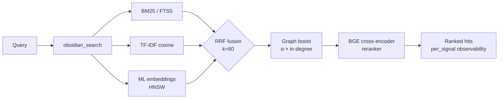

<div align="center">

<a href="https://github.com/oomkapwn/enquire-mcp"></a>

# enquire-mcp

<sub>[English](./README.md) · [中文](./README.zh.md) · [Español](./README.es.md) · **हिन्दी** · [العربية](./README.ar.md) · [Русский](./README.ru.md) · [Português](./README.pt.md) · [Français](./README.fr.md) · [日本語](./README.ja.md) · [한국어](./README.ko.md) · [Deutsch](./README.de.md)</sub>

### 🏆 AI मेमोरी के लिए #1 Obsidian MCP।

**हर सत्र में Claude, Cursor, ChatGPT, Codex, OpenClaw को संदर्भ दोबारा समझाना बंद करें। आपके Obsidian नोट्स हर MCP-संगत एजेंट के बीच साझा, खोजने-योग्य स्मृति बन जाते हैं — आपका ज्ञान, हर मॉडल, हमेशा आपका अपना।**

*मापा गया: BGE cross-encoder reranker एक [पुनरुत्पादनीय 60-क्वेरी ablation](./docs/benchmarks.md) पर सादे हाइब्रिड की तुलना में **+15.5 NDCG@10 / +24.7 MRR** जोड़ता है — पूरा आधुनिक IR स्टैक, जो उसी markdown को याद करता है जो **आपने** लिखी (उद्धृत, संपादन-योग्य), कभी कोई क्लाउड पैराफ़्रेज़ नहीं।*

[](https://www.npmjs.com/package/@oomkapwn/enquire-mcp)
[](./STABILITY.md)
[](https://slsa.dev/spec/v1.0/levels#build-l2)
[](https://modelcontextprotocol.io/)
[](./LICENSE)

**[⚡ 30-सेकंड इंस्टॉल](#-त्वरित-शुरुआत) · [🏆 #1 क्यों](#why-number-one) · [🧠 उपयोग के मामले](#-उपयोग-के-मामले) · [📊 बेंचमार्क](./docs/benchmarks.md) · [📖 API संदर्भ](https://oomkapwn.github.io/enquire-mcp/)**

**Claude Code — एक पंक्ति:**

```bash
claude mcp add obsidian -- npx -y @oomkapwn/enquire-mcp serve --vault ~/Documents/Obsidian\ Vault
```

</div>

> 📌 यह दस्तावेज़ [README.md](./README.md) का हिन्दी अनुवाद है, जो हिन्दी पाठकों की सुविधा के लिए है; किसी भी विसंगति की स्थिति में **अंग्रेज़ी संस्करण ही प्रामाणिक है** (अंग्रेज़ी संस्करण हर रिलीज़ के साथ अपडेट होता है)।

---

## समस्या

हर AI सत्र शून्य से शुरू होता है। आप परियोजना, डिज़ाइन निर्णय और पिछले शोध के निष्कर्ष बार-बार समझाते हैं। विक्रेता की अंतर्निहित मेमोरी ज्ञान को एक ही क्लाउड में बंद करती है और टूल बदलते ही निरंतरता टूट जाती है। **आपका ज्ञान बार-बार नए सिरे से शुरू होता रहता है।**

## समाधान

आपका Obsidian vault किसी भी MCP-संगत एजेंट के लिए **स्थायी, क्वेरी-योग्य दीर्घकालिक स्मृति** बन जाता है। एक बार इंस्टॉल करें — आपका ज्ञान तुरंत Claude Code, Claude Desktop, Cursor, ChatGPT कस्टम GPT, Codex, OpenClaw, और हर दूसरे MCP क्लाइंट से सुलभ हो जाता है। सादे markdown फ़ाइलें **जो आपकी अपनी हैं**, स्थानीय रूप से अनुक्रमित, पूरे आधुनिक IR स्टैक के साथ खोजी जाती हैं, और हर सत्र व हर मॉडल में याद की जाती हैं।

**आपके लिखे ज्ञान पर आधारित, चैट से निकाला हुआ नहीं।** अधिकांश संवाद-मेमोरी प्रणालियाँ चैट से तथ्यों को निकालकर अलग स्टोर में रखती हैं। enquire-mcp उस ज्ञान से शुरू होता है जिसे आपने जानबूझकर लिखा: मूल `.md` नोट्स और उद्धरण सुरक्षित रहते हैं, इसलिए recall ऑडिट योग्य, संपादन योग्य और पोर्टेबल है—किसी और के डेटाबेस में छिपा हुआ अधूरा सार नहीं। एक local-first vault ही source of truth रहता है और serve के दौरान कोई cloud call नहीं होती।

**मूल पर आधारित — और ताज़गी के प्रति सजग।** किसी तथ्य को याद करना आधी समस्या है; यह जानना कि वह अब भी *सही* है या नहीं, बाकी आधी है। [Memora बेंचमार्क](https://arxiv.org/abs/2604.20006) (अप्रैल 2026) ने दिखाया कि स्मृति प्रणालियाँ व्यवस्थित रूप से बासी-तथ्य पुनरुपयोग में विफल रहती हैं — एक साल पुराने नोट को ऐसे याद करती हैं मानो वह आज ही लिखा गया हो। चूँकि enquire की स्मृति *ही* आपकी असली markdown फ़ाइलें हैं, इसलिए हर खोज-परिणाम के साथ नोट के लाइव अंतिम-संशोधन समय से व्युत्पन्न `age_days` + एक `stale` फ़्लैग आता है, और आप recency-भारित रैंकिंग (`--recency-weight`) चुन सकते हैं ताकि ताज़ा नोट्स पहले सामने आएँ। आपका ज्ञान, ताज़गी के प्रति सजग — न कि एक कालातीत ढेर।

> **enquire-mcp को अलग क्या बनाता है**:
> 1. **विक्रेता-तटस्थ।** आपकी स्मृति `.md` फ़ाइलों में रहती है। Claude से Cursor पर जाएँ — आपकी स्मृति आपके साथ आती है।
> 2. **पूरा local retrieval stack।** BM25 + TF-IDF + multilingual embeddings को RRF से fuse किया जाता है, optional BGE cross-encoder reranker और per-signal scores के साथ; HNSW + int8 quantization dense path को scale करते हैं।
> 3. **serve के दौरान शून्य क्लाउड कॉल।** embedding मॉडल **आपकी मशीन पर** चलता है और उसी markdown को अनुक्रमित करता है जो **आपने** लिखी — इसीलिए यह एक-बार का स्थानीय डाउनलोड (~110 MB) है, न कि कोई क्लाउड API key। मूल-आधारित + निजी होना मुफ़्त नहीं है, और हम इसका दिखावा नहीं करते: आपके vault की सामग्री कभी आपकी मशीन नहीं छोड़ती, डिफ़ॉल्ट रूप से एयर-गैप-सुरक्षित ([प्रवर्तित](./SECURITY.md), केवल आकांक्षात्मक नहीं)।
> 4. **ताज़गी-सजग recall।** हर परिणाम बताता है कि नोट कितना पुराना है; वैकल्पिक recency re-ranking एजेंट को ताज़ा ज्ञान को प्राथमिकता देने और बासी तथ्यों को पुनः-सत्यापन हेतु चिह्नित करने देता है — भूलने-के-प्रति-सजग सीमांत, जो आपकी फ़ाइलों में पहले से मौजूद `mtime` पर बना है।

**46 टूल · 19 MCP प्रॉम्प्ट · 1692+ यूनिट टेस्ट · 50+ भाषाएँ · v3.11.x स्थिर · semver-बाध्य · MIT · npm बिल्ड प्रोवेनेंस (SLSA L2)।**

---

<a id="why-number-one"></a>

## 🏆 enquire-mcp #1 क्यों है

**Obsidian के लिए पूर्ण local AI-memory stack—न कोई पतला file wrapper, न केवल vector search।** एक इंस्टॉल retrieval quality, knowledge ownership, agent reach, document coverage और production-grade operations को जोड़ता है।

| नेतृत्व का मानक | enquire-mcp क्या देता है |
|---|---|
| **सटीक शब्दों से आगे recall** | ✅ BM25 + TF-IDF + multilingual embeddings → RRF fusion; optional BGE reranking का मापा लाभ **+15.5 NDCG@10 / +24.7 MRR** |
| **हर agent के लिए एक memory** | ✅ Claude Code/Desktop, Cursor, ChatGPT, Codex, OpenClaw और हर compatible client के लिए MCP-native access |
| **जाँच योग्य उत्तर** | ✅ मूल पाठ, note paths, PDF page citations, per-signal scores और freshness metadata |
| **वास्तव में आपका ज्ञान** | ✅ plain markdown source of truth, local indexes और serve के दौरान zero cloud calls |
| **पूरा Obsidian knowledge surface** | ✅ Markdown, wikilinks, frontmatter, Canvas, Bases, PDF और OCR |
| **कठिन सवालों के लिए agentic retrieval** | ✅ HyDE, sub-question decomposition, context packs, GraphRAG-light और 19 workflow prompts |
| **नियंत्रण छोड़े बिना scale** | ✅ HNSW live updates, persistence, adaptive refill और int8 quantization |
| **Production trust** | ✅ read-only default, privacy filters, authenticated HTTP, semver contracts, 1692 tests, 9 release gates और SLSA L2 provenance |

**एक vault। हर agent। पूरा retrieval stack। कोई cloud lock-in नहीं।**

> रणनीतिक स्थिति: enquire-mcp आपके मौजूदा Obsidian vault पर [Karpathy-style LLM Wikis](https://gist.github.com/karpathy/442a6bf555914893e9891c11519de94f) का open-source backend है—ऐसा ज्ञान जो बढ़ता है और स्रोत तक traceable रहता है।

---

## ⚡ त्वरित शुरुआत

```bash
npm install -g @oomkapwn/enquire-mcp
enquire-mcp serve --vault ~/Documents/Obsidian\ Vault
```

किसी भी MCP क्लाइंट में जोड़ें:

```json
{
  "mcpServers": {
    "obsidian": {
      "command": "npx",
      "args": ["-y", "@oomkapwn/enquire-mcp", "serve", "--vault", "/path/to/vault"]
    }
  }
}
```

📂 तैयार कॉन्फ़िग [`examples/`](./examples/) में — **Claude Desktop**, **Cursor**, **ChatGPT कस्टम GPT** (HTTP पर रिमोट MCP), साथ ही eval harness के लिए एक नमूना क्वेरी सेट।

**पूरी हाइब्रिड शक्ति चाहिए?** हाइब्रिड प्रीफ़्लाइट पूरा करें, फिर सर्व करें:

```bash
npm install -g @oomkapwn/enquire-mcp@3.12.0-rc.5      # exact prerelease package
enquire-mcp --version
# recommended: preview first, then explicitly apply the same package-coherent plan
enquire-mcp first-run --tier hybrid --client claude-desktop --vault <path>
enquire-mcp first-run --tier hybrid --client claude-desktop --vault <path> --apply
# manual equivalent below: choose this instead of first-run --apply, not in addition
enquire-mcp setup --vault <path>                          # embedder कैश और FTS5 + embed-db बनाता है
enquire-mcp install-model rerank-bge                      # ऑफ़लाइन reranker कैश करता है
enquire-mcp doctor --tier hybrid --vault <path>           # संरचनात्मक/runtime तैयारी
enquire-mcp configure --tier hybrid --client claude-desktop --vault <path>
enquire-mcp serve --vault <path> --persistent-index --enable-reranker --use-hnsw
```

---

## 🤖 अपने AI एजेंट में सेटअप करें — कॉपी-पेस्ट प्रॉम्प्ट

जब `enquire-mcp` इंस्टॉल हो जाए, तो इन प्रॉम्प्ट्स को अपने एजेंट में पेस्ट करें ताकि उसे पता चले कि vault स्मृति के रूप में उपलब्ध है।

<details>
<summary><b>Claude Code (टर्मिनल)</b> — MCP सर्वर जोड़ें + पहला प्रॉम्प्ट</summary>

```bash
# MCP सर्वर को अपने Claude Code कॉन्फ़िग में जोड़ें (एक बार)
claude mcp add obsidian -- npx -y @oomkapwn/enquire-mcp serve --vault ~/Documents/Obsidian\ Vault
```

फिर किसी भी Claude Code सत्र में:

> अब आपके पास `obsidian_*` टूल हैं जो मेरे Obsidian vault — मेरी दीर्घकालिक स्मृति — को खोजते और पढ़ते हैं। परियोजनाओं, निर्णयों, लोगों या तकनीकी संदर्भ के बारे में प्रश्नों का उत्तर देने से पहले, प्रासंगिक शब्दों के साथ `obsidian_search` को कॉल करें। हर तथ्य को स्रोत नोट के साथ उद्धृत करें (और PDF के लिए `[page: N]`)। यदि आपको कोई प्रासंगिक नोट न मिले, तो ऐसा कहें — अनुमान न लगाएँ।

</details>

<details>
<summary><b>Claude Desktop</b> — कॉन्फ़िग फ़ाइल + पहला प्रॉम्प्ट</summary>

`enquire-mcp configure --tier hybrid --client claude-desktop --vault <path>` के सीधे पेस्ट किए जा सकने वाले आउटपुट को प्राथमिकता दें। [`examples/claude-desktop-hybrid.json`](./examples/claude-desktop-hybrid.json) केवल टेम्पलेट है; मैन्युअल उपयोग में executable और vault दोनों पथ बदलें। Claude Desktop को पुनः आरंभ करें, फिर:

> आपके पास मेरा Obsidian vault `obsidian_*` टूल के माध्यम से खोजने-योग्य स्मृति के रूप में जुड़ा हुआ है। जब भी मैं अपने नोट्स में किसी भी चीज़ के बारे में पूछूँ — मीटिंग संदर्भ, शोध, निर्णय, जर्नल प्रविष्टियाँ — हमेशा पहले `obsidian_search` जाँचें। हर तथ्य पर स्रोत नोट का पथ उद्धृत करें।

</details>

<details>
<summary><b>Cursor</b> — MCP stdio कॉन्फ़िग + एजेंट नियम</summary>

[`examples/cursor-mcp.json`](./examples/cursor-mcp.json) को `~/.cursor/mcp.json` पर डालें (vault पथ संपादित करें)। अपनी `.cursorrules` फ़ाइल या चैट में:

> ऐसा कोड सुझाने से पहले जो किसी ऐसे विषय को छूता हो जिस पर मेरे नोट्स हो सकते हैं (आर्किटेक्चर निर्णय, API अनुबंध, विक्रेता मूल्यांकन), पहले `obsidian_search` को कॉल करें। मेरे Obsidian vault को आधिकारिक संदर्भ मानें।

</details>

<details>
<summary><b>ChatGPT कस्टम GPT</b> — HTTP पर रिमोट MCP</summary>

bearer auth के साथ टनल के माध्यम से `serve-http` को उजागर करने के लिए [`examples/chatgpt-actions.md`](./examples/chatgpt-actions.md) का पालन करें। अपने कस्टम GPT के निर्देशों में:

> आपके पास `obsidian_*` टूल परिवार के माध्यम से मेरे Obsidian vault तक पठन-पहुँच है। ऐसी किसी भी चीज़ का उत्तर देने से पहले खोजें जो मेरे नोट्स में हो सकती है; हर दावे पर स्रोत फ़ाइलपथ उद्धृत करें।

</details>

<details>
<summary><b>OpenClaw / Codex / कोई अन्य MCP क्लाइंट</b></summary>

वही `npx -y @oomkapwn/enquire-mcp serve --vault <path>` कमांड किसी भी MCP-संगत क्लाइंट के लिए काम करती है। सर्वर एंट्री कहाँ डालनी है, यह जानने के लिए क्लाइंट के अपने MCP-कॉन्फ़िग दस्तावेज़ देखें, फिर ऊपर दिए गए किसी भी प्रॉम्प्ट का उपयोग करें।

</details>

**पुन: प्रयोज्य एजेंट नियम** (किसी भी `AGENTS.md` / `CLAUDE.md` / `.cursorrules` में डालें ताकि एजेंट जान सके कि vault का सहारा *कब* लेना है):

> जब मेरा प्रश्न मेरे अपने नोट्स, निर्णयों, परियोजनाओं, लोगों या शोध को छूता हो, तो **पहले मेरे Obsidian vault में खोजें** `obsidian_*` टूल के माध्यम से (`obsidian_search` से शुरू करें) और हर तथ्य पर स्रोत नोट उद्धृत करें। *वैचारिक / क्रॉस-लैंग्वेज / "मैंने X के बारे में क्या कहा"* recall के लिए enquire को प्राथमिकता दें; सटीक शाब्दिक स्ट्रिंग के लिए सादा `grep` / `ripgrep` उपयोग करें। यदि कुछ भी प्रासंगिक न लौटे, तो ऐसा कहें — अनुमान न लगाएँ।

### उदाहरण क्वेरियाँ जो अच्छी तरह काम करती हैं

- *"हर वह नोट ढूँढो जहाँ मैंने मूल्य-निर्धारण रणनीति पर चर्चा की, विकास का सारांश दो।"* — RRF fusion + reranker "विकास" को सिमेंटिक रूप से संभालता है
- *"PostgreSQL बनाम MongoDB पर मेरा निर्णय क्या था? डेली नोट उद्धृत करो।"* — wikilink ग्राफ़-बूस्ट केंद्रीय निर्णय दस्तावेज़ को सामने लाता है
- *"Анализируй мои заметки о RAG за последние 3 месяца"* — बहुभाषी embeddings + frontmatter तिथि फ़िल्टर
- *"LLaMA-3 पेपर PDF के कौन-से पृष्ठ स्केलिंग की बात करते हैं?"* — `[page: N]` उद्धरणों के साथ खोज में घुले PDF
- *"मेरे शोध vault में विषयगत समुदाय दिखाओ — मैं किन विषयों की खोज कर रहा हूँ?"* — `obsidian_get_communities` (GraphRAG-light)

---

## 🧠 उपयोग के मामले

**1 — AI एजेंट्स के लिए दीर्घकालिक स्मृति।** अपने Obsidian vault को किसी भी MCP-संगत एजेंट (Claude Code, Claude Desktop, Cursor, ChatGPT, Codex, OpenClaw) में जोड़ें। एजेंट के पास अब आपके लिखे हर मीटिंग नोट, जर्नल प्रविष्टि, शोध लॉग और निर्णय दस्तावेज़ पर टिकाऊ, सिमेंटिक recall होता है — सत्रों, मॉडलों और प्रदाताओं के पार। किसी vendor की built-in memory के विपरीत, आपका ज्ञान किसी एक विक्रेता के क्लाउड में बंद नहीं होता; यह सादे markdown में रहता है जो आपका अपना है और जिसे आप स्वतंत्र रूप से माइग्रेट कर सकते हैं।

**2 — व्यक्तिगत ज्ञान-आधार / दूसरा दिमाग।** हाइब्रिड retrieval *किसी भी* शब्द-रचना के लिए, 50+ भाषाओं में से किसी में भी, सही नोट सामने लाता है। दो साल पुरानी रूसी-भाषा जर्नल प्रविष्टि के बारे में अंग्रेज़ी में पूछें, सही हिट पाएँ। Wikilink ग्राफ़-बूस्ट उन नोट्स को री-रैंक करता है जो आपके ज्ञान-ग्राफ़ के केंद्र में बैठे हैं। GraphRAG-light विषयगत समुदायों को सामने लाता है — उन संबंधों की खोज करें जिन्हें बनाना आप भूल गए थे। PDF `[page: N]` उद्धरणों के साथ खोज में घुल-मिल जाते हैं ताकि शोध-पत्र और मीटिंग ट्रांसक्रिप्ट प्रथम-श्रेणी स्मृति बन जाएँ।

**3 — एजेंटिक RAG / संदर्भ इंजीनियरिंग।** `obsidian_search` प्रति-संकेत स्कोर उजागर करता है ताकि एजेंट देख सके कि हर हिट *क्यों* रैंक हुई। HyDE retrieval से पहले अस्पष्ट क्वेरियों को समृद्ध काल्पनिक उत्तरों में पुनः-लिखता है। उप-प्रश्न विघटन बहु-हॉप प्रश्नों ("हमारी मूल्य-निर्धारण रणनीति कैसे विकसित हुई और ग्राहक की प्रतिक्रिया क्या थी?") को स्वतंत्र उप-क्वेरियों में तोड़कर, परिणाम fuse करके संभालता है। अंतर्निहित eval harness (NDCG / Recall / MRR) आपको विक्रेता बेंचमार्क पर भरोसा करने के बजाय अपनी क्वेरियों पर retrieval गुणवत्ता मापने देता है।

---

## ✅ गंभीर local knowledge workflows के लिए बनाया गया

enquire-mcp चुनें जब आप चाहते हैं:

- **Obsidian vault ही source of truth रहे**, ज्ञान किसी proprietary store में copy न हो।
- **कई AI agents के बीच एक memory layer**, ताकि model बदलना फिर से शुरू करना न बने।
- **Conceptual और multilingual recall**, जो अलग wording के बाद भी सही नोट खोजे।
- **Cited और inspectable results** जिनमें note path, PDF page, signal scores और freshness हो।
- **Local-first privacy**—read-only default, explicit write gates और serve के दौरान zero cloud calls।
- **पूर्ण retrieval backend**—hybrid search, reranking, graph context, agentic expansion, rich Obsidian formats और remote MCP।

**स्पष्ट scope:** enquire-mcp Markdown, Canvas, Bases और PDF के लिए headless MCP server / CLI है। Exact tokens के लिए literal search साथ में उपयोग करें; remote agents के लिए built-in HTTP transport उपलब्ध है।

---

## 📖 API संदर्भ

स्वचालित रूप से उत्पन्न **[oomkapwn.github.io/enquire-mcp पर API संदर्भ](https://oomkapwn.github.io/enquire-mcp/)** — हर टूल, प्रॉम्प्ट और निर्यातित helper के साथ पूर्ण TSDoc (`@param` / `@returns` / `@example`)। हर `main` पर push के साथ स्रोत से [`publish-docs.yml`](https://github.com/oomkapwn/enquire-mcp/blob/main/.github/workflows/publish-docs.yml) (TypeDoc → GitHub Pages) के माध्यम से पुनर्निर्मित। निर्माण-द्वारा बहाव-मुक्त: वही TSDoc जो AI एजेंट और IDE देखते हैं, वही प्रकाशित होता है।

---

## 🏗️ Retrieval कैसे काम करता है



`obsidian_search` उपलब्ध संकेतों का स्वचालित पता लगाता है और सुंदरता से degrade होता है। Wikilink ग्राफ़-बूस्ट सिंगल-स्टेप personalised PageRank के माध्यम से top-K को री-रैंक करता है। वैकल्पिक cross-encoder reranking top-N को पुनः स्कोर करता है, मापा गया +15.5 NDCG@10। हर हिट `per_signal: { bm25, tfidf, embeddings }` लौटाता है ताकि आप देख सकें कि वह *क्यों* रैंक हुई।

स्तरों में सक्षम करें, आवश्यकतानुसार लें:

| स्तर | सेटअप | आपको क्या मिलता है |
|---|---|---|
| **1** | `serve --vault <path>` | TF-IDF cosine (ज़ीरो सेटअप, तत्काल) |
| **2** | + `--persistent-index` | + BM25 / FTS5 (sub-100ms top-10) |
| **3** | + `setup` (मॉडल डाउनलोड + embed-db बनाता है) | + बहुभाषी ML embeddings |
| **4** | + `--enable-reranker` | + BGE cross-encoder (मापा गया +15.5 NDCG@10) |
| **5** | + `--use-hnsw` | + मिलियन-chunk पैमाने पर sub-10ms top-K |
| **6** | + `--include-pdfs` | + उपरोक्त सभी में घुले PDF |
| **7** | `serve-http --bearer-token …` | + रिमोट MCP (Claude.ai वेब, ChatGPT, Cursor HTTP, मोबाइल) |

---

## 🛠️ सभी 46 टूल

कुल 46 टूल: 34 हमेशा-चालू read (अम्ब्रेला `obsidian_search` सहित) + 4 opt-in read + 7 gated writes + 1 क्लोज़्ड-लूप फ़ीडबैक। पूर्ण संदर्भ: **[docs/api.md](./docs/api.md)**।

| श्रेणी | टूल |
|---|---|
| **खोज व retrieval** | `obsidian_search` (अम्ब्रेला, RRF-fused) · `obsidian_hyde_search` (HyDE-संवर्धित, v3.1.0) · `obsidian_search_text` · `obsidian_full_text_search` · `obsidian_semantic_search` · `obsidian_embeddings_search` · `obsidian_find_similar` |
| **Wikilinks व ग्राफ़** | `obsidian_resolve_wikilink` · `obsidian_get_backlinks` · `obsidian_get_outbound_links` · `obsidian_get_note_neighbors` · `obsidian_get_unresolved_wikilinks` · `obsidian_find_path` · `obsidian_get_communities` (v3.4.0, GraphRAG-light) |
| **Frontmatter व Dataview** | `obsidian_frontmatter_get` · `obsidian_frontmatter_search` · `obsidian_dataview_query` · `obsidian_list_tags` |
| **पढ़ना व नेविगेट** | `obsidian_read_note` · `obsidian_list_notes` · `obsidian_get_recent_edits` · `obsidian_stale_notes` · `obsidian_open_questions` · `obsidian_context_pack` · `obsidian_chat_thread_read` · `obsidian_open_in_ui` · `obsidian_stats` |
| **PDF, Canvas व Bases** | `obsidian_read_pdf` · `obsidian_list_pdfs` · `obsidian_ocr_pdf` · `obsidian_read_canvas` · `obsidian_list_canvases` · `obsidian_list_bases` (v3.2.0) · `obsidian_read_base` (v3.2.0) · `obsidian_query_base` (v3.2.0) |
| **लेखन** (`--enable-write` द्वारा gated) | `obsidian_create_note` · `obsidian_append_to_note` · `obsidian_rename_note` · `obsidian_replace_in_notes` · `obsidian_archive_note` · `obsidian_frontmatter_set` · `obsidian_chat_thread_append` |
| **डायग्नोस्टिक / lint** | `obsidian_lint_wiki` · `obsidian_paper_audit` · `obsidian_validate_note_proposal` |
| **फ़ीडबैक** (`--feedback-weight` के माध्यम से opt-in) | `obsidian_mark_useful` (क्लोज़्ड-लूप: रिकॉर्ड करें कि कौन-से याद किए गए नोट्स काम आए; भविष्य की खोज में उन्हें बूस्ट करता है) |

इसके अलावा 3 MCP resources (`obsidian://vault/info`, `obsidian://note/{path}`, `obsidian://chunk/{n}/{path}`) और सामान्य vault वर्कफ़्लो के लिए 19 **MCP प्रॉम्प्ट** (`summarize_recent_edits` · `review_tag` · `find_orphans` · `weekly_review` · `extract_todos` · `process_inbox` · `consolidate_tags` · `find_duplicates` · `lint_wiki` · `monthly_review` · `search_with_query_expansion` · `vault_synth` · `vault_wiki_compile` · `vault_lint_extended` · `vault_capture` · `vault_persona_search` · `vault_automation_setup` · `vault_research` · `vault_synthesis_page`)।

---

## 🛡️ भरोसा

| पहलू | रुख |
|---|---|
| **डिफ़ॉल्ट** | केवल-पठन — 7 लेखन टूल के लिए `--enable-write` ज़रूरी |
| **न्यूनतम विशेषाधिकार** | `--disabled-tools` / `--enabled-tools` एक न्यूनतम सतह उजागर करते हैं (जैसे केवल-पठन शोध एजेंट को सिर्फ़ `obsidian_search` + `obsidian_read_note` मिलता है) |
| **पथ सुरक्षा** | हर read+write पर realpath जाँच; vault से बाहर जाने वाले symlinks अस्वीकृत |
| **प्राइवेसी फ़िल्टर** | FTS5 + embed-db + chunk resource पथों पर सत्यापित; खाली allow-/deny-list पर fail-closed |
| **HTTP ट्रांसपोर्ट** | Bearer auth (constant-time SHA-256 + `timingSafeEqual`), प्रति-token rate-limit, सख़्त CORS |
| **Frontmatter** | `js-yaml@5` `load` (YAML 1.2 core schema, डिफ़ॉल्ट रूप से सुरक्षित) — कोई कोड निष्पादन नहीं |
| **कैश + इंडेक्स फ़ाइलें** | chmod 0600, पैरेंट डायरेक्टरी 0700 |
| **1692 यूनिट टेस्ट · 9 release-required CI जाँच · वर्तमान में 7 branch-protected** | वर्तमान verified release posture; operational detail नीचे pinned है। |
| **CI** | हर PR पर **9 release-required जाँच** चलती हैं: `lint`, `test (22)`, `test (24)`, `smoke`, `audit`, `coverage`, `version-consistency`, `docs`, और `oia`। Branch protection अभी इनमें से केवल **7** को लागू करता है; `docs` और `oia` release के लिए आवश्यक हैं, पर protected नहीं (2026-07-23 को live-verified)। `test-macos` `continue-on-error` वाला एकमात्र सलाहकारी job है। `docker` CI workflow को विफल कर सकता है, पर protected नहीं है; CodeQL [GitHub default setup](https://docs.github.com/code-security/code-scanning/automatically-scanning-your-code-for-vulnerabilities-and-errors/configuring-default-setup-for-code-scanning) के जरिए दो अलग unprotected analysis चलाता है। npm publish से पहले `release.yml` tagged SHA पर सभी 9 की फिर जाँच करता है। |
| **कवरेज** | लाइनें ≥86% · statements ≥82% · functions ≥75% · branches ≥74% (gated) |
| **रिलीज़** | प्रति tag npm + GitHub release · semver · **साइन्ड बिल्ड प्रोवेनेंस** (npm + Sigstore, SLSA Build L2; L3 जनरेटर रोडमैप पर) |
| **स्थिरता** | v3.0+ semver-बाध्य — हर CLI flag, टूल नाम, MCP resource, prompt, निर्यातित symbol एक अनुबंध है |

पूर्ण सुरक्षा-रुख: **[SECURITY.md](./SECURITY.md)** · स्थिरता सतह: **[STABILITY.md](./STABILITY.md)** · भेद्यताएँ: `oomkapwn@gmail.com`।

---

## ❓ अक्सर पूछे जाने वाले प्रश्न

**क्या Obsidian इंस्टॉल होना चाहिए?** नहीं। `.md` + `.canvas` + `.pdf` को सीधे पढ़ता है। किसी भी Obsidian-प्रारूप vault पर काम करता है।

**क्या यह मेरे vault में लिखेगा?** नहीं, जब तक आप `--enable-write` न दें। सभी 7 लेखन टूल gated हैं; विनाशकारी टूल `dry_run` का समर्थन करते हैं।

**डेटा कहीं भेजा जाता है?** बाहरी डाउनलोड केवल स्पष्ट acquisition कमांड पर होते हैं: `enquire-mcp setup`, `enquire-mcp build-embeddings` और `enquire-mcp install-model` HuggingFace से ONNX weights ला सकते हैं; `enquire-mcp install-ocr-lang` OCR के लिए Tesseract भाषा पैक लाता है। serve मोड कभी बाहरी HTTP नहीं करता। Embeddings + reranker स्थानीय CPU पर चलते हैं।

**प्रदर्शन?** कोल्ड-बिल्ड FTS5: ~5s/1k नोट्स, ~30s/50k। BM25 क्वेरी: हमेशा <100ms। **HNSW top-10: किसी भी पैमाने पर sub-10ms।** HNSW persistence के साथ serve कोल्ड-स्टार्ट: ~50ms।

**भाषाएँ?** डिफ़ॉल्ट embedder `paraphrase-multilingual-MiniLM-L12-v2` (50+ भाषाएँ) है, जिसे रूसी + अंग्रेज़ी bilingual vaults पर end-to-end सत्यापित किया गया है। डिफ़ॉल्ट cross-encoder reranker `rerank-bge` (English-only; end-to-end सत्यापित एकमात्र catalog alias) है; multilingual reranker aliases अभी transformers.js tokenizer compatibility check में विफल होते हैं। CJK / थाई / खमेर tokenization के लिए `Intl.Segmenter` उपयोग होता है।

**रिमोट चला सकते हैं?** हाँ — `serve-http` उसी सर्वर को [Streamable HTTP](https://modelcontextprotocol.io/specification/2025-06-18/basic/transports#streamable-http) पर उजागर करता है। HTTPS के लिए Tailscale Funnel या Cloudflare Tunnel के पीछे रखें। claude.ai वेब, ChatGPT कस्टम GPT, Cursor HTTP मोड, मोबाइल MCP क्लाइंट के साथ काम करता है। देखें **[docs/http-transport.md](./docs/http-transport.md)**।

---

## 🚀 रिलीज़

**v3.0.0 — स्थिर चैनल।** v2.x retrieval रोडमैप पूर्ण हो चुका है और सार्वजनिक सतह अब [semver-बाध्य](./STABILITY.md) है। चुनिंदा झलक:

`v2.0` हाइब्रिड retrieval (BM25+TF-IDF+embeddings, RRF के माध्यम से) · `v2.6` रिमोट MCP · `v2.7-2.8` PDF घुले · `v2.9` BGE reranker · `v2.10` OCR · `v2.11` doctor + setup · `v2.12` eval harness · `v2.13` HNSW · `v2.14` stateful sessions · `v2.15` late-chunking · `v2.16` HNSW persistence · `v2.17` int8 quantization · `v3.8.0` स्थिर · `v3.8.7` HTTP ट्रांसपोर्ट हार्डनिंग · **`v3.9.0` स्थिर**: OCR'd PDF watcher embed-sync, फ़ाइल बदलावों पर HNSW इन-मेमोरी लाइव अपडेट, R-10 अनुकूली HNSW refill (>66% बहिष्कृत under-return को बंद करता है)। · **`v3.10` स्थिर**: भूलने-के-प्रति-सजग ताज़गी — `age_days` + `stale` फ़्लैग + opt-in `--recency-weight` री-रैंकिंग + frontmatter-सजग `obsidian_search`।

चैनल: `npm install @oomkapwn/enquire-mcp` → नवीनतम स्थिर (`@latest` = v3.11.x)। प्री-रिलीज़: `npm install @oomkapwn/enquire-mcp@rc` (नवीनतम release candidate — देखें [CHANGELOG.md](./CHANGELOG.md))। पूर्ण changelog: **[CHANGELOG.md](./CHANGELOG.md)** · आगे की योजना: **[ROADMAP.md](https://github.com/oomkapwn/enquire-mcp/blob/main/ROADMAP.md)**।

---

## 🤝 योगदान

```bash
git clone https://github.com/oomkapwn/enquire-mcp.git
cd enquire-mcp && npm install
npm test       # पूर्ण सूट (1692 टेस्ट)
npm run lint   # ज़ीरो वॉर्निंग
npm run build  # tsc → dist/
```

issue, PR, और विचारों का स्वागत है। ब्रांच सुरक्षा `main` पर PR समीक्षा की मांग करती है। डेवलपमेंट वर्कफ़्लो देखें **[CONTRIBUTING.md](https://github.com/oomkapwn/enquire-mcp/blob/main/CONTRIBUTING.md)**; एजेंट-केंद्रित रिपॉज़िटरी विवरण देखें **[AGENTS.md](https://github.com/oomkapwn/enquire-mcp/blob/main/AGENTS.md)**।

---

## 📜 लाइसेंस

[MIT](./LICENSE) © Alex (@OomkaBear)
