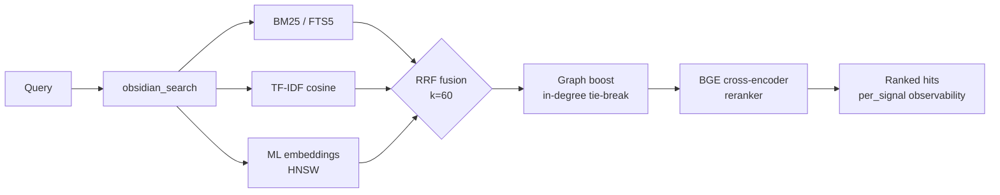

<div align="center">

<a href="https://github.com/oomkapwn/enquire-mcp"></a>

# enquire-mcp

<sub>[English](./README.md) · [中文](./README.zh.md) · [Español](./README.es.md) · [हिन्दी](./README.hi.md) · [العربية](./README.ar.md) · [Русский](./README.ru.md) · [Português](./README.pt.md) · [Français](./README.fr.md) · **日本語** · [한국어](./README.ko.md) · [Deutsch](./README.de.md)</sub>

### 🏆 AI メモリのための #1 Obsidian MCP。

**セッションのたびにコンテキストを説明し直すのはもう終わりです。enquire-mcp は Markdown と PDF/OCR をハイブリッド検索し、構造化ツールで Canvas を解析し、Dataview 形式の LIST/TABLE クエリと対応する Obsidian Base フィルターを実行します。あなたの知識が、すべての MCP 対応エージェントで使える出典付きの検索可能な記憶になります。**

[](https://www.npmjs.com/package/@oomkapwn/enquire-mcp)
[](./STABILITY.md)
[](https://slsa.dev/spec/v1.0/levels#build-l2)
[](https://modelcontextprotocol.io/)
[](./LICENSE)

**[⚡ 30 秒でインストール](#-クイックスタート) · [🏆 #1 の理由](#why-number-one) · [🧠 ユースケース](#-ユースケース) · [📊 ベンチマーク](./docs/benchmarks.md) · [📖 API リファレンス](https://oomkapwn.github.io/enquire-mcp/api/)**

**Claude Code —— 1 行で：**

```bash
claude mcp add obsidian -- npx -y @oomkapwn/enquire-mcp serve --vault ~/Documents/Obsidian\ Vault
```

</div>

> 📌 本ドキュメントは [README.md](./README.md) の日本語訳であり、日本語話者の読みやすさのためのものです。相違がある場合は、**英語版が正となります**（英語版は各リリースごとに更新されます）。

---

## 課題

AI セッションは毎回ゼロから始まり、プロジェクトや設計判断、前回の調査結果を説明し直すことになります。ベンダー内蔵メモリは知識を一つのクラウドに閉じ込め、ツールを替えると連続性が失われます。**あなたの知識は、いつまでも最初からやり直しのままです。**

## 解決策

あなたの Obsidian ボールト（vault）が、あらゆる MCP 対応エージェントにとって**永続的でクエリ可能な長期記憶**になります。一度インストールするだけで——あなたの知識は、Claude Code、Claude Desktop、Cursor、ChatGPT カスタム GPT、Codex、OpenClaw、その他すべての MCP クライアントから即座にアクセス可能になります。**あなたが所有する**プレーンな markdown ファイルを、ローカルでインデックス化し、最新のフルスタックな情報検索（IR）技術で検索し、すべてのセッション・すべてのモデルをまたいで呼び戻します。

**抽出した要約ではなく、あなたが書いた原文に基づく。** 多くの会話メモリはチャットから事実を別ストアへ抽出します。enquire-mcp は、あなたが意図して書いた知識から始めます。元の `.md` と引用が残るため、想起は監査・編集・移行が可能で、第三者のデータベースに隠れた欠落のある言い換えにはなりません。ローカル優先の Vault が唯一の情報源であり、serve 中のクラウド呼び出しはゼロです。

**根ざし——かつ鮮度を意識する。** 事実を思い出すのは問題の半分にすぎません。それが*まだ真である*かどうかを知ることが、もう半分です。[Memora ベンチマーク](https://arxiv.org/abs/2604.20006)（2026 年 4 月）は、メモリシステムが古くなった事実の再利用で体系的に失敗すること——1 年前のノートを今日書かれたものであるかのように呼び戻すこと——を示しました。enquire の記憶は*あなたの本物の* markdown ファイルそのものであるため、すべての検索ヒットには、ノートのライブな最終更新時刻から導出された `age_days` と `stale` フラグが付与され、新しいノートが先に浮上するように鮮度重み付けランキング（`--recency-weight`）をオプトインできます。あなたの知識を、鮮度を意識した形で——時間の概念を持たないかたまりではなく。

> **enquire-mcp が違う理由**：
> 1. **ベンダー中立。** あなたの記憶は `.md` ファイルの中にあります。Claude から Cursor に乗り換えても——記憶は一緒についてきます。
> 2. **完全なローカル検索スタック。** BM25 + TF-IDF + 多言語埋め込みを RRF で融合し、任意の BGE クロスエンコーダ・リランカーと信号別スコアを提供。HNSW + int8 量子化で dense path をスケールします。
> 3. **`serve` 中に enquire が開始する外向きネットワーク呼び出しはゼロ。** モデルはローカルにキャッシュされます（HuggingFace から明示的に一度ダウンロード）。内容は接続した MCP クライアントにのみ返され、そのクライアントやトンネルによるデータ処理は、それぞれの信頼境界です。
> 4. **鮮度を意識した呼び戻し。** すべてのヒットが、そのノートがどれくらい古いかを報告します。オプトインの鮮度リランキングにより、エージェントは新しい知識を優先し、古くなった事実を再検証対象としてフラグ付けできます——これは忘却を意識したフロンティアであり、あなたのファイルがもともと持っている `mtime` の上に構築されています。

**47 ツール · 19 MCP プロンプト · 2272+ ユニットテスト · 50+ 言語 · v3.11.x 安定版 · semver 準拠 · MIT · npm ビルドプロベナンス（SLSA L2）。**

---

<a id="why-number-one"></a>

## 🏆 enquire-mcp が #1 である理由

**Obsidian 向けの完全なローカル AI メモリスタック——薄いファイルラッパーでも、単なるベクトル検索でもありません。** 1 回の導入で、検索品質、知識の所有権、エージェント対応、文書カバレッジ、プロダクション運用をまとめて得られます。

| リーダーシップ基準 | enquire-mcp が提供するもの |
|---|---|
| **完全一致を超える想起** | ✅ BM25 + TF-IDF + 多言語埋め込み → RRF 融合。任意の BGE リランキングで実測 **+15.5 NDCG@10 / +24.7 MRR** |
| **すべてのエージェントに一つのメモリ** | ✅ Claude Code/Desktop、Cursor、ChatGPT、Codex、OpenClaw、あらゆる互換クライアントへ MCP ネイティブ接続 |
| **検証できる回答** | ✅ 原文、ノートパス、PDF ページ引用、信号別スコア、鮮度メタデータ |
| **本当に所有できる知識** | ✅ プレーン markdown が正本、インデックスはローカル、serve 中のクラウド呼び出しはゼロ |
| **Obsidian の知識面を網羅** | ✅ Markdown、wikilink、frontmatter、Canvas、Bases、PDF、OCR |
| **難問向けのエージェント検索** | ✅ HyDE、サブ質問分解、context packs、GraphRAG-light、19 の MCP プロンプト |
| **制御を失わないスケール** | ✅ HNSW ライブ更新、永続化、adaptive refill、int8 量子化 |
| **プロダクションの信頼性** | ✅ 既定で read-only、privacy filter、認証 HTTP、semver 契約、2272 tests、13 release gates、SLSA L2 provenance |

**一つの Vault。すべてのエージェント。完全な検索スタック。クラウドロックインなし。**

> 戦略的位置づけ：enquire-mcp は、既存の Obsidian Vault 上に構築する [Karpathy 型 LLM Wiki](https://gist.github.com/karpathy/442a6bf555914893e9891c11519de94f) のオープンソースバックエンドです。知識は蓄積され、常に出典へ追跡できます。

---

## ⚡ クイックスタート

```bash
npm install -g @oomkapwn/enquire-mcp
enquire-mcp serve --vault ~/Documents/Obsidian\ Vault
```

任意の MCP クライアントに組み込む：

```json
{
  "mcpServers": {
    "obsidian": {
      "command": "npx",
      "args": ["-y", "@oomkapwn/enquire-mcp", "serve", "--vault", "/path/to/vault"]
    }
  }
}
```

### レビュー可能なデスクトップバンドルなら MCPB Basic

[GitHub Release `v4.0.0-rc.7`](https://github.com/oomkapwn/enquire-mcp/releases/tag/v4.0.0-rc.7) では `enquire-mcp-basic-4.0.0-rc.7.mcpb` と checksum、inventory、SBOM、notices、provenance を提供します。バンドルにはサーバー JavaScript と通常の依存関係が含まれ、対応 MCPB ホスト側で Node.js 22.13 以降を提供する必要があります。

Basic は **13 個の読み取り専用ツール**と **0 プロンプト**に固定され、書き込み、永続インデックス、モデル、PDF/OCR、watcher はありません。実際のデスクトップ GUI、署名、ディレクトリ承認、カタログはメンテナーによる検証が未完了です。enquire は serve 中に外向き通信を開始しませんが、要求されたノート本文は接続した MCP クライアントへ渡り、そのプライバシー条件に従います。

📂 すぐに使える設定は [`examples/`](./examples/) にあります —— **Claude Desktop**、**Cursor**、**ChatGPT カスタム GPT**（HTTP 経由のリモート MCP）、さらに評価ハーネス用のサンプルクエリセットも。

**完全なハイブリッドの威力が欲しい？** ハイブリッドの事前確認を完了してから起動します：

```bash
npm install -g @oomkapwn/enquire-mcp@4.0.0-rc.7      # exact prerelease package
enquire-mcp --version
# recommended: preview first, then explicitly apply the same package-coherent plan
enquire-mcp first-run --tier hybrid --client claude-desktop --vault <path>
enquire-mcp first-run --tier hybrid --client claude-desktop --vault <path> --apply
# manual equivalent below: choose this instead of first-run --apply, not in addition
enquire-mcp setup --vault <path>                          # embedder をキャッシュし FTS5 + embed-db を構築
enquire-mcp install-model rerank-bge                      # オフライン reranker をキャッシュ
enquire-mcp doctor --tier hybrid --vault <path>           # 構造/runtime の準備状況
enquire-mcp configure --tier hybrid --client claude-desktop --vault <path>
enquire-mcp serve --vault <path> --persistent-index --enable-reranker --use-hnsw
```

---

## 🤖 AI エージェントで設定する —— コピペ用プロンプト

`enquire-mcp` をインストールしたら、ボールトが記憶として使えることをエージェントに伝えるために、以下のプロンプトを貼り付けてください。

<details>
<summary><b>Claude Code（ターミナル）</b> —— MCP サーバーの追加 + 最初のプロンプト</summary>

```bash
# MCP サーバーを Claude Code の設定に追加する（一度だけ）
claude mcp add obsidian -- npx -y @oomkapwn/enquire-mcp serve --vault ~/Documents/Obsidian\ Vault
```

その後、任意の Claude Code セッションで：

> あなたは今、私の Obsidian ボールト——私の長期記憶——を検索・読み取りする `obsidian_*` ツールを持っています。プロジェクト・決定・人物・技術的コンテキストに関する質問に答える前に、関連する語句で `obsidian_search` を呼び出してください。各事実には出典のノート（PDF の場合は `[page: N]`）を引用してください。関連するノートが見つからなければ、その旨を伝えてください——推測しないこと。

</details>

<details>
<summary><b>Claude Desktop</b> —— 設定ファイル + 最初のプロンプト</summary>

`enquire-mcp configure --tier hybrid --client claude-desktop --vault <path>` の貼り付け可能な出力を推奨します。[`examples/claude-desktop-hybrid.json`](./examples/claude-desktop-hybrid.json) はテンプレートにすぎません。手動で使う場合は実行ファイルとボールトの両方のパスを置き換えてください。Claude Desktop を再起動してから：

> あなたには、私の Obsidian ボールトが `obsidian_*` ツール経由で検索可能な記憶として接続されています。私がノートに関する何か——会議のコンテキスト、リサーチ、決定、日誌のエントリ——を尋ねたら、必ず最初に `obsidian_search` を確認してください。すべての事実について出典のノートパスを引用してください。

</details>

<details>
<summary><b>Cursor</b> —— MCP stdio 設定 + エージェントルール</summary>

[`examples/cursor-mcp.json`](./examples/cursor-mcp.json) を `~/.cursor/mcp.json` に置きます（ボールトのパスを編集）。`.cursorrules` ファイルまたはチャットで：

> 私がノートを持っているかもしれないトピック（アーキテクチャの決定、API 契約、ベンダー評価）に触れるコードを提案する前に、まず `obsidian_search` を呼び出してください。私の Obsidian ボールトを信頼できるコンテキストとして扱ってください。

</details>

<details>
<summary><b>ChatGPT カスタム GPT</b> —— HTTP 経由のリモート MCP</summary>

[`examples/chatgpt-actions.md`](./examples/chatgpt-actions.md) に従って、bearer 認証付きのトンネル経由で `serve-http` を公開します。カスタム GPT の指示文で：

> あなたは `obsidian_*` ツールファミリー経由で私の Obsidian ボールトへの読み取りアクセス権を持っています。私のノートにありそうなことに答える前に検索し、すべての主張について出典のファイルパスを引用してください。

</details>

<details>
<summary><b>OpenClaw / Codex / その他の任意の MCP クライアント</b></summary>

同じ `npx -y @oomkapwn/enquire-mcp serve --vault <path>` コマンドが、あらゆる MCP 対応クライアントで動作します。サーバーエントリをどこに置くかは、各クライアント自身の MCP 設定ドキュメントを参照し、上記のいずれかのプロンプトを使ってください。

</details>

**再利用可能なエージェントルール**（任意の `AGENTS.md` / `CLAUDE.md` / `.cursorrules` に貼り付けて、エージェントがボールトを*いつ*参照すべきかを把握させる）：

> 私の質問が、私自身のノート・決定・プロジェクト・人物・リサーチに触れるときは、`obsidian_*` ツール（まず `obsidian_search` から）で**最初に私の Obsidian ボールトを検索し**、すべての事実について出典のノートを引用してください。*概念的 / 言語横断 /「私が X について何と言ったか」*の呼び戻しには enquire を優先してください。正確なリテラル文字列にはプレーンな `grep` / `ripgrep` を使ってください。関連するものが何も返ってこなければ、その旨を伝えてください——推測しないこと。

### うまく機能するクエリの例

- *「価格戦略について議論したノートをすべて見つけて、その変遷を要約して。」* —— RRF 融合 + リランカーが「変遷」をセマンティックに処理
- *「PostgreSQL と MongoDB について私が下した決定は何だった？ デイリーノートを引用して。」* —— 融合された候補の RRF スコアが同点の場合、候補集合内の wikilink 入次数でタイブレークする
- *"Анализируй мои заметки о RAG за последние 3 месяца"* —— 多言語埋め込み + frontmatter の日付フィルタ
- *「LLaMA-3 論文 PDF のどのページがスケーリングについて述べている？」* —— `[page: N]` 引用付きで PDF を検索に統合
- *「私のリサーチボールトのトピック別コミュニティを見せて——どんなテーマを探求してきた？」* —— `obsidian_get_communities`（GraphRAG-light）

---

## 🧠 ユースケース

**1 —— AI エージェントのための長期記憶。** あなたの Obsidian ボールトを任意の MCP 対応エージェント（Claude Code、Claude Desktop、Cursor、ChatGPT、Codex、OpenClaw）に組み込みます。エージェントはこれで、あなたがこれまでに書いたすべての会議ノート・日誌エントリ・リサーチログ・決定ドキュメントに対する、永続的でセマンティックな呼び戻しを——セッション・モデル・プロバイダーをまたいで——手にします。ベンダー内蔵メモリと違って、あなたの知識は 1 つのベンダーのクラウドに閉じ込められません。あなたが所有し、自由に移行できるプレーンな markdown の中にあります。

**2 —— 個人ナレッジベース / セカンドブレイン。** ハイブリッド検索は、50 以上の言語のいずれにおいても、*どんな*言い回しに対しても正しいノートを浮上させます。2 年前のロシア語の日誌エントリについて英語で尋ねても、正しいヒットが得られます。Wikilink グラフブーストは、候補集合内の入次数を使って同点の RRF スコアだけをタイブレークします。GraphRAG-light はトピック別コミュニティを浮上させます——自分が作ったことすら忘れていたつながりを発見できます。PDF は `[page: N]` 引用付きで検索に統合され、論文や会議の文字起こしが一級の記憶になります。

**3 —— エージェンティック RAG / コンテキストエンジニアリング。** `obsidian_search` はシグナル別のスコアを公開するため、エージェントは各ヒットが*なぜ*そのランクになったかを見られます。HyDE は、検索の前に曖昧なクエリを内容豊かな仮想的回答へ事前に書き換えます。サブクエスチョン分解は、マルチホップの質問（「私たちの価格戦略はどう進化し、顧客の反応はどうだったか？」）を独立したサブクエリに分解して結果を融合することで処理します。組み込みの評価ハーネス（NDCG / Recall / MRR）により、ベンダーのベンチマークを信じる代わりに、あなた自身のクエリで検索品質を測定できます。

---

## ✅ 本格的なローカル知識ワークフローのために

次を求めるなら enquire-mcp を選んでください：

- **Obsidian Vault を唯一の情報源に保つ**。知識を独自ストアへ複製しません。
- **複数の AI エージェントで一つのメモリを共有する**。モデル変更のたびにやり直しません。
- **言い換えに強い概念・多言語想起**。
- **ノートパス、PDF ページ、信号スコア、鮮度を備えた引用可能な結果**。
- **ローカル優先のプライバシー**。既定で read-only、書き込みは明示、serve 中のクラウド呼び出しはゼロ。
- **完全な検索バックエンド**。ハイブリッド検索、リランキング、グラフ文脈、エージェント拡張、Obsidian 形式、リモート MCP を統合。

**明確な範囲：** enquire-mcp は Markdown、Canvas、Bases、PDF 向けのヘッドレス MCP サーバー / CLI です。正確なトークンには文字列検索を併用し、リモートエージェントには組み込み HTTP transport を使えます。

---

## 📖 API リファレンス

自動生成された **[oomkapwn.github.io/enquire-mcp の API リファレンス](https://oomkapwn.github.io/enquire-mcp/api/)** —— すべてのツール・プロンプト・エクスポートされたヘルパーを、完全な TSDoc（`@param` / `@returns` / `@example`）付きで掲載。[`publish-docs.yml`](https://github.com/oomkapwn/enquire-mcp/blob/main/.github/workflows/publish-docs.yml)（TypeDoc → GitHub Pages）により、`main` への push ごとにソースから再ビルドされます。構造的にドリフトしません。AI エージェントや IDE が見るのと同じ TSDoc が、公開されるものです。

---

## 🏗️ 検索の仕組み



`obsidian_search` は利用可能なシグナルを自動検出し、優雅にデグレードします。Wikilink グラフブーストは、候補集合内の入次数を使って同点の RRF スコアだけをタイブレークします。オプションのクロスエンコーダ・リランキングは top-N を再スコアリングし、実測で +15.5 NDCG@10 をもたらします。すべてのヒットは `per_signal: { bm25, tfidf, embeddings }` を返すので、それが*なぜ*ランクインしたかが分かります。

| 段階 | セットアップ | 得られるもの |
|---|---|---|
| **1** | `serve --vault <path>` | TF-IDF コサイン（セットアップ不要、即時） |
| **2** | + `--persistent-index` | + BM25 / FTS5（インデックス化された語彙検索） |
| **3** | + `setup`（モデルをダウンロード + embed-db を構築） | + 多言語 ML 埋め込み |
| **4** | + `--enable-reranker` | + BGE クロスエンコーダ（実測 +15.5 NDCG@10） |
| **5** | + `--use-hnsw` | + 永続化 HNSW による近似最近傍検索 |
| **6** | + `--include-pdfs` | + 上記すべてに統合された PDF |
| **7** | `serve-http --bearer-token …` | + リモート MCP（Claude.ai ウェブ、ChatGPT、Cursor HTTP、モバイル） |

---

## 🛠️ 47 ツールすべて

合計 47 ツール：35 個の常時オン読み取り（アンブレラの `obsidian_search` を含む）+ 4 個のオプトイン読み取り + 7 個のゲート付き書き込み + 1 個のクローズドループ・フィードバック。完全なリファレンス：**[docs/api.md](./docs/api.md)**。

| カテゴリ | ツール |
|---|---|
| **検索 & 取得** | `obsidian_search`（アンブレラ、RRF 融合） · `obsidian_hyde_search`（HyDE 強化、v3.1.0） · `obsidian_search_text` · `obsidian_full_text_search` · `obsidian_semantic_search` · `obsidian_embeddings_search` · `obsidian_find_similar` |
| **Wikilink & グラフ** | `obsidian_resolve_wikilink` · `obsidian_get_backlinks` · `obsidian_get_outbound_links` · `obsidian_get_note_neighbors` · `obsidian_get_unresolved_wikilinks` · `obsidian_find_path` · `obsidian_get_communities`（v3.4.0、GraphRAG-light） |
| **Frontmatter & Dataview** | `obsidian_frontmatter_get` · `obsidian_frontmatter_search` · `obsidian_dataview_query` · `obsidian_list_tags` |
| **読み取り & ナビゲート** | `obsidian_read_note` · `obsidian_list_notes` · `obsidian_get_recent_edits` · `obsidian_stale_notes` · `obsidian_open_questions` · `obsidian_context_pack` · `obsidian_chat_thread_read` · `obsidian_open_in_ui` · `obsidian_stats` |
| **PDF、Canvas & Bases** | `obsidian_read_pdf` · `obsidian_list_pdfs` · `obsidian_ocr_pdf` · `obsidian_read_canvas` · `obsidian_list_canvases` · `obsidian_list_bases`（v3.2.0） · `obsidian_read_base`（v3.2.0） · `obsidian_query_base`（v3.2.0） |
| **書き込み**（`--enable-write` でゲート） | `obsidian_create_note` · `obsidian_append_to_note` · `obsidian_rename_note` · `obsidian_replace_in_notes` · `obsidian_archive_note` · `obsidian_frontmatter_set` · `obsidian_chat_thread_append` |
| **診断 / lint** | `obsidian_lint_wiki` · `obsidian_paper_audit` · `obsidian_validate_note_proposal` |
| **フィードバック**（`--feedback-weight` でオプトイン） | `obsidian_mark_useful`（クローズドループ：どの呼び戻されたノートが役立ったかを記録し、今後の検索でそれらをブースト） |

加えて、3 つの MCP リソース（`obsidian://vault/info`、`obsidian://note/{path}`、`obsidian://chunk/{n}/{path}`）と、一般的なボールトワークフロー向けの 19 個の **MCP プロンプト**（`summarize_recent_edits` · `review_tag` · `find_orphans` · `weekly_review` · `extract_todos` · `process_inbox` · `consolidate_tags` · `find_duplicates` · `lint_wiki` · `monthly_review` · `search_with_query_expansion` · `vault_synth` · `vault_wiki_compile` · `vault_lint_extended` · `vault_capture` · `vault_persona_search` · `vault_automation_setup` · `vault_research` · `vault_synthesis_page`）。

---

## 🛡️ 信頼性

| サーフェス | スタンス |
|---|---|
| **デフォルト** | 読み取り専用 —— 7 個の書き込みツールには `--enable-write` が必要 |
| **最小権限** | `--disabled-tools` / `--enabled-tools` で最小限のサーフェスを公開（例：読み取り専用のリサーチエージェントには `obsidian_search` + `obsidian_read_note` のみを付与） |
| **パス安全性** | すべての読み書きで realpath チェック；ボールト外を指すシンボリックリンクは拒否 |
| **プライバシーフィルタ** | FTS5 + embed-db + chunk リソースパスで検証；空の許可 / 拒否リストには fail-closed |
| **HTTP トランスポート** | Bearer 認証（定数時間 SHA-256 + `timingSafeEqual`）、トークン別レート制限、厳格な CORS |
| **Frontmatter** | `js-yaml@5` の `load`（YAML 1.2 コアスキーマ、デフォルトで安全）—— コード実行なし |
| **キャッシュ + インデックスファイル** | POSIX モードが機能する環境では Enquire が機密ファイルへベストエフォートで `0600` を再適用。Enquire が作成した親ディレクトリは `0700` で開始し、既存/カスタムの親は運用者管理のまま |
| **2272 ユニットテスト · リリース必須 CI チェック 13 個 · 現在ブランチ保護対象は全 13 個** | 現在確認済みのリリース状態。運用詳細は下に固定しています。 |
| **CI** | `release.yml` は **13 個のリリース gate** を直接列挙し、各 PR ですべて実行します（`lint`、`test (22)`、`test (24)`、`smoke`、`audit`、`coverage`、`version-consistency`、`docs`、`oia`、`protocol-conformance`、`package-consumer`、`mcpb-basic`、`docker`）。固定された Windows hostile-filesystem job `test-windows` は追加の名前付き check-run で、`smoke` のブロッキング前提条件として推移的に強制されます。ブランチ保護は現在 **13 個すべて**を強制します（ブランチ保護スナップショットは 2026-08-21 にライブ確認）。`test-macos` は `continue-on-error` を持つ唯一のアドバイザリ job です。`docker` gate は image を build し、bounded CLI と MCP introspection probe を実行します。CodeQL は [GitHub default setup](https://docs.github.com/code-security/code-scanning/automatically-scanning-your-code-for-vulnerabilities-and-errors/configuring-default-setup-for-code-scanning) により 2 つの独立した未保護分析を実行します。npm publish 前に `release.yml` がタグ付き SHA 上で直接列挙した 13 個の gate を再検証します。 |
| **カバレッジ** | 行 ≥86% · ステートメント ≥82% · 関数 ≥75% · 分岐 ≥74%（ゲート付き） |
| **リリース** | タグごとに npm + GitHub リリース · semver · **署名付きビルドプロベナンス**（npm + Sigstore、SLSA Build L2；L3 ジェネレータはロードマップ上） |
| **安定性** | v3.0+ semver 準拠 —— すべての CLI フラグ、ツール名、MCP リソース、プロンプト、エクスポートシンボルが契約 |

完全なスタンス：**[SECURITY.md](./SECURITY.md)** · 安定性サーフェス：**[STABILITY.md](./STABILITY.md)** · 脆弱性：`oomkapwn@gmail.com`。

---

## ❓ FAQ

**Obsidian のインストールは必要？** いいえ。`.md` + `.canvas` + `.pdf` を直接読み取ります。任意の Obsidian 形式のボールトに対して動作します。

**私のボールトに書き込む？** `--enable-write` を渡さない限り、書き込みません。7 個の書き込みツールはすべてゲート付きで、破壊的なものは `dry_run` をサポートします。

**データはどこかに送信される？** enquire はテレメトリを送信せず、`serve` 中に外向きの HTTP を開始しません。ただし、要求された Vault のコンテキストは接続した MCP クライアントへ返されます。クラウドクライアントは独自のプライバシーポリシーに従ってそのコンテキストを処理する場合があり、トンネルやリバースプロキシも別の信頼境界です。`setup`、`build-embeddings`、`install-model`、およびハイブリッド Tier の `first-run --apply` は Hugging Face から ONNX の重みを取得する場合があります。`install-ocr-lang` は Tesseract 言語パックを取得します。

**パフォーマンスは？** Vault の規模、ハードウェア、モデル、有効な検索レイヤーによって変わります。公開されている根拠は、1,771 chunks / 368 files で BM25 top-10 が **50–100ms** だった本番報告と、100–1,000 notes で FTS5 が線形スキャンより **37–103×** 高速だった再現可能な合成ベンチマークです。レイテンシ SLO を決める前に自分の Vault で内蔵評価を実行してください。

**言語は？** デフォルトの embedder は `paraphrase-multilingual-MiniLM-L12-v2`（50+ 言語）で、ロシア語 + 英語のバイリンガルボールトでエンドツーエンド検証済みです。デフォルトの cross-encoder reranker は `rerank-bge`（English-only；エンドツーエンド検証済みの唯一のカタログ alias）です。多言語 reranker alias は現在、transformers.js tokenizer の互換性チェックに失敗します。CJK / タイ語 / クメール語のトークン化には `Intl.Segmenter` を使います。

**リモートで実行できる？** はい —— `serve-http` は同じサーバーを [Streamable HTTP](https://modelcontextprotocol.io/specification/2025-06-18/basic/transports#streamable-http) 経由で公開します。HTTPS には Tailscale Funnel または Cloudflare Tunnel を前段に置いてください。claude.ai ウェブ、ChatGPT カスタム GPT、Cursor の HTTP モード、モバイルの MCP クライアントで動作します。**[docs/http-transport.md](./docs/http-transport.md)** を参照してください。

---

## 🚀 リリース

**v3.0.0 —— 安定チャネル。** v2.x の検索ロードマップは完了し、公開サーフェスは [semver 準拠](./STABILITY.md) になりました。ハイライト：

`v2.0` ハイブリッド検索（BM25+TF-IDF+埋め込みを RRF で） · `v2.6` リモート MCP · `v2.7-2.8` PDF 統合 · `v2.9` BGE リランカー · `v2.10` OCR · `v2.11` doctor + setup · `v2.12` 評価ハーネス · `v2.13` HNSW · `v2.14` ステートフルセッション · `v2.15` late-chunking · `v2.16` HNSW 永続化 · `v2.17` int8 量子化 · `v3.8.0` 安定版 · `v3.8.7` HTTP トランスポート強化 · **`v3.9.0` 安定版**：OCR された PDF のウォッチャー embed-sync、ファイル変更時の HNSW インメモリライブ更新、R-10 適応的 HNSW リフィル（>66% 除外時のアンダーリターンを解消）。 · **`v3.10` 安定版**：忘却を意識した鮮度 —— `age_days` + `stale` フラグ + オプトインの `--recency-weight` リランキング + frontmatter を意識した `obsidian_search`。

チャネル：`npm install @oomkapwn/enquire-mcp` → 最新安定版（`@latest` = v3.11.x）。プレリリース：`npm install @oomkapwn/enquire-mcp@rc`（最新のリリース候補 —— [CHANGELOG.md](./CHANGELOG.md) を参照）。完全な変更履歴：**[CHANGELOG.md](./CHANGELOG.md)** · 今後の計画：**[ROADMAP.md](https://github.com/oomkapwn/enquire-mcp/blob/main/ROADMAP.md)**。

---

## 🤝 コントリビュート

```bash
git clone https://github.com/oomkapwn/enquire-mcp.git
cd enquire-mcp && npm install
npm test       # フルスイート（2272 テスト）
npm run lint   # 警告ゼロ
npm run build  # tsc → dist/
```

Issue、PR、アイデアを歓迎します。

---

## 📜 ライセンス

MIT。[Alex (@OomkaBear)](https://github.com/oomkapwn) が制作。[Tim Berners-Lee の 1980 年の WWW プロトタイプ](https://en.wikipedia.org/wiki/ENQUIRE) —— ウェブ以前の、オリジナルのハイパーテキストシステム —— にちなんで名付けられました。当初の仕様はこうでした：あなたはシステムに何でも尋ねることができる。**enquire-mcp はそれをあなたのボールトにもたらします。**
