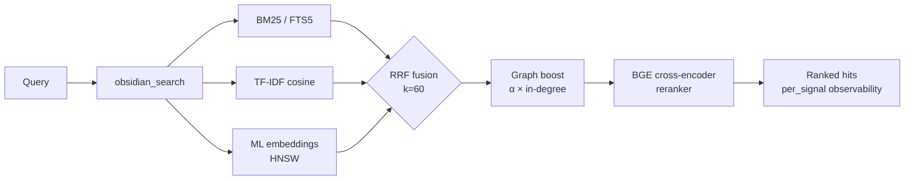

<div align="center">

<a href="https://github.com/oomkapwn/enquire-mcp"></a>

# enquire-mcp

<sub>[English](./README.md) · [中文](./README.zh.md) · [Español](./README.es.md) · [हिन्दी](./README.hi.md) · [العربية](./README.ar.md) · [Русский](./README.ru.md) · [Português](./README.pt.md) · [Français](./README.fr.md) · **日本語** · [한국어](./README.ko.md) · [Deutsch](./README.de.md)</sub>

### 最先端の Obsidian MCP。AI エージェントのための長期記憶。

**セッションのたびに Claude、Cursor、ChatGPT、Codex、OpenClaw へコンテキストを説明し直すのはもう終わりです。あなたの Obsidian ノートが、すべての MCP 対応エージェント間で共有・検索可能な記憶になります——あなたの知識を、あらゆるモデルで、永遠にあなたのものに。**

[](https://www.npmjs.com/package/@oomkapwn/enquire-mcp)
[](./STABILITY.md)
[](https://slsa.dev/spec/v1.0/levels#build-l2)
[](https://modelcontextprotocol.io/)
[](./LICENSE)

**[⚡ 30 秒でインストール](#-クイックスタート) · [🧠 ユースケース](#-ユースケース) · [📊 ベンチマーク](./docs/benchmarks.md) · [📖 API リファレンス](https://oomkapwn.github.io/enquire-mcp/) · [💬 他の選択肢と比較](./docs/COMPARISON.md)**

**Claude Code —— 1 行で：**

```bash
claude mcp add obsidian -- npx -y @oomkapwn/enquire-mcp serve --vault ~/Documents/Obsidian\ Vault
```

</div>

> 📌 本ドキュメントは [README.md](./README.md) の日本語訳であり、日本語話者の読みやすさのためのものです。相違がある場合は、**英語版が正となります**（英語版は各リリースごとに更新されます）。

---

## 課題

すべての AI セッションはゼロから始まります。プロジェクトのこと、設計上の決定、先週のリサーチで出した結論を、何度も説明し直すことになります。ベンダーの「メモリ」機能（[Claude Memory](https://www.anthropic.com/news/memory-and-tool-use)、[ChatGPT Memory](https://openai.com/index/memory-and-new-controls-for-chatgpt/)、Cursor memory）は、あなたの知識を 1 つのプロバイダーのクラウドに閉じ込め——ツールを乗り換えると、また忘れてしまいます。**あなたの知識は、いつまでも最初からやり直しのままです。**

## 解決策

あなたの Obsidian ボールト（vault）が、あらゆる MCP 対応エージェントにとって**永続的でクエリ可能な長期記憶**になります。一度インストールするだけで——あなたの知識は、Claude Code、Claude Desktop、Cursor、ChatGPT カスタム GPT、Codex、OpenClaw、その他すべての MCP クライアントから即座にアクセス可能になります。**あなたが所有する**プレーンな markdown ファイルを、ローカルでインデックス化し、最新のフルスタックな情報検索（IR）技術で検索し、すべてのセッション・すべてのモデルをまたいで呼び戻します。

**抽出ではなく、原文に根ざす。** 会話メモリ系のツール（mem0、Zep、Supermemory、Memobase）は、あなたのチャットログから事実を*抽出*し、あなた自身が読めない別のストアに格納します。enquire-mcp はその逆です。それは**あなたがすでに書いた知識に根ざしています**——あなた自身の `.md` ノートを、一字一句そのまま、引用付きで——だから呼び戻された内容は監査可能で、どのエディタでも編集でき、半分しか覚えていないチャットの劣化した要約に決してなりません。さらに、サーバーサイドの***フリート*記憶**プラットフォーム（エージェントのトラフィックを共有データベースに言い換えて格納するマルチテナントのクラウドストア）とも異なり、enquire は**シングルユーザーかつローカルファースト**です。完全にあなたが所有し、自分で読み・編集し・削除できる 1 つのボールトであり、serve 中はクラウド呼び出しがゼロです。（この「抽出される」という批判はチャットメモリ系のグループに特有のものであり、cognee のようなナレッジグラフ / ETL ツールにも、Khoj のようなパーソナル検索系の同種ツールにも当てはまりません。）

**根ざし——かつ鮮度を意識する。** 事実を思い出すのは問題の半分にすぎません。それが*まだ真である*かどうかを知ることが、もう半分です。[Memora ベンチマーク](https://arxiv.org/abs/2604.20006)（2026 年 4 月）は、メモリシステムが古くなった事実の再利用で体系的に失敗すること——1 年前のノートを今日書かれたものであるかのように呼び戻すこと——を示しました。enquire の記憶は*あなたの本物の* markdown ファイルそのものであるため、すべての検索ヒットには、ノートのライブな最終更新時刻から導出された `age_days` と `stale` フラグが付与され、新しいノートが先に浮上するように鮮度重み付けランキング（`--recency-weight`）をオプトインできます。あなたの知識を、鮮度を意識した形で——時間の概念を持たないかたまりではなく。

> **enquire-mcp が違う理由**：
> 1. **ベンダー中立。** あなたの記憶は `.md` ファイルの中にあります。Claude から Cursor に乗り換えても——記憶は一緒についてきます。
> 2. **クラス最高峰の検索。** ハイブリッドな BM25 + 多言語埋め込み + BGE クロスエンコーダ・リランカーを RRF で融合し、HNSW + int8 量子化でスケールさせます。検索系スタートアップが構築するのと同じ IR スタックを——オープンソースで、1 つのバイナリに収めています。
> 3. **serve 中はクラウド呼び出しがゼロ。** モデルはローカルにキャッシュ（HuggingFace から一度だけダウンロード）。あなたのボールトの内容はマシンから決して出ていきません。デフォルトでエアギャップ安全。
> 4. **鮮度を意識した呼び戻し。** すべてのヒットが、そのノートがどれくらい古いかを報告します。オプトインの鮮度リランキングにより、エージェントは新しい知識を優先し、古くなった事実を再検証対象としてフラグ付けできます——これは忘却を意識したフロンティアであり、あなたのファイルがもともと持っている `mtime` の上に構築されています。

**46 ツール · 19 MCP プロンプト · 1582+ ユニットテスト · 50+ 言語 · v3.11.x 安定版 · semver 準拠 · MIT · npm ビルドプロベナンス（SLSA L2）。**

---

## 🏆 なぜこれが最高なのか

**他のどの Obsidian-MCP にもまったく存在しない 6 つの機能**（GraphRAG-light、スタンドアロンの `.base` 実行、HyDE、int8 量子化、late-chunking、組み込みの評価ハーネス）。**さらに、最新の IR スタック全体**（BM25 + ML 埋め込み + クロスエンコーダ・リランキング + HNSW）——競合が多くても 1 つか 2 つしか搭載していないものを丸ごと。横並びで比較：

| 機能 | enquire-mcp | Smart Connections | 他の Obsidian-MCP |
|---|:---:|:---:|:---:|
| ハイブリッド検索（BM25 + TF-IDF + ML 埋め込み、RRF 融合） | ✅ | ❌ | ❌ |
| **クロスエンコーダ・リランキング**（BGE、実測 +15.5 NDCG@10） | ✅ | ❌ | ❌ |
| **HNSW ベクトルインデックス**（10ms 未満の top-K、永続化） | ✅ | ❌ | ❌ |
| **int8 ベクトル量子化**（embed-db が約 4 分の 1 のサイズ） | ✅ | ❌ | ❌ |
| **Late-chunking** コンテキストウィンドウ化埋め込み | ✅ | ❌ | ❌ |
| **ハイブリッド検索に統合された PDF**（`[page: N]` 引用） | ✅ | ❌ | ❌ |
| **スキャン PDF の OCR**（Tesseract.js、多言語） | ✅ | ❌ | ❌ |
| **Wikilink グラフブースト**検索シグナル | ✅ | ❌ | ❌ |
| **多言語セマンティック検索**（50+ 言語、オンデバイス） | ✅ | 💰 有料 | ❌ |
| **組み込みの検索品質評価ハーネス**（NDCG、Recall、MRR、A/B マトリクス） | ✅ | ❌ | ❌ |
| **リモート MCP**（HTTP + bearer 認証 + ステートフルセッション） | ✅ | ❌ | 一部 |
| **ヒットごとのシグナル別オブザーバビリティ** | ✅ | ❌ | ❌ |
| **MCP ネイティブ**（Claude · Cursor · ChatGPT · Codex · OpenClaw · 任意のクライアント） | ✅ | ❌ Obsidian 専用 | まちまち |
| **プライバシーフィルタ**をすべての検索 + 書き込みパスで検証 | ✅ | 該当なし | ❌ |
| **46 個の本番ツール**（34 個の常時オン読み取りツール + 4 個のオプトイン + 7 個のゲート付き書き込み + 1 個のフィードバックツール） | ✅ | 該当なし | まちまち |
| **GraphRAG-light**（Louvain モジュラリティによる wikilink コミュニティ検出） | ✅ **ここだけ** | ❌ | ❌ |
| **スタンドアロンの `.base` クエリ実行**（Obsidian を起動せずに動作） | ✅ **ここだけ** | ❌ | ❌ Obsidian に委譲 |
| **HyDE 検索**（Gao et al 2023）+ サブクエスチョン分解 | ✅ **ここだけ** | ❌ | ❌ |
| **1582 ユニットテスト · PR ごとに 9 個の必須 + 5 個のアドバイザリ CI ゲート** | ✅ | 該当なし | まれ |
| **署名付きビルドプロベナンス**（npm + Sigstore、SLSA Build L2） | ✅ | 該当なし | ❌ |
| **semver 準拠の公開サーフェス**（[STABILITY.md](./STABILITY.md)） | ✅ | 該当なし | ❌ |
| スタンドアロン（Obsidian プラグイン不要） | ✅ | ❌ Obsidian が必要 | まちまち |
| ライセンス | MIT、無料 | プロプライエタリ、有料 | まちまち |

<sub>比較は各プロジェクトの v3.8.x 安定版時点での公開機能に基づきます（初回スナップショット v3.7.0 / 2026-05-15；v3.8.4 で更新）。Smart Connections は有料の Obsidian プラグイン（MCP サーバーではありません）。「他の Obsidian-MCP」とは、執筆時点で GitHub 上にある公開オープンソースの Obsidian-MCP サーバーを指します。enquire-mcp のエンドツーエンド検索ベンチマークは <a href="./docs/benchmarks.md"><code>docs/benchmarks.md</code></a> で公開されています——実測の `rerank-bge` のデルタは、60 クエリのアブレーションにおいて、プレーンなハイブリッドに対して +24.7 MRR / +15.5 NDCG@10 です。</sub>

> 戦略的主張：enquire-mcp は、既存の Obsidian ボールトの上に構築する [Karpathy スタイルの LLM Wiki](https://gist.github.com/karpathy/442a6bf555914893e9891c11519de94f) のためのオープンソースバックエンドです。複利的に積み上がり、ソースまで追跡できる知識。

---

## ⚡ クイックスタート

```bash
npm install -g @oomkapwn/enquire-mcp
enquire-mcp serve --vault ~/Documents/Obsidian\ Vault
```

任意の MCP クライアントに組み込む：

```json
{
  "mcpServers": {
    "obsidian": {
      "command": "npx",
      "args": ["-y", "@oomkapwn/enquire-mcp", "serve", "--vault", "/path/to/vault"]
    }
  }
}
```

📂 すぐに使える設定は [`examples/`](./examples/) にあります —— **Claude Desktop**、**Cursor**、**ChatGPT カスタム GPT**（HTTP 経由のリモート MCP）、さらに評価ハーネス用のサンプルクエリセットも。

**完全なハイブリッドの威力が欲しい？** ワンコマンドでゼロタッチのオンボーディング：

```bash
enquire-mcp setup --vault <path>     # モデルをダウンロードし、FTS5 + embed-db を構築
enquire-mcp serve --vault <path> --persistent-index --enable-reranker --use-hnsw
enquire-mcp doctor --vault <path>    # 色分けされた ✓/⚠/✗ のヘルスチェック
```

---

## 🤖 AI エージェントで設定する —— コピペ用プロンプト

`enquire-mcp` をインストールしたら、ボールトが記憶として使えることをエージェントに伝えるために、以下のプロンプトを貼り付けてください。

<details>
<summary><b>Claude Code（ターミナル）</b> —— MCP サーバーの追加 + 最初のプロンプト</summary>

```bash
# MCP サーバーを Claude Code の設定に追加する（一度だけ）
claude mcp add obsidian -- npx -y @oomkapwn/enquire-mcp serve --vault ~/Documents/Obsidian\ Vault
```

その後、任意の Claude Code セッションで：

> あなたは今、私の Obsidian ボールト——私の長期記憶——を検索・読み取りする `obsidian_*` ツールを持っています。プロジェクト・決定・人物・技術的コンテキストに関する質問に答える前に、関連する語句で `obsidian_search` を呼び出してください。各事実には出典のノート（PDF の場合は `[page: N]`）を引用してください。関連するノートが見つからなければ、その旨を伝えてください——推測しないこと。

</details>

<details>
<summary><b>Claude Desktop</b> —— 設定ファイル + 最初のプロンプト</summary>

[`examples/claude-desktop-hybrid.json`](./examples/claude-desktop-hybrid.json) を Claude Desktop の MCP 設定に置きます（先にボールトのパスを編集してください）。Claude Desktop を再起動してから：

> あなたには、私の Obsidian ボールトが `obsidian_*` ツール経由で検索可能な記憶として接続されています。私がノートに関する何か——会議のコンテキスト、リサーチ、決定、日誌のエントリ——を尋ねたら、必ず最初に `obsidian_search` を確認してください。すべての事実について出典のノートパスを引用してください。

</details>

<details>
<summary><b>Cursor</b> —— MCP stdio 設定 + エージェントルール</summary>

[`examples/cursor-mcp.json`](./examples/cursor-mcp.json) を `~/.cursor/mcp.json` に置きます（ボールトのパスを編集）。`.cursorrules` ファイルまたはチャットで：

> 私がノートを持っているかもしれないトピック（アーキテクチャの決定、API 契約、ベンダー評価）に触れるコードを提案する前に、まず `obsidian_search` を呼び出してください。私の Obsidian ボールトを信頼できるコンテキストとして扱ってください。

</details>

<details>
<summary><b>ChatGPT カスタム GPT</b> —— HTTP 経由のリモート MCP</summary>

[`examples/chatgpt-actions.md`](./examples/chatgpt-actions.md) に従って、bearer 認証付きのトンネル経由で `serve-http` を公開します。カスタム GPT の指示文で：

> あなたは `obsidian_*` ツールファミリー経由で私の Obsidian ボールトへの読み取りアクセス権を持っています。私のノートにありそうなことに答える前に検索し、すべての主張について出典のファイルパスを引用してください。

</details>

<details>
<summary><b>OpenClaw / Codex / その他の任意の MCP クライアント</b></summary>

同じ `npx -y @oomkapwn/enquire-mcp serve --vault <path>` コマンドが、あらゆる MCP 対応クライアントで動作します。サーバーエントリをどこに置くかは、各クライアント自身の MCP 設定ドキュメントを参照し、上記のいずれかのプロンプトを使ってください。

</details>

**再利用可能なエージェントルール**（任意の `AGENTS.md` / `CLAUDE.md` / `.cursorrules` に貼り付けて、エージェントがボールトを*いつ*参照すべきかを把握させる）：

> 私の質問が、私自身のノート・決定・プロジェクト・人物・リサーチに触れるときは、`obsidian_*` ツール（まず `obsidian_search` から）で**最初に私の Obsidian ボールトを検索し**、すべての事実について出典のノートを引用してください。*概念的 / 言語横断 /「私が X について何と言ったか」*の呼び戻しには enquire を優先してください。正確なリテラル文字列にはプレーンな `grep` / `ripgrep` を使ってください。関連するものが何も返ってこなければ、その旨を伝えてください——推測しないこと。

### うまく機能するクエリの例

- *「価格戦略について議論したノートをすべて見つけて、その変遷を要約して。」* —— RRF 融合 + リランカーが「変遷」をセマンティックに処理
- *「PostgreSQL と MongoDB について私が下した決定は何だった？ デイリーノートを引用して。」* —— wikilink グラフブーストが中心的な決定ドキュメントを浮上させる
- *"Анализируй мои заметки о RAG за последние 3 месяца"* —— 多言語埋め込み + frontmatter の日付フィルタ
- *「LLaMA-3 論文 PDF のどのページがスケーリングについて述べている？」* —— `[page: N]` 引用付きで PDF を検索に統合
- *「私のリサーチボールトのトピック別コミュニティを見せて——どんなテーマを探求してきた？」* —— `obsidian_get_communities`（GraphRAG-light）

---

## 🧠 ユースケース

**1 —— AI エージェントのための長期記憶。** あなたの Obsidian ボールトを任意の MCP 対応エージェント（Claude Code、Claude Desktop、Cursor、ChatGPT、Codex、OpenClaw）に組み込みます。エージェントはこれで、あなたがこれまでに書いたすべての会議ノート・日誌エントリ・リサーチログ・決定ドキュメントに対する、永続的でセマンティックな呼び戻しを——セッション・モデル・プロバイダーをまたいで——手にします。`Claude Memory` や `ChatGPT Memory` と違って、あなたの知識は 1 つのベンダーのクラウドに閉じ込められません。あなたが所有し、自由に移行できるプレーンな markdown の中にあります。

**2 —— 個人ナレッジベース / セカンドブレイン。** ハイブリッド検索は、50 以上の言語のいずれにおいても、*どんな*言い回しに対しても正しいノートを浮上させます。2 年前のロシア語の日誌エントリについて英語で尋ねても、正しいヒットが得られます。Wikilink グラフブーストは、あなたのナレッジグラフの中心に位置するノートのランクを上げ直します。GraphRAG-light はトピック別コミュニティを浮上させます——自分が作ったことすら忘れていたつながりを発見できます。PDF は `[page: N]` 引用付きで検索に統合され、論文や会議の文字起こしが一級の記憶になります。

**3 —— エージェンティック RAG / コンテキストエンジニアリング。** `obsidian_search` はシグナル別のスコアを公開するため、エージェントは各ヒットが*なぜ*そのランクになったかを見られます。HyDE は、検索の前に曖昧なクエリを内容豊かな仮想的回答へ事前に書き換えます。サブクエスチョン分解は、マルチホップの質問（「私たちの価格戦略はどう進化し、顧客の反応はどうだったか？」）を独立したサブクエリに分解して結果を融合することで処理します。組み込みの評価ハーネス（NDCG / Recall / MRR）により、ベンダーのベンチマークを信じる代わりに、あなた自身のクエリで検索品質を測定できます。

---

## 🚫 enquire-mcp が適切なツール*ではない*とき

正直に語る非目標——次のときは別のものを使ってください：

- **リテラル文字列 / 正規表現検索が欲しい。** 「この正確なトークンを見つける」には `ripgrep` / `grep` の方が速く、正確です。enquire は*概念的な*呼び戻し——類義語、言語横断、「私が X について何と言ったか」——で輝きます。両方を使いましょう。リテラルには `rg`、意味には enquire。
- **あなたの知識がノートではなくチャットログにある。** enquire はあなたが書いた markdown に*根ざして*います。チャットの文字起こしから事実を*抽出*して別のストアに格納する会話メモリ系のツール（mem0、Zep、Supermemory）は別のカテゴリです——[比較](./docs/COMPARISON.md)を参照してください。
- **マルチユーザー / ホスト型 / 同期検索が必要。** enquire は設計上ローカルファーストかつ単一ボールトです——サーバーサイドのマルチテナントインデックスはありません。
- **ソースが Markdown でも PDF でもない。** `.md` / `.canvas` / `.base` / `.pdf` は一級ですが、他の形式はまず変換が必要です。
- **GUI やアプリ内 Obsidian プラグインが欲しい。** enquire はヘッドレスな MCP サーバー / CLI です——Obsidian を*補完*するものであって、Obsidian そのものではありません。（アプリ内プラグインの選択肢は Smart Connections です。）
- **数百万のノートに対するサブミリ秒の検索が必要。** HNSW は大規模でも 10ms 未満の top-K を提供しますが、enquire は個人 / チームのボールトを対象としており、ウェブスケールのコーパスではありません。

---

## 📖 API リファレンス

自動生成された **[oomkapwn.github.io/enquire-mcp の API リファレンス](https://oomkapwn.github.io/enquire-mcp/)** —— すべてのツール・プロンプト・エクスポートされたヘルパーを、完全な TSDoc（`@param` / `@returns` / `@example`）付きで掲載。[`publish-docs.yml`](https://github.com/oomkapwn/enquire-mcp/blob/main/.github/workflows/publish-docs.yml)（TypeDoc → GitHub Pages）により、`main` への push ごとにソースから再ビルドされます。構造的にドリフトしません。AI エージェントや IDE が見るのと同じ TSDoc が、公開されるものです。

---

## 🏗️ 検索の仕組み



`obsidian_search` は利用可能なシグナルを自動検出し、優雅にデグレードします。Wikilink グラフブーストは、1 ステップのパーソナライズド PageRank によって top-K をリランクします。オプションのクロスエンコーダ・リランキングは top-N を再スコアリングし、実測で +15.5 NDCG@10 をもたらします。すべてのヒットは `per_signal: { bm25, tfidf, embeddings }` を返すので、それが*なぜ*ランクインしたかが分かります。

| 段階 | セットアップ | 得られるもの |
|---|---|---|
| **1** | `serve --vault <path>` | TF-IDF コサイン（セットアップ不要、即時） |
| **2** | + `--persistent-index` | + BM25 / FTS5（100ms 未満の top-10） |
| **3** | + `setup`（モデルをダウンロード + embed-db を構築） | + 多言語 ML 埋め込み |
| **4** | + `--enable-reranker` | + BGE クロスエンコーダ（実測 +15.5 NDCG@10） |
| **5** | + `--use-hnsw` | + 100 万チャンク規模での 10ms 未満の top-K |
| **6** | + `--include-pdfs` | + 上記すべてに統合された PDF |
| **7** | `serve-http --bearer-token …` | + リモート MCP（Claude.ai ウェブ、ChatGPT、Cursor HTTP、モバイル） |

---

## 🛠️ 46 ツールすべて

合計 46 ツール：34 個の常時オン読み取り（アンブレラの `obsidian_search` を含む）+ 4 個のオプトイン読み取り + 7 個のゲート付き書き込み + 1 個のクローズドループ・フィードバック。完全なリファレンス：**[docs/api.md](./docs/api.md)**。

| カテゴリ | ツール |
|---|---|
| **検索 & 取得** | `obsidian_search`（アンブレラ、RRF 融合） · `obsidian_hyde_search`（HyDE 強化、v3.1.0） · `obsidian_search_text` · `obsidian_full_text_search` · `obsidian_semantic_search` · `obsidian_embeddings_search` · `obsidian_find_similar` |
| **Wikilink & グラフ** | `obsidian_resolve_wikilink` · `obsidian_get_backlinks` · `obsidian_get_outbound_links` · `obsidian_get_note_neighbors` · `obsidian_get_unresolved_wikilinks` · `obsidian_find_path` · `obsidian_get_communities`（v3.4.0、GraphRAG-light） |
| **Frontmatter & Dataview** | `obsidian_frontmatter_get` · `obsidian_frontmatter_search` · `obsidian_dataview_query` · `obsidian_list_tags` |
| **読み取り & ナビゲート** | `obsidian_read_note` · `obsidian_list_notes` · `obsidian_get_recent_edits` · `obsidian_stale_notes` · `obsidian_open_questions` · `obsidian_context_pack` · `obsidian_chat_thread_read` · `obsidian_open_in_ui` · `obsidian_stats` |
| **PDF、Canvas & Bases** | `obsidian_read_pdf` · `obsidian_list_pdfs` · `obsidian_ocr_pdf` · `obsidian_read_canvas` · `obsidian_list_canvases` · `obsidian_list_bases`（v3.2.0） · `obsidian_read_base`（v3.2.0） · `obsidian_query_base`（v3.2.0） |
| **書き込み**（`--enable-write` でゲート） | `obsidian_create_note` · `obsidian_append_to_note` · `obsidian_rename_note` · `obsidian_replace_in_notes` · `obsidian_archive_note` · `obsidian_frontmatter_set` · `obsidian_chat_thread_append` |
| **診断 / lint** | `obsidian_lint_wiki` · `obsidian_paper_audit` · `obsidian_validate_note_proposal` |
| **フィードバック**（`--feedback-weight` でオプトイン） | `obsidian_mark_useful`（クローズドループ：どの呼び戻されたノートが役立ったかを記録し、今後の検索でそれらをブースト） |

加えて、3 つの MCP リソース（`obsidian://vault/info`、`obsidian://note/{path}`、`obsidian://chunk/{n}/{path}`）と、一般的なボールトワークフロー向けの 19 個の **MCP プロンプト**（`summarize_recent_edits` · `review_tag` · `find_orphans` · `weekly_review` · `extract_todos` · `process_inbox` · `consolidate_tags` · `find_duplicates` · `lint_wiki` · `monthly_review` · `search_with_query_expansion` · `vault_synth` · `vault_wiki_compile` · `vault_lint_extended` · `vault_capture` · `vault_persona_search` · `vault_automation_setup` · `vault_research` · `vault_synthesis_page`）。

---

## 🛡️ 信頼性

| サーフェス | スタンス |
|---|---|
| **デフォルト** | 読み取り専用 —— 7 個の書き込みツールには `--enable-write` が必要 |
| **最小権限** | `--disabled-tools` / `--enabled-tools` で最小限のサーフェスを公開（例：読み取り専用のリサーチエージェントには `obsidian_search` + `obsidian_read_note` のみを付与） |
| **パス安全性** | すべての読み書きで realpath チェック；ボールト外を指すシンボリックリンクは拒否 |
| **プライバシーフィルタ** | FTS5 + embed-db + chunk リソースパスで検証；空の許可 / 拒否リストには fail-closed |
| **HTTP トランスポート** | Bearer 認証（定数時間 SHA-256 + `timingSafeEqual`）、トークン別レート制限、厳格な CORS |
| **Frontmatter** | `js-yaml@5` の `load`（YAML 1.2 コアスキーマ、デフォルトで安全）—— コード実行なし |
| **キャッシュ + インデックスファイル** | chmod 0600、親ディレクトリ 0700 |
| **CI** | **9 個の必須**ブランチ保護ゲート：(1) `lint`、(2) Node 22 での `test`、(3) Node 24 での `test`、(4) `smoke`、(5) `audit`、(6) `coverage`、(7) `version-consistency`、(8) `docs`、(9) `oia`。**5 個のアドバイザリ**：`test-macos` + `docker`（Dockerfile ビルド + `tools/list` イントロスペクションスモーク）を `.github/workflows/ci.yml` 経由で；CodeQL ×2 + Analyze アクションを [GitHub の default-setup](https://docs.github.com/code-security/code-scanning/automatically-scanning-your-code-for-vulnerabilities-and-errors/configuring-default-setup-for-code-scanning) 経由で（ワークフローファイルではありません）。リリースワークフローは、npm 公開の前に、タグ付き SHA で 9 個の必須すべてが通過したことを再検証します。_v3.7.10 —— `docs`（TypeDoc 生成ゲート）を必須セットに追加。v3.7.13 —— CI マトリクスに合わせて `engines.node` の下限を `>=22.13.0` に引き上げ。v3.8.0-rc.6 —— `oia`（Outside-In Audit）をアドバイザリから昇格。_ |
| **カバレッジ** | 行 ≥86% · ステートメント ≥82% · 関数 ≥75% · 分岐 ≥74%（ゲート付き） |
| **リリース** | タグごとに npm + GitHub リリース · semver · **署名付きビルドプロベナンス**（npm + Sigstore、SLSA Build L2；L3 ジェネレータはロードマップ上） |
| **安定性** | v3.0+ semver 準拠 —— すべての CLI フラグ、ツール名、MCP リソース、プロンプト、エクスポートシンボルが契約 |

完全なスタンス：**[SECURITY.md](./SECURITY.md)** · 安定性サーフェス：**[STABILITY.md](./STABILITY.md)** · 脆弱性：`oomkapwn@gmail.com`。

---

## ❓ FAQ

**Obsidian のインストールは必要？** いいえ。`.md` + `.canvas` + `.pdf` を直接読み取ります。任意の Obsidian 形式のボールトに対して動作します。

**私のボールトに書き込む？** `--enable-write` を渡さない限り、書き込みません。7 個の書き込みツールはすべてゲート付きで、破壊的なものは `dry_run` をサポートします。

**データはどこかに送信される？** `enquire-mcp install-model`（HuggingFace から ONNX の重みを一度だけダウンロード）の時だけです。serve モードは外向きの HTTP を一切行いません。埋め込みとリランカーはローカルの CPU で実行されます。

**パフォーマンスは？** FTS5 のコールドビルド：ノート 1k あたり約 5 秒、50k あたり約 30 秒。BM25 クエリ：常に 100ms 未満。**HNSW top-10：どんな規模でも 10ms 未満。** serve のコールドスタート：HNSW 永続化で約 50ms。

**言語は？** デフォルトは `paraphrase-multilingual-MiniLM-L12-v2`（50+ 言語）。多言語クロスエンコーダ。ロシア語 + 英語のバイリンガルボールトでエンドツーエンドに検証済み。CJK / タイ語 / クメール語のトークン化は `Intl.Segmenter` 経由。

**リモートで実行できる？** はい —— `serve-http` は同じサーバーを [Streamable HTTP](https://modelcontextprotocol.io/specification/2025-06-18/basic/transports#streamable-http) 経由で公開します。HTTPS には Tailscale Funnel または Cloudflare Tunnel を前段に置いてください。claude.ai ウェブ、ChatGPT カスタム GPT、Cursor の HTTP モード、モバイルの MCP クライアントで動作します。**[docs/http-transport.md](./docs/http-transport.md)** を参照してください。

---

## 🚀 リリース

**v3.0.0 —— 安定チャネル。** v2.x の検索ロードマップは完了し、公開サーフェスは [semver 準拠](./STABILITY.md) になりました。ハイライト：

`v2.0` ハイブリッド検索（BM25+TF-IDF+埋め込みを RRF で） · `v2.6` リモート MCP · `v2.7-2.8` PDF 統合 · `v2.9` BGE リランカー · `v2.10` OCR · `v2.11` doctor + setup · `v2.12` 評価ハーネス · `v2.13` HNSW · `v2.14` ステートフルセッション · `v2.15` late-chunking · `v2.16` HNSW 永続化 · `v2.17` int8 量子化 · `v3.8.0` 安定版 · `v3.8.7` HTTP トランスポート強化 · **`v3.9.0` 安定版**：OCR された PDF のウォッチャー embed-sync、ファイル変更時の HNSW インメモリライブ更新、R-10 適応的 HNSW リフィル（>66% 除外時のアンダーリターンを解消）。 · **`v3.10` 安定版**：忘却を意識した鮮度 —— `age_days` + `stale` フラグ + オプトインの `--recency-weight` リランキング + frontmatter を意識した `obsidian_search`。

チャネル：`npm install @oomkapwn/enquire-mcp` → 最新安定版（`@latest` = v3.11.x）。プレリリース：`npm install @oomkapwn/enquire-mcp@rc`（最新のリリース候補 —— [CHANGELOG.md](./CHANGELOG.md) を参照）。完全な変更履歴：**[CHANGELOG.md](./CHANGELOG.md)** · 今後の計画：**[ROADMAP.md](https://github.com/oomkapwn/enquire-mcp/blob/main/ROADMAP.md)**。

---

## 🤝 コントリビュート

```bash
git clone https://github.com/oomkapwn/enquire-mcp.git
cd enquire-mcp && npm install
npm test       # フルスイート（1582 テスト、約 12 秒）
npm run lint   # 警告ゼロ
npm run build  # tsc → dist/
```

Issue、PR、アイデアを歓迎します。ブランチ保護により `main` への PR レビューが必須です。

---

## 📜 ライセンス

MIT。[Alex (@OomkaBear)](https://github.com/oomkapwn) が制作。[Tim Berners-Lee の 1980 年の WWW プロトタイプ](https://en.wikipedia.org/wiki/ENQUIRE) —— ウェブ以前の、オリジナルのハイパーテキストシステム —— にちなんで名付けられました。当初の仕様はこうでした：あなたはシステムに何でも尋ねることができる。**enquire-mcp はそれをあなたのボールトにもたらします。**
