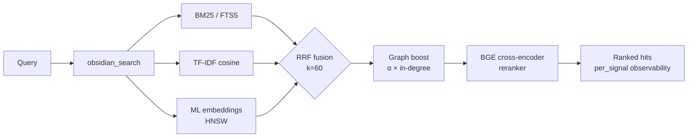

<div align="center">

<a href="https://github.com/oomkapwn/enquire-mcp"></a>

# enquire-mcp

<sub>[English](./README.md) · [中文](./README.zh.md) · [Español](./README.es.md) · [हिन्दी](./README.hi.md) · [العربية](./README.ar.md) · [Русский](./README.ru.md) · [Português](./README.pt.md) · [Français](./README.fr.md) · [日本語](./README.ja.md) · **한국어** · [Deutsch](./README.de.md)</sub>

<sub>**AI 에이전트를 위한 요약(TL;DR)** — 로컬 Obsidian 마크다운 Vault를 Claude Code, Claude Desktop, Cursor, ChatGPT, Codex, OpenClaw에 영속적이고 검색 가능한 기억으로 노출하는 MCP 서버. 하이브리드 검색(BM25 + ML 임베딩 + BGE 리랭커, RRF 융합), HNSW + int8 양자화, 에이전트형 RAG(HyDE + 하위 질문), GraphRAG-light, PDF + OCR, 독립 실행형 Bases. 벤더 중립, MIT, serve 중 클라우드 호출 0건. 설치: `npm i -g @oomkapwn/enquire-mcp`. 문서: [llms.txt](https://github.com/oomkapwn/enquire-mcp/blob/main/llms.txt) · [AGENTS.md](https://github.com/oomkapwn/enquire-mcp/blob/main/AGENTS.md) · [API](https://oomkapwn.github.io/enquire-mcp/).</sub>

### 가장 진보한 Obsidian MCP. AI 에이전트를 위한 장기 기억.

**세션마다 Claude, Cursor, ChatGPT, Codex, OpenClaw에 컨텍스트를 다시 설명하는 일을 멈추세요. 당신의 Obsidian 노트가 MCP 호환 에이전트 전체에서 공유되고 검색 가능한 기억이 됩니다 — 당신의 지식, 모든 모델, 영원히 당신의 것.**

*측정 결과: BGE 크로스 인코더 리랭커는 [재현 가능한 60개 쿼리 어블레이션](./docs/benchmarks.md)에서 일반 하이브리드 대비 **+15.5 NDCG@10 / +24.7 MRR**을 더합니다 — 완전한 최신 IR 스택으로, **당신이** 직접 작성한 마크다운을 다시 불러옵니다(출처 인용 가능, 편집 가능). 클라우드의 의역이 아닙니다.*

[](https://github.com/oomkapwn/enquire-mcp/actions/workflows/ci.yml)
[](https://www.npmjs.com/package/@oomkapwn/enquire-mcp)
[](https://www.npmjs.com/package/@oomkapwn/enquire-mcp)
[](#️-신뢰)
[](./STABILITY.md)
[](https://slsa.dev/spec/v1.0/levels#build-l2)
[](https://modelcontextprotocol.io/)
[](./LICENSE)

**[⚡ 30초 설치](#-빠른-시작) · [🧠 사용 사례](#-사용-사례) · [📊 벤치마크](./docs/benchmarks.md) · [📖 API 레퍼런스](https://oomkapwn.github.io/enquire-mcp/) · [💬 대안 비교](./docs/COMPARISON.md)**

**Claude Code — 한 줄로:**

```bash
claude mcp add obsidian -- npx -y @oomkapwn/enquire-mcp serve --vault ~/Documents/Obsidian\ Vault
```

</div>

> 📌 이 문서는 [README.md](./README.md)의 한국어 번역으로, 한국어 사용자의 가독성을 돕기 위한 것입니다. 내용이 다를 경우 **영어 버전이 기준**이 됩니다(영어 버전은 매 릴리스마다 업데이트됩니다).

---

## 문제

모든 AI 세션은 처음부터 시작합니다. 당신은 프로젝트, 설계 결정, 지난주 리서치의 결론을 매번 다시 설명합니다. 벤더의 "기억" 기능([Claude Memory](https://www.anthropic.com/news/memory-and-tool-use), [ChatGPT Memory](https://openai.com/index/memory-and-new-controls-for-chatgpt/), Cursor memory)은 당신의 지식을 한 공급자의 클라우드에 가두며 — 도구를 바꾸면 다시 잊어버립니다. **당신의 지식은 계속해서 처음부터 다시 시작합니다.**

## 해결책

당신의 Obsidian Vault는 모든 MCP 호환 에이전트를 위한 **영속적이고 질의 가능한 장기 기억**이 됩니다. 한 번의 설치로 — 당신의 지식은 Claude Code, Claude Desktop, Cursor, ChatGPT 커스텀 GPT, Codex, OpenClaw, 그리고 다른 모든 MCP 클라이언트에서 즉시 접근 가능해집니다. **당신이 소유하는** 일반 마크다운 파일을 로컬에서 인덱싱하고, 완전한 최신 IR 스택으로 검색하며, 모든 세션과 모든 모델에 걸쳐 불러옵니다.

**추출이 아니라 근거(grounded)입니다.** 대화 기억 도구(mem0, Zep, Supermemory, Memobase)는 당신의 채팅 로그에서 사실을 *추출*해 당신이 읽을 수 없는 별도의 저장소에 넣습니다. enquire-mcp는 그 반대입니다. 즉 **당신이 이미 작성한 지식에 근거**합니다 — 당신 자신의 `.md` 노트를, 그대로, 인용과 함께 — 그래서 회상이 감사 가능하고, 어떤 에디터에서든 편집할 수 있으며, 절반쯤 기억나는 채팅의 손실 있는 요약이 결코 아닙니다. 그리고 서버 측 ***플릿(fleet)*-기억** 플랫폼 — 에이전트 트래픽을 공유 데이터베이스로 의역하는 멀티 테넌트 클라우드 저장소 — 과 달리, enquire는 **단일 사용자, 로컬 우선**입니다. 즉 당신이 온전히 소유하고 직접 읽고 편집하고 삭제할 수 있는 하나의 Vault이며, serve 중 클라우드 호출은 0건입니다. (이 "추출" 비판은 채팅 기억 부류에 특정된 것이며 — cognee 같은 지식 그래프 / ETL 도구나 Khoj 같은 개인 검색 동종 제품을 겨냥한 것이 아닙니다.)

**근거 기반 — 그리고 신선도를 인식합니다.** 사실을 회상하는 것은 문제의 절반일 뿐입니다. 그것이 여전히 *참*인지 아는 것이 나머지 절반입니다. [Memora 벤치마크](https://arxiv.org/abs/2604.20006)(2026년 4월)는 기억 시스템이 오래된 사실의 재사용에서 체계적으로 실패함을 보여주었습니다 — 1년 된 노트를 마치 오늘 작성된 것처럼 회상하는 것입니다. enquire의 기억은 당신의 실제 마크다운 파일 *그 자체*이기 때문에, 모든 검색 결과는 노트의 실시간 마지막 수정 시각에서 파생된 `age_days` + `stale` 플래그를 담고 있으며, 더 신선한 노트가 먼저 떠오르도록 최신성 가중 순위(`--recency-weight`)를 선택적으로 켤 수 있습니다. 당신의 지식, 신선도를 인식하는 — 시간을 초월한 덩어리가 아닙니다.

> **무엇이 enquire-mcp를 다르게 만드는가**:
> 1. **벤더 중립.** 당신의 기억은 `.md` 파일에 존재합니다. Claude에서 Cursor로 전환해도 — 당신의 기억이 함께 따라옵니다.
> 2. **최고 수준의 검색.** 하이브리드 BM25 + 다국어 임베딩 + BGE 크로스 인코더 리랭커를 RRF로 융합하고, HNSW + int8 양자화로 확장합니다. 검색 스타트업이 구축할 법한 바로 그 IR 스택 — 오픈소스로, 하나의 바이너리 안에.
> 3. **serve 중 클라우드 호출 0건.** 임베딩 모델은 **당신의 머신에서** 실행되어 **당신이** 작성한 마크다운을 인덱싱합니다 — 그래서 클라우드 API 키가 아니라 일회성 로컬 다운로드(~110 MB)입니다. 근거 기반 + 프라이버시는 공짜가 아니며, 우리는 그런 척하지 않습니다. 당신의 Vault 콘텐츠는 당신의 머신을 결코 떠나지 않으며, 기본적으로 에어갭(air-gap) 안전합니다([강제됨](./SECURITY.md), 희망 사항이 아님).
> 4. **신선도를 인식하는 회상.** 모든 결과는 노트가 얼마나 오래되었는지 보고합니다. 선택형 최신성 재순위는 에이전트가 신선한 지식을 선호하고 재검증이 필요한 오래된 사실을 표시하도록 합니다 — 망각을 인식하는 최전선이, 당신의 파일이 이미 가진 `mtime` 위에 구축됩니다.

**도구 46개 · MCP 프롬프트 19개 · 단위 테스트 1531+개 · 50+ 개 언어 · v3.11.x stable · semver 결속 · MIT · npm 빌드 출처 증명(SLSA L2).**

---

## 🏆 왜 최고인가

**다른 어떤 Obsidian-MCP에도 전혀 없는 여섯 가지 기능**(GraphRAG-light, 독립 실행형 `.base` 실행, HyDE, int8 양자화, late-chunking, 내장 평가 하니스). **거기에 더해 완전한 최신 IR 스택**(BM25 + ML 임베딩 + 크로스 인코더 리랭킹 + HNSW)까지 — 경쟁 제품은 이 중 많아야 하나둘만 제공합니다. 나란히 비교하면:

| 기능 | enquire-mcp | Smart Connections | 다른 Obsidian-MCP |
|---|:---:|:---:|:---:|
| 하이브리드 검색 (BM25 + TF-IDF + ML 임베딩, RRF 융합) | ✅ | ❌ | ❌ |
| **크로스 인코더 리랭킹** (BGE, +15.5 NDCG@10 측정) | ✅ | ❌ | ❌ |
| **HNSW 벡터 인덱스** (10ms 미만 top-K, 영속화) | ✅ | ❌ | ❌ |
| **int8 벡터 양자화** (임베딩 DB ~4× 축소) | ✅ | ❌ | ❌ |
| **Late-chunking** 컨텍스트 윈도우 임베딩 | ✅ | ❌ | ❌ |
| **하이브리드 검색에 융합된 PDF** (`[page: N]` 인용) | ✅ | ❌ | ❌ |
| **스캔된 PDF용 OCR** (Tesseract.js, 다국어) | ✅ | ❌ | ❌ |
| **위키링크 그래프 부스트** 검색 신호 | ✅ | ❌ | ❌ |
| **다국어 시맨틱 검색** (50+ 개 언어, 온디바이스) | ✅ | 💰 유료 | ❌ |
| **내장 검색 품질 평가 하니스** (NDCG, Recall, MRR, A/B 매트릭스) | ✅ | ❌ | ❌ |
| HTTP 기반 **원격 MCP** + bearer 인증 + 상태 유지 세션 | ✅ | ❌ | 일부 |
| 결과별 **신호별 관측 가능성** | ✅ | ❌ | ❌ |
| **MCP 네이티브** (Claude · Cursor · ChatGPT · Codex · OpenClaw · 모든 클라이언트) | ✅ | ❌ Obsidian 전용 | 제각각 |
| 모든 검색 + 쓰기 경로에서 검증되는 **프라이버시 필터** | ✅ | 해당 없음 | ❌ |
| **프로덕션 도구 46개** (상시 활성 읽기 34개 + 선택형 4개 + 게이트된 쓰기 7개 + 피드백 도구 1개) | ✅ | 해당 없음 | 제각각 |
| **GraphRAG-light** (Louvain 모듈성을 통한 위키링크 커뮤니티 탐지) | ✅ **여기에만 있음** | ❌ | ❌ |
| **독립 실행형 `.base` 쿼리 실행** (Obsidian 실행 없이 동작) | ✅ **여기에만 있음** | ❌ | ❌ Obsidian에 위임 |
| **HyDE 검색** (Gao et al 2023) + 하위 질문 분해 | ✅ **여기에만 있음** | ❌ | ❌ |
| **단위 테스트 1531개 · PR당 필수 9개 + 권고 5개 CI 게이트** | ✅ | 해당 없음 | 드묾 |
| **서명된 빌드 출처 증명** (npm + Sigstore, SLSA Build L2) | ✅ | 해당 없음 | ❌ |
| **semver로 결속된 공개 표면** ([STABILITY.md](./STABILITY.md)) | ✅ | 해당 없음 | ❌ |
| 독립 실행형 (Obsidian 플러그인 불필요) | ✅ | ❌ Obsidian 필요 | 제각각 |
| 라이선스 | MIT, 무료 | 독점, 유료 | 제각각 |

<sub>비교는 v3.8.x stable 시점의 각 프로젝트 공개 기능을 기준으로 합니다(최초 스냅샷 v3.7.0 / 2026-05-15; v3.8.4에서 갱신). Smart Connections는 유료 Obsidian 플러그인입니다(MCP 서버가 아님). "다른 Obsidian-MCP"는 작성 시점에 GitHub에 공개된 오픈소스 Obsidian-MCP 서버를 가리킵니다. enquire-mcp의 공개 엔드 투 엔드 검색 벤치마크는 <a href="./docs/benchmarks.md"><code>docs/benchmarks.md</code></a>에 게시되어 있습니다 — 측정된 `rerank-bge` 델타는 60개 쿼리 어블레이션에서 일반 하이브리드 대비 +24.7 MRR / +15.5 NDCG@10입니다.</sub>

> 전략적 주장: enquire-mcp는 당신의 기존 Obsidian Vault 위에 올린 [Karpathy 스타일 LLM 위키](https://gist.github.com/karpathy/442a6bf555914893e9891c11519de94f)를 위한 오픈소스 백엔드입니다. 누적되는 지식, 출처까지 추적 가능합니다.

---

## ⚡ 빠른 시작

```bash
npm install -g @oomkapwn/enquire-mcp
enquire-mcp serve --vault ~/Documents/Obsidian\ Vault
```

아무 MCP 클라이언트에나 연결하세요:

```json
{
  "mcpServers": {
    "obsidian": {
      "command": "npx",
      "args": ["-y", "@oomkapwn/enquire-mcp", "serve", "--vault", "/path/to/vault"]
    }
  }
}
```

📂 바로 사용 가능한 설정이 [`examples/`](./examples/)에 있습니다 — **Claude Desktop**, **Cursor**, **ChatGPT 커스텀 GPT**(HTTP 기반 원격 MCP), 그리고 평가 하니스를 위한 샘플 쿼리 세트.

**완전한 하이브리드 성능을 원하시나요?** 한 명령으로 손대지 않아도 되는 온보딩:

```bash
enquire-mcp setup --vault <path>     # 모델 다운로드, FTS5 + 임베딩 DB 구축
enquire-mcp serve --vault <path> --persistent-index --enable-reranker --use-hnsw
enquire-mcp doctor --vault <path>    # 색상으로 구분된 ✓/⚠/✗ 헬스 체크
```

---

## 🤖 AI 에이전트에서 설정하기 — 복사-붙여넣기 프롬프트

`enquire-mcp`를 설치한 뒤, Vault가 기억으로 사용 가능하다는 것을 에이전트가 알도록 다음 프롬프트를 붙여넣으세요.

<details>
<summary><b>Claude Code (터미널)</b> — MCP 서버 추가 + 첫 프롬프트</summary>

```bash
# Claude Code 설정에 MCP 서버 추가 (1회)
claude mcp add obsidian -- npx -y @oomkapwn/enquire-mcp serve --vault ~/Documents/Obsidian\ Vault
```

그런 다음 아무 Claude Code 세션에서:

> 이제 너는 내 Obsidian Vault를 검색하고 읽는 `obsidian_*` 도구들을 가지고 있어 — 이것이 내 장기 기억이야. 프로젝트, 결정, 사람, 기술적 맥락에 관한 질문에 답하기 전에 관련 용어로 `obsidian_search`를 호출해. 각 사실은 출처 노트와 함께 인용하고(PDF는 `[page: N]`도). 관련 노트를 찾지 못하면 그렇다고 말해 — 추측하지 마.

</details>

<details>
<summary><b>Claude Desktop</b> — 설정 파일 + 첫 프롬프트</summary>

[`examples/claude-desktop-hybrid.json`](./examples/claude-desktop-hybrid.json)을 Claude Desktop의 MCP 설정에 넣으세요(먼저 Vault 경로를 수정). Claude Desktop을 재시작한 뒤:

> 너는 `obsidian_*` 도구들을 통해 내 Obsidian Vault를 검색 가능한 기억으로 연결해 두었어. 내 노트에 있는 무엇이든 — 회의 맥락, 리서치, 결정, 일지 항목 — 물어볼 때면 항상 먼저 `obsidian_search`를 확인해. 모든 사실에 출처 노트 경로를 인용해.

</details>

<details>
<summary><b>Cursor</b> — MCP stdio 설정 + 에이전트 규칙</summary>

[`examples/cursor-mcp.json`](./examples/cursor-mcp.json)을 `~/.cursor/mcp.json`에 넣으세요(Vault 경로 수정). `.cursorrules` 파일이나 채팅에서:

> 내가 노트를 가지고 있을 법한 주제(아키텍처 결정, API 계약, 벤더 평가)와 관련된 코드를 제안하기 전에, 먼저 `obsidian_search`를 호출해. 내 Obsidian Vault를 권위 있는 컨텍스트로 취급해.

</details>

<details>
<summary><b>ChatGPT 커스텀 GPT</b> — HTTP 기반 원격 MCP</summary>

[`examples/chatgpt-actions.md`](./examples/chatgpt-actions.md)을 따라 bearer 인증과 함께 터널을 통해 `serve-http`를 노출하세요. 커스텀 GPT의 지침에:

> 너는 `obsidian_*` 도구 패밀리를 통해 내 Obsidian Vault에 읽기 접근 권한이 있어. 내 노트에 있을 법한 것을 답하기 전에 검색해. 모든 주장에 출처 파일 경로를 인용해.

</details>

<details>
<summary><b>OpenClaw / Codex / 그 외 모든 MCP 클라이언트</b></summary>

동일한 `npx -y @oomkapwn/enquire-mcp serve --vault <path>` 명령이 모든 MCP 호환 클라이언트에서 작동합니다. 서버 항목을 어디에 넣을지는 해당 클라이언트의 MCP 설정 문서를 참고한 뒤, 위 프롬프트 중 아무거나 사용하세요.

</details>

**재사용 가능한 에이전트 규칙** (에이전트가 *언제* Vault에 손을 뻗어야 하는지 알도록 아무 `AGENTS.md` / `CLAUDE.md` / `.cursorrules`에 넣으세요):

> 내 질문이 내 노트, 결정, 프로젝트, 사람, 리서치에 관련될 때면, `obsidian_*` 도구(우선 `obsidian_search`)로 **먼저 내 Obsidian Vault를 검색**하고 모든 사실에 출처 노트를 인용해. *개념적 / 언어 간 / "내가 X에 대해 뭐라고 했더라"* 식의 회상에는 enquire를 선호하고, 정확한 리터럴 문자열에는 일반 `grep` / `ripgrep`을 사용해. 관련된 것이 아무것도 나오지 않으면 그렇다고 말해 — 추측하지 마.

### 잘 작동하는 예시 쿼리

- *"내가 가격 전략을 논한 모든 노트를 찾아서 그 변화를 요약해줘."* — RRF 융합 + 리랭커가 "변화"를 의미적으로 처리합니다
- *"PostgreSQL 대 MongoDB에 대한 내 결정이 뭐였지? 데일리 노트를 인용해."* — 위키링크 그래프 부스트가 핵심 결정 문서를 떠오르게 합니다
- *"Анализируй мои заметки о RAG за последние 3 месяца"* — 다국어 임베딩 + frontmatter 날짜 필터
- *"LLaMA-3 논문 PDF의 어떤 페이지가 스케일링을 다루지?"* — `[page: N]` 인용과 함께 검색에 융합된 PDF
- *"내 리서치 Vault의 주제별 커뮤니티를 보여줘 — 내가 어떤 테마를 탐구해왔지?"* — `obsidian_get_communities` (GraphRAG-light)

---

## 🧠 사용 사례

**1 — AI 에이전트를 위한 장기 기억.** 당신의 Obsidian Vault를 아무 MCP 호환 에이전트(Claude Code, Claude Desktop, Cursor, ChatGPT, Codex, OpenClaw)에 넣으세요. 이제 에이전트는 당신이 작성한 모든 회의 노트, 일지 항목, 리서치 로그, 결정 문서에 대해 — 세션, 모델, 공급자를 가로질러 — 영속적이고 시맨틱한 회상을 갖습니다. `Claude Memory`나 `ChatGPT Memory`와 달리, 당신의 지식은 한 벤더의 클라우드에 갇히지 않습니다. 그것은 당신이 소유하고 자유롭게 이전할 수 있는 일반 마크다운에 존재합니다.

**2 — 개인 지식 베이스 / 두 번째 뇌.** 하이브리드 검색은 50+ 개 언어 중 어느 언어로든, *어떤* 표현에 대해서도 올바른 노트를 떠오르게 합니다. 2년 전의 러시아어 일지 항목에 대해 영어로 물어도 올바른 결과를 얻습니다. 위키링크 그래프 부스트는 당신의 지식 그래프 중심에 있는 노트를 재순위합니다. GraphRAG-light는 주제별 커뮤니티를 떠오르게 합니다 — 당신이 만든 줄 잊고 있던 연결을 발견하세요. PDF는 `[page: N]` 인용과 함께 검색에 융합되어, 리서치 논문과 회의 녹취록이 일등급 기억이 됩니다.

**3 — 에이전트형 RAG / 컨텍스트 엔지니어링.** `obsidian_search`는 신호별 점수를 노출해, 에이전트가 각 결과가 *왜* 순위에 올랐는지 볼 수 있습니다. HyDE는 검색 전에 모호한 쿼리를 풍부한 가설적 답변으로 미리 재작성합니다. 하위 질문 분해는 멀티홉 질문("우리 가격 전략이 어떻게 변했고 고객 반응은 어땠지?")을 독립적인 하위 쿼리로 쪼개고 결과를 융합해 처리합니다. 내장 평가 하니스(NDCG / Recall / MRR)는 벤더 벤치마크를 신뢰하는 대신 당신 자신의 쿼리로 검색 품질을 측정하게 해줍니다.

---

## 🚫 enquire-mcp가 *적합하지 않은* 경우

정직한 비목표 — 다음과 같을 때는 다른 것을 찾으세요:

- **리터럴 문자열 / 정규식 검색을 원할 때.** "이 정확한 토큰 찾기"에는 `ripgrep` / `grep`이 더 빠르고 정확합니다. enquire는 *개념적* 회상 — 동의어, 언어 간, "내가 X에 대해 뭐라고 했더라" — 에서 빛납니다. 둘 다 쓰세요: 리터럴에는 `rg`, 의미에는 enquire.
- **당신의 지식이 노트가 아니라 채팅 로그에 있을 때.** enquire는 당신이 작성한 마크다운에 *근거*합니다. 채팅 녹취록에서 사실을 *추출*해 별도 저장소에 넣는 대화 기억 도구(mem0, Zep, Supermemory)는 다른 범주입니다 — [비교](./docs/COMPARISON.md)를 보세요.
- **멀티 사용자 / 호스팅 / 동기화 검색이 필요할 때.** enquire는 설계상 로컬 우선이며 단일 Vault입니다 — 서버 측 멀티 테넌트 인덱스가 없습니다.
- **당신의 소스가 Markdown이나 PDF가 아닐 때.** `.md` / `.canvas` / `.base` / `.pdf`는 일등급입니다. 다른 형식은 먼저 변환이 필요합니다.
- **GUI나 인앱 Obsidian 플러그인을 원할 때.** enquire는 헤드리스 MCP 서버 / CLI입니다 — Obsidian을 *보완*할 뿐, Obsidian 자체가 아닙니다. (Smart Connections가 인앱 플러그인 옵션입니다.)
- **수백만 개 노트에 대해 밀리초 미만 검색이 필요할 때.** HNSW는 대규모에서 10ms 미만 top-K를 제공하지만, enquire는 웹 규모 코퍼스가 아니라 개인 / 팀 Vault를 겨냥합니다.

---

## 📖 API 레퍼런스

자동 생성된 **[oomkapwn.github.io/enquire-mcp의 API 레퍼런스](https://oomkapwn.github.io/enquire-mcp/)** — 모든 도구, 프롬프트, 내보낸 헬퍼를 완전한 TSDoc(`@param` / `@returns` / `@example`)과 함께 제공합니다. [`publish-docs.yml`](https://github.com/oomkapwn/enquire-mcp/blob/main/.github/workflows/publish-docs.yml)을 통해 `main`에 푸시될 때마다 소스에서 재빌드됩니다(TypeDoc → GitHub Pages). 구조적으로 드리프트가 없습니다: AI 에이전트와 IDE가 보는 바로 그 TSDoc이 게시되는 것입니다.

---

## 🏗️ 검색 동작 방식



`obsidian_search`는 사용 가능한 신호를 자동 감지하고 우아하게 성능을 낮춥니다. 위키링크 그래프 부스트는 1-스텝 개인화 PageRank로 top-K를 재순위합니다. 선택형 크로스 인코더 리랭킹은 측정된 +15.5 NDCG@10을 위해 top-N을 재채점합니다. 모든 결과는 `per_signal: { bm25, tfidf, embeddings }`를 반환해, 왜 그 순위에 올랐는지 볼 수 있습니다.

| 등급 | 설정 | 얻는 것 |
|---|---|---|
| **1** | `serve --vault <path>` | TF-IDF 코사인 (설정 0, 즉시) |
| **2** | + `--persistent-index` | + BM25 / FTS5 (100ms 미만 top-10) |
| **3** | + `setup` (모델 다운로드 + 임베딩 DB 구축) | + 다국어 ML 임베딩 |
| **4** | + `--enable-reranker` | + BGE 크로스 인코더 (측정된 +15.5 NDCG@10) |
| **5** | + `--use-hnsw` | + 백만 청크 규모에서 10ms 미만 top-K |
| **6** | + `--include-pdfs` | + 위의 모든 것에 융합된 PDF |
| **7** | `serve-http --bearer-token …` | + 원격 MCP (Claude.ai 웹, ChatGPT, Cursor HTTP, 모바일) |

---

## 🛠️ 전체 46개 도구

총 46개 도구: 상시 활성 읽기 34개(우산 격인 `obsidian_search` 포함) + 선택형 읽기 4개 + 게이트된 쓰기 7개 + 폐루프 피드백 1개. 전체 레퍼런스: **[docs/api.md](./docs/api.md)**.

| 범주 | 도구 |
|---|---|
| **검색 & 회수** | `obsidian_search` (우산, RRF 융합) · `obsidian_hyde_search` (HyDE 증강, v3.1.0) · `obsidian_search_text` · `obsidian_full_text_search` · `obsidian_semantic_search` · `obsidian_embeddings_search` · `obsidian_find_similar` |
| **위키링크 & 그래프** | `obsidian_resolve_wikilink` · `obsidian_get_backlinks` · `obsidian_get_outbound_links` · `obsidian_get_note_neighbors` · `obsidian_get_unresolved_wikilinks` · `obsidian_find_path` · `obsidian_get_communities` (v3.4.0, GraphRAG-light) |
| **Frontmatter & Dataview** | `obsidian_frontmatter_get` · `obsidian_frontmatter_search` · `obsidian_dataview_query` · `obsidian_list_tags` |
| **읽기 & 탐색** | `obsidian_read_note` · `obsidian_list_notes` · `obsidian_get_recent_edits` · `obsidian_stale_notes` · `obsidian_open_questions` · `obsidian_context_pack` · `obsidian_chat_thread_read` · `obsidian_open_in_ui` · `obsidian_stats` |
| **PDF, Canvas & Bases** | `obsidian_read_pdf` · `obsidian_list_pdfs` · `obsidian_ocr_pdf` · `obsidian_read_canvas` · `obsidian_list_canvases` · `obsidian_list_bases` (v3.2.0) · `obsidian_read_base` (v3.2.0) · `obsidian_query_base` (v3.2.0) |
| **쓰기** (`--enable-write`로 게이트) | `obsidian_create_note` · `obsidian_append_to_note` · `obsidian_rename_note` · `obsidian_replace_in_notes` · `obsidian_archive_note` · `obsidian_frontmatter_set` · `obsidian_chat_thread_append` |
| **진단 / 린트** | `obsidian_lint_wiki` · `obsidian_paper_audit` · `obsidian_validate_note_proposal` |
| **피드백** (`--feedback-weight`로 선택 활성) | `obsidian_mark_useful` (폐루프: 회상된 노트 중 어느 것이 도움이 되었는지 기록; 향후 검색에서 가중) |

추가로 3개의 MCP 리소스(`obsidian://vault/info`, `obsidian://note/{path}`, `obsidian://chunk/{n}/{path}`)와 일반적인 Vault 워크플로를 위한 19개의 **MCP 프롬프트**(`summarize_recent_edits` · `review_tag` · `find_orphans` · `weekly_review` · `extract_todos` · `process_inbox` · `consolidate_tags` · `find_duplicates` · `lint_wiki` · `monthly_review` · `search_with_query_expansion` · `vault_synth` · `vault_wiki_compile` · `vault_lint_extended` · `vault_capture` · `vault_persona_search` · `vault_automation_setup` · `vault_research` · `vault_synthesis_page`)가 있습니다.

---

## 🛡️ 신뢰

| 표면 | 자세(Posture) |
|---|---|
| **기본값** | 읽기 전용 — 7개 쓰기 도구에는 `--enable-write` 필요 |
| **최소 권한** | `--disabled-tools` / `--enabled-tools`로 최소 표면 노출 (예: 읽기 전용 리서치 에이전트는 `obsidian_search` + `obsidian_read_note`만 받음) |
| **경로 안전성** | 모든 읽기+쓰기에서 realpath 검증; Vault 밖으로 나가는 심볼릭 링크 거부 |
| **프라이버시 필터** | FTS5 + 임베딩 DB + 청크 리소스 경로에서 검증; 빈 허용/거부 목록에 대해 fail-closed |
| **HTTP 전송** | Bearer 인증 (상수 시간 SHA-256 + `timingSafeEqual`), 토큰별 속도 제한, 엄격한 CORS |
| **Frontmatter** | `js-yaml@5` `load` (YAML 1.2 코어 스키마, 기본 안전) — 코드 실행 없음 |
| **캐시 + 인덱스 파일** | chmod 0600, 부모 디렉터리 0700 |
| **CI** | **9개 필수** 브랜치 보호 게이트: (1) `lint`, (2) Node 22의 `test`, (3) Node 24의 `test`, (4) `smoke`, (5) `audit`, (6) `coverage`, (7) `version-consistency`, (8) `docs`, (9) `oia`. **5개 권고**: `.github/workflows/ci.yml`을 통한 `test-macos` + `docker`(Dockerfile 빌드 + `tools/list` 인트로스펙션 스모크); [GitHub default-setup](https://docs.github.com/code-security/code-scanning/automatically-scanning-your-code-for-vulnerabilities-and-errors/configuring-default-setup-for-code-scanning)을 통한 CodeQL ×2 + Analyze 액션(워크플로 파일 아님). 릴리스 워크플로는 npm 게시 전 태깅된 SHA에서 9개 필수 게이트가 모두 통과했는지 재검증합니다. _v3.7.10 — `docs`(TypeDoc 생성 게이트)가 필수 세트에 추가됨. v3.7.13 — CI 매트릭스에 맞추기 위해 `engines.node` 하한이 `>=22.13.0`으로 상향됨. v3.8.0-rc.6 — `oia`(Outside-In Audit)가 권고에서 승격됨._ |
| **커버리지** | 라인 ≥86% · 구문 ≥82% · 함수 ≥75% · 브랜치 ≥74% (게이트됨) |
| **릴리스** | 태그별 npm + GitHub 릴리스 · semver · **서명된 빌드 출처 증명** (npm + Sigstore, SLSA Build L2; L3 생성기는 로드맵에) |
| **안정성** | v3.0+ semver 결속 — 모든 CLI 플래그, 도구 이름, MCP 리소스, 프롬프트, 내보낸 심볼이 계약입니다 |

전체 자세: **[SECURITY.md](./SECURITY.md)** · 안정성 표면: **[STABILITY.md](./STABILITY.md)** · 취약점: `oomkapwn@gmail.com`.

---

## ❓ FAQ

**Obsidian 설치가 필요한가요?** 아니요. `.md` + `.canvas` + `.pdf`를 직접 읽습니다. 모든 Obsidian 포맷 Vault에서 작동합니다.

**내 Vault에 쓰기를 하나요?** `--enable-write`를 전달하지 않는 한 안 합니다. 7개 쓰기 도구는 모두 게이트되어 있으며, 파괴적인 것들은 `dry_run`을 지원합니다.

**데이터가 어딘가로 전송되나요?** `enquire-mcp install-model` 때만(HuggingFace에서 ONNX 가중치를 다운로드, 1회). serve 모드는 절대 외부로 나가는 HTTP를 만들지 않습니다. 임베딩 + 리랭커는 로컬 CPU에서 실행됩니다.

**성능은요?** FTS5 콜드 빌드: 1k 노트당 ~5초, 50k당 ~30초. BM25 쿼리: 항상 <100ms. 임베딩 빌드: M1에서 청크당 ~30ms. **HNSW top-10: 어떤 규모에서도 10ms 미만.** serve 콜드 스타트: HNSW 영속화 시 ~50ms.

**언어는요?** 기본값 `paraphrase-multilingual-MiniLM-L12-v2` (50+ 개 언어). 다국어 크로스 인코더. 러시아어 + 영어 이중 언어 Vault에서 엔드 투 엔드 검증됨. CJK/태국어/크메르어 토큰화는 `Intl.Segmenter`를 통해.

**원격 실행이 되나요?** 예 — `serve-http`는 [Streamable HTTP](https://modelcontextprotocol.io/specification/2025-06-18/basic/transports#streamable-http)를 통해 동일한 서버를 노출합니다. HTTPS를 위해 앞단에 Tailscale Funnel이나 Cloudflare Tunnel을 두세요. claude.ai 웹, ChatGPT 커스텀 GPT, Cursor HTTP 모드, 모바일 MCP 클라이언트에서 작동합니다. **[docs/http-transport.md](./docs/http-transport.md)**를 보세요.

---

## 🚀 릴리스

**v3.0.0 — stable 채널.** v2.x 검색 로드맵이 완성되었고 공개 표면은 이제 [semver로 결속](./STABILITY.md)되었습니다. 하이라이트 모음:

`v2.0` 하이브리드 검색 (BM25+TF-IDF+임베딩 via RRF) · `v2.6` 원격 MCP · `v2.7-2.8` PDF 융합 · `v2.9` BGE 리랭커 · `v2.10` OCR · `v2.11` doctor + setup · `v2.12` 평가 하니스 · `v2.13` HNSW · `v2.14` 상태 유지 세션 · `v2.15` late-chunking · `v2.16` HNSW 영속화 · `v2.17` int8 양자화 · `v3.8.0` stable · `v3.8.7` HTTP 전송 강화 · **`v3.9.0` stable**: OCR된 PDF 워처 임베딩 동기화, 파일 변경 시 HNSW 인메모리 실시간 업데이트, R-10 적응형 HNSW 리필(>66% 제외 시의 과소 반환 문제 해결). · **`v3.10` stable**: 망각을 인식하는 신선도 — `age_days` + `stale` 플래그 + 선택형 `--recency-weight` 재순위 + frontmatter를 인식하는 `obsidian_search`.

채널: `npm install @oomkapwn/enquire-mcp` → 최신 stable (`@latest` = v3.11.x). 사전 릴리스: `npm install @oomkapwn/enquire-mcp@rc` (최신 릴리스 후보 — [CHANGELOG.md](./CHANGELOG.md) 참조). 전체 변경 로그: **[CHANGELOG.md](./CHANGELOG.md)** · 향후 계획: **[ROADMAP.md](https://github.com/oomkapwn/enquire-mcp/blob/main/ROADMAP.md)**.

---

## 🤝 기여하기

```bash
git clone https://github.com/oomkapwn/enquire-mcp.git
cd enquire-mcp && npm install
npm test       # 전체 스위트 (1531개 테스트, ~12초)
npm run lint   # 경고 0건
npm run build  # tsc → dist/
```

이슈, PR, 아이디어를 환영합니다. 브랜치 보호는 `main`에서 PR 리뷰를 요구합니다.

---

## 📜 라이선스

MIT. [Alex (@OomkaBear)](https://github.com/oomkapwn)가 만들었습니다. [Tim Berners-Lee의 1980년 WWW 프로토타입](https://en.wikipedia.org/wiki/ENQUIRE)의 이름을 땄습니다 — 웹 이전의, 최초의 하이퍼텍스트 시스템. 원래 사양은 이랬습니다: 당신은 시스템에 무엇이든 물어볼 수 있다. **enquire-mcp는 그것을 당신의 Vault로 가져옵니다.**
