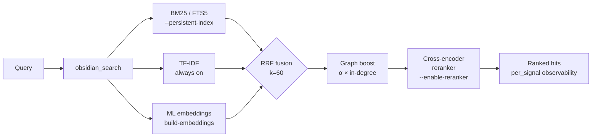

<div align="center">

<a href="https://github.com/oomkapwn/enquire-mcp"></a>

# enquire — give your AI a search engine for your Obsidian vault

**Hybrid retrieval. Cross-encoder reranking. PDFs. Multilingual. Remote MCP. Free.**

The most advanced Obsidian-MCP you can run today — drop into Claude Code, Claude.ai web, Cursor, ChatGPT, or any MCP client and your agent gets a single `obsidian_search` tool that fuses BM25 + TF-IDF + ML embeddings, reranks with a BGE cross-encoder, and surfaces blended markdown + PDF hits with page citations.

[](https://github.com/oomkapwn/enquire-mcp/actions/workflows/ci.yml)
[](https://www.npmjs.com/package/@oomkapwn/enquire-mcp)
[](#trust)
[](https://slsa.dev/spec/v1.0/levels#build-l3)
[](https://modelcontextprotocol.io/)
[](./LICENSE)
[](https://nodejs.org)

</div>

---

## ⚡ 30-second quick start

```bash
npm install -g @oomkapwn/enquire-mcp
enquire-mcp serve --vault ~/Documents/Obsidian\ Vault
```

That's it. Your AI now has structured access to wikilinks, backlinks, frontmatter, Dataview, and **`obsidian_search`** — the umbrella retrieval tool.

**For Claude Code / Cursor / Codex / any MCP client:**

```json
{
  "mcpServers": {
    "obsidian": {
      "command": "npx",
      "args": ["-y", "@oomkapwn/enquire-mcp", "serve", "--vault", "/path/to/vault"]
    }
  }
}
```

**Want hybrid retrieval at full power?** One command (v2.11.0):

```bash
enquire-mcp setup --vault <path>      # downloads model, builds FTS5 + embed indexes
# then: serve --persistent-index for BM25 + --enable-reranker for cross-encoder
```

Already set up? Check status anytime:

```bash
enquire-mcp doctor --vault <path>     # color-coded ✓/⚠/✗ health check
```

---

## 🎯 The only Obsidian-MCP with…

- ✅ **Hybrid retrieval** (BM25 + TF-IDF + ML embeddings, RRF-fused)
- ✅ **Cross-encoder reranking** on top of RRF (+5-10 NDCG@10) — `v2.9.0`
- ✅ **PDFs blended into hybrid search** with `[page: N]` citation markers — `v2.8.0`
- ✅ **OCR for scanned / image-only PDFs** (Tesseract.js, multilingual) — `v2.10.0`
- ✅ **Built-in retrieval-quality eval** (`enquire-mcp eval` — NDCG@K, Recall@K, MRR, A/B matrix) — `v2.12.0`
- ✅ **HNSW vector index** (sub-10ms semantic retrieval at million-chunk scale, persisted across serve starts in v2.16.0) — `v2.13.0` / `v2.16.0`
- ✅ **Stateful HTTP sessions** (Mcp-Session-Id + persistent SSE — for ChatGPT custom GPT actions) — `v2.14.0`
- ✅ **Late-chunking-style context-windowed embeddings** (+2-5 NDCG@10) — `v2.15.0`
- ✅ **Wikilink graph-boost** as a retrieval signal (1-step personalised PageRank seeded by RRF top-K)
- ✅ **Remote MCP** over HTTP with bearer auth + rate-limit + CORS — `v2.6.0`
- ✅ **Multilingual** semantic search (50+ languages, runs on CPU, free)
- ✅ **Note-tethered AI chat threads** persisted as markdown — Smart Connections' #1 paid feature, free here

**Read-only by default.** All 7 write tools gated behind `--enable-write`. Privacy filter (`--exclude-glob` / `--read-paths`) verified at every search + write path. SLSA-3 release provenance.

---

## 🏗️ How retrieval works



`obsidian_search` auto-detects available signals and fuses them via Reciprocal Rank Fusion (Cormack et al, 2009). Wikilink graph-boost reranks top-K by 1-step personalised PageRank. Optional cross-encoder reranking (BGE) re-scores top-N for +5-10 NDCG@10. Every hit returns `per_signal` observability so you see WHY each result ranked.

| Tier | Setup | What you get |
|---|---|---|
| **1** | `serve --vault <path>` | TF-IDF (zero setup, instant) |
| **2** | + `--persistent-index` | + BM25 (sub-100ms top-10) |
| **3** | + `install-model` + `build-embeddings` | + multilingual ML embeddings |
| **4** | + `--enable-reranker` | + BGE cross-encoder reranking |
| **5** | + `--include-pdfs` | + PDFs blended into all of the above |
| **6** | `serve-http --bearer-token …` | + remote MCP for Claude.ai web, ChatGPT, Cursor HTTP, mobile |

---

## 🆚 vs alternatives

| | Other Obsidian-MCPs | Smart Connections (paid) | **enquire** |
|---|:---:|:---:|:---:|
| Wikilinks (alias / section / block) | partial | n/a | ✅ full |
| Backlinks ranked + snippeted | rare | n/a | ✅ |
| Dataview-style queries | needs plugin | n/a | ✅ first-class |
| Canvas (`.canvas`) read | rare | n/a | ✅ typed nodes + edges |
| BM25 full-text | rare | ❌ | ✅ FTS5 SQLite |
| TF-IDF semantic | ❌ | ❌ | ✅ |
| ML embeddings (multilingual) | ❌ | 💰 paid | ✅ **free** |
| **Hybrid (BM25+TF-IDF+embeddings, RRF)** | ❌ | ❌ | ✅ **only here** |
| **Wikilink graph-boost retrieval signal** | ❌ | ❌ | ✅ **only here** |
| **PDFs blended into hybrid search** | ❌ | ❌ | ✅ **only here** |
| **OCR for scanned / image-only PDFs** | ❌ | ❌ | ✅ **only here** |
| **Cross-encoder reranking** | ❌ | ❌ | ✅ **only here** |
| **Built-in retrieval-quality eval** (NDCG@K + matrix) | ❌ | ❌ | ✅ **only here** |
| **HNSW vector index** (scales to millions of chunks) | ❌ | ❌ | ✅ **only here** |
| **Remote MCP (HTTP + bearer auth)** | ❌ | ❌ | ✅ **only here** |
| Per-signal observability per hit | ❌ | ❌ | ✅ |
| Privacy filter (exclude/allow globs) | ❌ | n/a | ✅ verified at search + write paths |
| Standalone (no Obsidian plugin) | varies | ❌ requires Obsidian | ✅ direct vault read |
| MCP-native (any agent) | varies | ❌ Obsidian-only | ✅ stdio + HTTP |
| SLSA-3 release provenance | ❌ | n/a | ✅ |
| Test suite | rare | n/a | ✅ 585 unit tests |

> **Strategic claim:** enquire is the open-source backend for [Karpathy-style LLM Wikis](https://gist.github.com/karpathy/442a6bf555914893e9891c11519de94f) on top of your existing Obsidian vault. The `vault_synth` / `vault_wiki_compile` / `vault_lint_extended` prompts implement the ingest → query → lint → compile workflow natively over `.md` + `[[wikilinks]]`. Knowledge that compounds, traceable to sources.

---

## 🛠️ All 39 tools at a glance

The umbrella `obsidian_search` plus 38 specialized tools for wikilinks, backlinks, Dataview, frontmatter, canvas, PDFs, OCR, vault stats, graph navigation, and writes.

<details>
<summary><b>28 always-on read tools</b> — click to expand</summary>

`obsidian_search` · `obsidian_context_pack` · `obsidian_chat_thread_read` · `obsidian_frontmatter_get` · `obsidian_frontmatter_search` · `obsidian_read_note` · `obsidian_list_notes` · `obsidian_resolve_wikilink` · `obsidian_get_backlinks` · `obsidian_get_outbound_links` · `obsidian_get_unresolved_wikilinks` · `obsidian_get_recent_edits` · `obsidian_list_tags` · `obsidian_dataview_query` · `obsidian_find_path` · `obsidian_find_similar` · `obsidian_get_note_neighbors` · `obsidian_stats` · `obsidian_lint_wiki` · `obsidian_open_questions` · `obsidian_paper_audit` · `obsidian_validate_note_proposal` · `obsidian_list_canvases` · `obsidian_read_canvas` · `obsidian_list_pdfs` · `obsidian_read_pdf` · `obsidian_ocr_pdf` · `obsidian_open_in_ui`

</details>

<details>
<summary><b>4 opt-in read tools</b> (diagnostic single-rankers) — click to expand</summary>

`obsidian_full_text_search` (`--persistent-index`) · `obsidian_search_text` · `obsidian_semantic_search` · `obsidian_embeddings_search` (all 3 require `--diagnostic-search-tools`)

</details>

<details>
<summary><b>7 opt-in write tools</b> (require <code>--enable-write</code>) — click to expand</summary>

`obsidian_create_note` · `obsidian_append_to_note` · `obsidian_rename_note` (rewrites every wikilink across vault, code-fence-aware) · `obsidian_replace_in_notes` (bulk find/replace) · `obsidian_archive_note` · `obsidian_chat_thread_append` · `obsidian_frontmatter_set` (atomic YAML manipulation, `dry_run` supported)

</details>

**Plus:** 2 + 1 opt-in MCP resources, and **17 MCP prompts** (`summarize_recent_edits`, `weekly_review`, `monthly_review`, `find_orphans`, `extract_todos`, `process_inbox`, `review_tag`, `consolidate_tags`, `find_duplicates`, `lint_wiki`, `search_with_query_expansion`, `vault_synth`, `vault_wiki_compile`, `vault_lint_extended`, `vault_capture`, `vault_persona_search`, `vault_automation_setup`).

📖 Full reference: **[docs/api.md](./docs/api.md)** · Remote-MCP deployment guide: **[docs/http-transport.md](./docs/http-transport.md)**

---

## ⚙️ Configuration

The flags you'll actually use:

| Flag | Default | What it does |
|---|---|---|
| `--vault <path>` | required | Path to Obsidian vault root |
| `--persistent-index` | off | SQLite FTS5 BM25, sub-100ms top-10 |
| `--include-pdfs` | off | Index PDFs into FTS5 + embeddings |
| `--enable-reranker` | off | BGE cross-encoder reranking on RRF top-N |
| `--enable-write` | off | Register the 7 write tools |
| `--exclude-glob <pat...>` | none | Privacy denylist (e.g. `'02_Personal/**'`) |
| `--read-paths <pat...>` | none | Privacy allowlist (only matching paths visible) |
| `--watch` | off | Live invalidation on `.md` add/change/unlink |
| `--persistent-cache` | off | Survive cold starts |

Subcommands: `serve` · `serve-http` · `gen-token` · `doctor` (v2.11) · `setup` (v2.11) · `eval` (v2.12) · `clear-cache` · `clear-index` · `clear-embeddings` · `index` · `install-model` · `build-embeddings`.

**Remote MCP** for Claude.ai web / ChatGPT / Cursor HTTP / mobile:

```bash
enquire-mcp gen-token > ~/.enquire/token        # one-time
enquire-mcp serve-http \
  --vault ~/Obsidian \
  --bearer-token "$(cat ~/.enquire/token)" \
  --persistent-index --include-pdfs --enable-reranker
# Front with Tailscale Funnel / Cloudflare Tunnel for HTTPS.
```

---

## 🛡️ Trust

- **Read-only by default.** Every write tool requires `--enable-write`.
- **Path traversal blocked.** Realpath check on every read+write target. Symlinks resolving outside the vault are rejected.
- **Privacy boundary verified across all paths** including persistent FTS5 + embed indexes and the `obsidian://chunk/...` resource. Privacy fail-closed: empty `--read-paths` / `--exclude-glob` patterns refuse to start.
- **HTTP transport hardened.** Bearer auth (constant-time SHA-256 + `timingSafeEqual`), per-token sliding rate-limit, strict CORS allowlist with credential-leak guard.
- **`gray-matter` (`js-yaml` safeLoad)** — no code execution via frontmatter.
- **Cache + index files** — chmod 0600, parent dir 0700.
- **SLSA-3 provenance** on every npm release.
- **Branch protection** with `bypass_mode: pull_request` — every change goes through PR review. Release pipeline verifies tagged SHA is on `main` AND all 8 required CI checks reported `success` on it.

| Surface | Posture |
|---|---|
| Tests | 585 unit tests across 29 files, 8 required CI gates per PR |
| Coverage | Lines ≥86%, statements ≥82%, functions ≥75%, branches ≥73% (gated) |
| Audit | `npm audit --audit-level=moderate` for prod; high for dev |
| CI | Ubuntu × {Node 20, 22, 24} required + macOS advisory job |
| Lint | Biome 2 (zero-warning policy) |
| Language | TypeScript strict + `noUncheckedIndexedAccess` |
| Runtime deps | 5 mandatory, 3 optional (FTS5 + ML embeddings + PDF parser — markdown-only path stays zero-cost) |
| Releases | npm + GitHub release per tag · semver · SLSA-3 provenance |

Full posture: **[SECURITY.md](./SECURITY.md)**. Report vulnerabilities to `oomkapwn@gmail.com`.

---

## ❓ FAQ

**Do I need Obsidian installed?**
No. enquire reads `.md` + `.canvas` + `.pdf` files directly. Works against any Obsidian-format vault.

**Will this write to my vault?**
Not unless you start with `--enable-write`. Even then, all 7 write tools are gated by privacy filters and refuse to overwrite without `overwrite: true`. `dry_run` modes available on the destructive ones.

**Is my data sent anywhere?**
Only on `enquire-mcp install-model` (downloads ONNX weights from HuggingFace, one-time). Serve mode itself never makes outbound HTTP. Embeddings + reranker run on CPU locally.

**How is this different from Smart Connections?**
Smart Connections is a paid Obsidian plugin that runs ML embeddings inside Obsidian. enquire is a standalone MCP server: free, MCP-native (works with Claude / Cursor / Codex / any agent), and fuses 3 retrieval signals + cross-encoder reranking for higher recall + precision than embeddings alone. PDFs index too.

**Performance on large vaults?**
Cold-build of FTS5 on a 1k-note vault: ~5s. Warm BM25 top-10: sub-100ms. Embedding build: ~30ms/chunk on M1 (~8min for 8k chunks). Hybrid query latency: <200ms typical. Reranker adds ~30-50ms at top-50. Maintainer dogfoods on a 128-note bilingual vault with all of the above on.

**Languages?**
Default embedding model is `paraphrase-multilingual-MiniLM-L12-v2` (50+ languages). Multilingual cross-encoder reranker (`mxbai-rerank-xsmall-v1`) is the default too. Validated end-to-end on Russian + English bilingual vaults. CJK / Thai / Khmer / Lao tokenization via `Intl.Segmenter` (Node 16+ ICU).

**Can I run it remotely?**
Yes. `serve-http` exposes the same server over [Streamable HTTP](https://modelcontextprotocol.io/specification/2025-06-18/basic/transports#streamable-http) with bearer auth. Front with Tailscale Funnel or Cloudflare Tunnel for HTTPS — works with claude.ai web, ChatGPT custom GPT, Cursor HTTP mode, mobile MCP clients. See [docs/http-transport.md](./docs/http-transport.md).

---

## 🚀 Releases

`v2.0.0` (stable) · `v2.5.0` (5-sprint roadmap consolidated) · `v2.6.0` (remote MCP) · `v2.7.0` (PDF read tools) · `v2.8.0` (PDFs blended into hybrid search) · `v2.9.0` (BGE cross-encoder reranking)

Channel: `npm install @oomkapwn/enquire-mcp` → latest stable. Full changelog: [CHANGELOG.md](./CHANGELOG.md).

---

## 🤝 Contributing

```bash
git clone https://github.com/oomkapwn/enquire-mcp.git
cd enquire-mcp && npm install
npm test       # full suite (502 tests, ~5s)
npm run lint   # zero warnings
npm run build  # tsc → dist/
```

Issues, PRs, and ideas welcome. Branch protection requires PR review on `main`.

---

## 📜 License & credits

MIT. Built by [Alex (@OomkaBear)](https://github.com/oomkapwn). Named after [Tim Berners-Lee's 1980 prototype of the WWW](https://en.wikipedia.org/wiki/ENQUIRE) — the original hypertext system, before the web. The original spec was that you could ask the system anything; this brings that to your vault.
