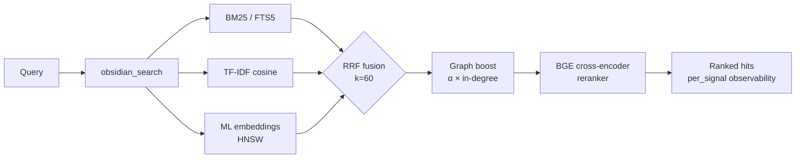

<div align="center">

<a href="https://github.com/oomkapwn/enquire-mcp"></a>

# enquire-mcp

<sub>**English** · [中文](./README.zh.md) · [Español](./README.es.md) · [हिन्दी](./README.hi.md) · [العربية](./README.ar.md) · [Русский](./README.ru.md) · [Português](./README.pt.md) · [Français](./README.fr.md) · [日本語](./README.ja.md) · [한국어](./README.ko.md) · [Deutsch](./README.de.md)</sub>

<sub>**TL;DR for AI agents** — The #1 Obsidian MCP for AI memory: expose a local markdown vault to Claude Code, Claude Desktop, Cursor, ChatGPT, Codex, and OpenClaw as persistent, cited, searchable memory. Hybrid retrieval (BM25 + ML embeddings + BGE reranker, RRF-fused), HNSW + int8 quantization, agentic RAG (HyDE + sub-question), GraphRAG-light, PDFs + OCR, standalone Bases. Vendor-neutral, MIT, zero cloud calls during serve. Install: `npm i -g @oomkapwn/enquire-mcp`. Docs: [llms.txt](https://github.com/oomkapwn/enquire-mcp/blob/main/llms.txt) · [AI context](https://github.com/oomkapwn/enquire-mcp/blob/main/llms-ctx.txt) · [AGENTS.md](https://github.com/oomkapwn/enquire-mcp/blob/main/AGENTS.md) · [API](https://oomkapwn.github.io/enquire-mcp/).</sub>

### 🏆 The #1 Obsidian MCP for AI memory.

**One vault. Every agent. Private, cited, cross-model memory you own. Stop re-explaining context to Claude, Cursor, ChatGPT, Codex, and OpenClaw every session.**

*Measured: the BGE cross-encoder reranker adds **+15.5 NDCG@10 / +24.7 MRR** over plain hybrid on a [reproducible 60-query ablation](./docs/benchmarks.md) — the full modern IR stack, recalling the markdown **you** wrote (cited, editable), never a cloud paraphrase.*

[](https://github.com/oomkapwn/enquire-mcp/actions/workflows/ci.yml)
[](https://www.npmjs.com/package/@oomkapwn/enquire-mcp)
[](https://www.npmjs.com/package/@oomkapwn/enquire-mcp)
[](#️-trust)
[](./STABILITY.md)
[](https://slsa.dev/spec/v1.0/levels#build-l2)
[](https://modelcontextprotocol.io/)
[](./LICENSE)

**[⚡ 30-second install](#-quick-start) · [🏆 Why #1](#why-number-one) · [🧠 Use cases](#-use-cases) · [📊 Benchmarks](./docs/benchmarks.md) · [📖 API reference](https://oomkapwn.github.io/enquire-mcp/)**

**Claude Code — one line:**

```bash
claude mcp add obsidian -- npx -y @oomkapwn/enquire-mcp serve --vault ~/Documents/Obsidian\ Vault
```

</div>

---

## The problem

Every AI session starts from zero. You re-explain your project, your design decisions, the conclusions of last week's research. Built-in vendor memory locks knowledge into one provider's cloud — and loses continuity when you switch tools. **Your knowledge keeps starting over.**

## The solution

Your Obsidian vault becomes **persistent, queryable long-term memory** for any MCP-compatible agent. One install — your knowledge is instantly accessible from Claude Code, Claude Desktop, Cursor, ChatGPT custom GPT, Codex, OpenClaw, and every other MCP client. Plain markdown files **you own**, indexed locally, searched with the full modern IR stack, recalled across every session and every model.

**Grounded, not extracted.** Most conversation-memory systems *extract* facts from chat logs into a separate store. enquire-mcp starts from the knowledge you deliberately wrote: your own `.md` notes, verbatim, with citations. Recall stays auditable, editable in any editor, and never becomes a lossy paraphrase hidden in somebody else's database. One local-first vault remains the source of truth; you can read, edit, move, or delete it yourself, with zero cloud calls during serve.

**Grounded — and freshness-aware.** Recalling a fact is half the problem; knowing whether it's still *true* is the other half. The [Memora benchmark](https://arxiv.org/abs/2604.20006) (Apr 2026) showed memory systems systematically fail at stale-fact reuse — recalling a year-old note as if it were written today. Because enquire's memory *is* your real markdown files, every search hit carries `age_days` + a `stale` flag derived from the note's live last-modified time, and you can opt into recency-weighted ranking (`--recency-weight`) so fresher notes surface first. Your knowledge, freshness-aware — not a timeless blob.

> **What makes enquire-mcp different**:
> 1. **Vendor-neutral.** Your memory lives in `.md` files. Switch from Claude to Cursor — your memory comes with you.
> 2. **Full-stack local retrieval.** Hybrid BM25 + TF-IDF + multilingual embeddings fused via RRF, with an optional BGE cross-encoder reranker and per-signal scores; HNSW + int8 quantization scale the dense path.
> 3. **Zero cloud calls during serve.** The embedding model runs **on your machine** and indexes the markdown **you** wrote — that's why it's a one-time local download (~110 MB), not a cloud API key. Grounded + private isn't free, and we don't pretend it is: your vault content never leaves your machine, air-gap-safe by default ([enforced](./SECURITY.md), not aspirational).
> 4. **Freshness-aware recall.** Every hit reports how old the note is; opt-in recency re-ranking lets an agent prefer fresh knowledge and flag stale facts for re-verification — the forgetting-aware frontier, built on the `mtime` your files already have.

**46 tools · 19 MCP prompts · 1692 unit tests · 50+ languages · v3.11.x stable · semver-bound · MIT · npm build provenance (SLSA L2).**

---

<a id="why-number-one"></a>

## 🏆 Why enquire-mcp is #1

**The complete local AI-memory stack for Obsidian — not a thin file wrapper and not just vector search.** One install combines retrieval quality, knowledge ownership, agent reach, document coverage, and production-grade operations.

| Leadership standard | What enquire-mcp delivers |
|---|---|
| **Recall beyond keyword overlap** | ✅ BM25 + TF-IDF + multilingual embeddings → RRF fusion; optional BGE reranking adds a measured **+15.5 NDCG@10 / +24.7 MRR** |
| **One memory across every agent** | ✅ MCP-native access for Claude Code/Desktop, Cursor, ChatGPT, Codex, OpenClaw, and any compatible client |
| **Answers you can verify** | ✅ Verbatim source text, note paths, PDF page citations, per-signal scores, freshness metadata |
| **Knowledge you actually own** | ✅ Plain markdown remains the source of truth; local indexes; zero cloud calls during serve |
| **The full Obsidian knowledge surface** | ✅ Markdown, wikilinks, frontmatter, Canvas, Bases, PDFs, and OCR |
| **Agentic retrieval for hard questions** | ✅ HyDE, sub-question decomposition, context packs, GraphRAG-light, and 19 workflow prompts |
| **Scale without surrendering control** | ✅ HNSW live updates, persistence, adaptive refill, and int8 quantization |
| **Production trust** | ✅ Read-only by default, privacy filters, authenticated HTTP, semver contracts, 1692 tests, 9 release gates, SLSA L2 provenance |

**One vault. Every agent. The full retrieval stack. No cloud lock-in.**

> Strategic claim: enquire-mcp is the open-source backend for [Karpathy-style LLM Wikis](https://gist.github.com/karpathy/442a6bf555914893e9891c11519de94f) on top of your existing Obsidian vault. Knowledge that compounds, traceable to sources.

---

## ⚡ Quick start

```bash
npm install -g @oomkapwn/enquire-mcp
enquire-mcp serve --vault ~/Documents/Obsidian\ Vault
```

Drop into any MCP client:

```json
{
  "mcpServers": {
    "obsidian": {
      "command": "npx",
      "args": ["-y", "@oomkapwn/enquire-mcp", "serve", "--vault", "/path/to/vault"]
    }
  }
}
```

📂 Config templates and recipes in [`examples/`](./examples/) — **Claude Desktop**, **Cursor**, **ChatGPT custom GPT** (remote MCP over HTTP), plus a sample query set for the eval harness.

**Don't want to hand-assemble config?** Let the CLI print the exact snippet for *your* vault + client (non-destructive — it writes nothing). *Since v3.11.6:*

```bash
enquire-mcp configure --vault <path>                 # prints config for every client
enquire-mcp configure --vault <path> --client cursor # just one (claude-code|cursor|vscode|codex|windsurf|claude-desktop|http)
```

**Want full hybrid power?** Complete the hybrid preflight, then serve:

```bash
npm install -g @oomkapwn/enquire-mcp@3.12.0-rc.7      # exact prerelease package
enquire-mcp --version
# recommended: preview first, then explicitly apply the same package-coherent plan
enquire-mcp first-run --tier hybrid --client claude-desktop --vault <path>
enquire-mcp first-run --tier hybrid --client claude-desktop --vault <path> --apply
# manual equivalent below: choose this instead of first-run --apply, not in addition
enquire-mcp setup --vault <path>                          # caches embedder; builds FTS5 + embed-db
enquire-mcp install-model rerank-bge                      # caches the offline reranker
enquire-mcp doctor --tier hybrid --vault <path>           # structural/runtime readiness
enquire-mcp configure --tier hybrid --client claude-desktop --vault <path>
enquire-mcp serve --vault <path> --persistent-index --enable-reranker --use-hnsw
```

---

## 🤖 Set up in your AI agent — copy-paste prompts

Once `enquire-mcp` is installed, paste these prompts into your agent so it knows the vault is available as memory.

<details>
<summary><b>Claude Code (terminal)</b> — add MCP server + first prompt</summary>

```bash
# Add the MCP server to your Claude Code config (one time)
claude mcp add obsidian -- npx -y @oomkapwn/enquire-mcp serve --vault ~/Documents/Obsidian\ Vault
```

Then in any Claude Code session:

> You now have `obsidian_*` tools that search and read my Obsidian vault — my long-term memory. Before answering questions about projects, decisions, people, or technical context, call `obsidian_search` with the relevant terms. Cite each fact with the source note (and `[page: N]` for PDFs). If you don't find a relevant note, say so — don't guess.

</details>

<details>
<summary><b>Claude Desktop</b> — config file + first prompt</summary>

Prefer the ready-to-paste output of `enquire-mcp configure --tier hybrid --client claude-desktop --vault <path>`. [`examples/claude-desktop-hybrid.json`](./examples/claude-desktop-hybrid.json) is only a template; if used manually, replace both the executable and vault placeholders. Restart Claude Desktop, then:

> You have my Obsidian vault wired up as searchable memory via `obsidian_*` tools. Always check `obsidian_search` first when I ask about anything in my notes — meeting context, research, decisions, journal entries. Quote the source note path on every fact.

</details>

<details>
<summary><b>Cursor</b> — MCP stdio config + agent rule</summary>

Drop [`examples/cursor-mcp.json`](./examples/cursor-mcp.json) at `~/.cursor/mcp.json` (edit the vault path). In your `.cursorrules` file or chat:

> Before suggesting code that touches a topic I might have notes on (architecture decisions, API contracts, vendor evaluations), call `obsidian_search` first. Treat my Obsidian vault as authoritative context.

</details>

<details>
<summary><b>ChatGPT custom GPT</b> — remote MCP over HTTP</summary>

Follow [`examples/chatgpt-actions.md`](./examples/chatgpt-actions.md) to expose `serve-http` via a tunnel with bearer auth. In your custom GPT's instructions:

> You have read access to my Obsidian vault via the `obsidian_*` tool family. Search before answering anything that might be in my notes; cite the source filepath on every claim.

</details>

<details>
<summary><b>OpenClaw / Codex / any other MCP client</b></summary>

Same `npx -y @oomkapwn/enquire-mcp serve --vault <path>` command works for any MCP-compatible client. See the client's own MCP-config docs for where to drop the server entry, then use any of the prompts above.

</details>

**Reusable agent rule** (drop into any `AGENTS.md` / `CLAUDE.md` / `.cursorrules` so the agent knows *when* to reach for the vault):

> When my question touches my own notes, decisions, projects, people, or research, **search my Obsidian vault first** via the `obsidian_*` tools (start with `obsidian_search`) and cite the source note on every fact. Prefer enquire for *conceptual / cross-language / "what did I say about X"* recall; use plain `grep` / `ripgrep` for exact literal strings. If nothing relevant comes back, say so — don't guess.

### Example queries that work well

- *"Find every note where I discussed pricing strategy, summarize the evolution."* — RRF fusion + reranker handles "evolution" semantically
- *"What was my decision on PostgreSQL vs MongoDB? Cite the daily note."* — wikilink graph-boost surfaces the central decision doc
- *"Анализируй мои заметки о RAG за последние 3 месяца"* — multilingual embeddings + frontmatter date filter
- *"What pages of the LLaMA-3 paper PDF talk about scaling?"* — PDFs blended into search with `[page: N]` citations
- *"Show me topical communities in my research vault — what themes have I been exploring?"* — `obsidian_get_communities` (GraphRAG-light)

---

## 🧠 Use cases

**1 — Long-term memory for AI agents.** Drop your Obsidian vault into any MCP-compatible agent (Claude Code, Claude Desktop, Cursor, ChatGPT, Codex, OpenClaw). The agent now has durable, semantic recall over every meeting note, journal entry, research log, and decision doc you've ever written — across sessions, models, and providers. Your knowledge isn't locked into one vendor's memory layer; it lives in plain markdown you own and can migrate freely.

**2 — Personal knowledge base / second brain.** Hybrid retrieval surfaces the right note for *any* phrasing, in any of 50+ languages. Ask in English about a Russian-language journal entry from 2 years ago, get the right hit. Wikilink graph-boost reranks notes that sit at the centre of your knowledge graph. GraphRAG-light surfaces topical communities — discover connections you forgot you made. PDFs blend into search with `[page: N]` citations so research papers and meeting transcripts become first-class memory.

**3 — Agentic RAG / context engineering.** `obsidian_search` exposes per-signal scores so the agent sees *why* each hit ranked. HyDE pre-rewrites vague queries into rich hypothetical answers before retrieval. Sub-question decomposition handles multi-hop questions ("how did our pricing strategy evolve and what was the customer reaction?") by breaking them into independent sub-queries, fusing results. The built-in eval harness (NDCG / Recall / MRR) lets you measure retrieval quality on your own queries instead of trusting vendor benchmarks.

---

## ✅ Built for serious local knowledge workflows

Choose enquire-mcp when you want:

- **Your Obsidian vault to remain the source of truth** instead of copying knowledge into another proprietary store.
- **One memory layer across many AI agents** so switching models never means starting over.
- **Conceptual and multilingual recall** that survives different wording, not only exact string matches.
- **Cited, inspectable answers** with note paths, PDF pages, signal scores, and freshness metadata.
- **Local-first privacy** with read-only defaults, explicit write gates, and zero cloud calls during serve.
- **A complete retrieval backend** spanning hybrid search, reranking, graph context, agentic expansion, rich Obsidian formats, and remote MCP.

**Clear scope:** enquire-mcp is a headless MCP server / CLI for Markdown, Canvas, Bases, and PDF knowledge. Use exact-search tools alongside it for literal tokens; use the built-in HTTP transport when agents need remote access.

---

## 📖 API reference

Auto-generated **[API reference at oomkapwn.github.io/enquire-mcp](https://oomkapwn.github.io/enquire-mcp/)** — every tool, prompt, and exported helper with full TSDoc (`@param` / `@returns` / `@example`). Rebuilt from source on every push to `main` via [`publish-docs.yml`](https://github.com/oomkapwn/enquire-mcp/blob/main/.github/workflows/publish-docs.yml) (TypeDoc → GitHub Pages). Drift-free by construction: the same TSDoc that AI agents and IDEs see is what's published.

---

## 🏗️ How retrieval works



`obsidian_search` auto-detects available signals and gracefully degrades. Wikilink graph-boost reranks top-K via 1-step personalised PageRank. Optional cross-encoder reranking re-scores top-N for +15.5 NDCG@10 measured. Every hit returns `per_signal: { bm25, tfidf, embeddings }` so you see WHY it ranked.

| Tier | Setup | What you get |
|---|---|---|
| **1** | `serve --vault <path>` | TF-IDF cosine (zero setup, instant) |
| **2** | + `--persistent-index` | + BM25 / FTS5 (sub-100ms top-10) |
| **3** | + `setup` (downloads model + builds embed-db) | + multilingual ML embeddings |
| **4** | + `--enable-reranker` | + BGE cross-encoder (+15.5 NDCG@10 measured) |
| **5** | + `--use-hnsw` | + sub-10ms top-K at million-chunk scale |
| **6** | + `--include-pdfs` | + PDFs blended into all of the above |
| **7** | `serve-http --bearer-token …` | + remote MCP (Claude.ai web, ChatGPT, Cursor HTTP, mobile) |

---

## 🛠️ All 46 tools

46 production tools total: 34 always-on read tools (incl. the umbrella `obsidian_search`) + 4 opt-in read + 7 gated writes + 1 closed-loop feedback. Full reference: **[docs/api.md](./docs/api.md)**.

| Category | Tools |
|---|---|
| **Search & retrieval** | `obsidian_search` (umbrella, RRF-fused) · `obsidian_hyde_search` (HyDE-augmented, v3.1.0) · `obsidian_search_text` · `obsidian_full_text_search` · `obsidian_semantic_search` · `obsidian_embeddings_search` · `obsidian_find_similar` |
| **Wikilinks & graph** | `obsidian_resolve_wikilink` · `obsidian_get_backlinks` · `obsidian_get_outbound_links` · `obsidian_get_note_neighbors` · `obsidian_get_unresolved_wikilinks` · `obsidian_find_path` · `obsidian_get_communities` (v3.4.0, GraphRAG-light) |
| **Frontmatter & Dataview** | `obsidian_frontmatter_get` · `obsidian_frontmatter_search` · `obsidian_dataview_query` · `obsidian_list_tags` |
| **Read & navigate** | `obsidian_read_note` · `obsidian_list_notes` · `obsidian_get_recent_edits` · `obsidian_stale_notes` · `obsidian_open_questions` · `obsidian_context_pack` · `obsidian_chat_thread_read` · `obsidian_open_in_ui` · `obsidian_stats` |
| **PDFs, Canvas & Bases** | `obsidian_read_pdf` · `obsidian_list_pdfs` · `obsidian_ocr_pdf` · `obsidian_read_canvas` · `obsidian_list_canvases` · `obsidian_list_bases` (v3.2.0) · `obsidian_read_base` (v3.2.0) · `obsidian_query_base` (v3.2.0) |
| **Writes** (gated by `--enable-write`) | `obsidian_create_note` · `obsidian_append_to_note` · `obsidian_rename_note` · `obsidian_replace_in_notes` · `obsidian_archive_note` · `obsidian_frontmatter_set` · `obsidian_chat_thread_append` |
| **Diagnostic / lint** | `obsidian_lint_wiki` · `obsidian_paper_audit` · `obsidian_validate_note_proposal` |
| **Feedback** (opt-in via `--feedback-weight`) | `obsidian_mark_useful` (closed-loop: record which recalled notes helped; boosts them in future search) |

Plus 3 MCP resources (`obsidian://vault/info`, `obsidian://note/{path}`, `obsidian://chunk/{n}/{path}`) and 19 **MCP prompts** (`summarize_recent_edits` · `review_tag` · `find_orphans` · `weekly_review` · `extract_todos` · `process_inbox` · `consolidate_tags` · `find_duplicates` · `lint_wiki` · `monthly_review` · `search_with_query_expansion` · `vault_synth` · `vault_wiki_compile` · `vault_lint_extended` · `vault_capture` · `vault_persona_search` · `vault_automation_setup` · `vault_research` · `vault_synthesis_page`) for common vault workflows.

---

## 🛡️ Trust

| Surface | Posture |
|---|---|
| **Default** | Read-only — `--enable-write` required for the 7 write tools |
| **Least privilege** | `--disabled-tools` / `--enabled-tools` expose a minimal surface (e.g. a read-only research agent gets only `obsidian_search` + `obsidian_read_note`) |
| **Path safety** | Realpath check on every read+write; symlinks-out-of-vault rejected |
| **Privacy filter** | Verified at FTS5 + embed-db + chunk resource paths; fail-closed on empty allow-/deny-lists |
| **HTTP transport** | Bearer auth (constant-time SHA-256 + `timingSafeEqual`), per-token rate-limit, strict CORS |
| **Frontmatter** | `js-yaml@5` `load` (YAML 1.2 core schema, safe-by-default) — no code execution |
| **Cache + index files** | chmod 0600, parent dir 0700 |
| **1692 tests · 9 release-required CI checks · 7 branch-protected** | Current verified release posture; the operational breakdown is pinned below. |
| **CI** | **9 release-required checks** run on every PR: `lint`, `test (22)`, `test (24)`, `smoke`, `audit`, `coverage`, `version-consistency`, `docs`, and `oia`. Branch protection currently enforces **7** of them; `docs` and `oia` are release-required but unprotected (live-verified 2026-07-23). `test-macos` is the only `continue-on-error` advisory job. `docker` can fail the CI workflow but is unprotected; CodeQL runs two separate unprotected analyses via [GitHub default setup](https://docs.github.com/code-security/code-scanning/automatically-scanning-your-code-for-vulnerabilities-and-errors/configuring-default-setup-for-code-scanning). Before npm publish, `release.yml` re-verifies all 9 on the tagged SHA. |
| **Coverage** | Lines ≥86% · statements ≥82% · functions ≥75% · branches ≥74% (gated) |
| **Releases** | npm + GitHub release per tag · semver · **signed build provenance** (npm + Sigstore, SLSA Build L2; L3 generator on the roadmap) |
| **Stability** | v3.0+ semver-bound — every CLI flag, tool name, MCP resource, prompt, exported symbol is contract |

Full posture: **[SECURITY.md](./SECURITY.md)** · Stability surface: **[STABILITY.md](./STABILITY.md)** · Vulns: `oomkapwn@gmail.com`.

---

## ❓ FAQ

**Need Obsidian installed?** No. Reads `.md` + `.canvas` + `.pdf` directly. Works against any Obsidian-format vault.

**Will it write to my vault?** Not unless you pass `--enable-write`. All 7 write tools are gated; destructive ones support `dry_run`.

**Data sent anywhere?** Outbound downloads occur only on explicit acquisition commands: `enquire-mcp setup`, `enquire-mcp build-embeddings`, and `enquire-mcp install-model` may fetch ONNX weights from HuggingFace; `enquire-mcp install-ocr-lang` fetches a Tesseract language pack. Serve mode never makes outbound HTTP ([enforced](./SECURITY.md), not aspirational). Embeddings + reranker run on CPU locally.

**Performance?** Cold-build FTS5: ~5s/1k notes, ~30s/50k. BM25 query: <100ms always. Embedding build: ~30ms/chunk on M1. **HNSW top-10: sub-10ms at any scale.** Serve cold-start: ~50ms with HNSW persistence.

**Languages?** The default embedder is `paraphrase-multilingual-MiniLM-L12-v2` (50+ languages), validated end-to-end on Russian + English bilingual vaults. The default cross-encoder reranker is `rerank-bge` (English-only; the only catalog alias verified end-to-end); multilingual reranker aliases currently fail their transformers.js tokenizer compatibility check. CJK/Thai/Khmer tokenization uses `Intl.Segmenter`.

**Run remotely?** Yes — `serve-http` exposes the same server over [Streamable HTTP](https://modelcontextprotocol.io/specification/2025-06-18/basic/transports#streamable-http). Front with Tailscale Funnel or Cloudflare Tunnel for HTTPS. Works with claude.ai web, ChatGPT custom GPT, Cursor HTTP mode, mobile MCP clients. See **[docs/http-transport.md](./docs/http-transport.md)**.

---

## 🚀 Releases

**v3.0.0 — stable channel.** The v2.x retrieval roadmap is complete and the public surface is now [semver-bound](./STABILITY.md). Highlight reel:

`v2.0` hybrid retrieval (BM25+TF-IDF+embeddings via RRF) · `v2.6` remote MCP · `v2.7-2.8` PDFs blended · `v2.9` BGE reranker · `v2.10` OCR · `v2.11` doctor + setup · `v2.12` eval harness · `v2.13` HNSW · `v2.14` stateful sessions · `v2.15` late-chunking · `v2.16` HNSW persistence · `v2.17` int8 quantization · `v3.8.0` stable · `v3.8.7` HTTP transport hardening · **`v3.9.0` stable**: OCR'd PDF watcher embed-sync, HNSW in-memory live update on file changes, R-10 adaptive HNSW refill (closes the >66% excluded under-return). · **`v3.10` stable**: forgetting-aware freshness — `age_days` + `stale` flag + opt-in `--recency-weight` re-ranking + frontmatter-aware `obsidian_search`.

Channel: `npm install @oomkapwn/enquire-mcp` → latest stable (`@latest` = v3.11.x). Pre-release: `npm install @oomkapwn/enquire-mcp@rc` (the latest release candidate — see [CHANGELOG.md](./CHANGELOG.md)). Full changelog: **[CHANGELOG.md](./CHANGELOG.md)** · Forward plan: **[ROADMAP.md](https://github.com/oomkapwn/enquire-mcp/blob/main/ROADMAP.md)**.

---

## 🤝 Contributing

```bash
git clone https://github.com/oomkapwn/enquire-mcp.git
cd enquire-mcp && npm install
npm test       # full suite (1692 tests)
npm run lint   # zero warnings
npm run build  # tsc → dist/
```

Issues, PRs, ideas welcome. For setup questions, bug reports, and private security routing, see [SUPPORT.md](./SUPPORT.md).

---

## 📜 License

MIT. Built by [Alex (@OomkaBear)](https://github.com/oomkapwn). Named after [Tim Berners-Lee's 1980 prototype of the WWW](https://en.wikipedia.org/wiki/ENQUIRE) — the original hypertext system, before the web. The original spec was: you could ask the system anything. **enquire-mcp brings that to your vault.**
