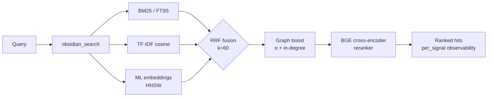

<div align="center">

<a href="https://github.com/oomkapwn/enquire-mcp"></a>

# enquire-mcp

<sub>**TL;DR for AI agents** — MCP server exposing a local Obsidian markdown vault to Claude Code, Claude Desktop, Cursor, ChatGPT, Codex, and OpenClaw as persistent searchable memory. Hybrid retrieval (BM25 + ML embeddings + BGE reranker, RRF-fused), HNSW + int8 quantization, agentic RAG (HyDE + sub-question), GraphRAG-light, PDFs + OCR, standalone Bases. Vendor-neutral, MIT, zero cloud calls during serve. Install: `npm i -g @oomkapwn/enquire-mcp`. Docs: [llms.txt](https://github.com/oomkapwn/enquire-mcp/blob/main/llms.txt) · [AGENTS.md](https://github.com/oomkapwn/enquire-mcp/blob/main/AGENTS.md) · [API](https://oomkapwn.github.io/enquire-mcp/).</sub>

### The most advanced Obsidian MCP. Long-term memory for AI agents.

**Stop re-explaining context to Claude, Cursor, ChatGPT, Codex, OpenClaw every session. Your Obsidian notes become shared, searchable memory across every MCP-compatible agent — your knowledge, every model, forever yours.**

[](https://github.com/oomkapwn/enquire-mcp/actions/workflows/ci.yml)
[](https://www.npmjs.com/package/@oomkapwn/enquire-mcp)
[](https://www.npmjs.com/package/@oomkapwn/enquire-mcp)
[](#trust)
[](./STABILITY.md)
[](https://slsa.dev/spec/v1.0/levels#build-l2)
[](https://modelcontextprotocol.io/)
[](./LICENSE)

**[⚡ 30-second install](#-quick-start) · [🧠 Use cases](#-use-cases) · [📊 Benchmarks](./docs/benchmarks.md) · [📖 API reference](https://oomkapwn.github.io/enquire-mcp/) · [💬 Compare alternatives](./docs/COMPARISON.md)**

**Claude Code — one line:**

```bash
claude mcp add obsidian -- npx -y @oomkapwn/enquire-mcp serve --vault ~/Documents/Obsidian\ Vault
```

</div>

---

## The problem

Every AI session starts from zero. You re-explain your project, your design decisions, the conclusions of last week's research. Vendor "memory" features ([Claude Memory](https://www.anthropic.com/news/memory-and-tool-use), [ChatGPT Memory](https://openai.com/index/memory-and-new-controls-for-chatgpt/), Cursor memory) lock your knowledge into one provider's cloud — and forget it again when you switch tools. **Your knowledge keeps starting over.**

## The solution

Your Obsidian vault becomes **persistent, queryable long-term memory** for any MCP-compatible agent. One install — your knowledge is instantly accessible from Claude Code, Claude Desktop, Cursor, ChatGPT custom GPT, Codex, OpenClaw, and every other MCP client. Plain markdown files **you own**, indexed locally, searched with the full modern IR stack, recalled across every session and every model.

**Grounded, not extracted.** Conversation-memory tools (mem0, Zep, Supermemory) *extract* facts from your chat logs into a separate store you can't read. enquire-mcp is the inverse: it's **grounded in the knowledge you already wrote** — your own `.md` notes, verbatim, with citations — so recall is auditable, editable in any editor, and never a lossy summary of a chat you half-remember.

> **Three things make enquire-mcp different**:
> 1. **Vendor-neutral.** Your memory lives in `.md` files. Switch from Claude to Cursor — your memory comes with you.
> 2. **Best-in-class retrieval.** Hybrid BM25 + multilingual embeddings + BGE cross-encoder reranker fused via RRF, scaled with HNSW + int8 quantization. The same IR stack a search startup would build — open-sourced, in one binary.
> 3. **Zero cloud calls during serve.** Models cached locally (one-time download from HuggingFace). Your vault content never leaves your machine. Air-gap-safe by default.

**45 tools · 19 MCP prompts · 1072 unit tests · 50+ languages · v3.9.x stable · semver-bound · MIT · npm build provenance (SLSA L2).**

---

## ⚡ Quick start

```bash
npm install -g @oomkapwn/enquire-mcp
enquire-mcp serve --vault ~/Documents/Obsidian\ Vault
```

Drop into any MCP client:

```json
{
  "mcpServers": {
    "obsidian": {
      "command": "npx",
      "args": ["-y", "@oomkapwn/enquire-mcp", "serve", "--vault", "/path/to/vault"]
    }
  }
}
```

📂 Drop-in configs in [`examples/`](./examples/) — **Claude Desktop**, **Cursor**, **ChatGPT custom GPT** (remote MCP over HTTP), plus a sample query set for the eval harness.

**Want full hybrid power?** One-command zero-touch onboarding:

```bash
enquire-mcp setup --vault <path>     # downloads model, builds FTS5 + embed-db
enquire-mcp serve --vault <path> --persistent-index --enable-reranker --use-hnsw
enquire-mcp doctor --vault <path>    # color-coded ✓/⚠/✗ health check
```

---

## 🤖 Set up in your AI agent — copy-paste prompts

Once `enquire-mcp` is installed, paste these prompts into your agent so it knows the vault is available as memory.

<details>
<summary><b>Claude Code (terminal)</b> — add MCP server + first prompt</summary>

```bash
# Add the MCP server to your Claude Code config (one time)
claude mcp add obsidian -- npx -y @oomkapwn/enquire-mcp serve --vault ~/Documents/Obsidian\ Vault
```

Then in any Claude Code session:

> You now have `obsidian_*` tools that search and read my Obsidian vault — my long-term memory. Before answering questions about projects, decisions, people, or technical context, call `obsidian_search` with the relevant terms. Cite each fact with the source note (and `[page: N]` for PDFs). If you don't find a relevant note, say so — don't guess.

</details>

<details>
<summary><b>Claude Desktop</b> — config file + first prompt</summary>

Drop [`examples/claude-desktop-hybrid.json`](./examples/claude-desktop-hybrid.json) into Claude Desktop's MCP config (edit the vault path first). Restart Claude Desktop, then:

> You have my Obsidian vault wired up as searchable memory via `obsidian_*` tools. Always check `obsidian_search` first when I ask about anything in my notes — meeting context, research, decisions, journal entries. Quote the source note path on every fact.

</details>

<details>
<summary><b>Cursor</b> — MCP stdio config + agent rule</summary>

Drop [`examples/cursor-mcp.json`](./examples/cursor-mcp.json) at `~/.cursor/mcp.json` (edit the vault path). In your `.cursorrules` file or chat:

> Before suggesting code that touches a topic I might have notes on (architecture decisions, API contracts, vendor evaluations), call `obsidian_search` first. Treat my Obsidian vault as authoritative context.

</details>

<details>
<summary><b>ChatGPT custom GPT</b> — remote MCP over HTTP</summary>

Follow [`examples/chatgpt-actions.md`](./examples/chatgpt-actions.md) to expose `serve-http` via a tunnel with bearer auth. In your custom GPT's instructions:

> You have read access to my Obsidian vault via the `obsidian_*` tool family. Search before answering anything that might be in my notes; cite the source filepath on every claim.

</details>

<details>
<summary><b>OpenClaw / Codex / any other MCP client</b></summary>

Same `npx -y @oomkapwn/enquire-mcp serve --vault <path>` command works for any MCP-compatible client. See the client's own MCP-config docs for where to drop the server entry, then use any of the prompts above.

</details>

### Example queries that work well

- *"Find every note where I discussed pricing strategy, summarize the evolution."* — RRF fusion + reranker handles "evolution" semantically
- *"What was my decision on PostgreSQL vs MongoDB? Cite the daily note."* — wikilink graph-boost surfaces the central decision doc
- *"Анализируй мои заметки о RAG за последние 3 месяца"* — multilingual embeddings + frontmatter date filter
- *"What pages of the LLaMA-3 paper PDF talk about scaling?"* — PDFs blended into search with `[page: N]` citations
- *"Show me topical communities in my research vault — what themes have I been exploring?"* — `obsidian_get_communities` (GraphRAG-light)

---

## 🧠 Use cases

**1 — Long-term memory for AI agents.** Drop your Obsidian vault into any MCP-compatible agent (Claude Code, Claude Desktop, Cursor, ChatGPT, Codex, OpenClaw). The agent now has durable, semantic recall over every meeting note, journal entry, research log, and decision doc you've ever written — across sessions, models, and providers. Unlike `Claude Memory` or `ChatGPT Memory`, your knowledge isn't locked into one vendor's cloud; it lives in plain markdown you own and can migrate freely.

**2 — Personal knowledge base / second brain.** Hybrid retrieval surfaces the right note for *any* phrasing, in any of 50+ languages. Ask in English about a Russian-language journal entry from 2 years ago, get the right hit. Wikilink graph-boost reranks notes that sit at the centre of your knowledge graph. GraphRAG-light surfaces topical communities — discover connections you forgot you made. PDFs blend into search with `[page: N]` citations so research papers and meeting transcripts become first-class memory.

**3 — Agentic RAG / context engineering.** `obsidian_search` exposes per-signal scores so the agent sees *why* each hit ranked. HyDE pre-rewrites vague queries into rich hypothetical answers before retrieval. Sub-question decomposition handles multi-hop questions ("how did our pricing strategy evolve and what was the customer reaction?") by breaking them into independent sub-queries, fusing results. The built-in eval harness (NDCG / Recall / MRR) lets you measure retrieval quality on your own queries instead of trusting vendor benchmarks.

---

## 📖 API reference

Auto-generated **[API reference at oomkapwn.github.io/enquire-mcp](https://oomkapwn.github.io/enquire-mcp/)** — every tool, prompt, and exported helper with full TSDoc (`@param` / `@returns` / `@example`). Rebuilt from source on every push to `main` via [`publish-docs.yml`](https://github.com/oomkapwn/enquire-mcp/blob/main/.github/workflows/publish-docs.yml) (TypeDoc → GitHub Pages). Drift-free by construction: the same TSDoc that AI agents and IDEs see is what's published.

---

## 🏆 Why it's the best

**Six features no other Obsidian-MCP has at all** (GraphRAG-light, standalone `.base` execution, HyDE, int8 quantization, late-chunking, built-in eval harness). **Plus the entire modern IR stack** (BM25 + ML embeddings + cross-encoder reranking + HNSW) that competitors ship at most one or two of. Side-by-side:

| Capability | enquire-mcp | Smart Connections | Other Obsidian-MCPs |
|---|:---:|:---:|:---:|
| Hybrid retrieval (BM25 + TF-IDF + ML embeddings, RRF-fused) | ✅ | ❌ | ❌ |
| **Cross-encoder reranking** (BGE, +15.5 NDCG@10 measured) | ✅ | ❌ | ❌ |
| **HNSW vector index** (sub-10ms top-K, persisted) | ✅ | ❌ | ❌ |
| **int8 vector quantization** (~4× smaller embed-db) | ✅ | ❌ | ❌ |
| **Late-chunking** context-windowed embeddings | ✅ | ❌ | ❌ |
| **PDFs blended into hybrid search** (`[page: N]` citations) | ✅ | ❌ | ❌ |
| **OCR for scanned PDFs** (Tesseract.js, multilingual) | ✅ | ❌ | ❌ |
| **Wikilink graph-boost** retrieval signal | ✅ | ❌ | ❌ |
| **Multilingual semantic search** (50+ languages, on-device) | ✅ | 💰 paid | ❌ |
| **Built-in retrieval-quality eval harness** (NDCG, Recall, MRR, A/B matrix) | ✅ | ❌ | ❌ |
| **Remote MCP** over HTTP + bearer auth + stateful sessions | ✅ | ❌ | partial |
| **Per-signal observability** per hit | ✅ | ❌ | ❌ |
| **MCP-native** (Claude · Cursor · ChatGPT · Codex · OpenClaw · any client) | ✅ | ❌ Obsidian-only | varies |
| **Privacy filter** verified at every search + write path | ✅ | n/a | ❌ |
| **44 production tools** (34 always-on read tools + 4 opt-in + 7 gated writes) | ✅ | n/a | varies |
| **GraphRAG-light** (wikilink community detection via Louvain modularity) | ✅ **only here** | ❌ | ❌ |
| **Standalone `.base` query execution** (works without Obsidian running) | ✅ **only here** | ❌ | ❌ delegates to Obsidian |
| **HyDE retrieval** (Gao et al 2023) + sub-question decomposition | ✅ **only here** | ❌ | ❌ |
| **1072 unit tests · 9 required + 4 advisory CI gates per PR** | ✅ | n/a | rare |
| **Signed build provenance** (npm + Sigstore, SLSA Build L2) | ✅ | n/a | ❌ |
| **Semver-bound public surface** ([STABILITY.md](./STABILITY.md)) | ✅ | n/a | ❌ |
| Standalone (no Obsidian plugin needed) | ✅ | ❌ requires Obsidian | varies |
| License | MIT, free | proprietary, paid | varies |

<sub>Comparison based on each project's public capabilities as of v3.8.x stable (initial snapshot v3.7.0 / 2026-05-15; refreshed in v3.8.4). Smart Connections is a paid Obsidian plugin (not an MCP server). "Other Obsidian-MCPs" refers to public open-source Obsidian-MCP servers on GitHub at time of writing. Public end-to-end retrieval benchmarks for enquire-mcp are published in <a href="./docs/benchmarks.md"><code>docs/benchmarks.md</code></a> — measured `rerank-bge` delta is +24.7 MRR / +15.5 NDCG@10 over plain hybrid on a 60-query ablation.</sub>

> Strategic claim: enquire-mcp is the open-source backend for [Karpathy-style LLM Wikis](https://gist.github.com/karpathy/442a6bf555914927e9891c11519de94f) on top of your existing Obsidian vault. Knowledge that compounds, traceable to sources.

---

## 🏗️ How retrieval works



`obsidian_search` auto-detects available signals and gracefully degrades. Wikilink graph-boost reranks top-K via 1-step personalised PageRank. Optional cross-encoder reranking re-scores top-N for +15.5 NDCG@10 measured. Every hit returns `per_signal: { bm25, tfidf, embeddings }` so you see WHY it ranked.

| Tier | Setup | What you get |
|---|---|---|
| **1** | `serve --vault <path>` | TF-IDF cosine (zero setup, instant) |
| **2** | + `--persistent-index` | + BM25 / FTS5 (sub-100ms top-10) |
| **3** | + `setup` (downloads model + builds embed-db) | + multilingual ML embeddings |
| **4** | + `--enable-reranker` | + BGE cross-encoder (+15.5 NDCG@10 measured) |
| **5** | + `--use-hnsw` | + sub-10ms top-K at million-chunk scale |
| **6** | + `--include-pdfs` | + PDFs blended into all of the above |
| **7** | `serve-http --bearer-token …` | + remote MCP (Claude.ai web, ChatGPT, Cursor HTTP, mobile) |

---

## 🛠️ All 45 tools

The umbrella `obsidian_search` plus 43 specialized tools (34 always-on read + 4 opt-in + 7 gated writes). Full reference: **[docs/api.md](./docs/api.md)**.

| Category | Tools |
|---|---|
| **Search & retrieval** | `obsidian_search` (umbrella, RRF-fused) · `obsidian_hyde_search` (HyDE-augmented, v3.1.0) · `obsidian_search_text` · `obsidian_full_text_search` · `obsidian_semantic_search` · `obsidian_embeddings_search` · `obsidian_find_similar` |
| **Wikilinks & graph** | `obsidian_resolve_wikilink` · `obsidian_get_backlinks` · `obsidian_get_outbound_links` · `obsidian_get_note_neighbors` · `obsidian_get_unresolved_wikilinks` · `obsidian_find_path` · `obsidian_get_communities` (v3.4.0, GraphRAG-light) |
| **Frontmatter & Dataview** | `obsidian_frontmatter_get` · `obsidian_frontmatter_search` · `obsidian_dataview_query` · `obsidian_list_tags` |
| **Read & navigate** | `obsidian_read_note` · `obsidian_list_notes` · `obsidian_get_recent_edits` · `obsidian_stale_notes` · `obsidian_open_questions` · `obsidian_context_pack` · `obsidian_chat_thread_read` · `obsidian_open_in_ui` · `obsidian_stats` |
| **PDFs, Canvas & Bases** | `obsidian_read_pdf` · `obsidian_list_pdfs` · `obsidian_ocr_pdf` · `obsidian_read_canvas` · `obsidian_list_canvases` · `obsidian_list_bases` (v3.2.0) · `obsidian_read_base` (v3.2.0) · `obsidian_query_base` (v3.2.0) |
| **Writes** (gated by `--enable-write`) | `obsidian_create_note` · `obsidian_append_to_note` · `obsidian_rename_note` · `obsidian_replace_in_notes` · `obsidian_archive_note` · `obsidian_frontmatter_set` · `obsidian_chat_thread_append` |
| **Diagnostic / lint** | `obsidian_lint_wiki` · `obsidian_paper_audit` · `obsidian_validate_note_proposal` |

Plus 3 MCP resources (`obsidian://vault/info`, `obsidian://note/{path}`, `obsidian://chunk/{n}/{path}`) and 19 **MCP prompts** (`summarize_recent_edits` · `review_tag` · `find_orphans` · `weekly_review` · `extract_todos` · `process_inbox` · `consolidate_tags` · `find_duplicates` · `lint_wiki` · `monthly_review` · `search_with_query_expansion` · `vault_synth` · `vault_wiki_compile` · `vault_lint_extended` · `vault_capture` · `vault_persona_search` · `vault_automation_setup` · `vault_research` · `vault_synthesis_page`) for common vault workflows.

---

## 🛡️ Trust

| Surface | Posture |
|---|---|
| **Default** | Read-only — `--enable-write` required for the 7 write tools |
| **Path safety** | Realpath check on every read+write; symlinks-out-of-vault rejected |
| **Privacy filter** | Verified at FTS5 + embed-db + chunk resource paths; fail-closed on empty allow-/deny-lists |
| **HTTP transport** | Bearer auth (constant-time SHA-256 + `timingSafeEqual`), per-token rate-limit, strict CORS |
| **Frontmatter** | `gray-matter` (`js-yaml` safeLoad) — no code execution |
| **Cache + index files** | chmod 0600, parent dir 0700 |
| **CI** | **9 required** branch-protection gates: (1) `lint`, (2) `test` on Node 22, (3) `test` on Node 24, (4) `smoke`, (5) `audit`, (6) `coverage`, (7) `version-consistency`, (8) `docs`, (9) `oia`. **4 advisory**: `test-macos` via `.github/workflows/ci.yml`; CodeQL ×2 + Analyze actions via [GitHub default-setup](https://docs.github.com/code-security/code-scanning/automatically-scanning-your-code-for-vulnerabilities-and-errors/configuring-default-setup-for-code-scanning) (not workflow files). Release workflow re-verifies all 9 required passed on tagged SHA before npm publish. _v3.7.10 — `docs` (TypeDoc generation gate) added to required set. v3.7.13 — `engines.node` floor bumped to `>=22.13.0` to match the CI matrix. v3.8.0-rc.6 — `oia` (Outside-In Audit) promoted from advisory._ |
| **Coverage** | Lines ≥86% · statements ≥82% · functions ≥75% · branches ≥74% (gated) |
| **Releases** | npm + GitHub release per tag · semver · **signed build provenance** (npm + Sigstore, SLSA Build L2; L3 generator on the roadmap) |
| **Stability** | v3.0+ semver-bound — every CLI flag, tool name, MCP resource, prompt, exported symbol is contract |

Full posture: **[SECURITY.md](./SECURITY.md)** · Stability surface: **[STABILITY.md](./STABILITY.md)** · Vulns: `oomkapwn@gmail.com`.

---

## ❓ FAQ

**Need Obsidian installed?** No. Reads `.md` + `.canvas` + `.pdf` directly. Works against any Obsidian-format vault.

**Will it write to my vault?** Not unless you pass `--enable-write`. All 7 write tools are gated; destructive ones support `dry_run`.

**Data sent anywhere?** Only on `enquire-mcp install-model` (downloads ONNX weights from HuggingFace, one-time). Serve mode never makes outbound HTTP. Embeddings + reranker run on CPU locally.

**Performance?** Cold-build FTS5: ~5s/1k notes, ~30s/50k. BM25 query: <100ms always. Embedding build: ~30ms/chunk on M1. **HNSW top-10: sub-10ms at any scale.** Serve cold-start: ~50ms with HNSW persistence.

**Languages?** Default `paraphrase-multilingual-MiniLM-L12-v2` (50+ languages). Multilingual cross-encoder. Validated end-to-end on Russian + English bilingual vaults. CJK/Thai/Khmer tokenization via `Intl.Segmenter`.

**Run remotely?** Yes — `serve-http` exposes the same server over [Streamable HTTP](https://modelcontextprotocol.io/specification/2025-06-18/basic/transports#streamable-http). Front with Tailscale Funnel or Cloudflare Tunnel for HTTPS. Works with claude.ai web, ChatGPT custom GPT, Cursor HTTP mode, mobile MCP clients. See **[docs/http-transport.md](./docs/http-transport.md)**.

---

## 🚀 Releases

**v3.0.0 — stable channel.** The v2.x retrieval roadmap is complete and the public surface is now [semver-bound](./STABILITY.md). Highlight reel:

`v2.0` hybrid retrieval (BM25+TF-IDF+embeddings via RRF) · `v2.6` remote MCP · `v2.7-2.8` PDFs blended · `v2.9` BGE reranker · `v2.10` OCR · `v2.11` doctor + setup · `v2.12` eval harness · `v2.13` HNSW · `v2.14` stateful sessions · `v2.15` late-chunking · `v2.16` HNSW persistence · `v2.17` int8 quantization · `v3.8.0` stable · `v3.8.7` HTTP transport hardening · **`v3.9.0` stable**: OCR'd PDF watcher embed-sync, HNSW in-memory live update on file changes, R-10 adaptive HNSW refill (closes the >66% excluded under-return).

Channel: `npm install @oomkapwn/enquire-mcp` → latest stable (`@latest` = v3.9.x). Pre-release: `npm install @oomkapwn/enquire-mcp@rc` (the latest release candidate — see [CHANGELOG.md](./CHANGELOG.md)). Full changelog: **[CHANGELOG.md](./CHANGELOG.md)** · Forward plan: **[ROADMAP.md](https://github.com/oomkapwn/enquire-mcp/blob/main/ROADMAP.md)**.

---

## 🤝 Contributing

```bash
git clone https://github.com/oomkapwn/enquire-mcp.git
cd enquire-mcp && npm install
npm test       # full suite (1072 tests, ~12s)
npm run lint   # zero warnings
npm run build  # tsc → dist/
```

Issues, PRs, ideas welcome. Branch protection requires PR review on `main`.

---

## 📜 License

MIT. Built by [Alex (@OomkaBear)](https://github.com/oomkapwn). Named after [Tim Berners-Lee's 1980 prototype of the WWW](https://en.wikipedia.org/wiki/ENQUIRE) — the original hypertext system, before the web. The original spec was: you could ask the system anything. **enquire-mcp brings that to your vault.**
