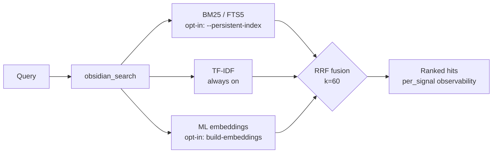

<div align="center">

<a href="https://github.com/oomkapwn/enquire-mcp"></a>

# enquire — MCP server for Obsidian

**Hybrid retrieval (BM25 + TF-IDF + ML embeddings, RRF-fused) for your Obsidian vault.** Drop-in for Claude Code, Cursor, OpenClaw 🦞, Codex, Devin, and any MCP-compatible agent. Free. Multilingual (50+ languages). Offline-capable. No Obsidian plugin required.

[](https://github.com/oomkapwn/enquire-mcp/actions/workflows/ci.yml)
[](https://www.npmjs.com/package/@oomkapwn/enquire-mcp)
[](https://www.npmjs.com/package/@oomkapwn/enquire-mcp/v/beta)
[](#engineering)
[](./LICENSE)
[](https://modelcontextprotocol.io/)
[](https://slsa.dev/spec/v1.0/levels#build-l3)

</div>

```bash
npm install -g @oomkapwn/enquire-mcp
enquire-mcp serve --vault ~/Documents/Obsidian\ Vault
```

That's it. Your AI now has structured access to wikilinks, backlinks, frontmatter, Dataview queries, and **`obsidian_search`** — a single hybrid-retrieval tool that auto-fuses BM25 + TF-IDF + ML embeddings.

---

## Why enquire (vs alternatives)

| | Other Obsidian-MCPs | Smart Connections (paid plugin) | **enquire** |
|---|:---:|:---:|:---:|
| Read-only by default | varies | n/a | ✅ |
| Resolves wikilinks (alias / section / block) | partial | n/a | ✅ full |
| Backlinks ranked + snippeted | rare | n/a | ✅ |
| Dataview-style queries | needs plugin | n/a | ✅ first-class |
| Canvas (`.canvas`) read | rare | n/a | ✅ typed nodes + edges |
| BM25 full-text search | rare | ❌ | ✅ FTS5 SQLite |
| TF-IDF semantic search | ❌ | ❌ | ✅ |
| **ML embeddings (multilingual)** | ❌ | ✅ paid | ✅ **free** |
| **Hybrid (BM25+TF-IDF+embeddings, RRF)** | ❌ | ❌ | ✅ **only here** |
| Per-signal observability on each hit | ❌ | ❌ | ✅ |
| Privacy filter (`--exclude-glob` / `--read-paths`) | ❌ | n/a | ✅ verified at search + write paths |
| Standalone (no Obsidian plugin) | varies | ❌ requires Obsidian | ✅ direct vault read |
| MCP-native (any agent) | varies | ❌ Obsidian-only | ✅ stdio JSON-RPC |
| SLSA-3 provenance | ❌ | n/a | ✅ |
| Test suite | rare | n/a | ✅ 408 unit tests |

---

## Architecture



`obsidian_search` auto-detects available signals and fuses them via Reciprocal Rank Fusion (Cormack et al, 2009). Returns per-signal contributions on every hit so agents can see WHY each result ranked.

```
Tier 1: serve --vault <path>                      → TF-IDF (zero setup, instant)
Tier 2: serve --vault <path> --persistent-index   → + BM25 (sub-100ms top-10)
Tier 3: + install-model + build-embeddings        → + ML embeddings (multilingual)
```

---

## Quick start

> **Two channels:** `npm install @oomkapwn/enquire-mcp` → **v2.0** (stable, hybrid retrieval). `@beta` → preview track. `@1` → legacy v1.x line.

**Claude Desktop / Claude Code / Cursor / Codex / any MCP client**:

```json
{
  "mcpServers": {
    "obsidian": {
      "command": "npx",
      "args": ["-y", "@oomkapwn/enquire-mcp", "serve", "--vault", "/path/to/vault"]
    }
  }
}
```

| Client | Config file |
|---|---|
| Claude Desktop | macOS `~/Library/Application Support/Claude/claude_desktop_config.json` · Windows `%APPDATA%\Claude\claude_desktop_config.json` |
| Claude Code (CLI) | `~/.claude.json` (global) or `.mcp.json` (per-project) |
| Cursor | `~/.cursor/mcp.json` (global) or `.cursor/mcp.json` (per-project) |
| Codex / OpenClaw / Devin | per-tool MCP config |

**Enable hybrid retrieval** (one-time setup, ~10 min for a 100-note vault):

```bash
enquire-mcp install-model multilingual          # ~120MB, 50+ languages
enquire-mcp build-embeddings --vault <path>     # ~30ms/chunk on M1
# Add --persistent-index to your serve invocation for BM25.
```

---

## Tools (36 total)

### 25 always-on read tools

| Tool | What it does |
|---|---|
| `obsidian_search` | **Hybrid retrieval** — fuses BM25 + TF-IDF + ML embeddings via RRF. The default search tool. Auto-detects available signals. v2.2.0: `granularity: "block"` arg returns chunks instead of notes. |
| `obsidian_context_pack` | **v2.2.0.** Token-budgeted context bundling: takes a question, runs hybrid search, gathers note bodies + backlinks + optionally recent dailies, returns one ready-to-paste markdown bundle. Saves ~5 tool calls. |
| `obsidian_chat_thread_read` | **v2.2.0.** Parse a note's `## Chat: <title>` block into structured messages (role/timestamp/content/line-range). Pair with `_append` (write) for note-tethered AI conversations. |
| `obsidian_frontmatter_get` | **v2.3.0.** Read parsed YAML frontmatter for a note. With `key`, returns just that field. |
| `obsidian_frontmatter_search` | **v2.3.0.** Find notes by frontmatter predicate (`equals` / `exists` / `contains`). Useful as a precursor to bulk `_set`. |
| `obsidian_read_note` | Full content + frontmatter + wikilinks + embeds + tags. Also accepts periodic-note aliases (`title: "today"` / `"weekly"` / `"monthly"`). |
| `obsidian_list_notes` | Vault-wide or folder-scoped. Includes title + tags + mtime + counts. |
| `obsidian_resolve_wikilink` | Resolves `[[Note]]`, `[[Note\|Alias]]`, `[[Note#Section]]`, `[[Note#^block]]`, with did-you-mean on near-miss. |
| `obsidian_get_backlinks` | Every note linking to X, ranked + snippeted. |
| `obsidian_get_outbound_links` | Outbound `[[wikilinks]]` from one note, with resolution status. |
| `obsidian_get_unresolved_wikilinks` | Vault-wide broken-link audit. |
| `obsidian_get_recent_edits` | Notes modified in the last N minutes. |
| `obsidian_list_tags` | Tag census across vault (frontmatter + inline). |
| `obsidian_dataview_query` | First-class Dataview-style queries (`LIST` / `TABLE`, `WHERE`, `AND` / `OR` / `LIKE` / `contains`). |
| `obsidian_find_path` | Multi-hop graph BFS between two notes (with alternatives). |
| `obsidian_find_similar` | Note-to-note similarity (tag + folder + content signals). |
| `obsidian_get_note_neighbors` | Outbound + inbound + tag-sibling for one note. |
| `obsidian_stats` | Vault dashboard: note count, tag count, broken links. |
| `obsidian_lint_wiki` | Karpathy LLM-Wiki `/lint` workflow (orphans / broken / stubs / stale). |
| `obsidian_open_questions` | Find open `?` questions across the vault. |
| `obsidian_paper_audit` | Track arXiv references and read-status. |
| `obsidian_validate_note_proposal` | Lint a draft note before writing (closes the #1 LLM-write pain). |
| `obsidian_list_canvases` | List `.canvas` files with node + edge counts. |
| `obsidian_read_canvas` | Parse `.canvas` into typed nodes (text/file/link/group) + edges. |
| `obsidian_open_in_ui` | Emit `obsidian://open?vault=...` URI. |

### 4 opt-in read tools

| Tool | Flag | Notes |
|---|---|---|
| `obsidian_full_text_search` | `--persistent-index` + `--diagnostic-search-tools` | BM25 ranking, sub-100ms. |
| `obsidian_search_text` | `--diagnostic-search-tools` | Token search (all/any/phrase modes). |
| `obsidian_semantic_search` | `--diagnostic-search-tools` | TF-IDF cosine standalone. |
| `obsidian_embeddings_search` | `--diagnostic-search-tools` | ML embeddings standalone. |

### 7 opt-in write tools (`--enable-write`)

| Tool | Notes |
|---|---|
| `obsidian_create_note` | Refuses overwrite without `overwrite=true`. Empty path rejected. |
| `obsidian_append_to_note` | Symlink-safe; respects `--max-file-bytes`. |
| `obsidian_rename_note` | Rewrites every wikilink across vault. Code-fence-aware. `dry_run` available. |
| `obsidian_replace_in_notes` | Bulk find/replace. Per-file errors collected; `partial: true` on mid-loop fail. |
| `obsidian_archive_note` | Wraps rename to `Archive/`. Preserves backlinks. |
| `obsidian_chat_thread_append` | **v2.2.0.** Append a user/assistant/system message to a note's `## Chat:` block. Creates note + heading if absent. Threads stored as markdown — searchable, version-controllable, survive sessions. |
| `obsidian_frontmatter_set` | **v2.3.0.** Surgical YAML manipulation — set/unset keys on a note atomically. Pass `null` as value to delete. Round-trips through gray-matter so YAML formatting stays consistent. `dry_run` supported. |

Plus **2 + 1 opt-in MCP resources** (`obsidian://note/...`, `obsidian://vault-info`, `obsidian://chunk/...`) and **17 MCP prompts** (`summarize_recent_edits`, `weekly_review`, `monthly_review`, `find_orphans`, `extract_todos`, `process_inbox`, `review_tag`, `consolidate_tags`, `find_duplicates`, `lint_wiki`, `search_with_query_expansion`, `vault_synth`, `vault_wiki_compile`, `vault_lint_extended`, `vault_capture`, `vault_persona_search`, `vault_automation_setup`).

> **v2.4.0 strategic position:** enquire-mcp is the open-source backend for **Karpathy-style LLM Wikis** on top of your existing Obsidian vault. The `vault_synth` + `vault_wiki_compile` + `vault_lint_extended` prompts implement the [Karpathy LLM-Wiki workflow](https://gist.github.com/karpathy/442a6bf555914893e9891c11519de94f) (ingest → query → lint → compile) natively over Obsidian's `.md` + `[[wikilinks]]` substrate. Knowledge that compounds, traceable to sources.

---

## Configuration

| Flag | Default | Notes |
|---|---|---|
| `--vault <path>` | required | Path to Obsidian vault root. |
| `--enable-write` | off | Register the 5 write tools. |
| `--exclude-glob <pat...>` | none | Privacy denylist. Repeatable. Example: `'02_Personal/**'`. |
| `--read-paths <pat...>` | none | Privacy allowlist (only matching paths visible). Repeatable. |
| `--persistent-index` | off | SQLite FTS5 BM25. Enables `obsidian_full_text_search` (with `--diagnostic-search-tools`). |
| `--persistent-cache` | off | Persist parsed-note cache across restarts. |
| `--watch` | off | Live invalidation on `.md` add/change/unlink. |
| `--diagnostic-search-tools` | off | Register 4 single-ranker search tools (defaults: hybrid `obsidian_search` only). |
| `--enabled-tools <name...>` | all | Strict allowlist (gate to a subset). |
| `--disabled-tools <name...>` | none | Denylist. |
| `--max-file-bytes <n>` | 5 MB | Per-file read/write cap. |
| `--cache-size <n>` | 1024 | LRU cap for parsed-note cache. |

Subcommands: `serve` · `clear-cache` · `clear-index` · `index` (cold-build FTS5) · `install-model` · `build-embeddings` · `clear-embeddings`.

Full reference: [docs/api.md](./docs/api.md).

---

## Security

- **Read-only by default.** Write tools require `--enable-write`.
- **Path traversal blocked.** Realpath check on every read+write target. Symlinks inside the vault that resolve outside are rejected.
- **Privacy boundary verified across all paths**, including persistent indexes (FTS5 / embed-db search-time filter) and the `obsidian://chunk/...` resource. Privacy fail-closed: empty `--read-paths` / `--exclude-glob` patterns refuse to start.
- **`gray-matter` (`js-yaml` safeLoad)** — no code execution via frontmatter.
- **DQL parser** — no shell, no `eval`, no template expansion.
- **Cache + index files** — chmod 0600, parent dir 0700.
- **SLSA-3 provenance** on every npm release.
- **Branch protection ruleset** with `bypass_mode: pull_request` — every change goes through PR with audit trail. Release pipeline verifies SHA-on-main + 8 required CI checks before publishing.

Full posture: [SECURITY.md](./SECURITY.md). Report vulnerabilities to `oomkapwn@gmail.com`.

---

## Engineering

| Surface | Posture |
|---|---|
| Language | TypeScript strict + `noUncheckedIndexedAccess` |
| Lint | Biome 2 (zero-warning policy) |
| Tests | 408 unit tests across 19 files |
| CI | ubuntu × {Node 20, 22, 24} required + macOS advisory job |
| Coverage | Lines ≥86%, statements ≥82%, functions ≥75%, branches ≥73% (gated) |
| Audit | `npm audit --audit-level=moderate` for prod; high for dev |
| Runtime deps | 5 mandatory (`@modelcontextprotocol/sdk`, `chokidar`, `commander`, `gray-matter`, `zod`) + 2 optional (`better-sqlite3` for FTS5 / embed-db; `@huggingface/transformers` for ML embeddings) |
| Releases | npm + GitHub release per tag · semver · provenance attached · channels: `latest` (stable), `beta`, `alpha` |

```bash
git clone https://github.com/oomkapwn/enquire-mcp.git
cd enquire-mcp && npm install
npm test          # full suite
npm run lint      # zero warnings
npm run build     # tsc → dist/
```

---

## FAQ

**Q: Do I need Obsidian installed?**
No. enquire reads `.md` + `.canvas` files directly. Works against any Obsidian-format vault.

**Q: Will this write to my vault?**
No, unless you explicitly start with `--enable-write`. Even then, all 5 write tools are gated by privacy filters and refuse to overwrite without `overwrite: true`.

**Q: Is my data sent anywhere?**
Only on `enquire-mcp install-model` (downloads ONNX weights from HuggingFace). The serve mode itself never makes outbound HTTP. Embeddings run on CPU locally.

**Q: How is this different from Smart Connections?**
Smart Connections is a paid Obsidian plugin that does ML embeddings inside Obsidian. enquire-mcp is a standalone MCP server: free, MCP-native (works with Claude / Cursor / Codex / any agent), and adds hybrid retrieval (BM25 + TF-IDF + embeddings via RRF) for higher recall than embeddings alone.

**Q: Performance on large vaults?**
Cold-build of FTS5 on a 1k-note vault: ~5s. Warm BM25 top-10: sub-100ms. Embedding build: ~30ms/chunk on M1 (8s for 256 chunks, ~8min for 8k chunks). Hybrid query latency: <200ms typical.

**Q: Does it support languages other than English?**
Yes. Default embedding model is `paraphrase-multilingual-MiniLM-L12-v2` (50+ languages). Validated end-to-end on Russian + English bilingual vaults. CJK requires the upcoming Intl.Segmenter pre-pass (v2.1 backlog).

---

## Contributing

Issues and PRs welcome. Read [CONTRIBUTING.md](./CONTRIBUTING.md). All changes go through PR review per branch protection ruleset.

## License & credits

[MIT](./LICENSE). Built by Alex — [GitHub `@oomkapwn`](https://github.com/oomkapwn) · [X `@OomkaBear`](https://x.com/OomkaBear).

Named after [ENQUIRE](https://en.wikipedia.org/wiki/ENQUIRE) — Tim Berners-Lee's 1980 hypertext prototype of the World Wide Web.

> **Not affiliated with Obsidian.md.** Obsidian and the Obsidian logo are trademarks of Dynalist Inc. enquire-mcp is an independent open-source project that reads Obsidian-format vaults.
