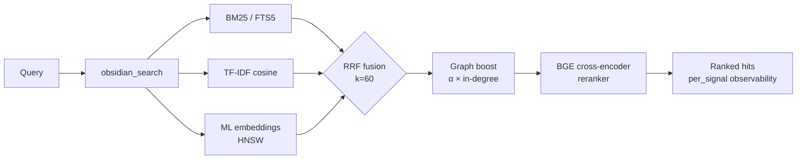

<div align="center">

<a href="https://github.com/oomkapwn/enquire-mcp"></a>

# enquire-mcp

<sub>[English](./README.md) · [中文](./README.zh.md) · [Español](./README.es.md) · [हिन्दी](./README.hi.md) · [العربية](./README.ar.md) · [Русский](./README.ru.md) · **Português** · [Français](./README.fr.md) · [日本語](./README.ja.md) · [한국어](./README.ko.md) · [Deutsch](./README.de.md)</sub>

<sub>**TL;DR para agentes de IA** — servidor MCP que expõe um vault local de markdown do Obsidian para Claude Code, Claude Desktop, Cursor, ChatGPT, Codex e OpenClaw como memória persistente e pesquisável. Recuperação híbrida (BM25 + embeddings de ML + reranker BGE, fundidos via RRF), HNSW + quantização int8, RAG agêntico (HyDE + sub-perguntas), GraphRAG-light, PDFs + OCR, Bases autônomas. Neutro em relação a fornecedores, MIT, zero chamadas à nuvem durante o serve. Instalação: `npm i -g @oomkapwn/enquire-mcp`. Docs: [llms.txt](https://github.com/oomkapwn/enquire-mcp/blob/main/llms.txt) · [AGENTS.md](https://github.com/oomkapwn/enquire-mcp/blob/main/AGENTS.md) · [API](https://oomkapwn.github.io/enquire-mcp/).</sub>

### O MCP de Obsidian mais avançado. Memória de longo prazo para agentes de IA.

**Pare de reexplicar o contexto ao Claude, Cursor, ChatGPT, Codex e OpenClaw a cada sessão. Suas notas do Obsidian se tornam memória compartilhada e pesquisável em todos os agentes compatíveis com MCP — seu conhecimento, qualquer modelo, seu para sempre.**

[](https://github.com/oomkapwn/enquire-mcp/actions/workflows/ci.yml)
[](https://www.npmjs.com/package/@oomkapwn/enquire-mcp)
[](https://www.npmjs.com/package/@oomkapwn/enquire-mcp)
[](#️-confiança)
[](./STABILITY.md)
[](https://slsa.dev/spec/v1.0/levels#build-l2)
[](https://modelcontextprotocol.io/)
[](./LICENSE)

**[⚡ Instalação em 30 segundos](#-início-rápido) · [🧠 Casos de uso](#-casos-de-uso) · [📊 Benchmarks](./docs/benchmarks.md) · [📖 Referência da API](https://oomkapwn.github.io/enquire-mcp/) · [💬 Comparar alternativas](./docs/COMPARISON.md)**

**Claude Code — em uma linha:**

```bash
claude mcp add obsidian -- npx -y @oomkapwn/enquire-mcp serve --vault ~/Documents/Obsidian\ Vault
```

</div>

> 📌 Este documento é a tradução para o português (Brasil) do [README.md](./README.md), para facilitar a leitura de quem fala português; em caso de qualquer divergência, **prevalece a versão em inglês** (atualizada a cada publicação).

---

## O problema

Toda sessão de IA começa do zero. Você reexplica seu projeto, suas decisões de design, as conclusões da pesquisa da semana passada. Os recursos de "memória" dos fornecedores ([Claude Memory](https://www.anthropic.com/news/memory-and-tool-use), [ChatGPT Memory](https://openai.com/index/memory-and-new-controls-for-chatgpt/), a memória do Cursor) prendem seu conhecimento na nuvem de um único fornecedor — e o esquecem de novo assim que você troca de ferramenta. **Seu conhecimento não para de começar de novo.**

## A solução

Seu vault do Obsidian se torna **memória de longo prazo persistente e consultável** para qualquer agente compatível com MCP. Uma instalação — seu conhecimento fica instantaneamente acessível a partir do Claude Code, Claude Desktop, Cursor, GPT personalizado do ChatGPT, Codex, OpenClaw e todos os demais clientes MCP. Arquivos markdown simples **que são seus**, indexados localmente, pesquisados com toda a pilha moderna de recuperação de informação (IR) e relembrados em cada sessão e em cada modelo.

**Ancorado, não extraído.** Ferramentas de memória conversacional (mem0, Zep, Supermemory, Memobase) *extraem* fatos dos seus logs de chat para um armazenamento à parte que você não pode ler. O enquire-mcp é o inverso: ele é **ancorado no conhecimento que você já escreveu** — suas próprias notas `.md`, literais, com citações — de modo que a recuperação é auditável, editável em qualquer editor e nunca um resumo com perdas de um chat que você lembra pela metade. E, diferentemente das plataformas de memória de ***frota*** do lado do servidor — armazenamentos em nuvem multi-inquilino que parafraseiam o tráfego dos agentes para um banco de dados compartilhado — o enquire é **monousuário e local-first**: um único vault que pertence inteiramente a você e que você mesmo pode ler, editar e apagar, com zero chamadas à nuvem durante o serve. (Essa crítica de "extraído" é específica do grupo de memória de chat — não se aplica a ferramentas de grafo de conhecimento / ETL como o cognee, nem a pares de busca pessoal como o Khoj.)

**Ancorado — e consciente da atualidade.** Relembrar um fato é metade do problema; saber se ele ainda é *verdadeiro* é a outra metade. O [benchmark Memora](https://arxiv.org/abs/2604.20006) (abr. 2026) mostrou que sistemas de memória falham sistematicamente na reutilização de fatos desatualizados — relembrando uma nota de um ano atrás como se tivesse sido escrita hoje. Como a memória do enquire *são* seus arquivos markdown reais, cada resultado de busca carrega `age_days` + uma flag `stale` derivada da hora de última modificação ao vivo da nota, e você pode optar pelo ranqueamento ponderado por recência (`--recency-weight`) para que as notas mais recentes apareçam primeiro. Seu conhecimento, consciente da atualidade — não um bloco atemporal.

> **O que torna o enquire-mcp diferente**:
> 1. **Neutro em relação a fornecedores.** Sua memória vive em arquivos `.md`. Troque do Claude para o Cursor — sua memória vem junto.
> 2. **Recuperação de ponta.** BM25 híbrido + embeddings multilíngues + reranker cross-encoder BGE fundidos via RRF, escalados com HNSW + quantização int8. A mesma pilha de IR que uma startup de busca construiria — open-source, em um único binário.
> 3. **Zero chamadas à nuvem durante o serve.** Modelos em cache local (download único do HuggingFace). O conteúdo do seu vault nunca sai da sua máquina. Seguro para ambientes isolados (air-gap) por padrão.
> 4. **Recuperação consciente da atualidade.** Cada resultado informa quão antiga é a nota; o reranqueamento por recência opcional permite que um agente prefira conhecimento recente e sinalize fatos desatualizados para reverificação — a fronteira consciente do esquecimento, construída sobre o `mtime` que seus arquivos já têm.

**46 ferramentas · 19 prompts MCP · 1479+ testes unitários · 50+ idiomas · v3.11.x estável · vinculado a semver · MIT · proveniência de build no npm (SLSA L2).**

---

## 🏆 Por que é o melhor

**Seis recursos que nenhum outro Obsidian-MCP tem** (GraphRAG-light, execução autônoma de `.base`, HyDE, quantização int8, late-chunking, harness de avaliação embutido). **Mais toda a pilha moderna de IR** (BM25 + embeddings de ML + reranking por cross-encoder + HNSW) da qual os concorrentes entregam, no máximo, um ou dois itens. Lado a lado:

| Recurso | enquire-mcp | Smart Connections | Outros Obsidian-MCPs |
|---|:---:|:---:|:---:|
| Recuperação híbrida (BM25 + TF-IDF + embeddings de ML, fundidos via RRF) | ✅ | ❌ | ❌ |
| **Reranking por cross-encoder** (BGE, +15.5 NDCG@10 medido) | ✅ | ❌ | ❌ |
| **Índice vetorial HNSW** (top-K em menos de 10 ms, persistido) | ✅ | ❌ | ❌ |
| **Quantização vetorial int8** (embed-db ~4× menor) | ✅ | ❌ | ❌ |
| **Late-chunking** embeddings com janela de contexto | ✅ | ❌ | ❌ |
| **PDFs mesclados na busca híbrida** (citações `[page: N]`) | ✅ | ❌ | ❌ |
| **OCR para PDFs digitalizados** (Tesseract.js, multilíngue) | ✅ | ❌ | ❌ |
| **Graph-boost de wikilinks** como sinal de recuperação | ✅ | ❌ | ❌ |
| **Busca semântica multilíngue** (50+ idiomas, no dispositivo) | ✅ | 💰 pago | ❌ |
| **Harness de avaliação de qualidade de recuperação embutido** (NDCG, Recall, MRR, matriz A/B) | ✅ | ❌ | ❌ |
| **MCP remoto** sobre HTTP + autenticação por bearer + sessões com estado | ✅ | ❌ | parcial |
| **Observabilidade por sinal** em cada resultado | ✅ | ❌ | ❌ |
| **MCP-native** (Claude · Cursor · ChatGPT · Codex · OpenClaw · qualquer cliente) | ✅ | ❌ só Obsidian | varia |
| **Filtro de privacidade** verificado em cada caminho de busca + escrita | ✅ | n/d | ❌ |
| **46 ferramentas de produção** (34 ferramentas de leitura sempre ativas + 4 opcionais + 7 escritas restritas + 1 ferramenta de feedback) | ✅ | n/d | varia |
| **GraphRAG-light** (detecção de comunidades de wikilinks via modularidade de Louvain) | ✅ **só aqui** | ❌ | ❌ |
| **Execução autônoma de consultas `.base`** (funciona sem o Obsidian em execução) | ✅ **só aqui** | ❌ | ❌ delega ao Obsidian |
| **Recuperação HyDE** (Gao et al. 2023) + decomposição em sub-perguntas | ✅ **só aqui** | ❌ | ❌ |
| **1479 testes unitários · 9 gates obrigatórios + 5 consultivos de CI por PR** | ✅ | n/d | raro |
| **Proveniência de build assinada** (npm + Sigstore, SLSA Build L2) | ✅ | n/d | ❌ |
| **Superfície pública vinculada a semver** ([STABILITY.md](./STABILITY.md)) | ✅ | n/d | ❌ |
| Autônomo (sem necessidade de plugin do Obsidian) | ✅ | ❌ exige Obsidian | varia |
| Licença | MIT, grátis | proprietária, paga | varia |

<sub>Comparação baseada nas capacidades públicas de cada projeto a partir do v3.8.x estável (snapshot inicial v3.7.0 / 15/05/2026; atualizada no v3.8.4). O Smart Connections é um plugin pago do Obsidian (não um servidor MCP). "Outros Obsidian-MCPs" refere-se a servidores Obsidian-MCP open-source públicos no GitHub no momento da redação. Os benchmarks públicos de recuperação ponta a ponta do enquire-mcp estão publicados em <a href="./docs/benchmarks.md"><code>docs/benchmarks.md</code></a> — o delta medido do `rerank-bge` é +24.7 MRR / +15.5 NDCG@10 sobre o híbrido puro em uma ablação de 60 consultas.</sub>

> Afirmação estratégica: o enquire-mcp é o backend open-source para [Wikis de LLM ao estilo Karpathy](https://gist.github.com/karpathy/442a6bf555914893e9891c11519de94f) sobre o seu vault do Obsidian existente. Conhecimento que se acumula, rastreável até as fontes.

---

## ⚡ Início rápido

```bash
npm install -g @oomkapwn/enquire-mcp
enquire-mcp serve --vault ~/Documents/Obsidian\ Vault
```

Conecte a qualquer cliente MCP:

```json
{
  "mcpServers": {
    "obsidian": {
      "command": "npx",
      "args": ["-y", "@oomkapwn/enquire-mcp", "serve", "--vault", "/path/to/vault"]
    }
  }
}
```

📂 Configurações prontas para uso em [`examples/`](./examples/) — **Claude Desktop**, **Cursor**, **GPT personalizado do ChatGPT** (MCP remoto sobre HTTP), além de um conjunto de consultas de exemplo para o harness de avaliação.

**Quer todo o poder híbrido?** Onboarding em um comando, sem fricção:

```bash
enquire-mcp setup --vault <path>     # baixa o modelo, constrói FTS5 + embed-db
enquire-mcp serve --vault <path> --persistent-index --enable-reranker --use-hnsw
enquire-mcp doctor --vault <path>    # verificação de saúde com código de cores ✓/⚠/✗
```

---

## 🤖 Configure no seu agente de IA — prompts para copiar e colar

Depois que o `enquire-mcp` estiver instalado, cole estes prompts no seu agente para que ele saiba que o vault está disponível como memória.

<details>
<summary><b>Claude Code (terminal)</b> — adicione o servidor MCP + primeiro prompt</summary>

```bash
# Adicione o servidor MCP à sua configuração do Claude Code (uma única vez)
claude mcp add obsidian -- npx -y @oomkapwn/enquire-mcp serve --vault ~/Documents/Obsidian\ Vault
```

Depois, em qualquer sessão do Claude Code:

> Você agora tem ferramentas `obsidian_*` que buscam e leem o meu vault do Obsidian — a minha memória de longo prazo. Antes de responder perguntas sobre projetos, decisões, pessoas ou contexto técnico, chame `obsidian_search` com os termos relevantes. Cite cada fato com a nota de origem (e `[page: N]` para PDFs). Se você não encontrar uma nota relevante, diga isso — não chute.

</details>

<details>
<summary><b>Claude Desktop</b> — arquivo de configuração + primeiro prompt</summary>

Coloque o [`examples/claude-desktop-hybrid.json`](./examples/claude-desktop-hybrid.json) na configuração MCP do Claude Desktop (edite o caminho do vault primeiro). Reinicie o Claude Desktop e então:

> Você tem o meu vault do Obsidian conectado como memória pesquisável via ferramentas `obsidian_*`. Sempre verifique `obsidian_search` primeiro quando eu perguntar sobre qualquer coisa nas minhas notas — contexto de reuniões, pesquisa, decisões, entradas de diário. Cite o caminho da nota de origem em cada fato.

</details>

<details>
<summary><b>Cursor</b> — configuração MCP stdio + regra do agente</summary>

Coloque o [`examples/cursor-mcp.json`](./examples/cursor-mcp.json) em `~/.cursor/mcp.json` (edite o caminho do vault). No seu arquivo `.cursorrules` ou no chat:

> Antes de sugerir código que toque em um tópico sobre o qual eu possa ter notas (decisões de arquitetura, contratos de API, avaliações de fornecedores), chame `obsidian_search` primeiro. Trate o meu vault do Obsidian como contexto autoritativo.

</details>

<details>
<summary><b>GPT personalizado do ChatGPT</b> — MCP remoto sobre HTTP</summary>

Siga [`examples/chatgpt-actions.md`](./examples/chatgpt-actions.md) para expor `serve-http` por um túnel com autenticação por bearer. Nas instruções do seu GPT personalizado:

> Você tem acesso de leitura ao meu vault do Obsidian via a família de ferramentas `obsidian_*`. Busque antes de responder qualquer coisa que possa estar nas minhas notas; cite o caminho do arquivo de origem em cada afirmação.

</details>

<details>
<summary><b>OpenClaw / Codex / qualquer outro cliente MCP</b></summary>

O mesmo comando `npx -y @oomkapwn/enquire-mcp serve --vault <path>` funciona para qualquer cliente compatível com MCP. Consulte a documentação de configuração MCP do próprio cliente para saber onde colocar a entrada do servidor e, então, use qualquer um dos prompts acima.

</details>

**Regra de agente reutilizável** (coloque em qualquer `AGENTS.md` / `CLAUDE.md` / `.cursorrules` para que o agente saiba *quando* recorrer ao vault):

> Quando minha pergunta tocar nas minhas próprias notas, decisões, projetos, pessoas ou pesquisas, **busque no meu vault do Obsidian primeiro** via as ferramentas `obsidian_*` (comece com `obsidian_search`) e cite a nota de origem em cada fato. Prefira o enquire para recall *conceitual / cross-language / "o que eu disse sobre X"*; use `grep` / `ripgrep` simples para strings literais exatas. Se nada relevante retornar, diga isso — não chute.

### Exemplos de consultas que funcionam bem

- *"Encontre toda nota em que discuti estratégia de precificação e resuma a evolução."* — a fusão RRF + reranker lida com "evolução" de forma semântica
- *"Qual foi minha decisão entre PostgreSQL e MongoDB? Cite a daily note."* — o graph-boost de wikilinks faz emergir o documento central de decisão
- *"Анализируй мои заметки о RAG за последние 3 месяца"* — embeddings multilíngues + filtro de data por frontmatter
- *"Quais páginas do PDF do paper do LLaMA-3 falam sobre escala?"* — PDFs mesclados na busca com citações `[page: N]`
- *"Mostre as comunidades temáticas no meu vault de pesquisa — quais temas venho explorando?"* — `obsidian_get_communities` (GraphRAG-light)

---

## 🧠 Casos de uso

**1 — Memória de longo prazo para agentes de IA.** Conecte o seu vault do Obsidian a qualquer agente compatível com MCP (Claude Code, Claude Desktop, Cursor, ChatGPT, Codex, OpenClaw). O agente passa a ter recall semântico durável sobre cada nota de reunião, entrada de diário, registro de pesquisa e documento de decisão que você já escreveu — entre sessões, modelos e fornecedores. Diferentemente do `Claude Memory` ou do `ChatGPT Memory`, seu conhecimento não fica preso na nuvem de um fornecedor; ele vive em markdown simples que você possui e pode migrar livremente.

**2 — Base de conhecimento pessoal / segundo cérebro.** A recuperação híbrida faz emergir a nota certa para *qualquer* formulação, em qualquer um dos mais de 50 idiomas. Pergunte em inglês sobre uma entrada de diário em russo de 2 anos atrás e obtenha o resultado certo. O graph-boost de wikilinks reranqueia notas que ficam no centro do seu grafo de conhecimento. O GraphRAG-light faz emergir comunidades temáticas — descubra conexões que você esqueceu que fez. PDFs se mesclam na busca com citações `[page: N]`, de modo que papers de pesquisa e transcrições de reuniões se tornam memória de primeira classe.

**3 — RAG agêntico / engenharia de contexto.** O `obsidian_search` expõe pontuações por sinal, de modo que o agente vê *por que* cada resultado foi ranqueado. O HyDE pré-reescreve consultas vagas em respostas hipotéticas ricas antes da recuperação. A decomposição em sub-perguntas lida com perguntas multi-hop ("como nossa estratégia de precificação evoluiu e qual foi a reação dos clientes?") quebrando-as em sub-consultas independentes e fundindo os resultados. O harness de avaliação embutido (NDCG / Recall / MRR) permite medir a qualidade da recuperação nas suas próprias consultas, em vez de confiar em benchmarks de fornecedores.

---

## 🚫 Quando o enquire-mcp *não* é a ferramenta certa

Não-objetivos honestos — recorra a outra coisa quando:

- **Você quer busca literal por string / regex.** `ripgrep` / `grep` é mais rápido e exato para "encontre este token preciso". O enquire brilha no recall *conceitual* — sinônimos, cross-language, "o que eu disse sobre X". Use os dois: `rg` para o literal, enquire para o significado.
- **Seu conhecimento vive em logs de chat, não em notas.** O enquire é *ancorado* no markdown que você escreveu. Ferramentas de memória conversacional (mem0, Zep, Supermemory) que *extraem* fatos de transcrições de chat para um armazenamento à parte são uma categoria diferente — veja a [comparação](./docs/COMPARISON.md).
- **Você precisa de busca multiusuário / hospedada / sincronizada.** O enquire é local-first e de vault único por design — sem índice multi-inquilino do lado do servidor.
- **Suas fontes não são Markdown ou PDF.** `.md` / `.canvas` / `.base` / `.pdf` são de primeira classe; outros formatos precisam de conversão primeiro.
- **Você quer uma GUI ou um plugin do Obsidian dentro do app.** O enquire é um servidor MCP / CLI headless — ele *complementa* o Obsidian, não é um. (O Smart Connections é a opção de plugin dentro do app.)
- **Você precisa de busca em submilissegundos sobre milhões de notas.** O HNSW dá top-K em menos de 10 ms em grande escala, mas o enquire mira vaults pessoais / de equipe, não corpora de escala web.

---

## 📖 Referência da API

**[Referência da API auto-gerada em oomkapwn.github.io/enquire-mcp](https://oomkapwn.github.io/enquire-mcp/)** — cada ferramenta, prompt e helper exportado com TSDoc completo (`@param` / `@returns` / `@example`). Reconstruída a partir do código a cada push para `main` via [`publish-docs.yml`](https://github.com/oomkapwn/enquire-mcp/blob/main/.github/workflows/publish-docs.yml) (TypeDoc → GitHub Pages). Sem desvio por construção: o mesmo TSDoc que agentes de IA e IDEs veem é o que é publicado.

---

## 🏗️ Como a recuperação funciona



O `obsidian_search` detecta automaticamente os sinais disponíveis e degrada de forma graciosa. O graph-boost de wikilinks reranqueia o top-K via PageRank personalizado de 1 passo. O reranking opcional por cross-encoder repontua o top-N para +15.5 NDCG@10 medido. Cada resultado retorna `per_signal: { bm25, tfidf, embeddings }` para você ver POR QUE ele foi ranqueado.

| Nível | Configuração | O que você obtém |
|---|---|---|
| **1** | `serve --vault <path>` | TF-IDF cosine (zero configuração, instantâneo) |
| **2** | + `--persistent-index` | + BM25 / FTS5 (top-10 em menos de 100 ms) |
| **3** | + `setup` (baixa o modelo + constrói o embed-db) | + embeddings de ML multilíngues |
| **4** | + `--enable-reranker` | + cross-encoder BGE (+15.5 NDCG@10 medido) |
| **5** | + `--use-hnsw` | + top-K em menos de 10 ms na escala de milhões de chunks |
| **6** | + `--include-pdfs` | + PDFs mesclados em tudo o que está acima |
| **7** | `serve-http --bearer-token …` | + MCP remoto (Claude.ai web, ChatGPT, Cursor HTTP, mobile) |

---

## 🛠️ Todas as 46 ferramentas

46 ferramentas no total: 34 de leitura sempre ativas (incl. a `obsidian_search` guarda-chuva) + 4 de leitura opcionais + 7 escritas restritas + 1 de feedback em ciclo fechado. Referência completa: **[docs/api.md](./docs/api.md)**.

| Categoria | Ferramentas |
|---|---|
| **Busca e recuperação** | `obsidian_search` (guarda-chuva, fundida via RRF) · `obsidian_hyde_search` (aumentada com HyDE, v3.1.0) · `obsidian_search_text` · `obsidian_full_text_search` · `obsidian_semantic_search` · `obsidian_embeddings_search` · `obsidian_find_similar` |
| **Wikilinks e grafo** | `obsidian_resolve_wikilink` · `obsidian_get_backlinks` · `obsidian_get_outbound_links` · `obsidian_get_note_neighbors` · `obsidian_get_unresolved_wikilinks` · `obsidian_find_path` · `obsidian_get_communities` (v3.4.0, GraphRAG-light) |
| **Frontmatter e Dataview** | `obsidian_frontmatter_get` · `obsidian_frontmatter_search` · `obsidian_dataview_query` · `obsidian_list_tags` |
| **Ler e navegar** | `obsidian_read_note` · `obsidian_list_notes` · `obsidian_get_recent_edits` · `obsidian_stale_notes` · `obsidian_open_questions` · `obsidian_context_pack` · `obsidian_chat_thread_read` · `obsidian_open_in_ui` · `obsidian_stats` |
| **PDFs, Canvas e Bases** | `obsidian_read_pdf` · `obsidian_list_pdfs` · `obsidian_ocr_pdf` · `obsidian_read_canvas` · `obsidian_list_canvases` · `obsidian_list_bases` (v3.2.0) · `obsidian_read_base` (v3.2.0) · `obsidian_query_base` (v3.2.0) |
| **Escritas** (restritas por `--enable-write`) | `obsidian_create_note` · `obsidian_append_to_note` · `obsidian_rename_note` · `obsidian_replace_in_notes` · `obsidian_archive_note` · `obsidian_frontmatter_set` · `obsidian_chat_thread_append` |
| **Diagnóstico / lint** | `obsidian_lint_wiki` · `obsidian_paper_audit` · `obsidian_validate_note_proposal` |
| **Feedback** (opcional via `--feedback-weight`) | `obsidian_mark_useful` (ciclo fechado: registra quais notas relembradas ajudaram; impulsiona-as em buscas futuras) |

Mais 3 recursos MCP (`obsidian://vault/info`, `obsidian://note/{path}`, `obsidian://chunk/{n}/{path}`) e 19 **prompts MCP** (`summarize_recent_edits` · `review_tag` · `find_orphans` · `weekly_review` · `extract_todos` · `process_inbox` · `consolidate_tags` · `find_duplicates` · `lint_wiki` · `monthly_review` · `search_with_query_expansion` · `vault_synth` · `vault_wiki_compile` · `vault_lint_extended` · `vault_capture` · `vault_persona_search` · `vault_automation_setup` · `vault_research` · `vault_synthesis_page`) para fluxos comuns de trabalho com o vault.

---

## 🛡️ Confiança

| Superfície | Postura |
|---|---|
| **Padrão** | Somente leitura — `--enable-write` é necessário para as 7 ferramentas de escrita |
| **Privilégio mínimo** | `--disabled-tools` / `--enabled-tools` expõem uma superfície mínima (ex.: um agente de pesquisa somente leitura recebe apenas `obsidian_search` + `obsidian_read_note`) |
| **Segurança de caminho** | Verificação de realpath em cada leitura+escrita; symlinks que apontam para fora do vault são rejeitados |
| **Filtro de privacidade** | Verificado nos caminhos de recurso FTS5 + embed-db + chunk; fail-closed em allow-/deny-lists vazias |
| **Transporte HTTP** | Autenticação por bearer (SHA-256 de tempo constante + `timingSafeEqual`), rate-limit por token, CORS estrito |
| **Frontmatter** | `js-yaml@5` `load` (schema core YAML 1.2, seguro por padrão) — sem execução de código |
| **Arquivos de cache + índice** | chmod 0600, diretório pai 0700 |
| **CI** | **9 gates obrigatórios** de branch-protection: (1) `lint`, (2) `test` no Node 22, (3) `test` no Node 24, (4) `smoke`, (5) `audit`, (6) `coverage`, (7) `version-consistency`, (8) `docs`, (9) `oia`. **5 consultivos**: `test-macos` + `docker` (build do Dockerfile + smoke de introspecção `tools/list`) via `.github/workflows/ci.yml`; CodeQL ×2 + ações Analyze via [GitHub default-setup](https://docs.github.com/code-security/code-scanning/automatically-scanning-your-code-for-vulnerabilities-and-errors/configuring-default-setup-for-code-scanning) (não em arquivos de workflow). O workflow de release reverifica que todos os 9 obrigatórios passaram no SHA marcado antes da publicação no npm. _v3.7.10 — `docs` (gate de geração TypeDoc) adicionado ao conjunto obrigatório. v3.7.13 — piso de `engines.node` elevado para `>=22.13.0` para casar com a matriz de CI. v3.8.0-rc.6 — `oia` (Outside-In Audit) promovido de consultivo._ |
| **Cobertura** | Linhas ≥86% · statements ≥82% · funções ≥75% · branches ≥74% (com gate) |
| **Releases** | npm + GitHub release por tag · semver · **proveniência de build assinada** (npm + Sigstore, SLSA Build L2; gerador L3 no roadmap) |
| **Estabilidade** | v3.0+ vinculado a semver — cada flag de CLI, nome de ferramenta, recurso MCP, prompt e símbolo exportado é contrato |

Postura completa: **[SECURITY.md](./SECURITY.md)** · Superfície de estabilidade: **[STABILITY.md](./STABILITY.md)** · Vulnerabilidades: `oomkapwn@gmail.com`.

---

## ❓ FAQ

**Preciso ter o Obsidian instalado?** Não. Lê `.md` + `.canvas` + `.pdf` diretamente. Funciona com qualquer vault no formato do Obsidian.

**Ele vai escrever no meu vault?** Não, a menos que você passe `--enable-write`. Todas as 7 ferramentas de escrita são restritas; as destrutivas suportam `dry_run`.

**Algum dado é enviado para algum lugar?** Somente no `enquire-mcp install-model` (baixa os pesos ONNX do HuggingFace, uma única vez). O modo serve nunca faz HTTP de saída. Embeddings + reranker rodam na CPU, localmente.

**Desempenho?** Build a frio do FTS5: ~5s/1k notas, ~30s/50k. Consulta BM25: <100ms sempre. Build de embedding: ~30ms/chunk no M1. **HNSW top-10: menos de 10 ms em qualquer escala.** Cold-start do serve: ~50ms com persistência do HNSW.

**Idiomas?** Padrão `paraphrase-multilingual-MiniLM-L12-v2` (50+ idiomas). Cross-encoder multilíngue. Validado ponta a ponta em vaults bilíngues russo + inglês. Tokenização CJK/tailandês/khmer via `Intl.Segmenter`.

**Rodar remotamente?** Sim — `serve-http` expõe o mesmo servidor sobre [Streamable HTTP](https://modelcontextprotocol.io/specification/2025-06-18/basic/transports#streamable-http). Coloque na frente um Tailscale Funnel ou Cloudflare Tunnel para HTTPS. Funciona com claude.ai web, GPT personalizado do ChatGPT, modo HTTP do Cursor, clientes MCP móveis. Veja **[docs/http-transport.md](./docs/http-transport.md)**.

---

## 🚀 Releases

**v3.0.0 — canal estável.** O roadmap de recuperação do v2.x está completo e a superfície pública agora é [vinculada a semver](./STABILITY.md). Resumo dos destaques:

`v2.0` recuperação híbrida (BM25+TF-IDF+embeddings via RRF) · `v2.6` MCP remoto · `v2.7-2.8` PDFs mesclados · `v2.9` reranker BGE · `v2.10` OCR · `v2.11` doctor + setup · `v2.12` harness de avaliação · `v2.13` HNSW · `v2.14` sessões com estado · `v2.15` late-chunking · `v2.16` persistência do HNSW · `v2.17` quantização int8 · `v3.8.0` estável · `v3.8.7` endurecimento do transporte HTTP · **`v3.9.0` estável**: embed-sync do watcher de PDFs com OCR, atualização ao vivo do HNSW em memória em mudanças de arquivo, refill adaptativo do HNSW R-10 (fecha o under-return de >66% excluído). · **`v3.10` estável**: atualidade consciente do esquecimento — flag `age_days` + `stale` + reranqueamento opcional `--recency-weight` + `obsidian_search` consciente de frontmatter.

Canal: `npm install @oomkapwn/enquire-mcp` → último estável (`@latest` = v3.11.x). Pré-lançamento: `npm install @oomkapwn/enquire-mcp@rc` (o release candidate mais recente — veja [CHANGELOG.md](./CHANGELOG.md)). Changelog completo: **[CHANGELOG.md](./CHANGELOG.md)** · Plano futuro: **[ROADMAP.md](https://github.com/oomkapwn/enquire-mcp/blob/main/ROADMAP.md)**.

---

## 🤝 Contribuindo

```bash
git clone https://github.com/oomkapwn/enquire-mcp.git
cd enquire-mcp && npm install
npm test       # suíte completa (1479 testes, ~12s)
npm run lint   # zero avisos
npm run build  # tsc → dist/
```

Issues, PRs e ideias são bem-vindos. A branch protection exige revisão de PR em `main`.

---

## 📜 Licença

MIT. Feito por [Alex (@OomkaBear)](https://github.com/oomkapwn). Nomeado em homenagem ao [protótipo da WWW de Tim Berners-Lee de 1980](https://en.wikipedia.org/wiki/ENQUIRE) — o sistema de hipertexto original, antes da web. A especificação original era: você poderia perguntar qualquer coisa ao sistema. **O enquire-mcp traz isso para o seu vault.**
