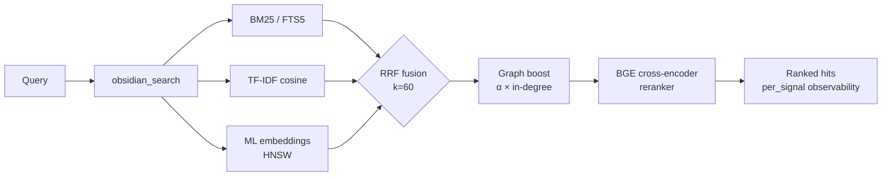

<div align="center">

<a href="https://github.com/oomkapwn/enquire-mcp"></a>

# enquire-mcp

<sub>[English](./README.md) · [中文](./README.zh.md) · [Español](./README.es.md) · [हिन्दी](./README.hi.md) · [العربية](./README.ar.md) · **Русский** · [Português](./README.pt.md) · [Français](./README.fr.md) · [日本語](./README.ja.md) · [한국어](./README.ko.md) · [Deutsch](./README.de.md)</sub>

<sub>**TL;DR для AI-агентов** — MCP-сервер, открывающий локальное Obsidian-хранилище из markdown-файлов для Claude Code, Claude Desktop, Cursor, ChatGPT, Codex и OpenClaw как постоянную поисковую память. Гибридный поиск (BM25 + ML-эмбеддинги + BGE-реранкер, объединённые через RRF), HNSW + int8-квантизация, агентный RAG (HyDE + декомпозиция на подвопросы), GraphRAG-light, PDF + OCR, автономные Bases. Нейтральность к вендору, MIT, ноль обращений в облако в режиме serve. Установка: `npm i -g @oomkapwn/enquire-mcp`. Документация: [llms.txt](https://github.com/oomkapwn/enquire-mcp/blob/main/llms.txt) · [AGENTS.md](https://github.com/oomkapwn/enquire-mcp/blob/main/AGENTS.md) · [API](https://oomkapwn.github.io/enquire-mcp/).</sub>

### Самый продвинутый Obsidian MCP. Долговременная память для AI-агентов.

**Хватит заново объяснять контекст Claude, Cursor, ChatGPT, Codex, OpenClaw в каждой сессии. Ваши заметки Obsidian становятся общей поисковой памятью для всех MCP-совместимых агентов — ваши знания, любая модель, навсегда ваши.**

[](https://github.com/oomkapwn/enquire-mcp/actions/workflows/ci.yml)
[](https://www.npmjs.com/package/@oomkapwn/enquire-mcp)
[](https://www.npmjs.com/package/@oomkapwn/enquire-mcp)
[](#️-доверие)
[](./STABILITY.md)
[](https://slsa.dev/spec/v1.0/levels#build-l2)
[](https://modelcontextprotocol.io/)
[](./LICENSE)

**[⚡ Установка за 30 секунд](#-быстрый-старт) · [🧠 Сценарии использования](#-сценарии-использования) · [📊 Бенчмарки](./docs/benchmarks.md) · [📖 Справочник API](https://oomkapwn.github.io/enquire-mcp/) · [💬 Сравнение с альтернативами](./docs/COMPARISON.md)**

**Claude Code — одна строка:**

```bash
claude mcp add obsidian -- npx -y @oomkapwn/enquire-mcp serve --vault ~/Documents/Obsidian\ Vault
```

</div>

> 📌 Этот документ — перевод [README.md](./README.md) на русский язык, для удобства русскоязычных читателей; при любых расхождениях **приоритет имеет английская версия** (она обновляется с каждым релизом).

---

## Проблема

Каждая AI-сессия начинается с нуля. Вы заново объясняете свой проект, свои дизайнерские решения, выводы прошлонедельного исследования. Вендорские функции «памяти» ([Claude Memory](https://www.anthropic.com/news/memory-and-tool-use), [ChatGPT Memory](https://openai.com/index/memory-and-new-controls-for-chatgpt/), память Cursor) запирают ваши знания в облаке одного провайдера — и снова забывают их, когда вы меняете инструмент. **Ваши знания постоянно начинаются заново.**

## Решение

Ваше хранилище Obsidian становится **постоянной, доступной для запросов долговременной памятью** для любого MCP-совместимого агента. Одна установка — и ваши знания мгновенно доступны из Claude Code, Claude Desktop, Cursor, кастомного GPT в ChatGPT, Codex, OpenClaw и любого другого MCP-клиента. Обычные markdown-файлы, **которыми владеете вы**, индексируются локально, ищутся с помощью полного современного IR-стека и вспоминаются в каждой сессии и с каждой моделью.

**Опора на ваш текст, а не извлечение.** Инструменты памяти для диалогов (mem0, Zep, Supermemory, Memobase) *извлекают* факты из ваших чат-логов в отдельное хранилище, которое вы не можете прочитать. enquire-mcp устроен наоборот: он **опирается на знания, которые вы уже записали** — на ваши собственные `.md`-заметки, дословно, со ссылками — поэтому возвращаемые результаты можно проверить, отредактировать в любом редакторе, и они никогда не являются сводкой-с-потерями чата, который вы помните лишь наполовину. И в отличие от серверных платформ ***флотовой*** памяти — многопользовательских облачных хранилищ, перефразирующих трафик агентов в общую базу данных, — enquire **однопользовательский и local-first**: одно хранилище, которым вы владеете целиком и которое можете сами читать, редактировать и удалять, с нулём обращений в облако в режиме serve. (Критика про «извлечение» относится именно к когорте чат-памяти — но не к инструментам построения графов знаний / ETL вроде cognee, и не к собратьям по персональному поиску вроде Khoj.)

**Опора на ваш текст — и с учётом свежести.** Вспомнить факт — это лишь половина задачи; знать, *верен* ли он до сих пор, — вторая половина. [Бенчмарк Memora](https://arxiv.org/abs/2604.20006) (апрель 2026) показал, что системы памяти систематически проваливаются на повторном использовании устаревших фактов — вспоминают годовалую заметку так, будто она написана сегодня. Поскольку память enquire — это *и есть* ваши настоящие markdown-файлы, каждый найденный результат несёт `age_days` + флаг `stale`, выведенные из реального времени последнего изменения заметки, и вы можете включить ранжирование с учётом давности (`--recency-weight`), чтобы более свежие заметки всплывали первыми. Ваши знания с учётом свежести — а не вневременной ком.

> **Что отличает enquire-mcp**:
> 1. **Нейтральность к вендору.** Ваша память живёт в `.md`-файлах. Переключитесь с Claude на Cursor — ваша память переезжает с вами.
> 2. **Лучший в классе поиск.** Гибрид BM25 + многоязычные эмбеддинги + кросс-энкодер-реранкер BGE, объединённые через RRF, масштабируемые с HNSW + int8-квантизацией. Тот же IR-стек, который построил бы поисковый стартап, — в открытом коде, в одном бинарнике.
> 3. **Ноль обращений в облако в режиме serve.** Модели кешируются локально (однократная загрузка с HuggingFace). Содержимое вашего хранилища никогда не покидает вашу машину. По умолчанию безопасно для изолированных сред.
> 4. **Поиск с учётом свежести.** Каждый результат сообщает, насколько стара заметка; опциональное переранжирование по давности позволяет агенту предпочитать свежие знания и помечать устаревшие факты для повторной проверки — рубеж «осознания забывания», построенный на `mtime`, который ваши файлы уже имеют.

**46 инструментов · 19 MCP-промптов · 1548+ модульных тестов · 50+ языков · стабильная ветка v3.11.x · с гарантиями semver · MIT · подтверждённая сборка в npm (SLSA L2).**

---

## 🏆 Почему он лучший

**Шесть возможностей, которых нет вообще ни у одного другого Obsidian-MCP** (GraphRAG-light, автономное выполнение `.base`, HyDE, int8-квантизация, late-chunking, встроенный фреймворк оценки). **Плюс весь современный IR-стек** (BM25 + ML-эмбеддинги + кросс-энкодер-реранкинг + HNSW), из которого конкуренты предлагают в лучшем случае один-два компонента. Сравнение бок о бок:

| Возможность | enquire-mcp | Smart Connections | Другие Obsidian-MCP |
|---|:---:|:---:|:---:|
| Гибридный поиск (BM25 + TF-IDF + ML-эмбеддинги, объединение через RRF) | ✅ | ❌ | ❌ |
| **Кросс-энкодер-реранкинг** (BGE, +15.5 NDCG@10 по замерам) | ✅ | ❌ | ❌ |
| **Векторный индекс HNSW** (top-K за менее чем 10 мс, с персистентностью) | ✅ | ❌ | ❌ |
| **int8-квантизация векторов** (embed-db примерно в 4× меньше) | ✅ | ❌ | ❌ |
| **Late-chunking** — эмбеддинги с учётом контекстного окна | ✅ | ❌ | ❌ |
| **PDF, вплетённые в гибридный поиск** (цитаты `[page: N]`) | ✅ | ❌ | ❌ |
| **OCR для отсканированных PDF** (Tesseract.js, многоязычный) | ✅ | ❌ | ❌ |
| **Усиление по wikilink-графу** как сигнал поиска | ✅ | ❌ | ❌ |
| **Многоязычный семантический поиск** (50+ языков, на устройстве) | ✅ | 💰 платно | ❌ |
| **Встроенный фреймворк оценки качества поиска** (NDCG, Recall, MRR, A/B-матрица) | ✅ | ❌ | ❌ |
| **Удалённый MCP** через HTTP + bearer-аутентификация + сессии с состоянием | ✅ | ❌ | частично |
| **Наблюдаемость по каждому сигналу** для каждого результата | ✅ | ❌ | ❌ |
| **MCP-нативность** (Claude · Cursor · ChatGPT · Codex · OpenClaw · любой клиент) | ✅ | ❌ только Obsidian | по-разному |
| **Фильтр приватности**, проверяемый на каждом пути поиска и записи | ✅ | н/д | ❌ |
| **46 продакшен-инструментов** (34 всегда включённых на чтение + 4 опциональных + 7 управляемых на запись + 1 инструмент обратной связи) | ✅ | н/д | по-разному |
| **GraphRAG-light** (детекция сообществ по wikilink-графу через модулярность Лувена) | ✅ **только здесь** | ❌ | ❌ |
| **Автономное выполнение `.base`-запросов** (работает без запущенного Obsidian) | ✅ **только здесь** | ❌ | ❌ делегирует Obsidian |
| **HyDE-поиск** (Gao et al 2023) + декомпозиция на подвопросы | ✅ **только здесь** | ❌ | ❌ |
| **1548 модульных тестов · 9 обязательных + 5 совещательных CI-гейтов на каждый PR** | ✅ | н/д | редко |
| **Подтверждённое происхождение сборки** (npm + Sigstore, SLSA Build L2) | ✅ | н/д | ❌ |
| **Публичная поверхность с гарантиями semver** ([STABILITY.md](./STABILITY.md)) | ✅ | н/д | ❌ |
| Автономность (плагин Obsidian не нужен) | ✅ | ❌ требует Obsidian | по-разному |
| Лицензия | MIT, бесплатно | проприетарная, платная | по-разному |

<sub>Сравнение основано на публично заявленных возможностях каждого проекта по состоянию на стабильную ветку v3.8.x (первоначальный срез v3.7.0 / 2026-05-15; обновлено в v3.8.4). Smart Connections — это платный плагин Obsidian (не MCP-сервер). «Другие Obsidian-MCP» — это публичные открытые Obsidian-MCP-серверы на GitHub на момент написания. Публичные сквозные бенчмарки поиска для enquire-mcp опубликованы в <a href="./docs/benchmarks.md"><code>docs/benchmarks.md</code></a> — измеренная дельта `rerank-bge` составляет +24.7 MRR / +15.5 NDCG@10 относительно чистого гибрида на абляции из 60 запросов.</sub>

> Стратегическое утверждение: enquire-mcp — это открытый бэкенд для [LLM-вики в стиле Karpathy](https://gist.github.com/karpathy/442a6bf555914893e9891c11519de94f) поверх вашего существующего хранилища Obsidian. Знания, которые накапливаются и прослеживаются до источников.

---

## ⚡ Быстрый старт

```bash
npm install -g @oomkapwn/enquire-mcp
enquire-mcp serve --vault ~/Documents/Obsidian\ Vault
```

Подключите к любому MCP-клиенту:

```json
{
  "mcpServers": {
    "obsidian": {
      "command": "npx",
      "args": ["-y", "@oomkapwn/enquire-mcp", "serve", "--vault", "/path/to/vault"]
    }
  }
}
```

📂 Готовые конфигурации в [`examples/`](./examples/) — **Claude Desktop**, **Cursor**, **кастомный GPT в ChatGPT** (удалённый MCP по HTTP), плюс образец набора запросов для фреймворка оценки.

**Нужна вся мощь гибридного поиска?** Однокомандный беспроблемный онбординг:

```bash
enquire-mcp setup --vault <path>     # загружает модель, строит FTS5 + embed-db
enquire-mcp serve --vault <path> --persistent-index --enable-reranker --use-hnsw
enquire-mcp doctor --vault <path>    # цветная проверка здоровья ✓/⚠/✗
```

---

## 🤖 Настройка в вашем AI-агенте — промпты для копипаста

После установки `enquire-mcp` вставьте эти промпты в вашего агента, чтобы он знал, что хранилище доступно как память.

<details>
<summary><b>Claude Code (терминал)</b> — добавить MCP-сервер + первый промпт</summary>

```bash
# Добавьте MCP-сервер в конфиг Claude Code (однократно)
claude mcp add obsidian -- npx -y @oomkapwn/enquire-mcp serve --vault ~/Documents/Obsidian\ Vault
```

Затем в любой сессии Claude Code:

> Теперь у тебя есть инструменты `obsidian_*`, которые ищут и читают моё хранилище Obsidian — мою долговременную память. Прежде чем отвечать на вопросы о проектах, решениях, людях или техническом контексте, вызывай `obsidian_search` с релевантными терминами. Подкрепляй каждый факт ссылкой на заметку-источник (и `[page: N]` для PDF). Если ты не нашёл релевантную заметку, так и скажи — не угадывай.

</details>

<details>
<summary><b>Claude Desktop</b> — файл конфигурации + первый промпт</summary>

Скопируйте [`examples/claude-desktop-hybrid.json`](./examples/claude-desktop-hybrid.json) в MCP-конфиг Claude Desktop (сначала отредактируйте путь к хранилищу). Перезапустите Claude Desktop, затем:

> У тебя подключено моё хранилище Obsidian как поисковая память через инструменты `obsidian_*`. Всегда сначала проверяй `obsidian_search`, когда я спрашиваю о чём-либо в моих заметках — контекст встреч, исследования, решения, дневниковые записи. На каждом факте цитируй путь к заметке-источнику.

</details>

<details>
<summary><b>Cursor</b> — конфиг MCP stdio + правило агента</summary>

Скопируйте [`examples/cursor-mcp.json`](./examples/cursor-mcp.json) в `~/.cursor/mcp.json` (отредактируйте путь к хранилищу). В вашем файле `.cursorrules` или в чате:

> Прежде чем предлагать код, затрагивающий тему, по которой у меня могут быть заметки (архитектурные решения, API-контракты, оценки вендоров), сначала вызови `obsidian_search`. Считай моё хранилище Obsidian авторитетным контекстом.

</details>

<details>
<summary><b>Кастомный GPT в ChatGPT</b> — удалённый MCP по HTTP</summary>

Следуйте [`examples/chatgpt-actions.md`](./examples/chatgpt-actions.md), чтобы открыть `serve-http` через туннель с bearer-аутентификацией. В инструкциях вашего кастомного GPT:

> У тебя есть доступ на чтение к моему хранилищу Obsidian через семейство инструментов `obsidian_*`. Ищи, прежде чем отвечать на что-либо, что может быть в моих заметках; на каждом утверждении цитируй путь к файлу-источнику.

</details>

<details>
<summary><b>OpenClaw / Codex / любой другой MCP-клиент</b></summary>

Та же команда `npx -y @oomkapwn/enquire-mcp serve --vault <path>` работает для любого MCP-совместимого клиента. Смотрите собственную документацию клиента по конфигурации MCP, чтобы понять, куда поместить запись о сервере, затем используйте любой из промптов выше.

</details>

**Многоразовое правило агента** (вставьте в любой `AGENTS.md` / `CLAUDE.md` / `.cursorrules`, чтобы агент знал, *когда* обращаться к хранилищу):

> Когда мой вопрос затрагивает мои собственные заметки, решения, проекты, людей или исследования, **сначала ищи в моём хранилище Obsidian** через инструменты `obsidian_*` (начни с `obsidian_search`) и цитируй заметку-источник на каждом факте. Предпочитай enquire для *концептуального / кросс-языкового / «что я говорил про X»* припоминания; используй обычный `grep` / `ripgrep` для точных буквальных строк. Если ничего релевантного не вернулось, так и скажи — не угадывай.

### Примеры запросов, которые хорошо работают

- *«Найди каждую заметку, где я обсуждал ценовую стратегию, и обобщи её эволюцию.»* — RRF-объединение + реранкер обрабатывают «эволюцию» семантически
- *«Каким было моё решение по PostgreSQL против MongoDB? Сошлись на дневниковую заметку.»* — усиление по wikilink-графу всплывает центральный документ с решением
- *«Анализируй мои заметки о RAG за последние 3 месяца»* — многоязычные эмбеддинги + фильтр по дате из frontmatter
- *«На каких страницах PDF статьи LLaMA-3 говорится о масштабировании?»* — PDF вплетены в поиск с цитатами `[page: N]`
- *«Покажи тематические сообщества в моём исследовательском хранилище — какие темы я изучал?»* — `obsidian_get_communities` (GraphRAG-light)

---

## 🧠 Сценарии использования

**1 — Долговременная память для AI-агентов.** Подключите ваше хранилище Obsidian к любому MCP-совместимому агенту (Claude Code, Claude Desktop, Cursor, ChatGPT, Codex, OpenClaw). Теперь у агента есть устойчивое семантическое припоминание по каждой заметке о встрече, дневниковой записи, исследовательскому логу и документу с решением, которые вы когда-либо писали — между сессиями, моделями и провайдерами. В отличие от `Claude Memory` или `ChatGPT Memory`, ваши знания не заперты в облаке одного вендора; они живут в обычном markdown, которым вы владеете и который можете свободно мигрировать.

**2 — Персональная база знаний / второй мозг.** Гибридный поиск всплывает нужную заметку при *любой* формулировке, на любом из 50+ языков. Спросите по-английски о русскоязычной дневниковой записи двухлетней давности — получите правильный результат. Усиление по wikilink-графу переранжирует заметки, находящиеся в центре вашего графа знаний. GraphRAG-light всплывает тематические сообщества — открывайте связи, которые вы забыли, что создавали. PDF вплетаются в поиск с цитатами `[page: N]`, так что научные статьи и расшифровки встреч становятся первоклассной памятью.

**3 — Агентный RAG / контекст-инжиниринг.** `obsidian_search` раскрывает оценки по каждому сигналу, так что агент видит, *почему* каждый результат так ранжирован. HyDE заранее переписывает расплывчатые запросы в богатые гипотетические ответы перед поиском. Декомпозиция на подвопросы обрабатывает многошаговые вопросы («как развивалась наша ценовая стратегия и какой была реакция клиентов?»), разбивая их на независимые подзапросы и объединяя результаты. Встроенный фреймворк оценки (NDCG / Recall / MRR) позволяет измерять качество поиска на ваших собственных запросах, а не доверять вендорским бенчмаркам.

---

## 🚫 Когда enquire-mcp *не* тот инструмент

Честные не-цели — обратитесь к чему-то другому, когда:

- **Вам нужен буквальный строковый / regex-поиск.** `ripgrep` / `grep` быстрее и точнее для «найди этот точный токен». enquire блистает на *концептуальном* припоминании — синонимы, кросс-язык, «что я говорил про X». Используйте оба: `rg` для буквального, enquire для смысла.
- **Ваши знания живут в чат-логах, а не в заметках.** enquire *опирается* на markdown, который вы написали. Инструменты памяти для диалогов (mem0, Zep, Supermemory), которые *извлекают* факты из расшифровок чатов в отдельное хранилище, — это другая категория, см. [сравнение](./docs/COMPARISON.md).
- **Вам нужен многопользовательский / хостируемый / синхронизируемый поиск.** enquire по дизайну local-first и однохранилищный — без серверного многопользовательского индекса.
- **Ваши источники — не Markdown и не PDF.** `.md` / `.canvas` / `.base` / `.pdf` — первоклассные; другие форматы требуют предварительной конвертации.
- **Вам нужен графический интерфейс или встроенный плагин Obsidian.** enquire — это headless MCP-сервер / CLI: он *дополняет* Obsidian, а не является им. (Smart Connections — это вариант встроенного плагина.)
- **Вам нужен субмиллисекундный поиск по миллионам заметок.** HNSW даёт top-K за менее чем 10 мс на больших масштабах, но enquire нацелен на персональные / командные хранилища, а не на корпуса веб-масштаба.

---

## 📖 Справочник API

Автогенерируемый **[справочник API на oomkapwn.github.io/enquire-mcp](https://oomkapwn.github.io/enquire-mcp/)** — каждый инструмент, промпт и экспортируемый хелпер с полным TSDoc (`@param` / `@returns` / `@example`). Пересобирается из исходников при каждом push в `main` через [`publish-docs.yml`](https://github.com/oomkapwn/enquire-mcp/blob/main/.github/workflows/publish-docs.yml) (TypeDoc → GitHub Pages). Свободен от рассинхронизации по построению: тот же TSDoc, который видят AI-агенты и IDE, и публикуется.

---

## 🏗️ Как работает поиск



`obsidian_search` автоматически определяет доступные сигналы и плавно деградирует. Усиление по wikilink-графу переранжирует top-K через одношаговый персонализированный PageRank. Опциональный кросс-энкодер-реранкинг переоценивает top-N, давая +15.5 NDCG@10 по замерам. Каждый результат возвращает `per_signal: { bm25, tfidf, embeddings }`, так что вы видите, ПОЧЕМУ он так ранжирован.

| Уровень | Настройка | Что вы получаете |
|---|---|---|
| **1** | `serve --vault <path>` | TF-IDF косинус (ноль настройки, мгновенно) |
| **2** | + `--persistent-index` | + BM25 / FTS5 (top-10 за менее чем 100 мс) |
| **3** | + `setup` (загружает модель + строит embed-db) | + многоязычные ML-эмбеддинги |
| **4** | + `--enable-reranker` | + кросс-энкодер BGE (+15.5 NDCG@10 по замерам) |
| **5** | + `--use-hnsw` | + top-K за менее чем 10 мс на масштабе в миллионы чанков |
| **6** | + `--include-pdfs` | + PDF, вплетённые во всё вышеперечисленное |
| **7** | `serve-http --bearer-token …` | + удалённый MCP (веб Claude.ai, ChatGPT, Cursor по HTTP, мобильные) |

---

## 🛠️ Все 46 инструментов

Всего 46 инструментов: 34 всегда включённых на чтение (включая зонтичный `obsidian_search`) + 4 опциональных на чтение + 7 управляемых на запись + 1 инструмент обратной связи с замкнутым контуром. Полный справочник: **[docs/api.md](./docs/api.md)**.

| Категория | Инструменты |
|---|---|
| **Поиск и извлечение** | `obsidian_search` (зонтичный, объединение через RRF) · `obsidian_hyde_search` (с HyDE-аугментацией, v3.1.0) · `obsidian_search_text` · `obsidian_full_text_search` · `obsidian_semantic_search` · `obsidian_embeddings_search` · `obsidian_find_similar` |
| **Wikilink и граф** | `obsidian_resolve_wikilink` · `obsidian_get_backlinks` · `obsidian_get_outbound_links` · `obsidian_get_note_neighbors` · `obsidian_get_unresolved_wikilinks` · `obsidian_find_path` · `obsidian_get_communities` (v3.4.0, GraphRAG-light) |
| **Frontmatter и Dataview** | `obsidian_frontmatter_get` · `obsidian_frontmatter_search` · `obsidian_dataview_query` · `obsidian_list_tags` |
| **Чтение и навигация** | `obsidian_read_note` · `obsidian_list_notes` · `obsidian_get_recent_edits` · `obsidian_stale_notes` · `obsidian_open_questions` · `obsidian_context_pack` · `obsidian_chat_thread_read` · `obsidian_open_in_ui` · `obsidian_stats` |
| **PDF, Canvas и Bases** | `obsidian_read_pdf` · `obsidian_list_pdfs` · `obsidian_ocr_pdf` · `obsidian_read_canvas` · `obsidian_list_canvases` · `obsidian_list_bases` (v3.2.0) · `obsidian_read_base` (v3.2.0) · `obsidian_query_base` (v3.2.0) |
| **Запись** (управляется через `--enable-write`) | `obsidian_create_note` · `obsidian_append_to_note` · `obsidian_rename_note` · `obsidian_replace_in_notes` · `obsidian_archive_note` · `obsidian_frontmatter_set` · `obsidian_chat_thread_append` |
| **Диагностика / линтинг** | `obsidian_lint_wiki` · `obsidian_paper_audit` · `obsidian_validate_note_proposal` |
| **Обратная связь** (опционально через `--feedback-weight`) | `obsidian_mark_useful` (замкнутый контур: фиксирует, какие из вспомненных заметок помогли; усиливает их в будущем поиске) |

Плюс 3 MCP-ресурса (`obsidian://vault/info`, `obsidian://note/{path}`, `obsidian://chunk/{n}/{path}`) и 19 **MCP-промптов** (`summarize_recent_edits` · `review_tag` · `find_orphans` · `weekly_review` · `extract_todos` · `process_inbox` · `consolidate_tags` · `find_duplicates` · `lint_wiki` · `monthly_review` · `search_with_query_expansion` · `vault_synth` · `vault_wiki_compile` · `vault_lint_extended` · `vault_capture` · `vault_persona_search` · `vault_automation_setup` · `vault_research` · `vault_synthesis_page`) для типовых рабочих процессов с хранилищем.

---

## 🛡️ Доверие

| Поверхность | Позиция |
|---|---|
| **По умолчанию** | Только чтение — для 7 инструментов записи требуется `--enable-write` |
| **Минимум привилегий** | `--disabled-tools` / `--enabled-tools` открывают минимальную поверхность (например, исследовательскому агенту только-на-чтение достаются лишь `obsidian_search` + `obsidian_read_note`) |
| **Безопасность путей** | Проверка realpath на каждом чтении+записи; символьные ссылки за пределы хранилища отклоняются |
| **Фильтр приватности** | Проверяется на путях FTS5 + embed-db + chunk-ресурсов; fail-closed при пустых allow-/deny-списках |
| **HTTP-транспорт** | Bearer-аутентификация (SHA-256 с постоянным временем + `timingSafeEqual`), ограничение частоты по токену, строгий CORS |
| **Frontmatter** | `js-yaml@5` `load` (YAML 1.2 core schema, безопасно по умолчанию) — без выполнения кода |
| **Файлы кеша + индекса** | chmod 0600, родительская директория 0700 |
| **CI** | **9 обязательных** гейтов защиты ветки: (1) `lint`, (2) `test` на Node 22, (3) `test` на Node 24, (4) `smoke`, (5) `audit`, (6) `coverage`, (7) `version-consistency`, (8) `docs`, (9) `oia`. **5 совещательных**: `test-macos` + `docker` (сборка Dockerfile + smoke-интроспекция `tools/list`) через `.github/workflows/ci.yml`; CodeQL ×2 + Analyze actions через [настройку по умолчанию в GitHub](https://docs.github.com/code-security/code-scanning/automatically-scanning-your-code-for-vulnerabilities-and-errors/configuring-default-setup-for-code-scanning) (не файлы workflow). Release-workflow повторно проверяет, что все 9 обязательных прошли на помеченном SHA, перед публикацией в npm. _v3.7.10 — `docs` (гейт генерации TypeDoc) добавлен в обязательный набор. v3.7.13 — нижняя граница `engines.node` поднята до `>=22.13.0`, чтобы соответствовать CI-матрице. v3.8.0-rc.6 — `oia` (Outside-In Audit) повышен с совещательного._ |
| **Покрытие** | Строки ≥86% · выражения ≥82% · функции ≥75% · ветви ≥74% (контролируется гейтом) |
| **Релизы** | npm + релиз на GitHub на каждый тег · semver · **подтверждённое происхождение сборки** (npm + Sigstore, SLSA Build L2; генератор L3 в дорожной карте) |
| **Стабильность** | v3.0+ с гарантиями semver — каждый CLI-флаг, имя инструмента, MCP-ресурс, промпт, экспортируемый символ является контрактом |

Полная позиция: **[SECURITY.md](./SECURITY.md)** · Поверхность стабильности: **[STABILITY.md](./STABILITY.md)** · Уязвимости: `oomkapwn@gmail.com`.

---

## ❓ FAQ

**Нужно ли устанавливать Obsidian?** Нет. Читает `.md` + `.canvas` + `.pdf` напрямую. Работает с любым хранилищем в формате Obsidian.

**Будет ли он писать в моё хранилище?** Нет, если только вы не передадите `--enable-write`. Все 7 инструментов записи управляемы; деструктивные поддерживают `dry_run`.

**Куда-нибудь отправляются данные?** Только при `enquire-mcp install-model` (загружает ONNX-веса с HuggingFace, однократно). Режим serve никогда не делает исходящих HTTP-запросов. Эмбеддинги + реранкер работают на CPU локально.

**Производительность?** Холодная сборка FTS5: ~5с/1k заметок, ~30с/50k. BM25-запрос: <100 мс всегда. Сборка эмбеддингов: ~30 мс/чанк на M1. **HNSW top-10: менее 10 мс на любом масштабе.** Холодный старт serve: ~50 мс при персистентности HNSW.

**Языки?** По умолчанию `paraphrase-multilingual-MiniLM-L12-v2` (50+ языков). Многоязычный кросс-энкодер. Проверено сквозным образом на двуязычных русско-английских хранилищах. Токенизация CJK/тайского/кхмерского через `Intl.Segmenter`.

**Запуск удалённо?** Да — `serve-http` открывает тот же сервер по [Streamable HTTP](https://modelcontextprotocol.io/specification/2025-06-18/basic/transports#streamable-http). Поставьте впереди Tailscale Funnel или Cloudflare Tunnel для HTTPS. Работает с вебом claude.ai, кастомным GPT в ChatGPT, режимом HTTP в Cursor, мобильными MCP-клиентами. См. **[docs/http-transport.md](./docs/http-transport.md)**.

---

## 🚀 Релизы

**v3.0.0 — стабильный канал.** Дорожная карта поиска ветки v2.x завершена, и публичная поверхность теперь [с гарантиями semver](./STABILITY.md). Подборка ключевых моментов:

`v2.0` гибридный поиск (BM25+TF-IDF+эмбеддинги через RRF) · `v2.6` удалённый MCP · `v2.7-2.8` вплетённые PDF · `v2.9` BGE-реранкер · `v2.10` OCR · `v2.11` doctor + setup · `v2.12` фреймворк оценки · `v2.13` HNSW · `v2.14` сессии с состоянием · `v2.15` late-chunking · `v2.16` персистентность HNSW · `v2.17` int8-квантизация · `v3.8.0` стабильная · `v3.8.7` усиление HTTP-транспорта · **`v3.9.0` стабильная**: embed-синхронизация watcher для PDF с OCR, живое обновление HNSW в памяти при изменении файлов, адаптивное дозаполнение HNSW R-10 (закрывает недовозврат при >66% исключённых). · **`v3.10` стабильная**: свежесть с осознанием забывания — `age_days` + флаг `stale` + опциональное переранжирование `--recency-weight` + `obsidian_search` с учётом frontmatter.

Канал: `npm install @oomkapwn/enquire-mcp` → последняя стабильная (`@latest` = v3.11.x). Предрелиз: `npm install @oomkapwn/enquire-mcp@rc` (последний кандидат на релиз — см. [CHANGELOG.md](./CHANGELOG.md)). Полный список изменений: **[CHANGELOG.md](./CHANGELOG.md)** · Дальнейший план: **[ROADMAP.md](https://github.com/oomkapwn/enquire-mcp/blob/main/ROADMAP.md)**.

---

## 🤝 Участие

```bash
git clone https://github.com/oomkapwn/enquire-mcp.git
cd enquire-mcp && npm install
npm test       # полный набор (1548 тестов, ~12с)
npm run lint   # ноль предупреждений
npm run build  # tsc → dist/
```

Issue, PR и идеи приветствуются. Защита ветки требует ревью PR в `main`.

---

## 📜 Лицензия

MIT. Создано [Alex (@OomkaBear)](https://github.com/oomkapwn). Названо в честь [прототипа WWW Тима Бернерса-Ли 1980 года ENQUIRE](https://en.wikipedia.org/wiki/ENQUIRE) — оригинальной гипертекстовой системы, ещё до веба. Исходная спецификация гласила: вы могли спросить систему о чём угодно. **enquire-mcp приносит это в ваше хранилище.**
