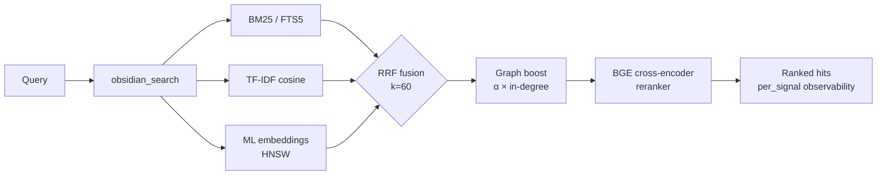

<div align="center">

<a href="https://github.com/oomkapwn/enquire-mcp"></a>

# enquire-mcp

<sub>[English](./README.md) · **中文** · [Español](./README.es.md) · [हिन्दी](./README.hi.md) · [العربية](./README.ar.md) · [Русский](./README.ru.md) · [Português](./README.pt.md) · [Français](./README.fr.md) · [日本語](./README.ja.md) · [한국어](./README.ko.md) · [Deutsch](./README.de.md)</sub>

### 最先进的 Obsidian MCP。为 AI 智能体打造的长期记忆。

**别再每次会话都向 Claude、Cursor、ChatGPT、Codex、OpenClaw 重新解释上下文。你的 Obsidian 笔记成为所有 MCP 兼容智能体之间共享、可检索的记忆——你的知识，任何模型，永远属于你。**

[](https://www.npmjs.com/package/@oomkapwn/enquire-mcp)
[](./STABILITY.md)
[](https://slsa.dev/spec/v1.0/levels#build-l2)
[](https://modelcontextprotocol.io/)
[](./LICENSE)

**[⚡ 30 秒安装](#-快速开始) · [🧠 应用场景](#-应用场景) · [📊 基准测试](./docs/benchmarks.md) · [📖 API 文档](https://oomkapwn.github.io/enquire-mcp/) · [💬 横向对比](./docs/COMPARISON.md)**

**Claude Code —— 一行命令：**

```bash
claude mcp add obsidian -- npx -y @oomkapwn/enquire-mcp serve --vault ~/Documents/Obsidian\ Vault
```

</div>

> 📌 本文档是 [README.md](./README.md) 的中文译本，便于中文读者阅读；如有出入，**以英文版为准**（英文版随每次发布更新）。

---

## 问题

每次 AI 会话都从零开始。你一遍遍重复你的项目、你的设计决策、上周调研的结论。各家厂商的"记忆"功能（[Claude Memory](https://www.anthropic.com/news/memory-and-tool-use)、[ChatGPT Memory](https://openai.com/index/memory-and-new-controls-for-chatgpt/)、Cursor memory）把你的知识锁进某一家的云端——当你切换工具时，它又忘得一干二净。**你的知识总在重新开始。**

## 解决方案

让你的 Obsidian 仓库（vault）成为任何 MCP 兼容智能体的**持久、可查询的长期记忆**。一次安装——你的知识立即可被 Claude Code、Claude Desktop、Cursor、ChatGPT 自定义 GPT、Codex、OpenClaw 以及其他所有 MCP 客户端访问。**归你所有**的纯 markdown 文件，本地建立索引，用完整的现代信息检索（IR）技术栈检索，跨越每一次会话、每一个模型被召回。

**扎根于原文，而非抽取。** 对话记忆类工具（mem0、Zep、Supermemory、Memobase）从你的聊天记录里*抽取*事实，存进一个你读不到的独立存储。enquire-mcp 恰恰相反：它**扎根于你已经写下的知识**——你自己的 `.md` 笔记，逐字逐句，附带引用——因此召回结果可审计、可在任意编辑器中编辑，绝不是对你半记得的某次聊天的有损摘要。而与服务端**集群记忆（fleet-memory）**平台（将各智能体的流量改写进共享数据库的多租户云存储）不同，enquire 是单用户、本地优先的——一个完全归你所有、可自行读取／编辑／删除的库，serve 期间零云端调用。（"抽取"这一批评专指对话记忆这一类工具——并不针对 cognee 这类知识图谱／ETL 工具，也不针对 Khoj 这类个人搜索同类产品。）

**扎根——且具备时效感知。** 召回一个事实只是一半；知道它是否*仍然成立*才是另一半。[Memora 基准](https://arxiv.org/abs/2604.20006)（2026 年 4 月）表明，记忆系统普遍在"陈旧事实复用"上失败——把一年前的笔记当作今天写的来召回。因为 enquire 的记忆*就是*你真实的 markdown 文件，每条检索结果都带有从笔记最后修改时间推导出的 `age_days`（天数）与 `stale`（是否陈旧）标记，你还可开启时效加权排序（`--recency-weight`），让较新的笔记优先浮现。你的知识，具备时效感知——而非一团没有时间的混沌。

> **enquire-mcp 的与众不同之处**：
> 1. **厂商中立。** 你的记忆存在 `.md` 文件里。从 Claude 换到 Cursor——记忆随你而来。
> 2. **顶级检索。** 混合 BM25 + 多语言向量嵌入 + BGE 交叉编码器重排，经 RRF 融合，配合 HNSW + int8 量化扩展。一个搜索创业公司会搭建的同款 IR 技术栈——开源，集成在一个二进制里。
> 3. **serve 期间零云端调用。** 向量嵌入模型**在你的机器上**运行，索引的是**你**亲手写下的 markdown——正因如此，它是一次性的本地下载（约 110 MB），而不是一个云端 API 密钥。扎根 + 隐私并非没有代价，我们也不假装它免费：你的仓库内容永不离开本机，默认即可隔离（air-gap）安全运行（[已强制执行](./SECURITY.md)，而非纸面承诺）。
> 4. **时效感知召回。** 每条结果都报告笔记有多旧；可选的时效重排让智能体优先采用新知识，并把陈旧事实标记出来等待复核——这是"遗忘感知"前沿，建立在你的文件本就拥有的 `mtime` 之上。

**46 个工具 · 19 个 MCP 提示词 · 1446+ 单元测试 · 50+ 语言 · v3.11.x 稳定版 · 语义化版本约束 · MIT · npm 构建溯源（SLSA L2）。**

---

## 🏆 为什么它是最好的

**六项其他 Obsidian-MCP 完全没有的能力**（GraphRAG-light、独立 `.base` 执行、HyDE、int8 量化、late-chunking、内置评测套件），**外加整套现代 IR 技术栈**（BM25 + 向量嵌入 + 交叉编码器重排 + HNSW），而竞品至多只有其中一两项。横向对比：

| 能力 | enquire-mcp | Smart Connections | 其他 Obsidian-MCP |
|---|:---:|:---:|:---:|
| 混合检索（BM25 + TF-IDF + 向量嵌入，RRF 融合） | ✅ | ❌ | ❌ |
| **交叉编码器重排**（BGE，实测 +15.5 NDCG@10） | ✅ | ❌ | ❌ |
| **HNSW 向量索引**（sub-10ms top-K，持久化） | ✅ | ❌ | ❌ |
| **int8 向量量化**（向量库体积约 1/4） | ✅ | ❌ | ❌ |
| **late-chunking** 上下文窗口向量嵌入 | ✅ | ❌ | ❌ |
| **PDF 融入混合检索**（`[page: N]` 引用） | ✅ | ❌ | ❌ |
| **扫描版 PDF 的 OCR**（Tesseract.js，多语言） | ✅ | ❌ | ❌ |
| **Wikilink 图增强**检索信号 | ✅ | ❌ | ❌ |
| **多语言语义搜索**（50+ 语言，本地运行） | ✅ | 💰 付费 | ❌ |
| **内置检索质量评测套件**（NDCG、Recall、MRR、A/B 矩阵） | ✅ | ❌ | ❌ |
| **远程 MCP**（HTTP + bearer 鉴权 + 有状态会话） | ✅ | ❌ | 部分 |
| **逐路信号可观测性**（每条命中） | ✅ | ❌ | ❌ |
| **MCP 原生**（Claude · Cursor · ChatGPT · Codex · OpenClaw · 任意客户端） | ✅ | ❌ 仅 Obsidian | 不一 |
| **隐私过滤**在每条检索 + 写入路径校验 | ✅ | 不适用 | ❌ |
| **46 个生产级工具**（34 常驻读 + 4 可选 + 7 受控写 + 1 反馈） | ✅ | 不适用 | 不一 |
| **GraphRAG-light**（Louvain 模块度社群检测） | ✅ **独有** | ❌ | ❌ |
| **独立 `.base` 查询执行**（无需运行 Obsidian） | ✅ **独有** | ❌ | ❌ 委托给 Obsidian |
| **HyDE 检索**（Gao et al. 2023）+ 子问题分解 | ✅ **独有** | ❌ | ❌ |
| **1446 单元测试 · 每个 PR 9 项必需 + 5 项指导性 CI 门禁** | ✅ | 不适用 | 罕见 |
| **签名构建溯源**（npm + Sigstore，SLSA Build L2） | ✅ | 不适用 | ❌ |
| **语义化版本约束的公开接口**（[STABILITY.md](./STABILITY.md)） | ✅ | 不适用 | ❌ |
| 独立运行（无需 Obsidian 插件） | ✅ | ❌ 需 Obsidian | 不一 |
| 许可证 | MIT，免费 | 专有，付费 | 不一 |

<sub>对比基于各项目截至 v3.8.x 稳定版的公开能力（初始快照 v3.7.0 / 2026-05-15；v3.8.4 刷新）。Smart Connections 是付费 Obsidian 插件（非 MCP 服务）。"其他 Obsidian-MCP"指撰写时 GitHub 上的公开开源 Obsidian-MCP 服务。enquire-mcp 的端到端检索基准发布于 <a href="./docs/benchmarks.md"><code>docs/benchmarks.md</code></a>——实测 `rerank-bge` 相对纯混合检索为 +24.7 MRR / +15.5 NDCG@10（60 条查询消融）。</sub>

> 战略定位：enquire-mcp 是构建在你现有 Obsidian 仓库之上的 [Karpathy 式 LLM Wiki](https://gist.github.com/karpathy/442a6bf555914893e9891c11519de94f) 的开源后端。可复利、可溯源的知识。

---

## ⚡ 快速开始

```bash
npm install -g @oomkapwn/enquire-mcp
enquire-mcp serve --vault ~/Documents/Obsidian\ Vault
```

接入任意 MCP 客户端：

```json
{
  "mcpServers": {
    "obsidian": {
      "command": "npx",
      "args": ["-y", "@oomkapwn/enquire-mcp", "serve", "--vault", "/path/to/vault"]
    }
  }
}
```

📂 开箱即用的配置见 [`examples/`](./examples/) —— **Claude Desktop**、**Cursor**、**ChatGPT 自定义 GPT**（通过 HTTP 的远程 MCP），以及一份评测用的示例查询集。

**想要完整的混合检索能力？** 一条命令，零配置上手：

```bash
enquire-mcp setup --vault <path>     # 下载模型，构建 FTS5 + 向量库
enquire-mcp serve --vault <path> --persistent-index --enable-reranker --use-hnsw
enquire-mcp doctor --vault <path>    # 彩色 ✓/⚠/✗ 健康检查
```

---

## 🤖 在你的 AI 智能体中配置 —— 复制粘贴提示词

`enquire-mcp` 安装完成后，把下面这些提示词粘贴进你的智能体，让它知道仓库已作为记忆可用。

<details>
<summary><b>Claude Code（终端）</b> —— 添加 MCP 服务 + 首条提示词</summary>

```bash
# 把 MCP 服务添加到你的 Claude Code 配置（一次即可）
claude mcp add obsidian -- npx -y @oomkapwn/enquire-mcp serve --vault ~/Documents/Obsidian\ Vault
```

随后在任意 Claude Code 会话中：

> 你现在拥有 `obsidian_*` 工具，可以搜索并读取我的 Obsidian 仓库——我的长期记忆。在回答关于项目、决策、人物或技术上下文的问题之前，先用相关关键词调用 `obsidian_search`。每条事实都用来源笔记标注引用（PDF 用 `[page: N]`）。如果找不到相关笔记，就直说——不要猜。

</details>

<details>
<summary><b>Claude Desktop</b> —— 配置文件 + 首条提示词</summary>

把 [`examples/claude-desktop-hybrid.json`](./examples/claude-desktop-hybrid.json) 放进 Claude Desktop 的 MCP 配置（先改好仓库路径）。重启 Claude Desktop，然后：

> 你已通过 `obsidian_*` 工具接好了我的 Obsidian 仓库作为可检索记忆。每当我问到笔记里的任何内容——会议上下文、调研、决策、日记条目——都先查 `obsidian_search`。每条事实都引用来源笔记路径。

</details>

<details>
<summary><b>Cursor</b> —— MCP stdio 配置 + 智能体规则</summary>

把 [`examples/cursor-mcp.json`](./examples/cursor-mcp.json) 放到 `~/.cursor/mcp.json`（改好仓库路径）。在你的 `.cursorrules` 文件或聊天中：

> 在提出涉及我可能有笔记的主题（架构决策、API 契约、供应商评估）的代码之前，先调用 `obsidian_search`。把我的 Obsidian 仓库视为权威上下文。

</details>

<details>
<summary><b>ChatGPT 自定义 GPT</b> —— 通过 HTTP 的远程 MCP</summary>

按照 [`examples/chatgpt-actions.md`](./examples/chatgpt-actions.md) 通过带 bearer 鉴权的隧道暴露 `serve-http`。在你的自定义 GPT 的指令中：

> 你通过 `obsidian_*` 工具族对我的 Obsidian 仓库拥有只读访问权限。在回答任何可能在我笔记里的内容之前先搜索；每条断言都引用来源文件路径。

</details>

<details>
<summary><b>OpenClaw / Codex / 任意其他 MCP 客户端</b></summary>

同一条 `npx -y @oomkapwn/enquire-mcp serve --vault <path>` 命令适用于任意 MCP 兼容客户端。查阅该客户端自己的 MCP 配置文档，了解服务条目应放在哪里，然后使用上面任意一条提示词。

</details>

**可复用的智能体规则**（放进任意 `AGENTS.md` / `CLAUDE.md` / `.cursorrules`，让智能体知道*何时*该去查仓库）：

> 当我的问题涉及我自己的笔记、决策、项目、人物或调研时，**先通过 `obsidian_*` 工具搜索我的 Obsidian 仓库**（从 `obsidian_search` 开始），并对每条事实引用来源笔记。*概念性 / 跨语言 / "我关于 X 说过什么"* 类的召回优先用 enquire；精确的字面字符串用普通的 `grep` / `ripgrep`。如果没有相关结果，就直说——不要猜。

### 行之有效的示例查询

- *"找出每一篇我讨论过定价策略的笔记，总结其演变。"* —— RRF 融合 + 重排在语义上处理"演变"
- *"我关于 PostgreSQL 与 MongoDB 的决定是什么？引用日记。"* —— Wikilink 图增强让核心决策文档浮现
- *"Анализируй мои заметки о RAG за последние 3 месяца"* —— 多语言向量嵌入 + frontmatter 日期过滤
- *"LLaMA-3 论文 PDF 的哪几页讲到扩展性？"* —— PDF 融入检索并带 `[page: N]` 引用
- *"展示我研究仓库里的主题社群——我一直在探索哪些主题？"* —— `obsidian_get_communities`（GraphRAG-light）

---

## 🧠 应用场景

**1 —— 为 AI 智能体提供长期记忆。** 把你的 Obsidian 仓库接入任意 MCP 兼容智能体（Claude Code、Claude Desktop、Cursor、ChatGPT、Codex、OpenClaw）。智能体随即拥有对你写过的每一条会议记录、日记、调研日志、决策文档的持久语义召回——跨会话、跨模型、跨厂商。与 `Claude Memory` 或 `ChatGPT Memory` 不同，你的知识不被锁进某家云端；它存在你拥有、可自由迁移的纯 markdown 里。

**2 —— 个人知识库 / 第二大脑。** 混合检索能为*任意*措辞、50+ 语言中的任意一种找到正确的笔记。用英文询问两年前一篇俄文日记，也能命中。Wikilink 图增强会把处于你知识图谱中心的笔记上调排名。GraphRAG-light 发现主题社群——找回你早已忘记自己建立过的联系。PDF 融入检索并带 `[page: N]` 引用，让论文和会议纪要成为一等公民记忆。

**3 —— 智能体 RAG / 上下文工程。** `obsidian_search` 暴露每路信号分数，让智能体看见每条命中*为何*这样排名。HyDE 在检索前把模糊查询改写成内容丰富的假设答案。子问题分解处理多跳问题（"我们的定价策略如何演变，客户反应如何？"），将其拆成相互独立的子查询再融合结果。内置评测套件（NDCG / Recall / MRR）让你在自己的查询上度量检索质量，而非盲信厂商基准。

---

## 🚫 何时 enquire-mcp 并不合适

诚实的非目标——遇到以下情况请另选工具：

- **你要的是字面 / 正则搜索。** `ripgrep` / `grep` 对"精确找这个 token"更快更准。enquire 擅长*概念性*召回——近义词、跨语言、"我关于 X 说过什么"。两者并用：字面用 `rg`，语义用 enquire。
- **你的知识在聊天记录里，而非笔记里。** enquire *扎根*于你亲手写的 markdown。从聊天记录*抽取*事实到独立存储的对话记忆工具（mem0、Zep、Supermemory）是另一个品类——见[对比](./docs/COMPARISON.md)。
- **你需要多用户 / 托管 / 同步搜索。** enquire 设计上是本地优先、单仓库的——没有服务端多租户索引。
- **你的来源不是 Markdown 或 PDF。** `.md` / `.canvas` / `.base` / `.pdf` 是一等公民；其他格式需先转换。
- **你想要图形界面或 Obsidian 内置插件。** enquire 是无界面的 MCP 服务 / CLI——它*补充* Obsidian，而非取代。（Smart Connections 是内置插件选项。）
- **你需要在数百万条笔记上做亚毫秒搜索。** HNSW 在大规模下提供 sub-10ms 的 top-K，但 enquire 面向个人 / 团队仓库，而非网页级语料。

---

## 📖 API 文档

自动生成的 **[API 文档：oomkapwn.github.io/enquire-mcp](https://oomkapwn.github.io/enquire-mcp/)** —— 每个工具、提示词和导出的 helper 都带有完整 TSDoc（`@param` / `@returns` / `@example`）。每次推送到 `main` 时通过 [`publish-docs.yml`](https://github.com/oomkapwn/enquire-mcp/blob/main/.github/workflows/publish-docs.yml) 从源码重建（TypeDoc → GitHub Pages）。从构造上就杜绝漂移：AI 智能体和 IDE 看到的 TSDoc 就是被发布出来的那份。

---

## 🏗️ 检索如何工作



`obsidian_search` 自动探测可用信号并优雅降级。Wikilink 图增强通过单步个性化 PageRank 重排 top-K。可选的交叉编码器重排对 top-N 重新打分，实测 +15.5 NDCG@10。每条命中都返回 `per_signal: { bm25, tfidf, embeddings }`，让你看见它*为何*这样排名。

| 层级 | 启用方式 | 你得到什么 |
|---|---|---|
| **1** | `serve --vault <path>` | TF-IDF 余弦（零配置，即时） |
| **2** | + `--persistent-index` | + BM25 / FTS5（sub-100ms top-10） |
| **3** | + `setup`（下载模型 + 构建向量库） | + 多语言 ML 向量嵌入 |
| **4** | + `--enable-reranker` | + BGE 交叉编码器（实测 +15.5 NDCG@10） |
| **5** | + `--use-hnsw` | + 百万级 chunk 规模下 sub-10ms top-K |
| **6** | + `--include-pdfs` | + PDF 融入以上全部 |
| **7** | `serve-http --bearer-token …` | + 远程 MCP（Claude.ai 网页、ChatGPT、Cursor HTTP、移动端） |

---

## 🛠️ 全部 46 个工具

共 46 个工具：34 个常驻读（含总入口 `obsidian_search`）+ 4 个可选读 + 7 个受控写 + 1 个闭环反馈。完整参考见 **[docs/api.md](./docs/api.md)**。

| 类别 | 工具 |
|---|---|
| **搜索与检索** | `obsidian_search`（总入口，RRF 融合）· `obsidian_hyde_search`（HyDE 增强，v3.1.0）· `obsidian_search_text` · `obsidian_full_text_search` · `obsidian_semantic_search` · `obsidian_embeddings_search` · `obsidian_find_similar` |
| **Wikilink 与图** | `obsidian_resolve_wikilink` · `obsidian_get_backlinks` · `obsidian_get_outbound_links` · `obsidian_get_note_neighbors` · `obsidian_get_unresolved_wikilinks` · `obsidian_find_path` · `obsidian_get_communities`（v3.4.0，GraphRAG-light） |
| **Frontmatter 与 Dataview** | `obsidian_frontmatter_get` · `obsidian_frontmatter_search` · `obsidian_dataview_query` · `obsidian_list_tags` |
| **读取与导航** | `obsidian_read_note` · `obsidian_list_notes` · `obsidian_get_recent_edits` · `obsidian_stale_notes` · `obsidian_open_questions` · `obsidian_context_pack` · `obsidian_chat_thread_read` · `obsidian_open_in_ui` · `obsidian_stats` |
| **PDF、Canvas 与 Bases** | `obsidian_read_pdf` · `obsidian_list_pdfs` · `obsidian_ocr_pdf` · `obsidian_read_canvas` · `obsidian_list_canvases` · `obsidian_list_bases`（v3.2.0）· `obsidian_read_base`（v3.2.0）· `obsidian_query_base`（v3.2.0） |
| **写入**（由 `--enable-write` 受控） | `obsidian_create_note` · `obsidian_append_to_note` · `obsidian_rename_note` · `obsidian_replace_in_notes` · `obsidian_archive_note` · `obsidian_frontmatter_set` · `obsidian_chat_thread_append` |
| **诊断 / lint** | `obsidian_lint_wiki` · `obsidian_paper_audit` · `obsidian_validate_note_proposal` |
| **反馈**（通过 `--feedback-weight` 可选启用） | `obsidian_mark_useful`（闭环：记录哪些被召回的笔记起了作用；在未来搜索中上调它们） |

外加 3 个 MCP 资源（`obsidian://vault/info`、`obsidian://note/{path}`、`obsidian://chunk/{n}/{path}`）和 19 个 **MCP 提示词**（`summarize_recent_edits` · `review_tag` · `find_orphans` · `weekly_review` · `extract_todos` · `process_inbox` · `consolidate_tags` · `find_duplicates` · `lint_wiki` · `monthly_review` · `search_with_query_expansion` · `vault_synth` · `vault_wiki_compile` · `vault_lint_extended` · `vault_capture` · `vault_persona_search` · `vault_automation_setup` · `vault_research` · `vault_synthesis_page`），覆盖常见的仓库工作流。

---

## 🛡️ 信任

| 维度 | 策略 |
|---|---|
| **默认** | 只读——7 个写工具需 `--enable-write` 才启用 |
| **最小权限** | `--disabled-tools` / `--enabled-tools` 可暴露最小工具面（如只读研究智能体仅获 `obsidian_search` + `obsidian_read_note`） |
| **路径安全** | 每次读写都做 realpath 校验；拒绝指向仓库外的符号链接 |
| **隐私过滤** | 在 FTS5 + 向量库 + chunk 资源路径校验；空白名/黑名单时按"失败即拒绝"处理 |
| **HTTP 传输** | Bearer 鉴权（常量时间 SHA-256 + `timingSafeEqual`）、按 token 限流、严格 CORS |
| **Frontmatter** | `js-yaml@5` `load`（YAML 1.2 核心 schema，默认安全）——不执行代码 |
| **缓存 + 索引文件** | chmod 0600，父目录 0700 |
| **CI** | **9 项必需**分支保护门禁：(1) `lint`、(2) Node 22 上的 `test`、(3) Node 24 上的 `test`、(4) `smoke`、(5) `audit`、(6) `coverage`、(7) `version-consistency`、(8) `docs`、(9) `oia`。**5 项指导性**：`test-macos` + `docker`（Dockerfile 构建 + `tools/list` 自省 smoke），经 `.github/workflows/ci.yml`；CodeQL ×2 + Analyze actions 经 [GitHub default-setup](https://docs.github.com/code-security/code-scanning/automatically-scanning-your-code-for-vulnerabilities-and-errors/configuring-default-setup-for-code-scanning)（非工作流文件）。发布工作流在 npm publish 前会在打了 tag 的 SHA 上重新核验全部 9 项必需门禁均已通过。_v3.7.10 —— `docs`（TypeDoc 生成门禁）加入必需集。v3.7.13 —— `engines.node` 下限提升到 `>=22.13.0` 以匹配 CI 矩阵。v3.8.0-rc.6 —— `oia`（Outside-In Audit）由指导性提升为必需。_ |
| **覆盖率** | 行 ≥86% · 语句 ≥82% · 函数 ≥75% · 分支 ≥74%（已设门禁） |
| **构建发布** | 每个 tag 发布到 npm + GitHub Release · 语义化版本 · **签名构建溯源**（npm + Sigstore，SLSA Build L2；L3 生成器在路线图中） |
| **稳定性** | v3.0+ 语义化版本约束——每个 CLI flag、工具名、MCP 资源、提示词、导出符号都是契约 |

完整安全模型见 **[SECURITY.md](./SECURITY.md)** · 稳定性边界见 **[STABILITY.md](./STABILITY.md)** · 漏洞反馈：`oomkapwn@gmail.com`。

---

## ❓ 常见问题

**需要安装 Obsidian 吗？** 不需要。直接读取 `.md` + `.canvas` + `.pdf`。可对任意 Obsidian 格式的仓库工作。

**会写入我的仓库吗？** 除非你传 `--enable-write`，否则不会。全部 7 个写工具受控；破坏性操作支持 `dry_run`。

**会把数据发到哪里吗？** 仅在 `enquire-mcp install-model` 时（一次性从 HuggingFace 下载 ONNX 权重）。serve 模式从不发起对外 HTTP。向量嵌入与重排都在本地 CPU 运行。

**性能如何？** 冷构建 FTS5：约 5s/1k 笔记、约 30s/50k。BM25 查询：始终 <100ms。**HNSW top-10：任意规模 sub-10ms。** 启用 HNSW 持久化时 serve 冷启动约 50ms。

**支持哪些语言？** 默认 `paraphrase-multilingual-MiniLM-L12-v2`（50+ 语言），多语言交叉编码器。已在俄文 + 英文双语仓库上做端到端验证。CJK / 泰文 / 高棉文分词通过 `Intl.Segmenter`。

**能远程运行吗？** 可以——`serve-http` 通过 [Streamable HTTP](https://modelcontextprotocol.io/specification/2025-06-18/basic/transports#streamable-http) 暴露同一个服务。用 Tailscale Funnel 或 Cloudflare Tunnel 套 HTTPS。可配合 claude.ai 网页、ChatGPT 自定义 GPT、Cursor HTTP 模式、移动端 MCP 客户端。见 **[docs/http-transport.md](./docs/http-transport.md)**。

---

## 🚀 发布

**v3.0.0 —— 稳定通道。** v2.x 检索路线图已完成，公开接口现已[语义化版本约束](./STABILITY.md)。精选回顾：

`v2.0` 混合检索（BM25+TF-IDF+向量嵌入经 RRF）· `v2.6` 远程 MCP · `v2.7-2.8` PDF 融入 · `v2.9` BGE 重排 · `v2.10` OCR · `v2.11` doctor + setup · `v2.12` 评测套件 · `v2.13` HNSW · `v2.14` 有状态会话 · `v2.15` late-chunking · `v2.16` HNSW 持久化 · `v2.17` int8 量化 · `v3.8.0` 稳定 · `v3.8.7` HTTP 传输加固 · **`v3.9.0` 稳定**：OCR'd PDF 监视器 embed-sync、文件变更时 HNSW 内存实时更新、R-10 自适应 HNSW refill（修复 >66% 被排除的欠返回）。· **`v3.10` 稳定**：遗忘感知的时效性——`age_days` + `stale` 标记 + 可选 `--recency-weight` 重排 + frontmatter 感知的 `obsidian_search`。

通道：`npm install @oomkapwn/enquire-mcp` → 最新稳定版（`@latest` = v3.11.x）。预览版：`npm install @oomkapwn/enquire-mcp@rc`（最新候选版——见 [CHANGELOG.md](./CHANGELOG.md)）。完整变更日志见 **[CHANGELOG.md](./CHANGELOG.md)** · 路线图见 **[ROADMAP.md](https://github.com/oomkapwn/enquire-mcp/blob/main/ROADMAP.md)**。

---

## 🤝 参与贡献

```bash
git clone https://github.com/oomkapwn/enquire-mcp.git
cd enquire-mcp && npm install
npm test       # 完整套件（1446 个测试，约 12s）
npm run lint   # 零警告
npm run build  # tsc → dist/
```

欢迎 issue、PR 与各种想法。分支保护要求 `main` 上的 PR 需经评审。

---

## 📜 许可证

MIT。由 [Alex (@OomkaBear)](https://github.com/oomkapwn) 打造。命名取自 [Tim Berners-Lee 1980 年的 WWW 原型](https://en.wikipedia.org/wiki/ENQUIRE)——万维网之前最早的超文本系统。它最初的设想是：你可以向系统询问任何事。**enquire-mcp 把这件事带到了你的仓库。**
